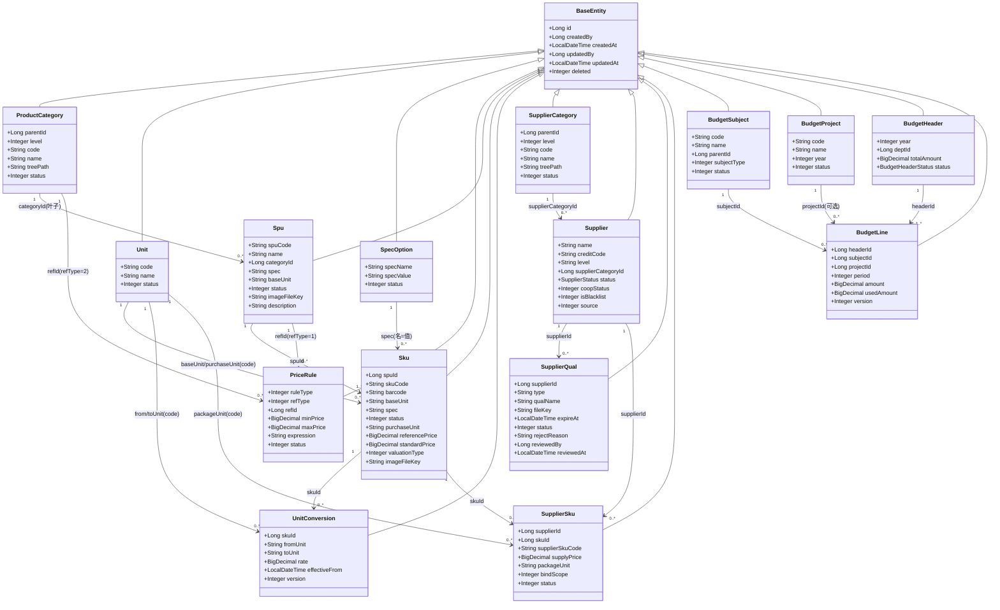
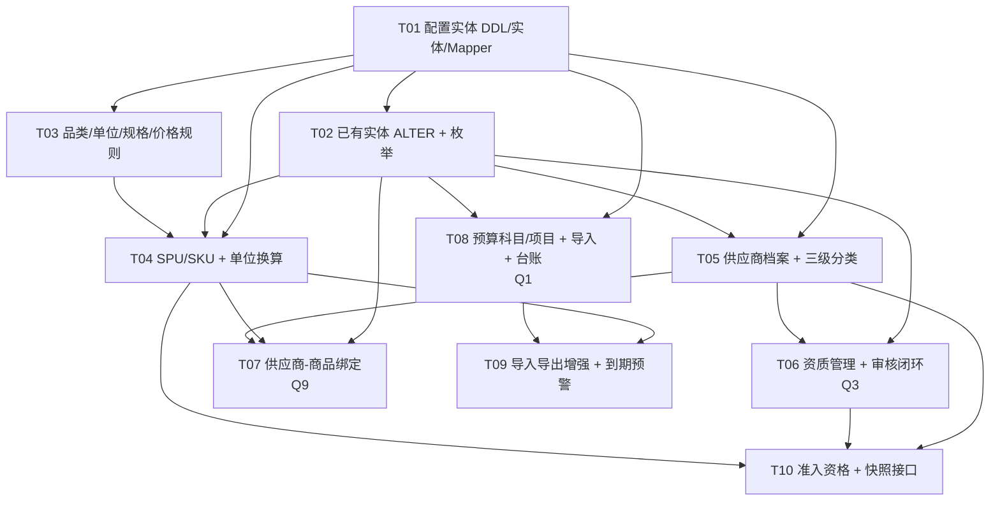

# P1 主数据 / 基础配置 · 系统设计（Design）

> 版本：v1.0（P1 阶段设计基线）
> 作者：架构师 高见远（Gao）
> 上游依据：`docs/P1主数据规格设计.md`（PM 许清楚 v1.0）、`docs/技术评审与架构设计.md`（v1.0 架构基线）、`docs/SDD开发阶段拆解.md`
> 范围：仅覆盖 **P1 主数据 / 基础配置**（进度表行 7–15），**只出设计，不含任何业务实现代码**。
> 阶段基线：P0 地基已完成并推送 `origin/develop`（commit `318b65c`），本阶段无外部阻塞，可立即开工。

---

## 0. 结论先行

本设计交付三大主数据域（**产品 / 供应商 / 预算**）的数据底座与分层契约，作为 P2 采购主链路与 P3 预算硬控的数据来源。核心结论如下：

- **新增 7 个配置/主数据实体**：`product_category`、`unit`、`spec_option`、`price_rule`、`supplier_category`、`budget_subject`、`budget_project`。
- **6 个已有实体仅做 ALTER 加字段（不改结构、不删字段）**：`spu`（+2）、`sku`（+5）、`supplier`（+4）、`supplier_qual`（+4）、`supplier_sku`（+4）、`budget_line`（+`project_id`，可选维度）。
- **统一沿用地基约定**：所有实体继承 `BaseEntity`（`id / created_by / created_at / updated_by / updated_at / deleted`），金额 `DECIMAL(18,2)`，状态用 `TINYINT` + `IEnum` 枚举，禁止魔法字符串；表/字段 `snake_case`，InnoDB、`utf8mb4_0900_ai_ci`。
- **复用既有抽象接缝，零新增外部依赖**：资质审核走 `ApprovalGateway`（`bizType=SUPPLIER_QUAL`，复用 `LocalApprovalGateway`）；不触发 `AuthProvider` / `Adapter` 真实实现。
- **三处关键决策已定稿落地**（详见 §6）：**A1（Q1）预算分解维度**、**A2（Q3）资质审核方式**、**A3（Q9）供应商绑定范围**——三者均按主理人已拍板口径设计，且均为"可切换、低返工"方案。
- **跨模块契约本阶段只定义、不落地**：供应商"准入资格"仅派生状态 + 查询接口，**拦截点由 P2/P3 落地**；单位换算快照由 P2 单据落，本阶段保证 `unit_conversion` 版本可追溯；`budget_line.used_amount` 初始 0，P3 实现占用/释放/核销。

---

## 1. 实体设计（DDL 级）

### 1.1 公共约束与 BaseEntity 审计列

本阶段所有新建表统一携带 `BaseEntity` 审计列，约定如下（与 `common/BaseEntity.java` 一致）：

| 列名 | 类型 | NOT NULL | 默认 | 说明 |
|---|---|---|---|---|
| `id` | BIGINT | Y | — | 主键，MyBatis-Plus `ASSIGN_ID`（雪花） |
| `created_by` | BIGINT | N | NULL | 创建人，`FieldFill.INSERT` |
| `created_at` | DATETIME | N | NULL | 创建时间，`FieldFill.INSERT` |
| `updated_by` | BIGINT | N | NULL | 更新人，`FieldFill.INSERT_UPDATE` |
| `updated_at` | DATETIME | N | NULL | 更新时间，`FieldFill.INSERT_UPDATE` |
| `deleted` | INT | N | 0 | 逻辑删除：0=未删 / 1=已删（`@TableLogic`） |

> **外键策略**：物理外键在业务库**禁用**（避免分库/迁移/批量导入时的锁与顺序问题），关联一律用逻辑外键 `xxx_id`（引用对象主键）+ 服务层校验引用完整性，树形结构用 `tree_path` 冗余祖先路径。
> **唯一索引与逻辑删除**：MyBatis-Plus 逻辑删除会保留已删行，故唯一索引统一带上 `deleted` 列（如 `UNIQUE KEY uk_x (code, deleted)`），实现"有效期内唯一、删除后可重建"。

### 1.2 新建实体 DDL（7 个）

#### 1.2.1 `product_category` — 商品三级品类

```sql
CREATE TABLE `product_category` (
  `id`          BIGINT       NOT NULL                COMMENT '主键',
  `parent_id`   BIGINT       NOT NULL DEFAULT 0      COMMENT '父节点ID，0=根',
  `level`       TINYINT      NOT NULL                COMMENT '层级：1/2/3',
  `code`        VARCHAR(64)  NOT NULL                COMMENT '品类编码（有效期内唯一）',
  `name`        VARCHAR(128) NOT NULL                COMMENT '品类名称',
  `tree_path`   VARCHAR(512) NOT NULL DEFAULT ''     COMMENT '祖先路径，如 /1/3/7（便于子树查询）',
  `status`      TINYINT      NOT NULL DEFAULT 0      COMMENT '0=有效 1=无效',
  `created_by`  BIGINT       NULL,
  `created_at`  DATETIME     NULL,
  `updated_by`  BIGINT       NULL,
  `updated_at`  DATETIME     NULL,
  `deleted`     INT          NOT NULL DEFAULT 0      COMMENT '0=未删 1=已删',
  PRIMARY KEY (`id`),
  UNIQUE KEY `uk_code` (`code`, `deleted`),
  KEY `idx_parent` (`parent_id`),
  KEY `idx_tree_path` (`tree_path`)
) ENGINE=InnoDB DEFAULT CHARSET=utf8mb4 COLLATE=utf8mb4_0900_ai_ci COMMENT='商品三级品类';
```
- **业务约束**：`spu.category_id` 仅可引用 **叶子节点（level=3 且无子节点）**，由 Service 校验；被 SPU 引用的节点不可物理删除，仅可置 `status=1`。

#### 1.2.2 `unit` — 计量单位配置

```sql
CREATE TABLE `unit` (
  `id`          BIGINT      NOT NULL                COMMENT '主键',
  `code`        VARCHAR(32) NOT NULL                COMMENT '单位编码（有效期内唯一），如 PCS/BOX/KG',
  `name`        VARCHAR(64) NOT NULL                COMMENT '单位名称，如 个/箱/千克',
  `status`      TINYINT     NOT NULL DEFAULT 0      COMMENT '0=有效 1=无效',
  `created_by`  BIGINT      NULL,
  `created_at`  DATETIME    NULL,
  `updated_by`  BIGINT      NULL,
  `updated_at`  DATETIME    NULL,
  `deleted`     INT         NOT NULL DEFAULT 0,
  PRIMARY KEY (`id`),
  UNIQUE KEY `uk_code` (`code`, `deleted`)
) ENGINE=InnoDB DEFAULT CHARSET=utf8mb4 COLLATE=utf8mb4_0900_ai_ci COMMENT='计量单位字典';
```
- **关联口径**：`sku.base_unit` / `sku.purchase_unit` / `supplier_sku.package_unit` / `unit_conversion.from_unit` / `unit_conversion.to_unit` 均**以 `unit.code` 作为字符串关联键**（与既有 `Sku.baseUnit`、`UnitConversion.fromUnit` 的 String 类型保持一致，避免改动既有结构）。

#### 1.2.3 `spec_option` — 规格配置

```sql
CREATE TABLE `spec_option` (
  `id`          BIGINT       NOT NULL                COMMENT '主键',
  `spec_name`   VARCHAR(64)  NOT NULL                COMMENT '规格名，如 颜色/尺寸',
  `spec_value`  VARCHAR(128) NOT NULL                COMMENT '规格值，如 红/S',
  `status`      TINYINT      NOT NULL DEFAULT 0      COMMENT '0=有效 1=无效',
  `created_by`  BIGINT       NULL,
  `created_at`  DATETIME     NULL,
  `updated_by`  BIGINT       NULL,
  `updated_at`  DATETIME     NULL,
  `deleted`     INT          NOT NULL DEFAULT 0,
  PRIMARY KEY (`id`),
  UNIQUE KEY `uk_name_value` (`spec_name`, `spec_value`, `deleted`),
  KEY `idx_spec_name` (`spec_name`)
) ENGINE=InnoDB DEFAULT CHARSET=utf8mb4 COLLATE=utf8mb4_0900_ai_ci COMMENT='规格维度可选值';
```
- **业务约束**：同一 `spec_name` 下多行形成"名-值"对（如 颜色→红、颜色→绿）；被 SKU 引用的规格值不可删，仅可置 `status=1`。

#### 1.2.4 `price_rule` — 价格规则

```sql
CREATE TABLE `price_rule` (
  `id`          BIGINT        NOT NULL                COMMENT '主键',
  `rule_type`   TINYINT       NOT NULL                COMMENT '1=最低限价 2=最高限价 3=区间 4=公式',
  `ref_type`    TINYINT       NOT NULL                COMMENT '引用类型：1=商品(SPU) 2=品类(product_category)',
  `ref_id`      BIGINT        NULL                    COMMENT '引用对象ID（spu.id 或 product_category.id）',
  `min_price`   DECIMAL(18,2) NULL                    COMMENT '最低价/区间下界',
  `max_price`   DECIMAL(18,2) NULL                    COMMENT '最高价/区间上界',
  `expression`  VARCHAR(512)  NULL                    COMMENT '公式表达式（rule_type=4 时使用）',
  `status`      TINYINT       NOT NULL DEFAULT 0      COMMENT '0=有效 1=无效',
  `created_by`  BIGINT        NULL,
  `created_at`  DATETIME      NULL,
  `updated_by`  BIGINT        NULL,
  `updated_at`  DATETIME      NULL,
  `deleted`     INT           NOT NULL DEFAULT 0,
  PRIMARY KEY (`id`),
  KEY `idx_ref` (`ref_type`, `ref_id`),
  KEY `idx_status` (`status`)
) ENGINE=InnoDB DEFAULT CHARSET=utf8mb4 COLLATE=utf8mb4_0900_ai_ci COMMENT='价格规则';
```
- **校验强度（Q6，待确认）**：建议**建档拦截 + 审批复核**，本阶段按"建档时校验、越界即拒绝"设计，校验点落在 `sku` 的参考价/标准价写入处。

#### 1.2.5 `supplier_category` — 供应商三级分类

```sql
CREATE TABLE `supplier_category` (
  `id`          BIGINT       NOT NULL                COMMENT '主键',
  `parent_id`   BIGINT       NOT NULL DEFAULT 0      COMMENT '父节点ID，0=根',
  `level`       TINYINT      NOT NULL                COMMENT '层级：1/2/3',
  `code`        VARCHAR(64)  NOT NULL                COMMENT '分类编码（有效期内唯一）',
  `name`        VARCHAR(128) NOT NULL                COMMENT '分类名称',
  `tree_path`   VARCHAR(512) NOT NULL DEFAULT ''     COMMENT '祖先路径，如 /1/3/7',
  `status`      TINYINT      NOT NULL DEFAULT 0      COMMENT '0=有效 1=无效',
  `created_by`  BIGINT       NULL,
  `created_at`  DATETIME     NULL,
  `updated_by`  BIGINT       NULL,
  `updated_at`  DATETIME     NULL,
  `deleted`     INT          NOT NULL DEFAULT 0,
  PRIMARY KEY (`id`),
  UNIQUE KEY `uk_code` (`code`, `deleted`),
  KEY `idx_parent` (`parent_id`),
  KEY `idx_tree_path` (`tree_path`)
) ENGINE=InnoDB DEFAULT CHARSET=utf8mb4 COLLATE=utf8mb4_0900_ai_ci COMMENT='供应商三级分类';
```
- **口径（Q5，待确认）**：与 `product_category` **独立两套**（语义不同：商品品类=买什么，供应商分类=供应商行业属性），不建议共用。结构与 `product_category` 完全对齐，便于复用树组件。

#### 1.2.6 `budget_subject` — 预算科目

```sql
CREATE TABLE `budget_subject` (
  `id`           BIGINT       NOT NULL                COMMENT '主键',
  `code`         VARCHAR(64)  NOT NULL                COMMENT '科目编码（有效期内唯一）',
  `name`         VARCHAR(128) NOT NULL                COMMENT '科目名称',
  `parent_id`    BIGINT       NOT NULL DEFAULT 0      COMMENT '父科目ID，0=根',
  `subject_type` TINYINT      NOT NULL                COMMENT '1=支出 2=收入',
  `status`       TINYINT      NOT NULL DEFAULT 0      COMMENT '0=有效 1=无效',
  `created_by`   BIGINT       NULL,
  `created_at`   DATETIME     NULL,
  `updated_by`   BIGINT       NULL,
  `updated_at`   DATETIME     NULL,
  `deleted`      INT          NOT NULL DEFAULT 0,
  PRIMARY KEY (`id`),
  UNIQUE KEY `uk_code` (`code`, `deleted`),
  KEY `idx_parent` (`parent_id`)
) ENGINE=InnoDB DEFAULT CHARSET=utf8mb4 COLLATE=utf8mb4_0900_ai_ci COMMENT='预算科目';
```
- **关联**：`budget_line.subject_id` 引用之；被引用的科目不可删，仅可置 `status=1`。

#### 1.2.7 `budget_project` — 预算项目（可选维度）

```sql
CREATE TABLE `budget_project` (
  `id`          BIGINT       NOT NULL                COMMENT '主键',
  `code`        VARCHAR(64)  NOT NULL                COMMENT '项目编码（有效期内唯一）',
  `name`        VARCHAR(128) NOT NULL                COMMENT '项目名称',
  `year`        INT          NOT NULL                COMMENT '所属年份，如 2026',
  `status`      TINYINT      NOT NULL DEFAULT 0      COMMENT '0=有效 1=无效',
  `created_by`  BIGINT       NULL,
  `created_at`  DATETIME     NULL,
  `updated_by`  BIGINT       NULL,
  `updated_at`  DATETIME     NULL,
  `deleted`     INT          NOT NULL DEFAULT 0,
  PRIMARY KEY (`id`),
  UNIQUE KEY `uk_code` (`code`, `deleted`),
  KEY `idx_year` (`year`)
) ENGINE=InnoDB DEFAULT CHARSET=utf8mb4 COLLATE=utf8mb4_0900_ai_ci COMMENT='预算项目（可选维度）';
```
- **关联**：启用项目维度时，`budget_line.project_id` 引用之（见 §1.3.6、§6 A1）。

### 1.3 已有实体 ALTER 加字段（6 个）

> 原则：**只加字段，不改动既有字段的类型与语义**（对齐规格 §实体对齐结论）。

#### 1.3.1 `spu`（+2）

```sql
ALTER TABLE `spu`
  ADD COLUMN `image_file_key` VARCHAR(255) NULL COMMENT '主图 file_key（引用 file_meta.file_key）' AFTER `status`,
  ADD COLUMN `description`    TEXT         NULL COMMENT '商品简介' AFTER `image_file_key`;
```

#### 1.3.2 `sku`（+5）

```sql
ALTER TABLE `sku`
  ADD COLUMN `purchase_unit`   VARCHAR(32)   NULL COMMENT '采购单位（引用 unit.code）'          AFTER `spec`,
  ADD COLUMN `reference_price` DECIMAL(18,2) NULL COMMENT '参考价（≥0）'                       AFTER `purchase_unit`,
  ADD COLUMN `standard_price`  DECIMAL(18,2) NULL COMMENT '标准价（≥0）'                       AFTER `reference_price`,
  ADD COLUMN `valuation_type`  TINYINT       NULL COMMENT '计价方式：0=计件 1=计重'             AFTER `standard_price`,
  ADD COLUMN `image_file_key`  VARCHAR(255)  NULL COMMENT '主图 file_key（引用 file_meta.file_key）' AFTER `valuation_type`;
```

#### 1.3.3 `supplier`（+4）

```sql
ALTER TABLE `supplier`
  ADD COLUMN `supplier_category_id` BIGINT      NULL     DEFAULT NULL COMMENT '供应商分类ID（引用 supplier_category）' AFTER `category`,
  ADD COLUMN `coop_status`          TINYINT     NOT NULL DEFAULT 0    COMMENT '合作状态：0=正常 1=停用 2=冻结'      AFTER `status`,
  ADD COLUMN `is_blacklist`         TINYINT     NOT NULL DEFAULT 0    COMMENT '黑名单：0=否 1=是'                     AFTER `coop_status`,
  ADD COLUMN `source`               TINYINT     NOT NULL DEFAULT 0    COMMENT '来源：0=平台录入 1=H5提交 2=导入'      AFTER `is_blacklist`;
```
- **状态解耦**：既有 `status`（`SupplierStatus`：0=资质审核中/1=通过/2=驳回）**保留为"资质状态"**；新增 `coop_status` 为"合作状态"；二者解耦，避免"资质审核中"误伤合作状态。
- **历史 `category` 字段**：既有 `category`（String）为遗留自由文本，保留不动；新增 `supplier_category_id`（Long）为强类型引用，二者可并行存在，建议后续以 `supplier_category_id` 为准，`category` 做一次性回填后不再写入（不在本阶段强制迁移）。

#### 1.3.4 `supplier_qual`（+4）

```sql
ALTER TABLE `supplier_qual`
  ADD COLUMN `qual_name`     VARCHAR(128) NULL COMMENT '资质名称'                 AFTER `type`,
  ADD COLUMN `reject_reason` VARCHAR(512) NULL COMMENT '驳回原因（驳回时必填）'    AFTER `status`,
  ADD COLUMN `reviewed_by`   BIGINT       NULL COMMENT '审核人ID'                 AFTER `reject_reason`,
  ADD COLUMN `reviewed_at`   DATETIME     NULL COMMENT '审核时间'                 AFTER `reviewed_by`;
```
- **状态机**：`待审(0) → 通过(1)`；`待审(0) → 驳回(2) → 待审(0)`（修改重提）。驳回必填 `reject_reason`，审核落 `reviewed_by/reviewed_at`。

#### 1.3.5 `supplier_sku`（+4）

```sql
ALTER TABLE `supplier_sku`
  ADD COLUMN `supplier_sku_code` VARCHAR(64)   NULL     COMMENT '供应商货号'                         AFTER `sku_id`,
  ADD COLUMN `supply_price`      DECIMAL(18,2) NULL     COMMENT '供货价（≥0，以本字段为准）'         AFTER `price_range`,
  ADD COLUMN `package_unit`      VARCHAR(32)   NULL     COMMENT '包装单位（引用 unit.code）'          AFTER `supply_price`,
  ADD COLUMN `bind_scope`        TINYINT       NOT NULL DEFAULT 0 COMMENT '绑定范围：0=不限定 1=限定报价接单' AFTER `package_unit`;
```
- **唯一约束**：同一 `supplier_id + sku_id` 仅一条有效绑定；建议在 Service 层校验 + 加候选唯一索引 `UNIQUE KEY uk_sup_sku (supplier_id, sku_id, deleted)`。
- **`price_range` 处理**：既有 `price_range`（String）保留；**以 `supply_price`（DECIMAL(18,2)）为供货价权威字段**，`price_range` 仅作兼容保留。
- **默认值（Q9，已确认）**：`bind_scope` 默认 **0=不限定**（优选/建议关系，非强制）。

#### 1.3.6 `budget_line`（+1，可选维度）

```sql
ALTER TABLE `budget_line`
  ADD COLUMN `project_id` BIGINT NULL DEFAULT NULL COMMENT '预算项目ID（可选，引用 budget_project；NULL=未启用项目维度）' AFTER `subject_id`;
```
- **维度口径（Q1，已确认）**：12 个月台账用 `period`（0=年度总额，1–12=月）；**项目维度**通过 `project_id` 落地（nullable）；**部门维度**锚定在 `budget_header.dept_id`（每个预算头 = 年份×部门），不在明细行重复建列。若 Q1 拍板要求"单预算头跨多部门"，再为 `budget_line` 追加 nullable `dept_id`（一条 ALTER 即可，零破坏）。
- **`used_amount`**：本阶段恒为 0，初始化写入 0；占用/释放/核销由 P3 实现（行锁 + 乐观版本）。

### 1.4 P1 新增枚举清单（`com.dzgylxt.enums`，均实现 `IEnum<Integer>`）

| 枚举 | 值域 | 归属实体字段 |
|---|---|---|
| `CoopStatus` | 0=正常 / 1=停用 / 2=冻结 | `supplier.coop_status` |
| `BlacklistFlag` | 0=否 / 1=是 | `supplier.is_blacklist` |
| `SupplierSource` | 0=平台录入 / 1=H5提交 / 2=导入 | `supplier.source` |
| `ValuationType` | 0=计件 / 1=计重 | `sku.valuation_type` |
| `BindScope` | 0=不限定 / 1=限定报价接单范围 | `supplier_sku.bind_scope` |
| `PriceRuleType` | 1=最低限价 / 2=最高限价 / 3=区间 / 4=公式 | `price_rule.rule_type` |
| `PriceRefType` | 1=商品(SPU) / 2=品类 | `price_rule.ref_type` |
| `SubjectType` | 1=支出 / 2=收入 | `budget_subject.subject_type` |
| `QualStatus` | 0=待审 / 1=通过 / 2=驳回 | `supplier_qual.status`（既有亦可用 `SupplierStatus`，建议以 `QualStatus` 语义化，二者数值一致） |
| `QualValidity`（**派生，不落库**） | VALID / EXPIRING / EXPIRED | 由 `supplier_qual.expire_at` + 预警天数计算 |

> 复用既有枚举：`SupplierStatus`（资质状态，保留）、`BudgetHeaderStatus`（0=草稿/1=生效/2=归档）、产品 `status`（0=正常/1=停用，继续用 TINYINT）。

### 1.5 实体关系图



---

## 2. 分层契约（Mapper / Service / VO / Controller）

> 说明：仅给**接口签名与职责**，不写方法体。Service 采用"MyBatis-Plus `IService<T>` 接口 + `ServiceImpl` 实现"的标准范式（与 P0 一致），业务方法定义在自定义接口中。VO 归属包 `com.dzgylxt.vo.{catalog,budget,supplier}`。

### 2.1 catalog · 配置子模块（品类 / 单位 / 规格 / 价格规则）

#### 2.1.1 Mapper
```java
@Mapper interface ProductCategoryMapper extends BaseMapper<ProductCategory> {}
@Mapper interface UnitMapper           extends BaseMapper<Unit> {}
@Mapper interface SpecOptionMapper     extends BaseMapper<SpecOption> {}
@Mapper interface PriceRuleMapper      extends BaseMapper<PriceRule> {
    // 查某引用对象命中的有效规则（SPU 级 + 其品类级，供价格校验）
    List<PriceRule> selectEffectiveByRef(@Param("spuId") Long spuId,
                                         @Param("categoryId") Long categoryId);
}
```

#### 2.1.2 Service 接口与职责
```java
interface IProductCategoryService extends IService<ProductCategory> {
    Long createCategory(ProductCategorySaveReqVO req);          // 校验 code 唯一、level 与 parent 一致、维护 tree_path
    void updateCategory(Long id, ProductCategorySaveReqVO req); // 校验被引用不可改关键字段
    List<CategoryTreeNodeVO> tree();                            // 返回三级树
    void invalidate(Long id);                                   // 置 status=1（被引用不可物理删）
    void assertLeaf(Long categoryId);                           // 供 SPU 保存时校验"必须是叶子"
}

interface IUnitService extends IService<Unit> {
    Long createUnit(UnitSaveReqVO req);                         // code 唯一
    void updateUnit(Long id, UnitSaveReqVO req);
    void invalidate(Long id);                                   // 被 SKU/换算/绑定引用则拒绝
}

interface ISpecOptionService extends IService<SpecOption> {
    Long createSpecOption(SpecOptionSaveReqVO req);             // (specName,specValue) 唯一
    void updateSpecOption(Long id, SpecOptionSaveReqVO req);
    Map<String, List<String>> groupedOptions();                 // 规格名 -> 值列表（供多规格组合）
    void invalidate(Long id);                                   // 被 SKU 引用则拒绝
}

interface IPriceRuleService extends IService<PriceRule> {
    Long createRule(PriceRuleSaveReqVO req);                    // 依 rule_type 校验 min/max/expression 组合
    void updateRule(Long id, PriceRuleSaveReqVO req);
    void validatePrice(Long refType, Long refId, BigDecimal price); // 建档/改价时校验（R-PRD-09）
    void invalidate(Long id);                                   // 被引用则拒绝
}
```

#### 2.1.3 关键 VO
| VO | 用途 | 关键字段 |
|---|---|---|
| `ProductCategorySaveReqVO` | 品类新增/编辑 | `parentId, code, name, status` |
| `CategoryTreeNodeVO` | 品类树响应 | `id, parentId, code, name, level, children[]` |
| `UnitSaveReqVO` | 单位新增/编辑 | `code, name, status` |
| `SpecOptionSaveReqVO` | 规格新增/编辑 | `specName, specValue, status` |
| `PriceRuleSaveReqVO` | 规则新增/编辑 | `ruleType, refType, refId, minPrice, maxPrice, expression` |

#### 2.1.4 Controller 端点（继承/参照 `BaseController`，写接口加 `@PreAuthorize`）
```java
@RestController @RequestMapping("/api/v1/catalog/categories")     class ProductCategoryController {}
@RestController @RequestMapping("/api/v1/catalog/units")          class UnitController {}
@RestController @RequestMapping("/api/v1/catalog/spec-options")   class SpecOptionController {}
@RestController @RequestMapping("/api/v1/catalog/price-rules")    class PriceRuleController {}
```

### 2.2 catalog · 商品主数据子模块（SPU / SKU / 单位换算）

#### 2.2.1 Mapper
```java
@Mapper interface SpuMapper extends BaseMapper<Spu> {
    boolean existsByCode(@Param("code") String code, @Param("excludeId") Long excludeId);
}
@Mapper interface SkuMapper extends BaseMapper<Sku> {
    boolean existsBySkuCode(@Param("skuCode") String skuCode, @Param("excludeId") Long excludeId);
    boolean existsByBarcode(@Param("barcode") String barcode, @Param("excludeId") Long excludeId);
}
@Mapper interface UnitConversionMapper extends BaseMapper<UnitConversion> {
    // 取当前生效版本（effective_from <= now 的最大 version）
    UnitConversion selectCurrentEffective(@Param("skuId") Long skuId, @Param("fromUnit") String fromUnit);
    List<UnitConversion> selectHistory(@Param("skuId") Long skuId);
}
```

#### 2.2.2 Service 接口与职责
```java
interface ISpuService extends IService<Spu> {
    Long createSpu(SpuSaveReqVO req);        // code 唯一 + 品类叶子校验 + 主图落 file_meta
    void updateSpu(Long id, SpuSaveReqVO req);
    void enable(Long id);  void disable(Long id);   // 停用联动 SKU 不可被新单据引用
    IPage<SpuPageRespVO> pageSpu(SpuPageReqVO req);// 筛选：category/status/关键字
}

interface ISkuService extends IService<Sku> {
    Long createSku(SkuSaveReqVO req);        // skuCode/barcode 唯一 + purchaseUnit 存在于 unit + 价格规则校验
    void updateSku(Long id, SkuSaveReqVO req);
    void enable(Long id);  void disable(Long id);
    IPage<SkuPageRespVO> pageSku(SkuPageReqVO req);
    List<Sku> listBySpu(Long spuId);
}

interface IUnitConversionService extends IService<UnitConversion> {
    Long saveConversion(UnitConversionSaveReqVO req); // rate>0；(fromUnit,生效期) 仅一条有效；变更生成新 version
    UnitConversion currentEffective(Long skuId, String fromUnit); // 供 P2 落快照（本阶段仅暴露查询）
    List<UnitConversion> history(Long skuId);
}
```

#### 2.2.3 关键 VO
| VO | 用途 | 关键字段 |
|---|---|---|
| `SpuSaveReqVO` | SPU 新增/编辑 | `spuCode, name, categoryId, spec, baseUnit, imageFileKey, description, remark` |
| `SpuPageReqVO` | SPU 分页查询 | `categoryId, status, keyword, current, size` |
| `SpuPageRespVO` | SPU 分页响应 | `id, spuCode, name, categoryName, status, updatedAt` |
| `SkuSaveReqVO` | SKU 新增/编辑 | `spuId, skuCode, barcode, baseUnit, spec, purchaseUnit, referencePrice, standardPrice, valuationType, imageFileKey` |
| `SkuPageReqVO/RespVO` | SKU 查询 | 同上维度筛选 + 响应含价格与状态 |
| `UnitConversionSaveReqVO` | 换算保存 | `skuId, fromUnit, toUnit, rate, effectiveFrom` |

#### 2.2.4 Controller 端点
```java
@RestController @RequestMapping("/api/v1/catalog/spus")              class SpuController {}
@RestController @RequestMapping("/api/v1/catalog/skus")             class SkuController {}
@RestController @RequestMapping("/api/v1/catalog/unit-conversions") class UnitConversionController {}
```

### 2.3 supplier · 供应商主数据子模块

#### 2.3.1 Mapper
```java
@Mapper interface SupplierMapper            extends BaseMapper<Supplier> {
    boolean existsByCreditCode(@Param("creditCode") String creditCode, @Param("excludeId") Long excludeId);
}
@Mapper interface SupplierCategoryMapper    extends BaseMapper<SupplierCategory> {}
@Mapper interface SupplierQualMapper        extends BaseMapper<SupplierQual> {
    List<SupplierQual> selectBySupplier(@Param("supplierId") Long supplierId);
}
@Mapper interface SupplierSkuMapper         extends BaseMapper<SupplierSku> {
    boolean existsBind(@Param("supplierId") Long supplierId, @Param("skuId") Long skuId, @Param("excludeId") Long excludeId);
}
```

#### 2.3.2 Service 接口与职责
```java
interface ISupplierService extends IService<Supplier> {
    Long createSupplier(SupplierSaveReqVO req);   // creditCode 唯一 + 分类存在 + 默认 coop_status=0/is_blacklist=0
    void updateSupplier(Long id, SupplierSaveReqVO req);
    IPage<SupplierPageRespVO> pageSupplier(SupplierPageReqVO req); // 名称/分类/等级/合作状态/黑名单组合检索
    void updateCoopStatus(Long id, CoopStatus status);
    void markBlacklist(Long id, boolean blacklist);
    SupplierAdmissionVO getAdmission(Long supplierId);  // R-X-01：派生 合格/不合格 + 原因（只读）
}

interface ISupplierCategoryService extends IService<SupplierCategory> {
    Long createCategory(SupplierCategorySaveReqVO req);
    void updateCategory(Long id, SupplierCategorySaveReqVO req);
    List<CategoryTreeNodeVO> tree();
    void invalidate(Long id);
}

interface ISupplierQualService extends IService<SupplierQual> {
    Long createQual(SupplierQualSaveReqVO req);            // 后台录入资质（H5 提交属 P7，复用同模型）
    void updateQual(Long id, SupplierQualSaveReqVO req);
    Long submitForApproval(Long qualId);                   // A2(Q3)：经 ApprovalGateway 发起（bizType=SUPPLIER_QUAL）
    void onApprovalCallback(Long taskId, boolean approved, String comment); // 回调：通过→1；驳回→2+reject_reason
    void resubmit(Long qualId, SupplierQualSaveReqVO req); // 驳回后修改重提→回到待审(0)
    QualValidity deriveValidity(Long qualId);              // 派生 有效/即将到期/已过期
    List<SupplierQualRespVO> listBySupplier(Long supplierId);
}

interface ISupplierSkuService extends IService<SupplierSku> {
    Long bind(SupplierSkuSaveReqVO req);                   // (supplier,sku) 唯一 + supplyPrice≥0 + packageUnit 存在
    void unbind(Long id);
    BatchBindRespVO batchBind(MultipartFile file);         // 供 T09 批量绑定（Excel）
    List<SupplierSkuRespVO> listBySupplier(Long supplierId);
}
```

#### 2.3.3 准入资格（R-X-01）派生口径
`getAdmission(supplierId)` 返回 `{qualified: boolean, reasons: []}`，判定：
```
qualified = (supplier.coop_status == 0 /*正常*/)
         && (supplier.is_blacklist == 0)
         && 存在 status=1 且未过期的"必要资质"（必要资质清单见 Q12，本期以"存在任一有效资质"为最小口径，预留可配置）
```
- **本阶段只计算 + 暴露查询接口，不做任何拦截**；拦截点（询价/定标/合同/下单）由 P2/P3 调用本接口落地（见 §5）。

#### 2.3.4 关键 VO
| VO | 用途 | 关键字段 |
|---|---|---|
| `SupplierSaveReqVO` | 供应商新增/编辑 | `name, creditCode, level, supplierCategoryId, legalPerson, businessScope, contact, phone, bankName, bankAccount, source` |
| `SupplierPageReqVO/RespVO` | 检索/响应 | 入参 `name, categoryId, level, coopStatus, blacklist`；出参含资质/合作状态 |
| `SupplierAdmissionVO` | 准入资格 | `supplierId, qualified, coopStatus, isBlacklist, qualValidity, reasons[]` |
| `SupplierQualSaveReqVO` | 资质录入/重提 | `supplierId, type, qualName, fileKey, expireAt` |
| `SupplierQualRespVO` | 资质列表 | `id, type, qualName, expireAt, status, validity, rejectReason, reviewedBy, reviewedAt` |
| `SupplierSkuSaveReqVO` | 绑定 | `supplierId, skuId, supplierSkuCode, supplyPrice, packageUnit, bindScope` |
| `CategoryTreeNodeVO` | 供应商分类树 | 同商品品类树 |

#### 2.3.5 Controller 端点
```java
@RestController @RequestMapping("/api/v1/suppliers")                     class SupplierController {}       // 既有，扩充业务方法
@RestController @RequestMapping("/api/v1/suppliers/categories")          class SupplierCategoryController {}
@RestController @RequestMapping("/api/v1/suppliers/{supplierId}/quals")  class SupplierQualController {}
@RestController @RequestMapping("/api/v1/supplier-skus")                 class SupplierSkuController {}
```

### 2.4 budget · 预算主数据子模块

#### 2.4.1 Mapper
```java
@Mapper interface BudgetSubjectMapper extends BaseMapper<BudgetSubject> {}
@Mapper interface BudgetProjectMapper extends BaseMapper<BudgetProject> {}
@Mapper interface BudgetHeaderMapper  extends BaseMapper<BudgetHeader> {}
@Mapper interface BudgetLineMapper    extends BaseMapper<BudgetLine> {
    List<BudgetLine> selectByHeader(@Param("headerId") Long headerId);      // 含 period 0 与 1–12
    // P3 预留：selectForUpdate(headerId, subjectId, period) 行锁；本阶段不实现
}
```

#### 2.4.2 Service 接口与职责
```java
interface IBudgetSubjectService extends IService<BudgetSubject> {
    Long createSubject(BudgetSubjectSaveReqVO req);   // code 唯一 + subject_type 必填
    void updateSubject(Long id, BudgetSubjectSaveReqVO req);
    List<CategoryTreeNodeVO> tree();                  // 科目树（复用树结构）
    void invalidate(Long id);                         // 被预算明细引用则拒绝
}

interface IBudgetProjectService extends IService<BudgetProject> {
    Long createProject(BudgetProjectSaveReqVO req);   // code 唯一
    void updateProject(Long id, BudgetProjectSaveReqVO req);
    void invalidate(Long id);
    List<BudgetProject> listByYear(Integer year);
}

interface IBudgetImportService {
    ImportTaskVO importAnnual(MultipartFile file);    // R-BUD-03：模板版本校验→解析→生成 header + line(12月台账)
    BudgetImportPreviewVO preview(MultipartFile file); // 预览（不落库），错误定位到行/列
    ImportTaskVO taskStatus(String taskId);           // 异步导入进度（R1）
}

interface IBudgetQueryService {
    IPage<BudgetHeaderRespVO> pageHeader(BudgetHeaderQueryReqVO req);  // 部门数据权限过滤
    List<BudgetLineRespVO> listLines(Long headerId);                   // period 维度：0=年，1–12=月
}
```

#### 2.4.3 年度预算导入生成结构（R-BUD-03）
- 1 条 `budget_header`（`year` + `dept_id` + `total_amount` + `status=草稿`）。
- N 条 `budget_line`：`subject_id × {period=0(年度), period=1..12(月)}`；启用项目维度时按 `project_id` 再分。
- `used_amount = 0`（本阶段初始化）；全部行校验通过才落库，失败行回传"错误清单 Sheet"。
- 导入查询与部门数据权限一致（`DataPermissionInterceptor` 注入 `dept_id`）。

#### 2.4.4 关键 VO
| VO | 用途 | 关键字段 |
|---|---|---|
| `BudgetSubjectSaveReqVO` | 科目新增/编辑 | `code, name, parentId, subjectType, status` |
| `BudgetProjectSaveReqVO` | 项目新增/编辑 | `code, name, year, status` |
| `BudgetImportPreviewVO` | 导入预览 | `header(year,deptId,totalAmount), lines[], errors[{row,col,msg}]` |
| `BudgetHeaderQueryReqVO/RespVO` | 预算头查询 | 入参 `year, deptId`；出参含总额与状态 |
| `BudgetLineRespVO` | 台账明细 | `subjectId, projectId, period, amount, usedAmount` |
| `ImportTaskVO` / `ImportResultRespVO` | 导入结果 | `taskId, success, totalRows, errorRows, errorFileKey` |

#### 2.4.5 Controller 端点
```java
@RestController @RequestMapping("/api/v1/budgets/subjects")  class BudgetSubjectController {}
@RestController @RequestMapping("/api/v1/budgets/projects")  class BudgetProjectController {}
@RestController @RequestMapping("/api/v1/budgets")           class BudgetController {}   // /import /headers /lines
```

---

## 3. API 端点清单

> 权限口径：**阶段一**沿用 `BaseController` 的粗粒度门禁 `@PreAuthorize("isAuthenticated() and @authz.hasAnyPerm(authentication)")`（已登录且至少一个权限）；**阶段二**细化到 `@PreAuthorize("hasAuthority('module:action')")` 方法级权限。下表"目标权限"列给出阶段二的细化键，"阶段一"列标注当前门禁。

| 模块 | 方法 | 路径 | 说明 | 目标权限（阶段二） | 阶段一 |
|---|---|---|---|---|---|
| 商品-品类 | GET | `/api/v1/catalog/categories/tree` | 品类树 | `catalog:category:read` | hasAnyPerm |
| 商品-品类 | POST/PUT/DELETE | `/api/v1/catalog/categories` `/categories/{id}` | 品类增改/置无效 | `catalog:category:write` | hasAnyPerm |
| 商品-单位 | GET/POST/PUT/DELETE | `/api/v1/catalog/units` `/units/{id}` | 单位字典 CRUD | `catalog:unit:read` / `catalog:unit:write` | hasAnyPerm |
| 商品-规格 | GET/POST/PUT/DELETE | `/api/v1/catalog/spec-options` `/spec-options/{id}` | 规格值 CRUD | `catalog:spec:read` / `catalog:spec:write` | hasAnyPerm |
| 商品-价格规则 | GET/POST/PUT/DELETE | `/api/v1/catalog/price-rules` `/price-rules/{id}` | 价格规则 CRUD | `catalog:price:read` / `catalog:price:write` | hasAnyPerm |
| 商品-SPU | GET | `/api/v1/catalog/spus/page` | SPU 分页（筛选） | `catalog:spu:read` | hasAnyPerm |
| 商品-SPU | POST/PUT | `/api/v1/catalog/spus` `/spus/{id}` | SPU 新增/编辑 | `catalog:spu:write` | hasAnyPerm |
| 商品-SPU | POST | `/api/v1/catalog/spus/{id}/enable` `/disable` | 启停用 | `catalog:spu:write` | hasAnyPerm |
| 商品-SKU | GET | `/api/v1/catalog/skus/page`、`/spus/{spuId}/skus` | SKU 查询 | `catalog:sku:read` | hasAnyPerm |
| 商品-SKU | POST/PUT | `/api/v1/catalog/skus` `/skus/{id}` | SKU 新增/编辑（含价格校验） | `catalog:sku:write` | hasAnyPerm |
| 商品-SKU | POST | `/api/v1/catalog/skus/{id}/enable` `/disable` | 启停用 | `catalog:sku:write` | hasAnyPerm |
| 商品-换算 | GET | `/api/v1/catalog/unit-conversions?skuId=` | 换算查询（含当前生效版本） | `catalog:unit:read` | hasAnyPerm |
| 商品-换算 | POST/PUT | `/api/v1/catalog/unit-conversions` `/unit-conversions/{id}` | 换算维护（rate/version/effectiveFrom） | `catalog:unit:write` | hasAnyPerm |
| 商品-导入 | POST | `/api/v1/catalog/spus/import/single` | 单规格导入（校验+错误 Sheet） | `catalog:import` | hasAnyPerm |
| 商品-导入 | POST | `/api/v1/catalog/spus/import/multi/preview`、`/import/multi` | 多规格预览/导入（错误定位） | `catalog:import` | hasAnyPerm |
| 商品-导出 | POST | `/api/v1/catalog/spus/export` | 筛选导出（异步 task_id） | `catalog:export` | hasAnyPerm |
| 供应商-档案 | GET | `/api/v1/suppliers/page`、`/suppliers/{id}` | 检索/详情 | `supplier:read` | hasAnyPerm |
| 供应商-档案 | POST/PUT | `/api/v1/suppliers` `/suppliers/{id}` | 新增/编辑 | `supplier:write` | hasAnyPerm |
| 供应商-档案 | POST | `/api/v1/suppliers/{id}/coop-status`、`/blacklist` | 合作状态/黑名单 | `supplier:write` | hasAnyPerm |
| 供应商-分类 | GET/POST/PUT/DELETE | `/api/v1/suppliers/categories` `/categories/tree` `/categories/{id}` | 分类树 CRUD | `supplier:category:read` / `supplier:category:write` | hasAnyPerm |
| 供应商-绑定 | GET/POST/DELETE | `/api/v1/supplier-skus` `/supplier-skus/{id}` | 绑定查询/新增/解绑 | `supplier:bind:read` / `supplier:bind:write` | hasAnyPerm |
| 供应商-绑定 | POST | `/api/v1/supplier-skus/batch` | 批量绑定（Excel） | `supplier:bind:write` | hasAnyPerm |
| 供应商-资质 | GET | `/api/v1/suppliers/{supplierId}/quals` | 资质列表（含派生有效期） | `supplier:qual:read` | hasAnyPerm |
| 供应商-资质 | POST/PUT | `/api/v1/suppliers/{supplierId}/quals` `/quals/{id}` | 资质录入/编辑 | `supplier:qual:write` | hasAnyPerm |
| 供应商-资质 | POST | `/api/v1/suppliers/{supplierId}/quals/{id}/review` | 提交审核（经 ApprovalGateway） | `supplier:qual:review` | hasAnyPerm |
| 供应商-资质 | POST | `/api/v1/suppliers/{supplierId}/quals/{id}/resubmit` | 驳回后修改重提 | `supplier:qual:write` | hasAnyPerm |
| 供应商-准入 | GET | `/api/v1/suppliers/{id}/admission` | 准入资格查询（只读，R-X-01） | `supplier:read` | hasAnyPerm |
| 预算-科目 | GET/POST/PUT/DELETE | `/api/v1/budgets/subjects` `/subjects/tree` `/subjects/{id}` | 科目树 CRUD | `budget:subject:read` / `budget:subject:write` | hasAnyPerm |
| 预算-项目 | GET/POST/PUT/DELETE | `/api/v1/budgets/projects` `/projects/{id}` | 项目 CRUD | `budget:project:read` / `budget:project:write` | hasAnyPerm |
| 预算-导入 | POST | `/api/v1/budgets/import/preview`、`/import` | 预览 / 年度预算导入 | `budget:import` | hasAnyPerm |
| 预算-导入 | GET | `/api/v1/budgets/import/tasks/{taskId}` | 异步导入进度 | `budget:import` | hasAnyPerm |
| 预算-台账 | GET | `/api/v1/budgets/headers`、`/budgets/{headerId}/lines` | 预算头/台账查询（period 维度） | `budget:read` | hasAnyPerm |

> **免责**：所有列表/导出/台账查询必须经 `DataPermissionInterceptor` 注入部门过滤（`budget_header.dept_id` 等），前端仅控按钮显隐。

---

## 4. 任务分解（有序 · 含依赖）

> 顺序严格遵循"**先配置实体 → 再主数据 → 后导入导出与预警**"。任务粒度按功能模块分组、每任务 ≥3 文件；配置文件（DDL 脚本、枚举）随首个任务集中落地。

| T | 任务名 | 主要内容 / 源文件（示例） | 归属模块 | 依赖 | 优先级 | 假设依赖 |
|---|---|---|---|---|---|---|
| **T01** | 配置实体落地（DDL + 实体 + Mapper + 基础 Service） | `scripts/sql/p1_schema.sql`（7 新建表 DDL）、`entity/{catalog:ProductCategory,Unit,SpecOption,PriceRule; budget:BudgetSubject,BudgetProject}`、`enums/{PriceRuleType,PriceRefType,SubjectType}`、对应 `mapper/**` | catalog/budget | — | P0 | — |
| **T02** | 已有实体字段扩展 + 新增业务枚举 | `scripts/sql/p1_alter.sql`（6 张表 ALTER）、`entity` 字段追加（Spu/Sku/Supplier/SupplierQual/SupplierSku/BudgetLine）、`enums/{CoopStatus,BlacklistFlag,SupplierSource,ValuationType,BindScope,QualStatus,QualValidity}` | catalog/budget | T01 | P0 | — |
| **T03** | 品类/单位/规格/价格规则 配置管理 | `service/I{ProductCategory,Unit,SpecOption,PriceRule}Service` + Impl、`vo/catalog/*`、`controller/catalog/{ProductCategory,Unit,SpecOption,PriceRule}Controller`、引用校验逻辑 | catalog | T01 | P0 | — |
| **T04** | SPU/SKU 主数据 + 单位换算 | `service/I{Spu,Sku,UnitConversion}Service` + Impl、`vo/catalog/{SpuSku*}VO`、`controller/catalog/{Spu,Sku,UnitConversion}Controller`、唯一性/叶子品类校验、换算版本 | catalog | T01,T02,T03 | P0 | — |
| **T05** | 供应商档案 + 三级分类 | `service/I{Supplier,SupplierCategory}Service` + Impl、`vo/supplier/*`、`controller/catalog/{Supplier,SupplierCategory}Controller`、组合检索、合作状态/黑名单 | supplier | T01,T02 | P0 | — |
| **T06** | 资质管理 + 审核闭环（经 ApprovalGateway） | `service/ISupplierQualService` + Impl、`vo/supplier/SupplierQual*VO`、`controller/catalog/SupplierQualController`、`ApprovalGateway` 接入（bizType=`SUPPLIER_QUAL`）、状态机、派生有效期 | supplier | T02,T05 | P0 | **A2(Q3)** |
| **T07** | 供应商-商品绑定 | `service/ISupplierSkuService` + Impl、`vo/supplier/SupplierSku*VO`、`controller/catalog/SupplierSkuController`、(supplier,sku) 唯一、供货价/包装单位/绑定范围 | supplier | T02,T04,T05 | P0 | **A3(Q9)** |
| **T08** | 预算科目/项目 + 年度预算导入 + 12 月台账 | `service/I{BudgetSubject,BudgetProject,BudgetImport}Service` + Impl、`vo/budget/*`、`controller/budget/{BudgetSubject,BudgetProject,Budget}Controller`、EasyExcel 解析→header+line(period) | budget | T01,T02 | P0 | **A1(Q1)** |
| **T09** | 导入导出增强 + 资质到期预警基础 | 产品单/多规格导入 + 异步导出（task_id）、资质到期扫描与预警基础（提前天数默认 30 天，走配置项）、`R-SUP-04/05`、`R-PRD-10/11/12` | catalog/supplier | T04,T08 | P1 | 预警天数(Q4) |
| **T10** | 跨模块契约接口落地（准入资格 + 快照预留） | `GET /suppliers/{id}/admission`（R-X-01 派生只读）、`unit_conversion` 当前生效版本查询接口（R-X-02 供 P2 取快照）、契约文档化 | catalog/supplier | T05,T06,T04 | P0 | — |

**依赖图**



> **假设依赖说明**：T06 依赖 **A2(Q3)** 资质审核方式；T07 依赖 **A3(Q9)** 绑定范围默认；T08 依赖 **A1(Q1)** 预算分解维度。三者若用户改口径，影响面见 §6；其余任务（T01–T05、T09、T10）**不受三项假设影响**。

---

## 5. 跨模块契约提示（本期定义 · 下游落地）

1. **行 14 供应商准入资格（R-X-01）**：本阶段**只定义派生状态 + 暴露只读查询接口** `GET /api/v1/suppliers/{id}/admission`，不做任何拦截。**拦截点由 P2（询价/定标/合同）与 P3 落地**——在发起询价、定标、建合同、下订单时调用本接口校验，`qualified=false` 则拒绝。契约冻结：请求 `supplierId`；响应 `{qualified, reasons[], coopStatus, isBlacklist, qualValidity}`。
2. **行 8 单位换算快照（R-X-02）**：**快照字段由 P2 单据行落地**（`qty_in_purchase_unit / qty_in_base_unit / conv_rate_snapshot`），取值来自下单时 `unit_conversion` 当前有效版本。本阶段**保证 `version / effective_from` 可追溯**并提供"当前生效版本"查询接口，不改既有结构。
3. **预算 `used_amount`**：本阶段初始化恒为 **0**；P3 实现占用/释放/核销（`SELECT ... FOR UPDATE` 行锁 + `version` 乐观锁 + Redis 分布式锁双保险）。本阶段仅保证 `budget_line` 具备 `amount / used_amount / period / version` 结构。
4. **审批中心接缝**：资质审核经 `ApprovalGateway.create(spec)`（`bizType=SUPPLIER_QUAL`）发起、`callback(taskId, decision, comment)` 回流；本地由 `LocalApprovalGateway` 落 `approval_task`，P4 换 `RemoteApprovalGateway` 业务无感。
5. **认证接缝**：本阶段不触发 `AuthProvider` 真实实现，权限判定沿用阶段一 `@authz.hasAnyPerm`。
6. **外部系统接缝**：本阶段不写 `OutboxEvent`，商品/入库同步属 P6。

---

## 6. 关键假设（3 项 · 已定稿）

> 以下 3 项原为待确认假设，**用户已拍板，现定稿为实施口径**，本设计据此落地。各项保留"变更参考"，仅供后续如需调整时评估影响面。

### A1（对应 Q1）· 预算"三种分解"维度 —— 状态：**已确认（按现方案）**
- **已定稿口径**：`budget_line` 支持 **科目(subject_id) × 期间(period，0=年/1–12=月) × 可选项目(project_id, nullable)**；**部门维度锚定 `budget_header.dept_id`**（每预算头=年份×部门）；年度预算按"科目×项目×部门"可组合。12 月台账用 `period`。
- **变更参考（若后续改口径）**：若要求"单预算头跨多部门"，只需为 `budget_line` 追加 nullable `dept_id`（一条 ALTER，零破坏）；若要求"比例/手工/模板三策略分解算法"，仅影响 T08 的导入/分解逻辑，**不改表结构**（已预留 `project_id`）。影响面：**中（T08 局部）**。

### A2（对应 Q3）· 资质审核方式 —— 状态：**已确认（走 Gateway）**
- **已定稿口径**：资质审核 **纳入统一审批中心**，走 `ApprovalGateway` 审批流（`bizType=SUPPLIER_QUAL`），复用既有 `LocalApprovalGateway`（P4 换 `RemoteApprovalGateway` 业务无感），与采购申请/合同审批统一。
- **变更参考（若后续改为独立审核动作）**：仅需 `ISupplierQualService` 去掉 Gateway 调用、改为直接更新 `supplier_qual.status/reviewed_by/reviewed_at`；`supplier_qual` 表结构、VO、Controller 端点**均可复用**。影响面：**小（T06 内一处实现分支）**。

### A3（对应 Q9）· 供应商-商品绑定范围 —— 状态：**已确认（按现方案）**
- **已定稿口径**：绑定为 **"优选/建议"关系而非强制限定**；`bind_scope` 默认 **0=不限定**。P2 询价默认带入该供应商池，但允许超范围选其他供应商，**不卡 P2**。
- **变更参考（若后续改为强制限定）**：将 `bind_scope` 默认改为 1 并在 P2 询价/接单处加校验（**若强制则为 P2 增加校验拦截点，可能阻塞询价范围**）。影响面：**中（跨到 P2）**。

> 另有 Q4（预警渠道/天数，建议默认 30 天、以配置项承载，T09 落地）、Q5（供应商分类独立，已按独立设计）、Q6（价格规则类型/强度，已按建档拦截设计）、Q8（图片本阶段单图）、Q12（必要资质清单，本期以"存在任一有效资质"为最小口径）等次级待确认项，均已给出默认并在相应章节标注，不阻塞开工。

---

## 7. 设计汇总

本设计覆盖 **产品、供应商、预算** 三大主数据域，共 **7 个新建实体**（`product_category / unit / spec_option / price_rule / supplier_category / budget_subject / budget_project`）与 **6 个已有实体的加字段扩展**（`spu / sku / supplier / supplier_qual / supplier_sku / budget_line`），给出完整 DDL、Mapper/Service/VO/Controller 分层契约与 API 端点清单，并拆出 **10 个有序实现任务**（T01 配置实体 → T02 字段扩展 → T03–T08 各模块主数据与配置 → T09 导入导出与预警 → T10 跨模块契约接口）。

**关键决策**：统一继承 `BaseEntity`、金额 `DECIMAL(18,2)`、状态用枚举、逻辑外键 + 服务层校验引用完整性、唯一索引带 `deleted`；资质审核复用 `ApprovalGateway`（A2/Q3）；供应商准入资格本期只派生 + 查询、拦截点留给 P2/P3；单位换算快照由 P2 落、本期保证版本可追溯；`used_amount` 本期初始 0、P3 做占用/释放。

**风险**：① 三项假设已确认定稿（见 §6），其中 A3 若改为"强制"将外溢至 P2；② Q12"必要资质清单"未定，准入资格本期取最小口径，需 P2/P3 前冻结；③ 树形引用完整性（品类/科目/分类）与逻辑删除唯一索引需在 T01 严格落地，避免脏数据。

**下一步**：主理人将本文档分发工程师按 T01→T10 顺序实现（T01/T02 先行以解锁并行的 T03–T08），QA 依 PM 规格 AC 编写用例（重点覆盖唯一性校验、启停用联动、资质审核闭环、12 个月台账结构、准入资格派生）；同时请用户尽快确认 A1/A2/A3，以便 T08/T06/T07 收口。
