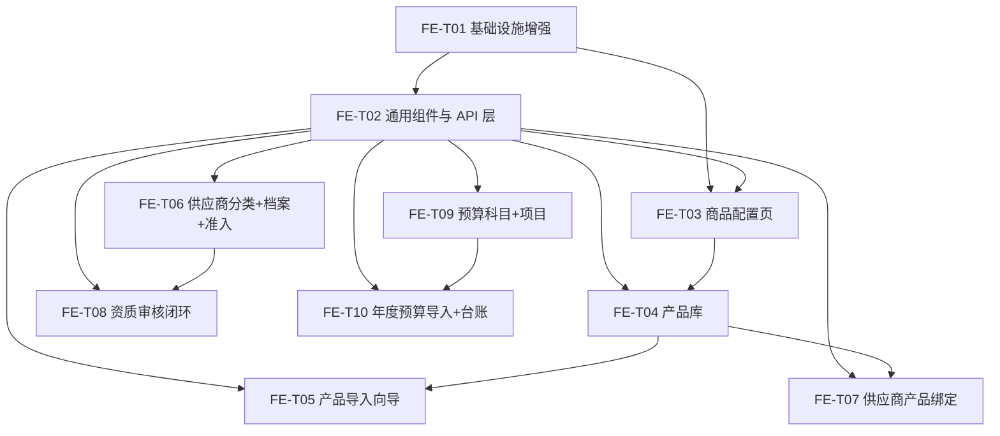

# P1 主数据 / 基础配置 · 前端设计（后台管理端）

> 版本：v1.0（P1 阶段前端设计基线）
> 作者：架构师 高见远（Gao）
> 上游依据：`docs/P1主数据设计.md`（§3 API 清单 / §2 分层契约）、`docs/P1主数据规格设计.md`（AC，进度表行 7–15）、已 push 后端提交 `e337361`..`629a151`（`develop`）
> 范围：**仅后台管理端**（Vue3 + Vite + Element Plus + Pinia + Vue Router）。供应商 H5 不在本期。**只出设计，不写实现代码。**

---

## 0. 结论先行

- **技术栈与骨架完全复用现有 `frontend/`**：Vue 3（`<script setup>` 纯 JS，非 TS）、Vite 5、Element Plus 2.7、Pinia、Vue Router 4；沿用 `@/utils/request`（axios 封装）、`@/store/user`（用户/菜单）、`@/layout/Layout`（动态菜单+面包屑）、列表页既有范式（`el-card` + `el-table` + `el-pagination` + `el-dialog` + `ElMessage`）。**无 i18n**（中文硬编码），**无 TypeScript**。
- **页面规模**：三大模块共 **15 个页面**——商品库 6（品类/单位/规格/价格规则/产品库/导入）、供应商 4（分类/档案/绑定/资质）、预算 4（科目/项目/导入/台账），另加通用增强。
- **路由与菜单**：在既有扁平路由基础上新增 **14 条 P1 子路由**（挂在 `Layout` 下）；菜单数据仍来自后端 `GET /api/v1/menu`（`MenuTreeVO` 树），**需升级 `Layout.vue` 支持二级 `el-sub-menu`**，并扩充 `store/user.js` 的 `fallbackMenus`。
- **组件化**：复用现有请求封装与页面范式；**新增 9 个通用组件 + 2 个 composable + 1 个权限指令**（三级树、树选择、枚举下拉、单位下拉、金额输入、状态标签、错误定位表、导入向导、12 月台账表、`v-permission`）。
- **权限**：后端 `perms` 由 `GET /api/v1/auth/me` 返回（`LoginResponse.UserInfo.perms`），前端据此做**按钮级隐藏**（`v-permission`）；阶段一后端仅 `hasAnyPerm` 门禁，故前端隐藏为 UX，非安全边界。
- **两处实现缺口（须确认）**：① **无通用文件上传端点**（后端仅有 `FileStorage` 接口 + `MinioFileStorage` 实现，无 HTTP 上传控制器）——商品主图 `imageFileKey`、资质附件 `fileKey` 需一个上传接口；② **无字典接口**——枚举在**前端本地用常量表维护**（与既有 `PurchaseRequest.vue` 的本地 map 一致），后续可切换后端字典。

---

## 1. 页面清单（含后端 API 映射）

> 页面 ID 用于任务分解引用。所有列表页统一带部门数据权限（后端 `DataPermissionInterceptor` 注入，前端无感）；所有端点当前门禁为 `@authz.hasAnyPerm`（阶段二细化到 `module:action`）。

### 1.1 商品库管理（catalog）

| 页面 ID | 页面 | 路由 | 后端 API（方法 + 路径） |
|---|---|---|---|
| P-C1 | 品类配置（三级树 + 增改/置无效） | `/catalog/category` | `GET /api/v1/catalog/categories/tree`、`GET /{id}`、`POST /api/v1/catalog/categories`、`PUT /{id}`、`POST /{id}/invalidate` |
| P-C2 | 单位配置（列表 + 增改/置无效） | `/catalog/unit` | `GET /api/v1/catalog/units/page`、`/list`、`/{id}`、`POST`、`PUT /{id}`、`POST /{id}/invalidate` |
| P-C3 | 规格配置（列表 + 分组视图 + 增改/置无效） | `/catalog/spec` | `GET /api/v1/catalog/spec-options/list`、`/grouped`、`/{id}`、`POST`、`PUT /{id}`、`POST /{id}/invalidate` |
| P-C4 | 价格规则（列表 + 增改/置无效 + 引用校验） | `/catalog/price-rule` | `GET /api/v1/catalog/price-rules/list`、`/{id}`、`/validate?refType&refId&price`、`POST`、`PUT /{id}`、`POST /{id}/invalidate` |
| P-C5 | 产品库（SPU 列表 + SKU 抽屉 + 单位换算 + 导出） | `/catalog/product` | `GET /api/v1/catalog/spus/page`、`/{id}`、`/{spuId}/skus`、`POST /spus`、`PUT /spus/{id}`、`POST /spus/{id}/enable|disable`；`GET /api/v1/catalog/skus/page`、`POST /skus`、`PUT /skus/{id}`、`POST /skus/{id}/enable|disable`；`GET /api/v1/catalog/unit-conversions?skuId=`、`/current?skuId&fromUnit`、`POST /unit-conversions`；`POST /api/v1/catalog/spus/export`、`GET /spus/export/{taskId}`、`GET /spus/export/{taskId}/download` |
| P-C6 | 产品导入向导（单规格 / 多规格预览+导入） | `/catalog/import` | `POST /api/v1/catalog/spus/import/single`、`POST /spus/import/multi/preview`、`POST /spus/import/multi` |

### 1.2 供应商管理（supplier）

| 页面 ID | 页面 | 路由 | 后端 API |
|---|---|---|---|
| P-S1 | 供应商分类（三级树 + 增改/置无效） | `/supplier/category` | `GET /api/v1/suppliers/categories/tree`、`/list`、`/{id}`、`POST`、`PUT /{id}`、`POST /{id}/invalidate` |
| P-S2 | 供应商档案（列表 + 组合检索 + 档案抽屉 + 准入资格） | `/supplier/list` | `GET /api/v1/suppliers/page`、`/{id}`、`POST /api/v1/suppliers`、`PUT /{id}`、`POST /{id}/coop-status?status`、`POST /{id}/blacklist?blacklist`、`GET /{id}/admission` |
| P-S3 | 供应商产品绑定（绑定表 + 批量绑定） | `/supplier/bind` | `GET /api/v1/supplier-skus?supplierId=`、`POST /api/v1/supplier-skus`、`DELETE /{id}`、`POST /api/v1/supplier-skus/batch` |
| P-S4 | 资质管理（列表 + 录入 + 审核闭环 + 驳回重提） | `/supplier/qual` | `GET /api/v1/suppliers/{supplierId}/quals`、`POST /{supplierId}/quals`、`PUT /{supplierId}/quals/{id}`、`POST /qual/{id}/review`、`POST /qual/{id}/resubmit`、`POST /qual/callback?taskId&approved&comment` |

### 1.3 预算管理（budget）

| 页面 ID | 页面 | 路由 | 后端 API |
|---|---|---|---|
| P-B1 | 预算科目（树 + 增改/置无效） | `/budget/subject` | `GET /api/v1/budgets/subjects/tree`、`/list`、`/{id}`、`POST`、`PUT /{id}`、`POST /{id}/invalidate` |
| P-B2 | 预算项目（列表 + 按年筛选 + 增改/置无效） | `/budget/project` | `GET /api/v1/budgets/projects/list?year=`、`/{id}`、`POST`、`PUT /{id}`、`POST /{id}/invalidate` |
| P-B3 | 年度预算导入向导（上传→预览→导入→进度） | `/budget/import` | `POST /api/v1/budgets/import/preview`、`POST /api/v1/budgets/import`、`GET /api/v1/budgets/import/tasks/{taskId}` |
| P-B4 | 预算台账（预算头列表 + 12 月台账） | `/budget/ledger` | `GET /api/v1/budgets/headers`、`GET /api/v1/budgets/{headerId}/lines` |

> 覆盖度自检：行 7（P-C5）、行 8（P-C5 单位换算）、行 9（P-C6）、行 10（P-C1~P-C4）、行 11（P-S3）、行 12（P-S1/P-S2）、行 13（P-S4）、行 14（P-S2 准入资格查询）、行 15（P-B1~P-B4）。

---

## 2. 路由与菜单

### 2.1 新增路由表（挂在既有 `Layout`（`/`）下，扁平 `children`）

> 说明：采用**扁平子路由**（路径如 `catalog/category`），不引入多级 `<router-view>` 嵌套；菜单的"分组"仅由 `Layout` 的 `el-sub-menu` 呈现。**替换**既有 `/catalog`、`/supplier`、`/budget` 三个 `ModulePlaceholder` 路由；其余模块占位路由（contract/quotation/order/settlement/approval/report/setting）**保持不变**。默认重定向仍为 `/purchase`。

```js
// 追加到现有 Layout 的 children（router/index.js）——设计示意，非最终实现
{ path: 'catalog/category',   name: 'CatalogCategory',  component: () => import('@/views/catalog/CategoryConfig.vue'),  meta: { title: '品类配置' } },
{ path: 'catalog/unit',       name: 'CatalogUnit',      component: () => import('@/views/catalog/UnitConfig.vue'),      meta: { title: '单位配置' } },
{ path: 'catalog/spec',       name: 'CatalogSpec',      component: () => import('@/views/catalog/SpecConfig.vue'),      meta: { title: '规格配置' } },
{ path: 'catalog/price-rule', name: 'CatalogPriceRule', component: () => import('@/views/catalog/PriceRuleConfig.vue'), meta: { title: '价格规则' } },
{ path: 'catalog/product',    name: 'CatalogProduct',   component: () => import('@/views/catalog/ProductList.vue'),     meta: { title: '产品库' } },
{ path: 'catalog/import',     name: 'CatalogImport',    component: () => import('@/views/catalog/ProductImport.vue'),   meta: { title: '产品导入' } },
{ path: 'supplier/category',  name: 'SupplierCategory', component: () => import('@/views/supplier/SupplierCategory.vue'), meta: { title: '供应商分类' } },
{ path: 'supplier/list',      name: 'SupplierList',     component: () => import('@/views/supplier/SupplierList.vue'),   meta: { title: '供应商档案' } },
{ path: 'supplier/bind',      name: 'SupplierBind',     component: () => import('@/views/supplier/SupplierSkuBind.vue'), meta: { title: '产品绑定' } },
{ path: 'supplier/qual',      name: 'SupplierQual',     component: () => import('@/views/supplier/SupplierQual.vue'),   meta: { title: '资质管理' } },
{ path: 'budget/subject',     name: 'BudgetSubject',    component: () => import('@/views/budget/BudgetSubject.vue'),    meta: { title: '预算科目' } },
{ path: 'budget/project',     name: 'BudgetProject',    component: () => import('@/views/budget/BudgetProject.vue'),    meta: { title: '预算项目' } },
{ path: 'budget/import',      name: 'BudgetImport',     component: () => import('@/views/budget/BudgetImport.vue'),     meta: { title: '年度预算导入' } },
{ path: 'budget/ledger',      name: 'BudgetLedger',     component: () => import('@/views/budget/BudgetLedger.vue'),     meta: { title: '预算台账' } }
```
> 路由守卫沿用现有 `beforeEach`（无 token → `/login`）。

### 2.2 动态菜单机制（数据来源与挂载）

- **数据来源**：`GET /api/v1/menu` → `MenuTreeVO`（`id, parentId, menuName, menuType, path, component, icon, perms, sort, children`），由后端按当前用户角色过滤，`MenuController` 已构建树。前端 `store/user.js#fetchMenus()` 拉取，**失败回退 `fallbackMenus`**（后端不可用时本地兜底）。
- **需扩充 `fallbackMenus`**：在既有 3 个顶级项（`商品库管理/供应商管理/预算管理`）下补 `children`（`parentId` 指向父项 id），叶子 `path` 与 §2.1 路由一致，并带 `perms`（如 `catalog:spu:read`）。示例：
  ```
  商品库管理(id=2) → 品类配置(/catalog/category) · 单位配置(/catalog/unit) · 规格配置(/catalog/spec)
                   · 价格规则(/catalog/price-rule) · 产品库(/catalog/product) · 产品导入(/catalog/import)
  供应商管理(id=3) → 供应商分类(/supplier/category) · 供应商档案(/supplier/list) · 产品绑定(/supplier/bind) · 资质管理(/supplier/qual)
  预算管理(id=5)   → 预算科目(/budget/subject) · 预算项目(/budget/project) · 年度预算导入(/budget/import) · 预算台账(/budget/ledger)
  ```
- **`Layout.vue` 升级（必做）**：当前仅渲染**扁平** `el-menu-item`（`v-for="m in menus"` 忽略 `children`）。P1 需改为递归渲染——**有 `children` 的节点用 `el-sub-menu`，叶子用 `el-menu-item`（`router` 模式，`index=path`）**；`activeMenu` 用 `route.path`；图标取 `m.icon`（可选）。父级 `path` 设为小组件路径（非导航）。
- **组件 column/组件路由**：`MenuTreeVO.component` 默认可为空；菜单仅作导航，路由已在前端静态注册（不从后端动态注册路由）。

---

## 3. 组件与复用

### 3.1 直接复用（现有）
- `@/utils/request`（axios 封装：注入 `Bearer` token、统一 `{code,message,data,traceId}` 处理、401 跳登录、错误 toast）。
- `@/store/user`（`login/fetchUserInfo/fetchMenus/logout`）。
- `@/layout/Layout`（升级后）、`@/views/ModulePlaceholder`（未开发模块占位）。
- 页面范式：`PurchaseRequest.vue` 的卡片+工具栏+`el-table`+`el-pagination`+`el-dialog`+`ElMessage` 结构。

### 3.2 新增通用组件（`frontend/src/components/`）
| 组件 | 职责 | 关键 props（设计） |
|---|---|---|
| `CategoryTree.vue` | 通用三级树（品类/供应商分类/预算科目复用），节点内联操作（新增子节点/编辑/置无效） | `fetcher`(拉树函数)、`onInvalidate`、`levelMax=3`、`skippable` |
| `TreeSelect.vue` | `el-tree-select` 封装，供选择「叶子」节点（SPU→品类、预算维度等） | `fetcher`、`leafOnly`(默认 true)、`modelValue` |
| `EnumSelect.vue` | 枚举下拉，读本地枚举常量表 | `enumKey`、`modelValue`、`clearable` |
| `UnitSelect.vue` | 计量单位下拉（`unit.code`），数据源 `GET /catalog/units/list` | `modelValue`、`filterable` |
| `MoneyInput.vue` | 金额输入（`el-input-number`，`:precision=2`、`:min=0`，`DECIMAL(18,2)`） | `modelValue`、`min`、`max` |
| `StatusTag.vue` | 状态/枚举 → `el-tag`（颜色映射集中管理） | `value`、`enumKey` |
| `ErrorTable.vue` | 渲染 `ImportErrorVO[]{row,col,msg}`，点击行高亮对应预览行 | `errors`、`@row-click` |
| `ImportWizard.vue` | 通用「上传→预览→校验→确认→进度」向导（产品导入/预算导入/批量绑定复用） | `previewApi`、`submitApi`、`taskApi`、`slots` |
| `BudgetLedgerTable.vue` | 12 月台账透视表（行=科目，列=period 0(年度)+1–12 月） | `lines`、`showProject` |
| `FileUpload.vue` | 主图/资质附件的上传封装（**依赖待补的上传端点**，见 §7） | `value(fileKey)`、`accept`、`bizType` |

### 3.3 新增 composable / 指令 / 常量
- `frontend/src/composables/usePagination.js`：统一 `{current,size,total,loading}` 与 `load()` 翻页逻辑。
- `frontend/src/composables/useImportTask.js`：异步任务轮询（`taskId` → 定时 `GET .../tasks/{taskId}`，`RUNNING→SUCCESS/FAILED`）。
- `frontend/src/directive/permission.js`：`v-permission="'catalog:spu:write'"`，依据 `userStore.userInfo?.perms` 判定；在 `main.js` 注册。
- `frontend/src/constants/enums.js`：全部枚举常量映射（见 §3.4）。
- `frontend/src/api/*.js`：新增 `catalog.js`、`supplier.js`、`budget.js`（对齐 §1 端点；命名沿用 `purchase.js` 风格）。

### 3.4 枚举常量表（`constants/enums.js`，前端本地维护）
`productStatus`(0正常/1停用)、`coopStatus`(0正常/1停用/2冻结)、`blacklist`(0否/1是)、`supplierSource`(0平台录入/1H5提交/2导入)、`valuationType`(0计件/1计重)、`bindScope`(0不限定/1限定报价接单)、`priceRuleType`(1最低限价/2最高限价/3区间/4公式)、`priceRefType`(1商品/2品类)、`subjectType`(1支出/2收入)、`qualStatus`(0待审/1通过/2驳回)、`qualValidity`(VALID/EXPIRING/EXPIRED/NONE)、`budgetHeaderStatus`(0草稿/1生效/2归档)、`period`(0年度/1–12月)、`categoryLevel`(1/2/3)。

---

## 4. 关键交互

1. **品类三级树（P-C1）**：`el-tree`（`CategoryTree`）。根节点新增一级；节点操作：新增子级（受限 `level<3`）、编辑、置无效（`POST /{id}/invalidate`；被引用时后端拒绝 → toast）。SPU 表单的品类选择用 `TreeSelect`（`leafOnly=true`，**仅可选 level=3 叶子**）。
2. **单位换算版本与"当前生效"（P-C5 内 SKU 抽屉）**：换算 tab 列出 `GET /unit-conversions?skuId=`（按 `effectiveFrom` 倒序，显示 `version`）；调 `GET /unit-conversions/current?skuId&fromUnit` 标注"当前生效"角标；新增换算即产生新 `version`（`POST`），**前端不做换算计算**，仅展示与录入。
3. **价格规则校验提示（P-C4 / P-C5）**：`PriceRuleConfig` 维护规则（`ruleType/refType/refId/min/max/expression`）；SKU 保存前可调 `GET /price-rules/validate?refType&refId&price` 预检，越界时**表单项标红 + 行内提示**；最终以后端保存时校验为准（越界由后端返回错误，拦截器 toast）。
4. **资质审核闭环（P-S4）**：资质列表（状态 `StatusTag` + 有效期 `qualValidity` 标签）。流程：**录入**（`POST`，状态→待审 0）→ **提交审核**（`POST /{id}/review`，返回 `taskId`，本阶段走 `ApprovalGateway`，`LocalApprovalGateway` 落 `approval_task`）→ **审核弹窗**（通过/驳回 + 意见）→ `POST /callback?taskId&approved&comment`（通过→1；驳回→2 且必填原因）→ **驳回后修改重提**（`POST /{id}/resubmit`，状态回 0）。展示 `reviewedBy/reviewedAt/rejectReason`。
5. **准入资格查询（P-S2 档案抽屉）**：只读区块，`GET /{id}/admission` → 展示 `qualified`（合格/不合格 `el-tag`）+ `reasons[]` + `qualValidity`；**本阶段仅展示，不做拦截**（拦截点 P2/P3）。
6. **年度预算导入 + 12 月台账（P-B3 / P-B4）**：
   - 导入向导（`ImportWizard`）：下载模板 → 上传 → `POST /import/preview` 得 `BudgetImportPreviewVO`（header + lines + errors + valid）→ 校验通过才允许 `POST /import`（返回 `taskId`）→ `GET /import/tasks/{taskId}` 轮询进度。
   - 台账（`BudgetLedgerTable`）：`GET /budgets/headers` 选头 → `GET /budgets/{headerId}/lines`，**行=科目、列=period 0(年度)+1–12 月**；`usedAmount` 本阶段显示 0（P3 写入）。
7. **导入预览与行级错误定位（P-C6 / P-B3 / P-S3）**：`ErrorTable` 渲染 `{row,col,msg}`；点错误行高亮预览行；`valid=false` 时禁用"确认导入"；批量绑定（P-S3）`POST /supplier-skus/batch` 返回 `BatchBindRespVO{totalRows,successRows,failRows,errors}`。
8. **导出下载（P-C5）**：`POST /spus/export`（筛选 `ProductExportReqVO{categoryId,status,keyword,columns}`）→ `ImportTaskVO{taskId,status}` → 轮询 `GET /spus/export/{taskId}` → 完成后 `GET /spus/export/{taskId}/download`。**注意**：下载接口需带 `Authorization` 头，故用 **axios `responseType:'blob'` 拉取后 `URL.createObjectURL` 触发保存**（不可用裸 `window.open`）。

---

## 5. 状态与权限

- **加载态**：列表/树/抽屉统一 `v-loading`；提交按钮 `:loading`；轮询期间显示进度条。
- **空态**：列表无数据用 `el-empty`；未开发模块保留 `ModulePlaceholder`；无权限/404 展示友好 `el-empty`。
- **错误态**：由 `@/utils/request` 统一处理——业务码 `≠0` toast 提示，`401/2001/2002/2003` 清 token 跳登录；列表请求失败回退空数组（沿用 `PurchaseRequest.vue` 容错）。
- **按钮级权限（`v-permission`）**：依据 `userStore.userInfo.perms`（`GET /auth/me` 返回）。用法示例：`:disabled` / `v-permission="'catalog:spu:write'"` 隐藏"新建/编辑/删除/导入"等操作。**权限键对齐 `docs/P1主数据设计.md` §3**（`catalog:*` / `supplier:*` / `budget:*`）。
  - **阶段一说明**：后端当前门禁为 `@authz.hasAnyPerm`（所有登录且拥有任一权限的用户可过），故前端隐藏仅为 UX 优化；阶段二后端细化到 `module:action` 后，前端 `perms` 与后端一致，隐藏即等价。
  - **菜单级**：可选用 `MenuTreeVO.perms` 过滤菜单项（后端已按角色下发，前端可不重复过滤）。
- **部门数据权限**：列表/台账/导出由后端拦截器注入 `dept_id`，前端无需传部门参数（`BudgetHeaderQueryReqVO` 的 `deptId` 仅在管理端跨部门查询时显式传）。

---

## 6. 任务分解（前端）

> 有序、按依赖推进；每任务 ≥3 文件。**FE-T01 为基础增强**（其余任务的前置）。

| FE 任务 | 名称 | 主要文件 | 依赖 | 优先级 |
|---|---|---|---|---|
| **FE-T01** | 前端基础设施增强 | `router/index.js`（+14 P1 子路由）、`layout/Layout.vue`（二级菜单渲染）、`store/user.js`（增 `perms`、扩充 `fallbackMenus`）、`directive/permission.js`、`main.js`（注册指令）、`constants/enums.js` | 现有骨架 | P0 |
| **FE-T02** | 通用组件与 API 层 | `components/{CategoryTree,TreeSelect,EnumSelect,UnitSelect,MoneyInput,StatusTag,ErrorTable,ImportWizard}.vue`、`composables/{usePagination,useImportTask}.js`、`api/{catalog,supplier,budget}.js` | FE-T01 | P0 |
| **FE-T03** | 商品配置页（品类/单位/规格/价格规则） | `views/catalog/{CategoryConfig,UnitConfig,SpecConfig,PriceRuleConfig}.vue` | FE-T01,FE-T02 | P0 |
| **FE-T04** | 产品库（SPU/SKU/单位换算/导出） | `views/catalog/ProductList.vue`、`components/catalog/{SpuForm,SkuForm,UnitConversionPanel,ExportDialog}.vue` | FE-T02,FE-T03 | P0 |
| **FE-T05** | 产品导入向导（单/多规格） | `views/catalog/ProductImport.vue`（复用 `ImportWizard`） | FE-T02,FE-T04 | P1 |
| **FE-T06** | 供应商分类 + 档案 + 准入资格 | `views/supplier/{SupplierCategory,SupplierList}.vue`、`components/supplier/SupplierDrawer.vue`（含准入资格区块） | FE-T02 | P0 |
| **FE-T07** | 供应商产品绑定（含批量） | `views/supplier/SupplierSkuBind.vue` | FE-T02,FE-T04 | P0 |
| **FE-T08** | 资质管理 + 审核闭环 | `views/supplier/SupplierQual.vue`、`components/supplier/QualReviewDialog.vue` | FE-T02,FE-T06 | P0 |
| **FE-T09** | 预算科目 + 预算项目 | `views/budget/{BudgetSubject,BudgetProject}.vue` | FE-T02 | P0 |
| **FE-T10** | 年度预算导入 + 预算台账 | `views/budget/{BudgetImport,BudgetLedger}.vue`、`components/BudgetLedgerTable.vue` | FE-T02,FE-T09 | P0 |

**依赖图**



---

## 7. 风险 / 待确认

| # | 事项 | 影响 | 建议 |
|---|---|---|---|
| R1 | **无通用文件上传端点**：后端仅有 `FileStorage` 接口 + `MinioFileStorage`，无 HTTP 上传控制器。商品主图 `imageFileKey`、资质附件 `fileKey` 无处上传。 | P-C5（SPU/SKU 主图）、P-S4（资质附件）无法完成附件交互 | 建议 P1 补一个薄上传接口（如 `POST /api/v1/files/upload` → 返回 `fileKey`，内部调 `FileStorage`）；前端先以 `FileUpload.vue` 封装，端点就绪前可暂用 `fileKey` 文本占位。**待确认由谁补。** |
| R2 | **无字典/枚举接口**：枚举值需前端本地维护（`constants/enums.js`）。 | 枚举若后端调整，前端需同步改 | 本期沿用本地常量（与既有 `PurchaseRequest.vue` 一致）；后续如加 `GET /api/v1/dict/{type}` 再切换。 |
| R3 | **`Layout.vue` 当前仅支持扁平菜单**，需升级为二级 `el-sub-menu`。 | 不改会导致 P1 子菜单不显示 | FE-T01 必做；若暂不做，可先以"模块页内 tabs"过渡（不推荐）。 |
| R4 | **资质审核动作链路**：`/review` 仅发起审批并返回 `taskId`，通过/驳回由 `/callback` 落地。前端需在一处同时承载"发起"与"审核"两个动作，交互需明确角色。 | P-S4 交互设计 | 设计为两步：列表「提交审核」→（可切换的）「审核」弹窗触发 `/callback`；本阶段 `LocalApprovalGateway` 为本地桩，审核即时生效。 |
| R5 | **导出下载鉴权**：`download` 需 `Authorization` 头。 | 用 `window.open` 会 401 | 统一用 axios `responseType:'blob'` + `URL.createObjectURL` 保存。 |
| R6 | **异步导入/导出进度**：`ImportTaskVO.status` 需轮询。 | 大文件导入体验 | `useImportTask` 统一轮询，间隔 1–2s，`SUCCESS/FAILED` 停止，`FAILED` 展示 `errors`。 |
| R7 | **价格规则校验时机**：后端为"保存时拦截"；前端预检为增强。 | 越界提示位置 | 前端做行内预检（`/validate`）+ 保存兜底 toast；不改变后端拦截语义。 |

> 结论：P1 前端在既有骨架上增量实现即可，**唯一外部依赖是 R1 文件上传端点**（影响 2 个页面的附件交互），其余均为前端内部工作；路由/菜单/组件三处为全局性改动，集中在 FE-T01/FE-T02 完成。
