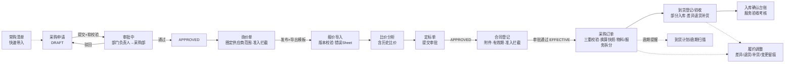
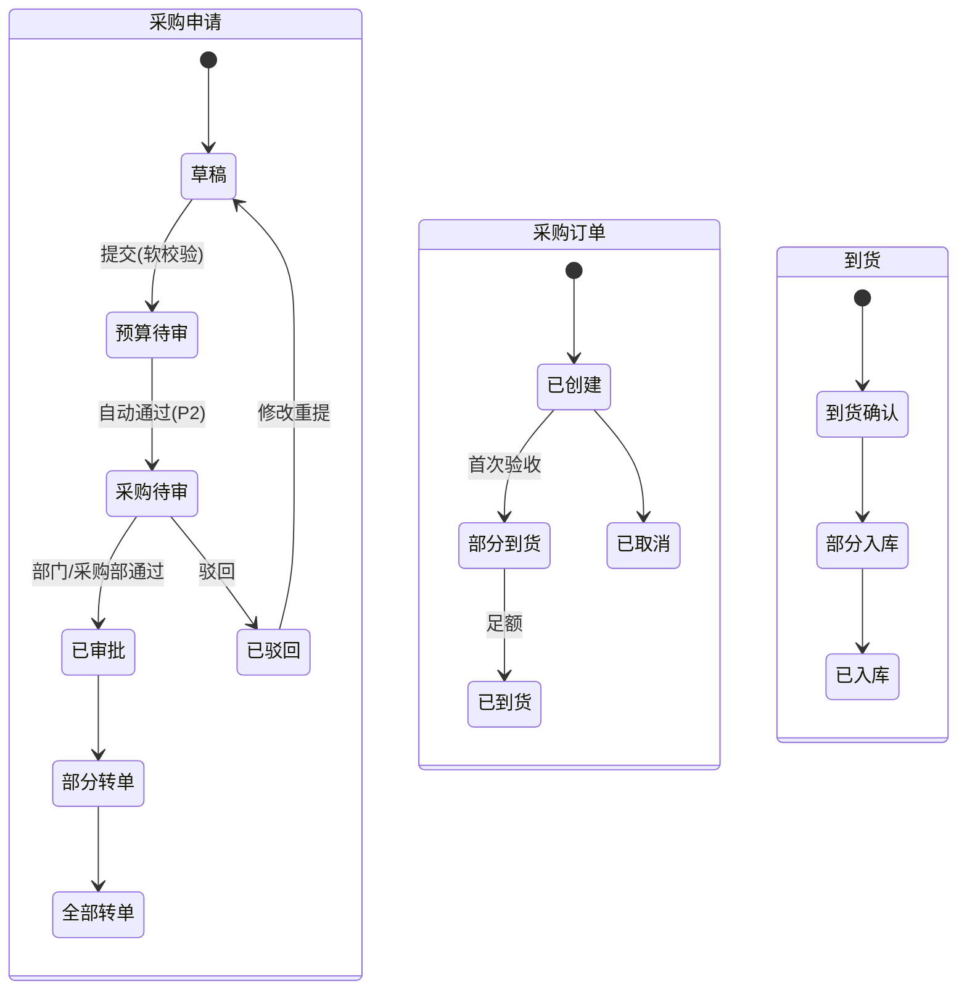

# P2 采购主链路 · 产品需求规格（Spec）

> 版本：v1.0（P2 阶段规格基线）
> 作者：产品经理 许清楚（Xu）
> 关联基线：`docs/需求评审报告.md`、`docs/技术评审与架构设计.md`、`docs/SDD开发阶段拆解.md`、`docs/P1主数据规格设计.md`、`docs/P1主数据设计.md`（§3 API 范式 / §6 定稿假设）
> 阶段基线：P0 地基 + P1 主数据已交付；前端按原型样式实现（主题已对齐），本 Spec 不出效果图、不写代码。

---

## 0. 结论先行

P2 交付**标准/项目采购链路端到端**：采购申请 → 常购清单带入 → 询价 → 报价导入 → 比价 → 定标 → 合同 → 订单 → 到货验收 → 履约调整，全程落地 P1 冻结的三项跨模块契约（准入拦截 / 换算快照 / 预算软校验不动账）。审批统一经 `ApprovalGateway`（本地桩），本阶段用"简单审核动作"推进，状态机按两级审批设计以避免 P4 返工。

- **硬规则（不可违反）**：订单**必须**基于已审批/登记且在有效期内的合同（`EFFECTIVE`）发起；定标只驱动合同、**不直接转单**；订单累计金额 ≤ 合同 `available_amount`；累计下单数量 ≤ 申请 `remain_qty`。
- **实体映射结论**：复用 7 个已有实体（`purchase_apply / purchase_apply_item / inquiry / quotation / award / contract / purchase_order / order_item / arrival` 共 9 个），**需加字段 8 张**；**需新建 7 个实体**：`award_item`（定标明细，`order_item.source_award_item` 已预留引用）、`inquiry_supplier`（询价供应商范围）、`frequent_purchase`（常购清单）、`order_change`（订单变更留痕）、`arrival_item`（到货验收明细）、`service_assess`（服务验收考核）、`fulfillment_adjust`（履约调整）。
- **范围裁量（待主理人确认）**：建议 P2 前半只做**标准链路**，日常/框架免比价链路与线下补录链路放 P2 后半（实体 `type` 已预留，不影响表结构）。
- **预算口径**：申请提交做**软校验**（读余额、标记 `budget_status`，不拦截不升级审批）；`budget_line.used_amount` 本阶段**不写**，占用/释放/核销属 P3。

---

## 1. 项目信息 / 范围复述

| 项 | 内容 |
|---|---|
| 阶段 | P2 采购主链路 MVP（进度表行 18–29，后台管理端 / 采购管理） |
| 语言 | 中文（文档与界面文案，前端按原型实现） |
| 技术栈 | 沿用既定：Spring Boot 3.2 + Java 17 + MyBatis-Plus + MySQL8 + Redis7 + MinIO；Vue3 + Vite + Element Plus |
| 领域分包 | `com.dzgylxt.entity.{purchase,contract,order}` 及对应 `vo/mapper/controller/service` |
| 原始需求复述 | 行18 采购申请（新建/编辑/明细/导出）；行19 常购清单快速带入；行20 询价单创建/编辑/发布与供应商范围；行21 报价模板导出/导入与版本校验；行22 比价分析、历史比价与定标管理；行23 合同登记/检索/附件/审批；行24 合同到期预警与续签/终止；行25 订单生成/详情/变更/履约状态；行26 到货计划/逾期提醒/订单状态回写；行27 到货登记/验收/部分入库/差异退货补货；行28 入库确认台账与服务验收扣款；行29 履约调整登记/查询/变更留痕 |

**已定稿决策（勿改）**：
1. 审批统一走 `ApprovalGateway`（本地桩 `LocalApprovalGateway`，bizType 如 `PURCHASE_APPLY / AWARD / CONTRACT`）；完整审批单据中心属 P4，本阶段用简单审核动作推进。
2. 供应商-商品绑定为**优选非强制**（`bind_scope=0`）；准入资格按**"未过期即有效"**（VALID/EXPIRING 合格，EXPIRED 阻断）。
3. P1 已交付的供应商档案/黑名单/资质有效期预警、商品 SPU/SKU/换算、预算科目/台账直接复用。

**本期范围（In Scope）**：标准链路全单据（创建/编辑/发布/导入导出/比价/定标/登记/生成/验收/调整）+ 三项契约落地 + 单据间追溯。

**明确排除（Out of Scope）**：预算占用/释放/核销与超预算升级审批（P3）、结算与付款（P3）、完整审批单据中心（P4）、真实 SSO（P5）、外部同步（P6）、H5 端（P7）。日常/框架与线下补录链路的"免比价跳转"逻辑待 Q1 拍板（建议 P2 后半）。

---

## 2. 产品目标（Product Goals）

1. **打通标准采购链路闭环**：从申请到验收的全单据可创建、可追溯、可流转，任何单据可上溯来源、下追去向（申请↔订单↔到货）。
2. **守住三条硬规则**：合同约束下单（无有效合同不可下单）、额度约束（订单 ≤ 合同可用额度）、数量约束（订单 ≤ 申请余量），超限一律拒绝。
3. **落地 P1 契约并沉淀留痕**：供应商准入在询价/定标/合同三处拦截；所有单据行落换算快照；审批/变更/调整全程留痕，为 P3 结算与 P4 审批中心铺路。

> 三目标正交：①可用性（链路跑通）②合规性（硬规则）③可追溯性（契约与留痕）。

---

## 3. 用户故事（按角色 / 链路）

| # | 角色 | 场景 | 价值 |
|---|---|---|---|
| U1 | 部门申请人 | 新建采购申请（物料/服务混合明细），从常购清单快速带入，提交审批并导出 | 快速、准确发起采购 |
| U2 | 部门负责人 | 审核本部门申请（通过/驳回+意见） | 部门侧合规把关 |
| U3 | 采购专员 | 基于已审批申请创建询价单、圈定供应商范围、发布；导出报价模板发给供应商 | 规范询价、范围可控 |
| U4 | 采购专员 | 导入各供应商 Excel 报价（版本校验、错误定位），查看报价汇总 | 报价高效入库、可校验 |
| U5 | 采购负责人 | 查看比价分析（含历史比价），确定定标方案，提交定标审批 | 决策有据、留痕 |
| U6 | 采购专员 | 定标审批通过后登记合同（附件、有效期、额度），提交合同审批 | 定标→合同可追溯 |
| U7 | 采购专员 | 选择有效合同发起订单，自动带出合同可用额度/价格，落换算快照 | 无合同不下单、口径一致 |
| U8 | 采购专员 | 订单变更（未到货前）、维护到货计划、查看逾期提醒与履约状态 | 履约可控 |
| U9 | 仓管/验收员 | 到货登记、按实际数量部分入库、差异退货/补货、入库确认台账 | 账实一致、差异闭环 |
| U10 | 采购/服务管理员 | 对服务订单登记验收考核与扣款（供 P3 结算取数） | 服务类采购有验收依据 |
| U11 | 采购专员 | 登记履约调整（差异/退货/订单变更），查询调整台账与留痕 | 履约异常可治理 |

---

## 4. 需求池（按 P0 / P1 / P2 分级）

> 每条含：功能描述、验收标准（AC）、字段与状态机、实体映射。编号规则统一见 §6。

### 4.1 采购申请与常购清单

#### P0 · R-APL-01 采购申请新建 / 编辑 / 明细 / 导出（行18）
- **功能描述**：申请人新建采购申请（标题、类型、备注、期望到货日期），维护明细（SKU、数量、预估单价、备注），提交审批；支持导出。
- **AC**：① 明细行必须选**有效 SKU**（`spu/sku status=0`），选中即落**换算快照**（`qty_in_purchase_unit/qty_in_base_unit/conv_rate_snapshot`，取 `unit_conversion` 当前生效版本）；② 申请金额=Σ(数量×预估单价)；③ 仅 `DRAFT/REJECTED` 可编辑，其余只读；④ 导出含明细与快照列，经数据权限过滤；⑤ 物料与服务可混合（行级标记，转单时拆分物料/服务订单）。
- **字段与状态机**：`purchase_apply`（已有 `dept_id/apply_no/title/type/status/budget_status/applicant_id/remark`）**+ `expected_date`（期望到货）**。`purchase_apply_item`（已有 `apply_id/sku_id/qty/apply_qty/ordered_qty/remain_qty/unit_snapshot`）**+ `qty_in_purchase_unit`、`qty_in_base_unit`、`conv_rate_snapshot`(DECIMAL)、`purchase_unit`、`price_estimate`、`item_type`(0物料/1服务)、`remark`**；`unit_snapshot`(String) **弃用**，迁移至结构化三字段。
  - 状态机（沿用 `PurchaseApplyStatus`）：`DRAFT →BUDGET_PENDING →PURCHASE_PENDING →APPROVED / REJECTED(→DRAFT 修改重提)`；`APPROVED →PARTIAL_ORDER / FULL_ORDER`。本阶段 `BUDGET_PENDING` 由**软校验自动通过**（超预算仅置 `budget_status=2` 并提示，不拦截、不升级审批——升级审批属 P3）。
- **实体映射**：`purchase_apply`(+1)、`purchase_apply_item`(+7/重构1)。

#### P1 · R-APL-02 常购清单与申请快速带入（行19）
- **功能描述**：按部门维护常购清单（SKU、默认数量、采购单位、最近价），新建申请时一键带入。
- **AC**：① 清单按部门隔离（`dept_id`）；② 带入后数量/价格可改，改后重算金额与快照；③ 停用 SKU 不允许带入；④ 最近价自动取该 SKU 最近一次订单/报价价（无则取 `standard_price`）。
- **字段与状态**：**新建 `frequent_purchase`**：`dept_id, sku_id, default_qty, purchase_unit, last_price, remark, status(0正常/1停用)`；(dept_id,sku_id) 唯一。
- **实体映射**：**新建**。

### 4.2 询价与报价

#### P0 · R-INQ-01 询价单创建 / 编辑 / 发布与供应商范围（行20）
- **功能描述**：基于已审批申请（或其明细子集）创建询价单，维护截标时间与备注，圈定供应商范围后发布。
- **AC**：① 仅 `APPLIED→APPROVED` 的申请可创建询价（`inquiry.apply_id` 关联）；② 发布前必须圈定 ≥1 家供应商；③ **发布时逐家调用 `GET /api/v1/suppliers/{id}/admission`，`qualified=false` 拒绝加入范围**（EXPIRED 资质/黑名单/停用均不合格；默认按 `supplier_sku` 绑定池**优选带入**，`bind_scope=0` 不强制）；④ 供应商范围可增删，截标后锁定；⑤ 一个申请可多次询价（重新询价）。
- **字段与状态机**：`inquiry`（已有 `apply_id/inquiry_no/status/remark`）**+ `deadline`（截标时间）、+ `created_by_dept`**。**新建 `inquiry_supplier`**：`inquiry_id, supplier_id, invited(0/1), quoted(0/1), admission_snapshot(JSON：qualified/reasons)，remark`；(inquiry_id,supplier_id) 唯一。发布时落**准入快照**，供审计回溯。
  - 状态机（`InquiryStatus`）：`DRAFT →PUBLISHED →CLOSED（截标，可进入比价）→（比价完成→定标）`；`DRAFT/PUBLISHED →CANCELLED`。
- **实体映射**：`inquiry`(+2)、**新建** `inquiry_supplier`。

#### P0 · R-INQ-02 报价模板导出 / 报价导入与版本校验（行21）
- **功能描述**：按询价单导出报价包模板（含询价明细行、供应商信息位），供应商线下填写后后台导入。
- **AC**：① 模板带 `templateVersion`，版本不符拒绝并提示更新；② 导入按"供应商×询价明细"落 `quotation` 行，校验 SKU 存在且属于该询价、价格>0；③ 单价落**换算快照**（按导入单位换算到基本单位）；④ 错误行收集为"错误 Sheet"返回（行号+原因），全部通过才落库；⑤ 同一供应商重复导入生成新批次，旧批次置失效（不物理删）。
- **字段与状态机**：`quotation`（已有 `inquiry_id/supplier_id/sku_id/price/conv_snapshot/status`）**+ `batch_no`（报价批次）、+ `file_key`（原始报价附件）、+ `qty_in_base_unit`、`purchase_unit`、`invalid`(0/1)**。状态机（`QuotationStatus`）：`SUBMITTED →ACCEPTED / REJECTED`（比价采纳/否决）。
- **实体映射**：`quotation`(+4)。

### 4.3 比价与定标

#### P0 · R-AWD-01 比价分析、历史比价与定标管理（行22）
- **功能描述**：截标后按 SKU 汇总各供应商报价形成比价视图（含该 SKU 历史成交价：历史 `quotation` 采纳价、历史订单价）；采购员择优生成定标单（含定标明细），提交定标审批。
- **AC**：① 比价视图展示 最低/最高/均价/历史价（近 N 次可配置，默认 5）；② 定标明细逐 SKU 指定供应商与价格（可拆分给多家，即按 SKU 定标）；③ **定标只驱动合同，不生成订单**；④ 定标提交审批走 `ApprovalGateway`（bizType=`AWARD`）；⑤ 参与定标的供应商均须准入合格（沿用询价快照，不一致则重新校验）。
- **字段与状态机**：`award`（已有 `inquiry_id/supplier_id/amount/status/remark`）**+ `award_no`（定标单号）、+ `apply_id`（追溯申请）**。**新建 `award_item`**：`award_id, sku_id, supplier_id, price, qty, qty_in_base_unit, conv_rate_snapshot, remark`（`order_item.source_award_item` 引用此表 id——P0 骨架已预留）。
  - 状态机（`AwardStatus`）：`PENDING_APPROVAL →APPROVED / REJECTED(→PENDING_APPROVAL 调整重提)`。`APPROVED` 后可登记合同。
- **实体映射**：`award`(+2)、**新建** `award_item`。

### 4.4 合同管理

#### P0 · R-CON-01 合同登记 / 检索 / 附件 / 审批（行23）
- **功能描述**：定标审批通过后（或线下补录链路）登记合同：供应商、名称、金额、有效期、附件、来源定标；提交合同审批。
- **AC**：① 合同金额 = Σ来源定标明细金额（线下补录可手填）；② 附件走 `FileStorage`（`file_key`），支持多附件；③ 检索：按名称/供应商/状态/有效期范围组合查询，经数据权限过滤；④ 登记即校验供应商准入（`qualified=false` 拒绝）；⑤ 提交审批走 `ApprovalGateway`（bizType=`CONTRACT`），审批通过置 `EFFECTIVE` 并初始化 `available_amount=amount`。
- **字段与状态机**：`contract`（已有 `supplier_id/no/title/amount/valid_from/valid_to/status/available_amount/remark`）**+ `file_keys`（附件，关联 `file_meta`，多附件存 JSON）、+ `award_id`（来源定标，nullable）、+ `contract_type`(0物料/1服务/2综合)**。
  - 状态机（`ContractStatus`）：`DRAFT →PENDING_APPROVAL →EFFECTIVE →EXPIRED（到期） / TERMINATED（终止）`。**仅 `EFFECTIVE` 且在有效期内可发起订单**（硬规则）。
- **实体映射**：`contract`(+3)。

#### P1 · R-CON-02 合同到期预警与续签 / 终止（行24）
- **功能描述**：到期前 N 天（配置项，默认 30）预警；支持续签（生成新合同并关联原合同）与终止（填原因，释放剩余额度）。
- **AC**：① 预警列表按 `valid_to` 派生（复用 P1 资质预警同款扫描模式）；② 终止仅 `EFFECTIVE` 可操作，终止后 `available_amount` 冻结不可下单；③ 续签生成新合同（`renewed_from_id` 关联），新合同独立走审批。
- **字段与状态**：`contract` **+ `renewed_from_id`（续签来源，nullable）、+ `terminate_reason`**。
- **实体映射**：`contract`(+2)。

### 4.5 采购订单

#### P0 · R-ORD-01 订单生成 / 详情 / 变更 / 履约状态（行25）
- **功能描述**：选择有效合同带出供应商/可用额度/价格，选择申请明细（或定标明细）生成订单；订单详情可查全链路追溯；未到货前可变更（数量/价格/明细），变更留痕；履约状态看板。
- **AC**：① **下单三重校验（硬规则）**：合同 `EFFECTIVE` 且 `valid_from≤today≤valid_to`；Σ订单金额（含本单）≤ 合同 `available_amount`；Σ订单数量 ≤ 申请明细 `remain_qty`；② 订单明细落**换算快照**（`qty_purchase/qty_base/conv_snapshot` 已有字段）与来源追溯（`source_award_item`/申请明细）；③ 物料/服务订单拆分（`order_type`，源自申请 `item_type`）；④ 变更仅 `CREATED`（未到货）可发起，重跑三重校验，前后快照留痕；⑤ 履约状态由到货进度回写（见 R-ARR-02）。
- **字段与状态机**：`purchase_order`（已有 `contract_id/apply_id/supplier_id/order_no/status/budget_occupied/remark`）**+ `order_type`(0物料/1服务)**。`order_item`（已有 `order_id/sku_id/qty_purchase/qty_base/conv_snapshot/price/source_award_item`）**+ `apply_item_id`（申请明细追溯）**。**新建 `order_change`**：`order_id, change_type(数量/价格/明细/取消), before_json, after_json, reason, status(0待审/1生效/2驳回), operator`（变更是否需审批见 Q5）。
  - 状态机（`OrderStatus`）：`CREATED →PARTIAL_RECEIVED →RECEIVED →SETTLED（P3） / PAID（P3）`；`CREATED/PARTIAL_RECEIVED →CANCELLED`。`budget_occupied` 本阶段仅落快照金额，**不写 `budget_line.used_amount`**（P3 做占用/释放）。
- **实体映射**：`purchase_order`(+1)、`order_item`(+1)、**新建** `order_change`。

#### P1 · R-ORD-02 到货计划 / 逾期提醒 / 订单状态回写（行26）
- **功能描述**：订单明细维护到货计划（计划日期/数量）；按计划日期扫描逾期未到货并提醒；到货进度自动回写订单状态。
- **AC**：① 到货计划在订单明细级维护（可多次分批计划）；② 逾期=计划日期已过且未足额到货，提醒列表+站内通知；③ 回写规则：首单到货→`PARTIAL_RECEIVED`，全部明细足额到货→`RECEIVED`。
- **字段与状态**：`order_item` **+ `plan_date`（到货计划）、+ `planned_qty`**；提醒走 P1 同款扫描+通知模式。
- **实体映射**：`order_item`(+2)。

### 4.6 到货验收

#### P0 · R-ARR-01 到货登记 / 验收 / 部分入库 / 差异退货补货（行27）
- **功能描述**：按订单登记到货（分批多次），逐明细验收：合格入库、差异处理（退货/补货/接受），凭证上传。
- **AC**：① 一订单可多次到货；② 到货明细按订单明细展开，录 `qty_actual`，差异=`qty_expected-qty_actual` 自动计算；③ 差异必须选择处理方式（退货/补货/接受），退货/补货生成后续跟踪项；④ 部分入库：验收合格数量可分次入库，未足额到货订单保持 `PARTIAL_RECEIVED`；⑤ 入库数量口径=**基本单位**（快照换算）；⑥ 凭证附件走 `file_meta`。
- **字段与状态机**：`arrival`（已有 `order_id/actual_qty/diff_qty/voucher_file_key/status/remark`）**+ `arrival_no`（到货单号）**。**新建 `arrival_item`**：`arrival_id, order_item_id, sku_id, qty_expected, qty_actual, qty_diff, diff_type(0无差异/1短缺/2破损), handle_type(0接受/1退货/2补货), qty_stored, handle_status(0待处理/1已完成), remark`。
  - 状态机（`ArrivalStatus`）：`ARRIVAL_CONFIRMED →PARTIAL_STORED →STORED`。
- **实体映射**：`arrival`(+1)、**新建** `arrival_item`。

#### P0 · R-ARR-02 入库确认台账与服务验收扣款（行28）
- **功能描述**：入库确认台账（按订单/到货/时间查询入库流水，确认动作落台账）；服务订单的验收考核（评分/扣款留痕，供 P3 结算取数）。
- **AC**：① 台账=查询视图（`arrival_item.qty_stored` 流水），支持按订单/供应商/日期筛选与导出，经数据权限过滤；② "确认入库"动作将 `qty_stored` 落账并推进到货状态；③ 服务订单验收：登记考核结果（评分、扣款金额、依据、附件），**扣款金额供 P3 结算直接取数**；④ 考核口径（评分项/扣款公式）见 Q7，先按自由录入落库。
- **字段与状态**：台账无新表（查询视图）。**新建 `service_assess`**：`order_id, assess_date, score, deduct_amount, basis, file_keys, status, remark`。
- **实体映射**：**新建** `service_assess`。

### 4.7 履约调整

#### P1 · R-ADJ-01 履约调整登记 / 查询 / 变更留痕（行29）
- **功能描述**：登记履约调整（到货差异/退货/补货/订单变更调整），独立台账查询，全程留痕。
- **AC**：① 调整关联 `order_id`（可关联 `arrival_id`），类型：差异/退货/补货/变更；② 前后口径快照（金额/数量 before/after）；③ 调整是否需审批走 `ApprovalGateway`（bizType=`FULFILLMENT_ADJUST`，阈值见 Q5）；④ 调整生效后回写相关单据状态（退货→差异处理完成等）；⑤ 台账按类型/订单/供应商/时间筛选导出。
- **字段与状态机**：**新建 `fulfillment_adjust`**：`adjust_no, biz_type(订单/到货), order_id, arrival_id, adjust_type(0差异/1退货/2补货/3变更), before_json, after_json, reason, status(0草稿/1审批中/2生效/3驳回), file_keys, operator`。
  - 状态机：`DRAFT →审批中(可选) →生效 / 驳回(→DRAFT)`。
- **实体映射**：**新建**（架构 T15 预留的 `FulfillmentAdjust` 提前至 P2）。

---

## 5. 单据流转图

### 5.1 标准链路主流程（行18–29）

> 日常/框架链路（C→H 跳过询价定标，基于有效框架合同免比价）与线下补录链路（H 直接登记→补定标）**复用同一批实体**，仅流转入口不同，是否纳入 P2 见 Q1。

### 5.2 关键状态机（采购申请 / 订单 / 到货）

---

## 6. 单据编号规则

| 单据 | 字段 | 规则 | 唯一性 |
|---|---|---|---|
| 采购申请 | `apply_no` | `CG-{yyyy}{MM}-{部门编码}-{seq4}` | 全局唯一索引 |
| 询价单 | `inquiry_no` | `XJ-{yyyy}{MM}-{seq6}` | 全局唯一索引 |
| 报价批次 | `batch_no` | `BJ-{inquiry_no}-{seq2}` | (inquiry_id,batch_no) 唯一 |
| 定标单 | `award_no` | `DB-{yyyy}{MM}-{seq6}` | 全局唯一索引 |
| 合同 | `no` | `HT-{yyyy}-{seq6}`（线下合同号可另行录入备注） | 全局唯一索引 |
| 订单 | `order_no` | `PO-{yyyy}{MM}-{seq6}` | 全局唯一索引 |
| 到货单 | `arrival_no` | `DH-{order_no}-{seq2}` | (order_id,arrival_no) 唯一 |
| 履约调整 | `adjust_no` | `LY-{yyyy}{MM}-{seq6}` | 全局唯一索引 |

> 序列实现：`seq` 由 DB 序列表或 Redis INCR 生成，按月重置；编码规则实现放 `common/IdGenerator`，禁止业务代码散落拼接。

---

## 7. 跨模块契约落地清单（P2 落地 · 承接 P1）

| # | 契约（P1 冻结） | P2 落地点 | 口径 |
|---|---|---|---|
| 1 | 供应商准入拦截（R-X-01） | **询价发布圈定供应商**、**定标提交**、**合同登记** 三处调用 `GET /api/v1/suppliers/{id}/admission` | VALID/EXPIRING 合格；EXPIRED/黑名单/停用 → 拒绝；询价时落 `inquiry_supplier.admission_snapshot` 审计快照 |
| 2 | 供应商绑定优选（A3） | 询价供应商范围默认按 `supplier_sku` 绑定池带入 | `bind_scope=0` 优选非强制，允许超范围加供应商 |
| 3 | 单位换算快照（R-X-02） | `purchase_apply_item / quotation / award_item / order_item / arrival_item` 落 `qty_in_purchase_unit / qty_in_base_unit / conv_rate_snapshot` | 取下单/录入时 `unit_conversion` 当前生效版本；历史单据不受后续换率变更影响 |
| 4 | 预算不动账（P1 §5-3） | 申请提交**软校验**：读 `budget_line(amount-used)` 余额，超限置 `budget_status=2` 仅提示 | `budget_line.used_amount` 不写；`purchase_order.budget_occupied` 落快照金额供 P3 核算 |
| 5 | 审批接缝（已定稿） | 申请 bizType=`PURCHASE_APPLY`、定标=`AWARD`、合同=`CONTRACT`、（可选）调整=`FULFILLMENT_ADJUST` | 本地桩 `LocalApprovalGateway`，本阶段简单审核动作（approve/reject 即回调）；状态机按两级设计，P4 换实现业务无感 |
| 6 | 权限键范式（P1 §3） | `purchase:apply:{read,write}`、`purchase:inquiry:{read,write}`、`purchase:award:{read,write}`、`contract:{read,write,terminate}`、`order:{read,write,change}`、`arrival:{read,confirm}`、`adjust:{read,write}` | 阶段一沿用 `@authz.hasAnyPerm`，阶段二细化；所有列表/导出经 `DataPermissionInterceptor` |
| 7 | P1 主数据复用 | SKU 有效性与换算：`/catalog/skus/page`、`/catalog/unit-conversions`；供应商：`/suppliers/page`、`/suppliers/{id}/admission` | 商品停用后不可入新单据；供应商档案/黑名单/资质预警复用 P1 |

---

## 8. 待确认问题清单（Open Questions · 含建议）

| # | 问题 | 建议 | 影响 |
|---|---|---|---|
| Q1 | **三链路范围**：日常/框架免比价链路与线下补录链路是否纳入 P2？ | **建议：P2 前半只做标准链路**（行18–29 全按标准链路实现验收）；日常/框架与线下补录放 P2 后半（P2b）——实体 `type` 与 `inquiry/award 可跳过` 已预留，不阻塞表结构，仅影响流程入口与排期 | 排期（不影响数据模型） |
| Q2 | **审批闭环**：申请/定标审批层级？ | 建议：申请两级（部门负责人→采购部）、定标一级（采购负责人）、合同一级（金额阈值超限升两级，阈值入配置）。本阶段本地桩即审即过，**状态机按两级设计**避免 P4 返工 | T09/T10 实现；P4 对接 |
| Q3 | **预算**：申请阶段软校验还是完全留 P3？ | 建议：**做软校验**（读余额+标记，不拦截不升级）——提前暴露超预算风险且零硬控成本；升级审批留 P3 | R-APL-01 |
| Q4 | **比价规则口径**：最低价中标 or 综合评分？定标方式？ | 建议：一期**最低价中标 + 异常价人工复核**（低于历史均价 X% 提示）；综合评分（质量/交期加权）列为后续；定标按 SKU 可拆分多供应商 | R-AWD-01 |
| Q5 | 履约调整与订单变更是否需审批？阈值？ | 建议：金额超阈值（默认合同金额 5%，可配置）走 `ApprovalGateway`（bizType=`FULFILLMENT_ADJUST`），小额直接生效 | R-ORD-01/R-ADJ-01 |
| Q6 | 逾期提醒渠道与提前天数 | 建议站内+邮件，计划日前 1 天与逾期当日各提醒一次（可配置） | R-ORD-02 |
| Q7 | **服务验收考核口径**（评分项/扣款公式） | 建议：一期自由录入（评分+扣款金额+依据），**P3 结算启动前冻结**口径，避免结算取数返工 | R-ARR-02 / P3 |
| Q8 | 差异退货/补货的库存口径：入库台账是否需要库存结存？ | 建议：按 PRD 边界**只做入库台账流水**，不做 WMS 库存结存；退货仅记台账与跟踪项 | R-ARR-01/02 |
| Q9 | 订单变更范围：仅未到货前？变更后是否重走合同额度校验？ | 建议：仅 `CREATED`（未到货）可变更；变更后**重跑三重校验**（合同额度/申请余量/有效期） | R-ORD-01 |

---

## 9. 实体映射总表（对齐既有代码）

| 实体 | 变更 | 关键新增字段 |
|---|---|---|
| `purchase_apply` | +字段 | `expected_date` |
| `purchase_apply_item` | +字段/重构 | `qty_in_purchase_unit / qty_in_base_unit / conv_rate_snapshot / purchase_unit / price_estimate / item_type / remark`（`unit_snapshot` 弃用） |
| `inquiry` | +字段 | `deadline / created_by_dept` |
| `inquiry_supplier` | **新建** | `inquiry_id / supplier_id / invited / quoted / admission_snapshot / remark` |
| `quotation` | +字段 | `batch_no / file_key / qty_in_base_unit / purchase_unit / invalid` |
| `award` | +字段 | `award_no / apply_id` |
| `award_item` | **新建** | `award_id / sku_id / supplier_id / price / qty / qty_in_base_unit / conv_rate_snapshot / remark`（`order_item.source_award_item` 引用） |
| `contract` | +字段 | `file_keys / award_id / contract_type / renewed_from_id / terminate_reason` |
| `purchase_order` | +字段 | `order_type`（`budget_occupied` 已有，本阶段落快照） |
| `order_item` | +字段 | `apply_item_id / plan_date / planned_qty` |
| `order_change` | **新建** | `order_id / change_type / before_json / after_json / reason / status / operator` |
| `arrival` | +字段 | `arrival_no` |
| `arrival_item` | **新建** | `arrival_id / order_item_id / sku_id / qty_expected / qty_actual / qty_diff / diff_type / handle_type / qty_stored / handle_status` |
| `service_assess` | **新建** | `order_id / assess_date / score / deduct_amount / basis / file_keys / status` |
| `fulfillment_adjust` | **新建** | `adjust_no / biz_type / order_id / arrival_id / adjust_type / before_json / after_json / reason / status / file_keys` |
| `frequent_purchase` | **新建** | `dept_id / sku_id / default_qty / purchase_unit / last_price / status` |

> 共 **9 个已有实体加字段（含 1 处重构）+ 7 个新建实体**；全部继承 `BaseEntity`，状态用枚举（新增 `ItemType / OrderType / DiffType / HandleType / AdjustType / AdjustStatus / ChangeType` 等，均实现 `IEnum<Integer>`），金额 `DECIMAL(18,2)`。

---

## 10. 建议下一步

1. **拍板 Q1–Q4**（三链路范围、审批层级、预算软校验、比价口径——均为排期与实现方式级，不阻塞 DDL）。
2. **架构师**基于本 Spec 产出 P2 Design：9 张 ALTER + 7 张新建 DDL、`ApprovalGateway` 接入契约（4 个 bizType）、下单三重校验的锁与事务方案（合同额度行锁，对齐架构 2.2 风格）。
3. **工程师**按"申请→常购清单→询价→报价→比价定标→合同→订单→到货验收→履约调整"顺序实现，DDL 先行；下单三重校验与准入拦截为合规重点，需单元测试覆盖。
4. **QA** 依 AC 编用例，重点：硬规则三重校验（超合同额度/超申请余量/无效合同拒绝）、准入拦截（EXPIRED 阻断）、快照一致性、部分入库与差异闭环、报价导入错误定位。
