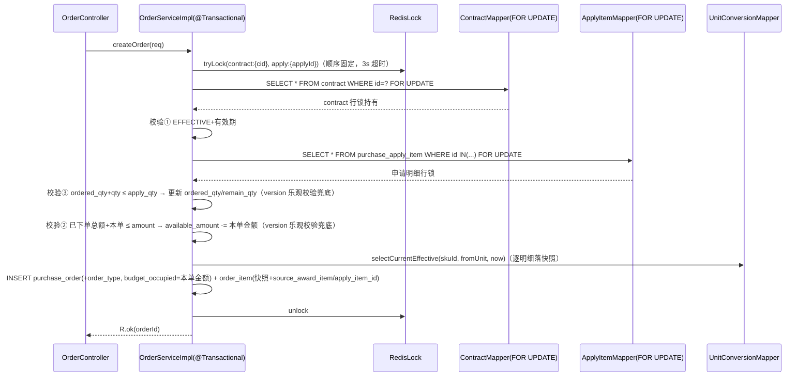
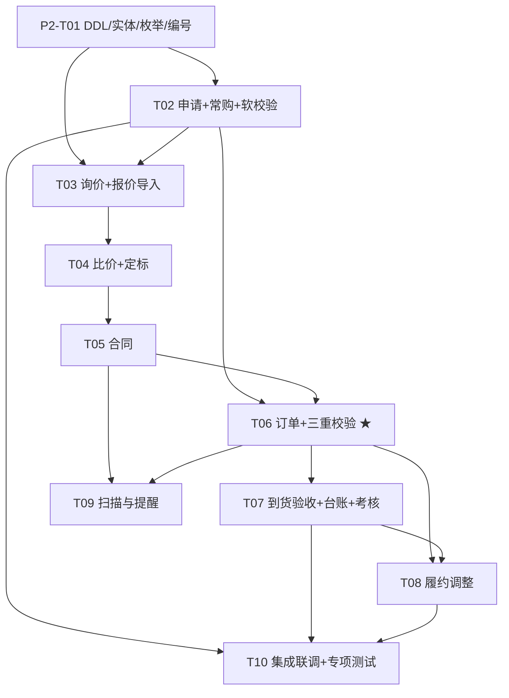

# P2 采购主链路 · 系统设计（Design）

> 版本：v1.0（P2 阶段设计基线）
> 作者：架构师 高见远（Gao）
> 上游依据：`docs/P2采购主链路规格设计.md`（v1.0，Q1–Q4 已定稿）、`docs/P1主数据设计.md`（§3 API/权限键范式、§6 定稿假设）、`docs/技术评审与架构设计.md`（架构 2.2 事务基线）、`docs/延期需求与占位登记.md`（D1–D8/B1–B2 台账）
> 范围：**P2 标准链路端到端**（行 18–29）。**只出设计，不含业务实现代码。** 日常/框架与线下补录链路放 P2b（见 §8 D1/D2）。

---

## 0. 结论先行

- **已定稿口径（Q1–Q4，不再待确认）**：① P2 只做标准链路端到端，日常/免比价与线下补录放 **P2b**（`purchase_apply.type` 预留，不动表结构）；② 采购申请**两级审批**（部门负责人→采购部）状态机，本阶段 `LocalApprovalGateway` 即审即过；③ 申请提交**预算软校验**（读 `budget_line` 余额、超限置 `budget_status=2` 仅提示），`used_amount` 不写；④ **最低价中标 + 异常价人工复核**，定标按 SKU 可拆分多供应商（`award_item` 明细）。
- **数据模型**：**7 个新建实体** + **9 个已有实体 ALTER**（其中 `purchase_apply_item` 的换算快照由字符串 `unit_snapshot` **重构为结构化三字段** `qty_in_purchase_unit / qty_in_base_unit / conv_rate_snapshot`；并为 `contract` / `purchase_apply_item` 增加乐观锁 `version` 作为并发兜底）。全部继承 `BaseEntity`，金额 `DECIMAL(18,2)`、数量 `DECIMAL(18,4)`、换算率 `DECIMAL(18,6)`，状态用 `IEnum` 枚举，唯一索引带 `deleted`。
- **审批统一经 `ApprovalGateway`，4 个 bizType**：`PURCHASE_APPLY`（两级）/ `AWARD`（一级）/ `CONTRACT`（一级+金额阈值升级）/ `FULFILLMENT_ADJUST`（阈值内免审）。回调映射到各状态机，幂等靠"任务状态一次性流转 + bizId 取最新任务"。
- **下单三重校验为硬规则**：合同 `EFFECTIVE` 且在有效期、Σ订单金额 ≤ 合同可用额度（`available_amount` 扣减式）、Σ订单数量 ≤ 申请 `remain_qty`。事务边界 = **Redis 锁 → `contract` 行锁 `FOR UPDATE` → `purchase_apply_item` 行锁 → 扣额度/扣余量/落快照/落单**，同一事务提交；锁顺序固定 `contract → apply_item` 防死锁。
- **三条 P1 契约在本阶段落地**：准入拦截三处（询价发布/定标提交/合同登记）+ `inquiry_supplier.admission_snapshot` 审计快照；换算快照五类明细行；预算软校验读数（`<!-- D3 -->` 预留升级）。
- **所有延后项已在 §8 显式登记预留口子**（对照台账 D1–D8/B1–B2），正文临时态就地标注 `<!-- D3 -->` / `<!-- D5 -->` 风格注释；**阶段收尾按台账逐项核对**。

---

## 1. 实体设计（DDL 级）

### 1.1 公共约定（沿用 P1 §1.1）

- 所有表继承 `BaseEntity` 审计列：`id(BIGINT PK, ASSIGN_ID) / created_by / created_at / updated_by / updated_at / deleted(INT, 0未删/1已删, @TableLogic)`。
- 物理外键禁用，逻辑外键 + Service 层校验；唯一索引统一带 `deleted`；InnoDB / `utf8mb4_0900_ai_ci`。
- 金额 `DECIMAL(18,2)`；**数量 `DECIMAL(18,4)`（计重 SKU 需 4 位小数；与存量列对齐时以存量精度为准）**；换算率 `DECIMAL(18,6)`；JSON 载荷用 `TEXT`（存 JSON 字符串）。

### 1.2 新建实体 DDL（7 个）

#### 1.2.1 `award_item` — 定标明细

```sql
CREATE TABLE `award_item` (
  `id`                 BIGINT        NOT NULL,
  `award_id`           BIGINT        NOT NULL                COMMENT '定标单ID（逻辑外键 award.id）',
  `sku_id`             BIGINT        NOT NULL                COMMENT 'SKU（逻辑外键 sku.id）',
  `supplier_id`        BIGINT        NOT NULL                COMMENT '中标供应商（按 SKU 可拆分多家）',
  `price`              DECIMAL(18,2) NOT NULL                COMMENT '定标单价（基本单位口径）',
  `qty`                DECIMAL(18,4) NOT NULL                COMMENT '定标数量（采购单位）',
  `qty_in_base_unit`   DECIMAL(18,4) NOT NULL                COMMENT '基本单位数量 = qty × conv_rate_snapshot',
  `conv_rate_snapshot` DECIMAL(18,6) NOT NULL                COMMENT '换算快照（取 unit_conversion 当前生效版本）',
  `remark`             VARCHAR(255)  NULL,
  `created_by` BIGINT NULL, `created_at` DATETIME NULL,
  `updated_by` BIGINT NULL, `updated_at` DATETIME NULL,
  `deleted`    INT    NOT NULL DEFAULT 0,
  PRIMARY KEY (`id`),
  KEY `idx_award` (`award_id`),
  KEY `idx_supplier_sku` (`supplier_id`, `sku_id`)
) ENGINE=InnoDB DEFAULT CHARSET=utf8mb4 COLLATE=utf8mb4_0900_ai_ci COMMENT='定标明细（order_item.source_award_item 引用）';
```

#### 1.2.2 `inquiry_supplier` — 询价供应商范围（含准入快照）

```sql
CREATE TABLE `inquiry_supplier` (
  `id`                 BIGINT      NOT NULL,
  `inquiry_id`         BIGINT      NOT NULL                COMMENT '询价单ID',
  `supplier_id`        BIGINT      NOT NULL                COMMENT '供应商ID',
  `invited`            TINYINT     NOT NULL DEFAULT 1      COMMENT '是否邀请：0/1',
  `quoted`             TINYINT     NOT NULL DEFAULT 0      COMMENT '是否已报价：0/1',
  `admission_snapshot` TEXT        NULL                    COMMENT '准入快照 JSON：{qualified,reasons[],coopStatus,isBlacklist,qualValidity}（发布时落，审计用）',
  `remark`             VARCHAR(255) NULL,
  `created_by` BIGINT NULL, `created_at` DATETIME NULL,
  `updated_by` BIGINT NULL, `updated_at` DATETIME NULL,
  `deleted`    INT    NOT NULL DEFAULT 0,
  PRIMARY KEY (`id`),
  UNIQUE KEY `uk_inquiry_supplier` (`inquiry_id`, `supplier_id`, `deleted`),
  KEY `idx_supplier` (`supplier_id`)
) ENGINE=InnoDB DEFAULT CHARSET=utf8mb4 COLLATE=utf8mb4_0900_ai_ci COMMENT='询价供应商范围（发布时逐家准入校验+落快照）';
```

#### 1.2.3 `frequent_purchase` — 常购清单

```sql
CREATE TABLE `frequent_purchase` (
  `id`            BIGINT        NOT NULL,
  `dept_id`       BIGINT        NOT NULL                COMMENT '部门（数据权限隔离）',
  `sku_id`        BIGINT        NOT NULL                COMMENT 'SKU（仅有效 SKU 可维护）',
  `default_qty`   DECIMAL(18,4) NOT NULL DEFAULT 1      COMMENT '默认数量（采购单位）',
  `purchase_unit` VARCHAR(32)   NULL                    COMMENT '默认采购单位（unit.code）',
  `last_price`    DECIMAL(18,2) NULL                    COMMENT '最近价（最近订单/报价价，无则 standard_price）',
  `remark`        VARCHAR(255)  NULL,
  `status`        TINYINT       NOT NULL DEFAULT 0      COMMENT '0=正常 1=停用',
  `created_by` BIGINT NULL, `created_at` DATETIME NULL,
  `updated_by` BIGINT NULL, `updated_at` DATETIME NULL,
  `deleted`    INT    NOT NULL DEFAULT 0,
  PRIMARY KEY (`id`),
  UNIQUE KEY `uk_dept_sku` (`dept_id`, `sku_id`, `deleted`),
  KEY `idx_dept` (`dept_id`)
) ENGINE=InnoDB DEFAULT CHARSET=utf8mb4 COLLATE=utf8mb4_0900_ai_ci COMMENT='部门常购清单（申请快速带入）';
```

#### 1.2.4 `order_change` — 订单变更留痕

```sql
CREATE TABLE `order_change` (
  `id`          BIGINT       NOT NULL,
  `order_id`    BIGINT       NOT NULL                COMMENT '订单ID',
  `change_type` TINYINT      NOT NULL                COMMENT '1=数量 2=价格 3=明细 4=取消',
  `before_json` TEXT         NULL                    COMMENT '变更前快照（明细/金额/数量）',
  `after_json`  TEXT         NULL                    COMMENT '变更后快照',
  `reason`      VARCHAR(512) NULL,
  `status`      TINYINT      NOT NULL DEFAULT 0      COMMENT '0=待审 1=生效 2=驳回',
  `operator`    BIGINT       NULL                    COMMENT '操作人',
  `created_by` BIGINT NULL, `created_at` DATETIME NULL,
  `updated_by` BIGINT NULL, `updated_at` DATETIME NULL,
  `deleted`    INT    NOT NULL DEFAULT 0,
  PRIMARY KEY (`id`),
  KEY `idx_order` (`order_id`)
) ENGINE=InnoDB DEFAULT CHARSET=utf8mb4 COLLATE=utf8mb4_0900_ai_ci COMMENT='订单变更留痕';
```

#### 1.2.5 `arrival_item` — 到货验收明细

```sql
CREATE TABLE `arrival_item` (
  `id`             BIGINT        NOT NULL,
  `arrival_id`     BIGINT        NOT NULL                COMMENT '到货单ID',
  `order_item_id`  BIGINT        NOT NULL                COMMENT '订单明细ID（继承其换算快照与来源追溯）',
  `sku_id`         BIGINT        NOT NULL,
  `qty_expected`   DECIMAL(18,4) NOT NULL                COMMENT '应收数量（基本单位）',
  `qty_actual`     DECIMAL(18,4) NOT NULL                COMMENT '实收数量（基本单位，入库口径）',
  `qty_diff`       DECIMAL(18,4) NOT NULL                COMMENT '差异 = qty_expected − qty_actual',
  `diff_type`      TINYINT       NOT NULL DEFAULT 0      COMMENT '0=无差异 1=短缺 2=破损',
  `handle_type`    TINYINT       NOT NULL DEFAULT 0      COMMENT '0=接受 1=退货 2=补货',
  `qty_stored`     DECIMAL(18,4) NOT NULL DEFAULT 0      COMMENT '已入库数量（基本单位，分次累加）',
  `handle_status`  TINYINT       NOT NULL DEFAULT 0      COMMENT '0=待处理 1=已完成',
  `remark`         VARCHAR(255)  NULL,
  `created_by` BIGINT NULL, `created_at` DATETIME NULL,
  `updated_by` BIGINT NULL, `updated_at` DATETIME NULL,
  `deleted`    INT    NOT NULL DEFAULT 0,
  PRIMARY KEY (`id`),
  KEY `idx_arrival` (`arrival_id`),
  KEY `idx_order_item` (`order_item_id`),
  KEY `idx_sku` (`sku_id`)
) ENGINE=InnoDB DEFAULT CHARSET=utf8mb4 COLLATE=utf8mb4_0900_ai_ci COMMENT='到货验收明细（差异退货补货 / 入库流水）';
```

#### 1.2.6 `service_assess` — 服务验收考核

```sql
CREATE TABLE `service_assess` (
  `id`            BIGINT        NOT NULL,
  `order_id`      BIGINT        NOT NULL                COMMENT '服务订单ID（order_type=1）',
  `assess_date`   DATE          NOT NULL                COMMENT '考核日期',
  `score`         DECIMAL(5,2)  NULL                    COMMENT '评分（口径见 Q7，一期自由录入）',
  `deduct_amount` DECIMAL(18,2) NOT NULL DEFAULT 0      COMMENT '扣款金额（<!-- D8: P3 结算直接取数 -->）',
  `basis`         VARCHAR(512)  NULL                    COMMENT '考核依据',
  `file_keys`     TEXT          NULL                    COMMENT '附件 JSON 数组（file_meta.file_key）',
  `status`        TINYINT       NOT NULL DEFAULT 0      COMMENT '0=正常 1=作废',
  `remark`        VARCHAR(255)  NULL,
  `created_by` BIGINT NULL, `created_at` DATETIME NULL,
  `updated_by` BIGINT NULL, `updated_at` DATETIME NULL,
  `deleted`    INT    NOT NULL DEFAULT 0,
  PRIMARY KEY (`id`),
  KEY `idx_order` (`order_id`)
) ENGINE=InnoDB DEFAULT CHARSET=utf8mb4 COLLATE=utf8mb4_0900_ai_ci COMMENT='服务验收考核（扣款供 P3 结算取数）';
```

#### 1.2.7 `fulfillment_adjust` — 履约调整

```sql
CREATE TABLE `fulfillment_adjust` (
  `id`          BIGINT       NOT NULL,
  `adjust_no`   VARCHAR(32)  NOT NULL                COMMENT '调整单号 LY-{yyyy}{MM}-{seq6}（全局唯一）',
  `biz_type`    TINYINT      NOT NULL                COMMENT '0=订单 1=到货',
  `order_id`    BIGINT       NOT NULL                COMMENT '订单ID',
  `arrival_id`  BIGINT       NULL                    COMMENT '到货单ID（可空）',
  `adjust_type` TINYINT      NOT NULL                COMMENT '0=差异 1=退货 2=补货 3=变更',
  `before_json` TEXT         NULL                    COMMENT '调整前口径快照（金额/数量）',
  `after_json`  TEXT         NULL                    COMMENT '调整后口径快照',
  `reason`      VARCHAR(512) NOT NULL,
  `status`      TINYINT      NOT NULL DEFAULT 0      COMMENT '0=草稿 1=审批中 2=生效 3=驳回',
  `file_keys`   TEXT         NULL                    COMMENT '附件 JSON 数组',
  `operator`    BIGINT       NULL,
  `created_by` BIGINT NULL, `created_at` DATETIME NULL,
  `updated_by` BIGINT NULL, `updated_at` DATETIME NULL,
  `deleted`    INT    NOT NULL DEFAULT 0,
  PRIMARY KEY (`id`),
  UNIQUE KEY `uk_adjust_no` (`adjust_no`, `deleted`),
  KEY `idx_order` (`order_id`),
  KEY `idx_arrival` (`arrival_id`)
) ENGINE=InnoDB DEFAULT CHARSET=utf8mb4 COLLATE=utf8mb4_0900_ai_ci COMMENT='履约调整台账（变更留痕）';
```

### 1.3 已有实体 ALTER（9 个，含换算快照重构与并发兜底）

> 原则：只加字段/索引，不改既有列语义；`purchase_apply_item.unit_snapshot` 弃用（保留列停写，一次性回填三字段后只读）。

#### 1.3.1 `purchase_apply`（+1）

```sql
ALTER TABLE `purchase_apply`
  ADD COLUMN `expected_date` DATE NULL COMMENT '期望到货日期' AFTER `applicant_id`;
```

#### 1.3.2 `purchase_apply_item`（+7 新列 / 重构 1）

```sql
ALTER TABLE `purchase_apply_item`
  ADD COLUMN `purchase_unit`       VARCHAR(32)   NULL COMMENT '采购单位（unit.code）' AFTER `sku_id`,
  ADD COLUMN `qty_in_purchase_unit` DECIMAL(18,4) NULL COMMENT '采购单位数量' AFTER `purchase_unit`,
  ADD COLUMN `qty_in_base_unit`     DECIMAL(18,4) NULL COMMENT '基本单位数量 = qty × 换算率' AFTER `qty_in_purchase_unit`,
  ADD COLUMN `conv_rate_snapshot`   DECIMAL(18,6) NULL COMMENT '换算快照（unit_conversion 当前生效版本）' AFTER `qty_in_base_unit`,
  ADD COLUMN `price_estimate`       DECIMAL(18,2) NULL COMMENT '预估单价' AFTER `conv_rate_snapshot`,
  ADD COLUMN `item_type`            TINYINT       NOT NULL DEFAULT 0 COMMENT '行级类型：0=物料 1=服务（转单拆分依据）' AFTER `price_estimate`,
  ADD COLUMN `remark`               VARCHAR(255)  NULL AFTER `item_type`,
  ADD COLUMN `version`              INT           NOT NULL DEFAULT 0 COMMENT '乐观锁版本（下单余量扣减并发兜底）' AFTER `remark`;
-- unit_snapshot(String) 弃用：停写；一次性回填脚本 scripts/sql/p2_migrate_unit_snapshot.sql 将存量映射到三字段后仅作历史展示
```

#### 1.3.3 `inquiry`（+2）

```sql
ALTER TABLE `inquiry`
  ADD COLUMN `deadline`         DATETIME NULL COMMENT '截标时间（到期或手动截标→CLOSED）' AFTER `inquiry_no`,
  ADD COLUMN `created_by_dept`  BIGINT   NULL COMMENT '创建部门（数据权限）' AFTER `deadline`;
```

#### 1.3.4 `quotation`（+5）

```sql
ALTER TABLE `quotation`
  ADD COLUMN `batch_no`         VARCHAR(32)   NULL COMMENT '报价批次 BJ-{inquiry_no}-{seq2}' AFTER `inquiry_id`,
  ADD COLUMN `purchase_unit`    VARCHAR(32)   NULL COMMENT '报价单位（unit.code）' AFTER `sku_id`,
  ADD COLUMN `qty_in_base_unit` DECIMAL(18,4) NULL COMMENT '基本单位数量（导入单位换算所得）' AFTER `purchase_unit`,
  ADD COLUMN `file_key`         VARCHAR(255)  NULL COMMENT '原始报价附件（file_meta.file_key）' AFTER `qty_in_base_unit`,
  ADD COLUMN `invalid`          TINYINT       NOT NULL DEFAULT 0 COMMENT '0=有效 1=已失效（新批次导入后旧批次置 1，不物理删）' AFTER `file_key`,
  ADD KEY `idx_batch` (`inquiry_id`, `batch_no`);
```

#### 1.3.5 `award`（+2）

```sql
ALTER TABLE `award`
  ADD COLUMN `award_no` VARCHAR(32) NULL COMMENT '定标单号 DB-{yyyy}{MM}-{seq6}（全局唯一）' AFTER `inquiry_id`,
  ADD COLUMN `apply_id` BIGINT      NULL COMMENT '追溯申请（定标→申请上溯）' AFTER `award_no`,
  ADD UNIQUE KEY `uk_award_no` (`award_no`, `deleted`);
```

#### 1.3.6 `contract`（+6，含并发兜底 version）

```sql
ALTER TABLE `contract`
  ADD COLUMN `award_id`        BIGINT       NULL COMMENT '来源定标（<!-- D2: P2b 线下补录可空 -->）' AFTER `supplier_id`,
  ADD COLUMN `contract_type`   TINYINT      NOT NULL DEFAULT 0 COMMENT '0=物料 1=服务 2=综合' AFTER `title`,
  ADD COLUMN `file_keys`       TEXT         NULL COMMENT '附件 JSON 数组（file_meta.file_key，多附件）' AFTER `valid_to`,
  ADD COLUMN `renewed_from_id` BIGINT       NULL COMMENT '续签来源合同（<!-- D1: P2b 框架续签 -->）' AFTER `file_keys`,
  ADD COLUMN `terminate_reason` VARCHAR(512) NULL COMMENT '终止原因' AFTER `renewed_from_id`,
  ADD COLUMN `version`         INT          NOT NULL DEFAULT 0 COMMENT '乐观锁版本（额度扣减并发兜底，主防=行锁）' AFTER `terminate_reason`;
```

#### 1.3.7 `purchase_order`（+1）

```sql
ALTER TABLE `purchase_order`
  ADD COLUMN `order_type` TINYINT NOT NULL DEFAULT 0 COMMENT '0=物料 1=服务（源自申请 item_type 拆单）' AFTER `order_no`;
```

#### 1.3.8 `order_item`（+3）

```sql
ALTER TABLE `order_item`
  ADD COLUMN `apply_item_id` BIGINT        NULL COMMENT '申请明细追溯（与 source_award_item 二选一或并存）' AFTER `source_award_item`,
  ADD COLUMN `plan_date`     DATE          NULL COMMENT '到货计划日期（<!-- D-提醒: P2-T09 逾期扫描 -->）' AFTER `apply_item_id`,
  ADD COLUMN `planned_qty`   DECIMAL(18,4) NULL COMMENT '计划数量（基本单位，可分批多计划行）' AFTER `plan_date`;
```

#### 1.3.9 `arrival`（+1）

```sql
ALTER TABLE `arrival`
  ADD COLUMN `arrival_no` VARCHAR(32) NULL COMMENT '到货单号 DH-{order_no}-{seq2}（全局唯一）' AFTER `order_id`,
  ADD UNIQUE KEY `uk_arrival_no` (`arrival_no`, `deleted`);
```

### 1.4 P2 新增枚举（`com.dzgylxt.enums`，均实现 `IEnum<Integer>`）

| 枚举 | 值域 | 归属字段 |
|---|---|---|
| `ItemType` | 0=物料 / 1=服务 | `purchase_apply_item.item_type`、`purchase_order.order_type`、`contract.contract_type` |
| `ChangeType` | 1=数量 / 2=价格 / 3=明细 / 4=取消 | `order_change.change_type` |
| `ChangeStatus` | 0=待审 / 1=生效 / 2=驳回 | `order_change.status` |
| `DiffType` | 0=无差异 / 1=短缺 / 2=破损 | `arrival_item.diff_type` |
| `HandleType` | 0=接受 / 1=退货 / 2=补货 | `arrival_item.handle_type` |
| `HandleStatus` | 0=待处理 / 1=已完成 | `arrival_item.handle_status` |
| `AdjustBizType` | 0=订单 / 1=到货 | `fulfillment_adjust.biz_type` |
| `AdjustType` | 0=差异 / 1=退货 / 2=补货 / 3=变更 | `fulfillment_adjust.adjust_type` |
| `AdjustStatus` | 0=草稿 / 1=审批中 / 2=生效 / 3=驳回 | `fulfillment_adjust.status` |
| `AssessStatus` | 0=正常 / 1=作废 | `service_assess.status` |
| `FrequentStatus` | 0=正常 / 1=停用 | `frequent_purchase.status` |

> 复用既有枚举：`PurchaseApplyType`(0标准/1日常/2线下)<!-- D1/D2: P2b 启用 1/2 -->、`PurchaseApplyStatus`、`InquiryStatus`、`QuotationStatus`、`AwardStatus`、`ContractStatus`、`OrderStatus`、`ArrivalStatus`、`ApprovalStatus`。

### 1.5 实体关系图（P2 增量）

```mermaid
classDiagram
  class PurchaseApply { +Long deptId +String applyNo +PurchaseApplyType type +PurchaseApplyStatus status +Integer budgetStatus +LocalDate expectedDate }
  class PurchaseApplyItem { +Long applyId +Long skuId +BigDecimal applyQty +BigDecimal orderedQty +BigDecimal remainQty +String purchaseUnit +BigDecimal qtyInPurchaseUnit +BigDecimal qtyInBaseUnit +BigDecimal convRateSnapshot +BigDecimal priceEstimate +ItemType itemType +Integer version }
  class FrequentPurchase { +Long deptId +Long skuId +BigDecimal defaultQty +String purchaseUnit +BigDecimal lastPrice }
  class Inquiry { +Long applyId +String inquiryNo +InquiryStatus status +LocalDateTime deadline }
  class InquirySupplier { +Long inquiryId +Long supplierId +Integer invited +Integer quoted +String admissionSnapshot }
  class Quotation { +Long inquiryId +Long supplierId +Long skuId +BigDecimal price +String batchNo +Integer invalid }
  class Award { +Long inquiryId +Long applyId +String awardNo +Long supplierId +BigDecimal amount +AwardStatus status }
  class AwardItem { +Long awardId +Long skuId +Long supplierId +BigDecimal price +BigDecimal qty +BigDecimal qtyInBaseUnit +BigDecimal convRateSnapshot }
  class Contract { +Long supplierId +Long awardId +String no +BigDecimal amount +LocalDate validFrom +LocalDate validTo +ContractStatus status +BigDecimal availableAmount +Integer contractType +Long renewedFromId +Integer version }
  class PurchaseOrder { +Long contractId +Long applyId +Long supplierId +String orderNo +OrderStatus status +BigDecimal budgetOccupied +Integer orderType }
  class OrderItem { +Long orderId +Long skuId +BigDecimal qtyPurchase +BigDecimal qtyBase +String convSnapshot +BigDecimal price +Long sourceAwardItem +Long applyItemId +LocalDate planDate }
  class OrderChange { +Long orderId +ChangeType changeType +String beforeJson +String afterJson +ChangeStatus status }
  class Arrival { +Long orderId +String arrivalNo +ArrivalStatus status }
  class ArrivalItem { +Long arrivalId +Long orderItemId +Long skuId +BigDecimal qtyExpected +BigDecimal qtyActual +BigDecimal qtyDiff +DiffType diffType +HandleType handleType +BigDecimal qtyStored +HandleStatus handleStatus }
  class ServiceAssess { +Long orderId +LocalDate assessDate +BigDecimal score +BigDecimal deductAmount }
  class FulfillmentAdjust { +String adjustNo +AdjustBizType bizType +Long orderId +Long arrivalId +AdjustType adjustType +AdjustStatus status }

  PurchaseApply "1" --> "*" PurchaseApplyItem : applyId
  FrequentPurchase "*" --> "1" PurchaseApplyItem : 带入(deptId+skuId)
  PurchaseApply "1" --> "*" Inquiry : applyId
  Inquiry "1" --> "*" InquirySupplier : inquiryId(准入快照)
  Inquiry "1" --> "*" Quotation : inquiryId(批次)
  Inquiry "1" --> "*" Award : inquiryId
  PurchaseApply "1" --> "*" Award : applyId(追溯)
  Award "1" --> "*" AwardItem : awardId
  Award "1" --> "0..*" Contract : awardId(来源)
  Contract "1" --> "*" PurchaseOrder : contractId
  PurchaseApply "1" --> "*" PurchaseOrder : applyId
  PurchaseOrder "1" --> "*" OrderItem : orderId
  AwardItem "1" --> "0..*" OrderItem : sourceAwardItem
  PurchaseApplyItem "1" --> "0..*" OrderItem : applyItemId
  PurchaseOrder "1" --> "*" OrderChange : orderId
  PurchaseOrder "1" --> "*" Arrival : orderId
  Arrival "1" --> "*" ArrivalItem : arrivalId
  OrderItem "1" --> "*" ArrivalItem : orderItemId
  PurchaseOrder "1" --> "*" ServiceAssess : orderId
  PurchaseOrder "1" --> "*" FulfillmentAdjust : orderId
  Arrival "1" --> "0..*" FulfillmentAdjust : arrivalId
```



---

## 2. 分层契约与状态机（逐单据）

> 契约只列签名与职责。Service 均为 `IService<T>` + 自定义接口；VO 归属 `com.dzgylxt.vo.{purchase,contract,order}`。**每张单据给出状态机流转表与流转事件**。单据编号统一由 `common/IdGenerator` 按规格 §6 规则生成（Redis INCR 按月重置），禁止业务散拼。

### 2.1 采购申请 + 常购清单（purchase）

**Mapper**：`PurchaseApplyMapper`、`PurchaseApplyItemMapper`（+ `selectForUpdateByApply(applyId)`、`selectCurrentEffective` 复用 P1 `UnitConversionMapper.selectCurrentEffective(skuId, fromUnit, now)` 落快照）、`FrequentPurchaseMapper`。

**Service**：
```java
interface IPurchaseApplyService extends IService<PurchaseApply> {
    Long createApply(ApplySaveReqVO req);                 // 落头+明细：明细选有效SKU、逐行落换算快照、算金额
    void updateApply(Long id, ApplySaveReqVO req);        // 仅 DRAFT/REJECTED 可编辑（状态机校验）
    void submit(Long id);                                 // 提交：软校验(见下)→BUDGET_PENDING→PURCHASE_PENDING；发起 ApprovalGateway(bizType=PURCHASE_APPLY)
    void onApprovalCallback(Long taskId, boolean approved, String comment); // 回调：通过→APPROVED；驳回→REJECTED
    void exportApply(Long id);                            // 导出含明细与快照列（数据权限过滤）
}
interface IFrequentPurchaseService extends IService<FrequentPurchase> {
    List<FrequentPurchase> listByDept(Long deptId);       // 部门隔离（DataPermissionInterceptor）
    List<ApplyItemDraftVO> bringIn(Long deptId, List<Long> skuIds); // 带入：停用SKU拒绝；最近价取最近订单/报价价，无则 standard_price；带入后重算快照与金额
}
```
**预算软校验**（`<!-- D3: P3 升级为"校验+占用+拦截+升级审批"，读数逻辑直接复用 -->`）：
```java
interface IBudgetSoftCheckService {          // 本阶段只读，不写 used_amount
    BudgetCheckResultVO check(Long deptId, Integer year, Long subjectId, BigDecimal amount);
    // 读 budget_line(amount−used) 余额；不足→ budgetStatus=2 + 提示；不拦截、不发升级审批
}
```
**状态机**（`PurchaseApplyStatus`）：

| 流转 | 触发 | 事件 |
|---|---|---|
| DRAFT → BUDGET_PENDING | `submit()` | 软校验（读余额、写 `budget_status`）<!-- D3 --> |
| BUDGET_PENDING → PURCHASE_PENDING | 软校验自动通过 | 预算升级审批分支 P3 启用 <!-- D3 --> |
| PURCHASE_PENDING → APPROVED / REJECTED | `ApprovalGateway.callback`（两级：`current_node=DEPT_HEAD→PURCHASE_DEPT`，本地桩即审即过）| 审批留痕 |
| REJECTED → DRAFT | 修改重提 `updateApply+submit` | 重新发起审批（见 §3 幂等） |
| APPROVED → PARTIAL_ORDER / FULL_ORDER | 下单扣减 `ordered_qty` | 余量扣减见 §4 |

**VO**：`ApplySaveReqVO{title,type,expectedDate,remark,items[{skuId,qty,purchaseUnit,priceEstimate,itemType,remark}]}`、`ApplyPageReqVO{keyword,status,type,deptId}`、`ApplyDetailRespVO{apply,items[]}`、`BringInReqVO{deptId,skuIds[]}`。

### 2.2 询价 + 供应商范围（purchase）

**Service**：
```java
interface IInquiryService extends IService<Inquiry> {
    Long createInquiry(InquirySaveReqVO req);              // 仅 APPROVED 申请（或明细子集）；生成 inquiry_no
    void publish(Long id, List<Long> supplierIds);         // 发布：≥1 家供应商；逐家调 getAdmission，qualified=false 拒绝并落 admission_snapshot；状态→PUBLISHED
    void close(Long id);                                   // 截标（到 deadline 定时或手动）→CLOSED，锁定范围
    void cancel(Long id);                                  // DRAFT/PUBLISHED → CANCELLED
    InquiryComparisonVO comparison(Long id);               // 比价视图：按SKU汇总 最低/最高/均价 + 历史价（近5次，可配置）
}
interface IInquirySupplierService extends IService<InquirySupplier> {
    void addSuppliers(Long inquiryId, List<Long> supplierIds); // 增补范围：逐家准入校验+快照；PUBLISHED 后锁定
    void removeSupplier(Long inquiryId, Long supplierId);      // 未发布可删
}
```
**状态机**（`InquiryStatus`）：`DRAFT →(发布,准入拦截) PUBLISHED →(截标) CLOSED`；`DRAFT/PUBLISHED → CANCELLED`。

### 2.3 报价（purchase）

**Service**：
```java
interface IQuotationService extends IService<Quotation> {
    byte[] exportTemplate(Long inquiryId);                 // 报价包模板（含询价明细+供应商信息位+templateVersion）
    QuotationImportResultVO importQuotations(Long inquiryId, MultipartFile file); // 版本校验→按"供应商×明细"落行→价格>0/SKU属于该询价→换算快照→错误Sheet；新批次落库后旧批次 invalid=1
    void accept(Long quotationId); void reject(Long quotationId); // 比价采纳/否决（SUBMITTED→ACCEPTED/REJECTED）
    List<Quotation> listByInquiry(Long inquiryId, String batchNo); // 仅 invalid=0
}
```
**状态机**（`QuotationStatus`）：`导入→SUBMITTED →(比价) ACCEPTED / REJECTED`；批次维度：新批次导入→旧批次 `invalid=1`。

### 2.4 比价 + 定标（purchase）

**Service**：
```java
interface IAwardService extends IService<Award> {
    Long createAward(AwardSaveReqVO req);                  // 生成 award_no + award_item 明细（按SKU可拆多供应商）；重校验参与供应商准入
    void updateAwardItems(Long id, List<AwardItemVO> items); // REJECTED 后调整重提
    void submit(Long id);                                  // 发起 ApprovalGateway(bizType=AWARD)；异常价（低于历史均价X%）标记人工复核提示
    void onApprovalCallback(Long taskId, boolean approved, String comment); // APPROVED→可登记合同；REJECTED→PENDING_APPROVAL(调整重提)
}
```
**状态机**（`AwardStatus`）：`PENDING_APPROVAL →(审批通过) APPROVED`；`PENDING_APPROVAL →(驳回) REJECTED →(调整重提) PENDING_APPROVAL`。**定标只驱动合同，不生成订单**。

### 2.5 合同（contract）

**Service**：
```java
interface IContractService extends IService<Contract> {
    Long createContract(ContractSaveReqVO req);            // 登记即校验供应商准入；来源定标时校验金额=Σ定标明细；生成合同号
    void updateContract(Long id, ContractSaveReqVO req);   // 仅 DRAFT
    void submit(Long id);                                  // 发起 ApprovalGateway(bizType=CONTRACT)（金额超阈值升两级，阈值配置）
    void onApprovalCallback(Long taskId, boolean approved, String comment); // 通过→EFFECTIVE 且 available_amount=amount；驳回→DRAFT
    void terminate(Long id, String reason);                // 仅 EFFECTIVE；置 TERMINATED、available_amount 冻结（本单不可下单）
    Long renew(Long id, ContractRenewReqVO req);           // 续签：新合同 renewed_from_id=原id，独立走审批
    List<ContractWarnVO> expiringList();                   // 到期预警派生（valid_to − 提前天数配置，默认30）
}
```
**状态机**（`ContractStatus`）：`DRAFT → PENDING_APPROVAL → EFFECTIVE / (驳回→DRAFT)`；`EFFECTIVE → EXPIRED（到期扫描）/ TERMINATED（终止）`。**仅 EFFECTIVE 且 `valid_from≤today≤valid_to` 可发起订单（硬规则）。**

### 2.6 采购订单 + 变更（order）

**Service**：
```java
interface IOrderService extends IService<PurchaseOrder> {
    Long createOrder(OrderCreateReqVO req);                // 三重校验事务（见 §4）：合同/额度/余量；落换算快照；物料/服务拆单；budget_occupied=本单金额快照 <!-- D3: P3 改为真实占用 -->
    void cancelOrder(Long id, String reason);              // 仅 CREATED/PARTIAL_RECEIVED；释放合同额度；order_change(change_type=4)
    void changeOrder(Long id, OrderChangeReqVO req);       // 仅 CREATED；重跑三重校验；before/after 快照落 order_change；差额调整合同额度
    OrderTraceRespVO trace(Long id);                       // 全链路追溯：申请↔询价↔定标↔合同↔订单↔到货
}
interface IOrderItemService extends IService<OrderItem> { /* 明细维护 + plan_date/planned_qty 到货计划 */ }
```
**状态机**（`OrderStatus`）：`CREATED →(首次到货) PARTIAL_RECEIVED →(足额) RECEIVED`；`→ SETTLED / PAID 属 P3 <!-- D8 -->`；`CREATED/PARTIAL_RECEIVED →(取消) CANCELLED（释放额度）`。

### 2.7 到货验收 + 入库台账 + 服务考核（order）

**Service**：
```java
interface IArrivalService extends IService<Arrival> {
    Long createArrival(ArrivalCreateReqVO req);            // 按订单展开明细 arrival_item（qty_expected=订单明细未入库余量）；生成 arrival_no；状态 ARRIVAL_CONFIRMED；回写订单 PARTIAL_RECEIVED
    void confirmStore(Long arrivalItemId, BigDecimal qtyStored); // 入库确认：qty_stored 累加（基本单位）；到货单→PARTIAL_STORED/STORED；订单全部明细足额→RECEIVED
    void handleDiff(Long arrivalItemId, HandleType type);  // 差异处理（接受/退货/补货）；退货/补货生成跟踪项 + 建议联动登记 fulfillment_adjust
    LedgerPageRespVO ledger(LedgerQueryReqVO req);         // 入库台账流水（按订单/供应商/日期筛选导出，数据权限过滤）
}
interface IServiceAssessService extends IService<ServiceAssess> {
    Long assess(ServiceAssessSaveReqVO req);               // 服务订单验收考核（score/deduct_amount/basis/附件）；deduct_amount 供 P3 结算取数 <!-- D8 -->
}
```
**状态机**（`ArrivalStatus`）：`ARRIVAL_CONFIRMED →(部分入库) PARTIAL_STORED →(足额) STORED`；订单回写：首次到货→`PARTIAL_RECEIVED`，全部明细足额→`RECEIVED`。

### 2.8 履约调整（order / adjust）

**Service**：
```java
interface IFulfillmentAdjustService extends IService<FulfillmentAdjust> {
    Long createAdjust(AdjustSaveReqVO req);                // adjust_no；before/after 快照；关联 order/arrival
    void submit(Long id);                                  // 金额 ≤ 阈值（默认合同金额5%，可配置）→直接生效；超阈值→审批中（ApprovalGateway, bizType=FULFILLMENT_ADJUST）<!-- D5 -->
    void onApprovalCallback(Long taskId, boolean approved, String comment); // 生效→回写相关单据（差异完成/退货跟踪闭环）；驳回→DRAFT
    IPage<AdjustPageRespVO> pageAdjust(AdjustPageReqVO req); // 台账筛选（类型/订单/供应商/时间）+ 导出
}
```
**状态机**（`AdjustStatus`）：`DRAFT →(免审) 生效(2)` 或 `DRAFT →(超阈值) 审批中(1) → 生效(2) / 驳回(3)→DRAFT`。

---

## 3. ApprovalGateway 接入契约（4 个 bizType）

> 复用既有接缝：`ApprovalGateway.create(ApprovalTaskSpec) / callback(taskId, ApprovalDecision, comment)`；本阶段 `LocalApprovalGateway` 落 `approval_task` 即审即过（前端提供"同意/驳回"操作入口，触发 `callback`）。**两级状态机按 P4 设计，本地桩先跑通一级语义。**

| bizType | create 时机 | ApprovalTaskSpec 构造 | 回调映射（APPROVED / REJECTED） | 级别 |
|---|---|---|---|---|
| `PURCHASE_APPLY` | `apply.submit()` | `bizType=PURCHASE_APPLY, bizId=applyId, title="采购申请-{applyNo}", payloadJson={deptId,totalAmount,budgetStatus}` | `PURCHASE_PENDING→APPROVED`；`→REJECTED`（可修改重提=重新 create，旧任务留痕） | 两级（`current_node: DEPT_HEAD→PURCHASE_DEPT`，本地桩即审即过） |
| `AWARD` | `award.submit()` | `bizType=AWARD, bizId=awardId, title="定标-{awardNo}", payloadJson={items:[{skuId,supplierId,price,qty}]}` | `PENDING_APPROVAL→APPROVED`（可登记合同）；`→REJECTED→PENDING_APPROVAL`（调整重提） | 一级（采购负责人） |
| `CONTRACT` | `contract.submit()` | `bizType=CONTRACT, bizId=contractId, title="合同-{no}", payloadJson={supplierId,amount,validFrom,validTo,awardId}` | `→EFFECTIVE 且 available_amount=amount`；`→DRAFT` | 一级；金额超阈值升两级（阈值 `app.contract.approve-threshold`，配置） |
| `FULFILLMENT_ADJUST` | `adjust.submit()`（仅超阈值） | `bizType=FULFILLMENT_ADJUST, bizId=adjustId, title="履约调整-{adjustNo}", payloadJson={adjustType,beforeAmount,afterAmount}` | `→生效(2)`（回写相关单据）；`→驳回(3)→DRAFT` | 阈值内免审（不发任务） |

**幂等与重提**：
1. **回调幂等**：`callback` 先查任务状态，仅 `IN_PROGRESS/CREATED` 可流转；重复回调直接忽略（不重复推进业务状态机）。
2. **重提 = 新任务**：同一 `bizId` 重新 create 生成新 `approval_task`（旧任务保留作历史）；业务侧"最新任务"以 `biz_type+biz_id` 按 `created_at` 倒序取第一条。
3. **回调事务性**：回调与业务状态变更同事务（`REQUIRES_NEW` 隔离审批落库与业务回写，避免循环依赖）。
4. `<!-- D5: P4 换 RemoteApprovalGateway：仅替换 Gateway 实现，spec/callback 契约不变；两级节点由审批中心驱动 current_node -->`。

---

## 4. 下单三重校验的事务方案（硬规则）

### 4.1 校验内容（`OrderService.createOrder / changeOrder / cancelOrder` 共用）

| # | 规则 | 判定 | 失败动作 |
|---|---|---|---|
| 1 | 合同有效 | `contract.status==EFFECTIVE && valid_from≤today≤valid_to` | 拒绝：`合同不存在/未生效/已过期` |
| 2 | 额度 | `合同已用额度 + 本单金额 ≤ contract.amount`（采用**扣减式**：下单即 `available_amount -= 本单金额`，取消/变更差额回冲） | 拒绝：`超出合同可用额度` |
| 3 | 数量余量 | `apply_item.ordered_qty + 本单数量 ≤ apply_item.apply_qty`（逐明细） | 拒绝：`超出申请余量` |

### 4.2 事务边界与锁（对齐架构 2.2：行锁为主、Redis 锁双保险、乐观版本兜底）



**要点与取舍**：
1. **锁顺序固定** `contract → purchase_apply_item`，全链路统一，杜绝交叉死锁；Redis 锁（`contract:{id}` / `apply:{applyId}`）为多实例防穿透双保险，获取失败快速失败返回"订单提交繁忙"。
2. **扣减式额度**优于"实时 Σ 计算"：避免每次下单聚合历史订单（大合同聚合代价高），且取消/变更回冲在行锁内天然一致。**对账兜底**：每日校准任务 `Σ(非取消订单金额) == amount − available_amount`（对齐架构 2.2-R2）。
3. **乐观版本兜底**：`contract.version` / `purchase_apply_item.version` 在 UPDATE 时 `WHERE version=?`，冲突重试 1 次后仍失败则抛业务异常（防行锁遗漏的极端场景）。
4. **快照在锁内取**：`selectCurrentEffective` 在事务内调用，保证"校验通过的单据一定带当刻快照"。
5. **粒度**：行锁锁"合同行 + 本单涉及的申请明细行"，不锁整表/整申请，串行化程度可控；同合同并发下单天然串行（合规优先）。
6. **变更/取消**：同一边界重跑三重校验；变更差额正负回冲额度与余量；`order_change` 记录前后快照（免审，见 Q5）。

---

## 5. API 端点清单（权限键对齐 P1 `module:action` 范式）

> 阶段一门禁沿用 `@authz.hasAnyPerm`；下表"权限键"为阶段二细化目标。所有列表/导出经 `DataPermissionInterceptor` 部门过滤。

### 5.1 采购申请 / 常购清单
| 方法 | 路径 | 权限键 |
|---|---|---|
| GET | `/api/v1/purchase-requests/page`、`/{id}`、`/{id}/items` | `purchase:apply:read` |
| POST/PUT | `/api/v1/purchase-requests`、`/{id}` | `purchase:apply:write` |
| POST | `/api/v1/purchase-requests/{id}/submit` | `purchase:apply:write` |
| GET | `/api/v1/purchase-requests/{id}/export` | `purchase:apply:export` |
| GET | `/api/v1/frequent-purchases?deptId=` | `purchase:frequent:read` |
| POST/PUT/DELETE | `/api/v1/frequent-purchases`、`/{id}` | `purchase:frequent:write` |
| POST | `/api/v1/frequent-purchases/bring-in` | `purchase:frequent:read` |

### 5.2 询价 / 报价 / 比价
| 方法 | 路径 | 权限键 |
|---|---|---|
| GET/POST/PUT | `/api/v1/inquiries`（`/page`、`/{id}`） | `purchase:inquiry:read` / `purchase:inquiry:write` |
| POST | `/api/v1/inquiries/{id}/publish`、`/{id}/close`、`/{id}/cancel` | `purchase:inquiry:write` |
| GET/POST/DELETE | `/api/v1/inquiries/{id}/suppliers`、`/{id}/suppliers/{supplierId}` | `purchase:inquiry:write`（增删时逐家准入校验） |
| GET | `/api/v1/inquiries/{id}/comparison` | `purchase:inquiry:read` |
| GET | `/api/v1/inquiries/{id}/quotation-template` | `purchase:quotation:read` |
| POST | `/api/v1/inquiries/{id}/quotations/import` | `purchase:quotation:write` |
| GET | `/api/v1/quotations?inquiryId=&batchNo=` | `purchase:quotation:read` |
| POST | `/api/v1/quotations/{id}/accept`、`/{id}/reject` | `purchase:quotation:write` |

### 5.3 定标
| 方法 | 路径 | 权限键 |
|---|---|---|
| GET/POST | `/api/v1/awards`（`/page`、`/{id}`） | `purchase:award:read` / `purchase:award:write` |
| PUT | `/api/v1/awards/{id}/items` | `purchase:award:write` |
| POST | `/api/v1/awards/{id}/submit` | `purchase:award:submit` |

### 5.4 合同
| 方法 | 路径 | 权限键 |
|---|---|---|
| GET/POST/PUT | `/api/v1/contracts`（`/page`、`/{id}`） | `contract:read` / `contract:write` |
| POST | `/api/v1/contracts/{id}/submit` | `contract:submit` |
| POST | `/api/v1/contracts/{id}/terminate` | `contract:terminate` |
| POST | `/api/v1/contracts/{id}/renew` | `contract:write` |
| GET | `/api/v1/contracts/expiring-warn` | `contract:read` |

### 5.5 订单 / 到货 / 调整
| 方法 | 路径 | 权限键 |
|---|---|---|
| GET/POST | `/api/v1/orders`（`/page`、`/{id}`、`/{id}/trace`） | `order:read` / `order:write` |
| POST | `/api/v1/orders/{id}/change`、`/{id}/cancel` | `order:change` |
| GET | `/api/v1/orders/{id}/changes` | `order:read` |
| GET/POST | `/api/v1/orders/{orderId}/service-assess` | `order:assess:read` / `order:assess:write` |
| GET/POST | `/api/v1/arrivals`（`/page`、`/{id}`、`/{id}/items`） | `arrival:read` / `arrival:write` |
| POST | `/api/v1/arrivals/items/{id}/store`、`/{id}/handle` | `arrival:confirm` |
| GET | `/api/v1/arrivals/ledger` | `arrival:read` |
| GET/POST | `/api/v1/fulfillment-adjusts`（`/page`、`/{id}`） | `adjust:read` / `adjust:write` |
| POST | `/api/v1/fulfillment-adjusts/{id}/submit` | `adjust:write` |

### 5.6 审批（统一入口）
| 方法 | 路径 | 权限键 |
|---|---|---|
| GET | `/api/v1/approvals/tasks?bizType=&status=`（待我审批列表） | `approval:read` |
| POST | `/api/v1/approvals/tasks/{taskId}/approve`、`/{taskId}/reject`（comment 必填于驳回） | `approval:approve` |

---

## 6. 任务分解（有序 · 含依赖 · 后端/前端归属）

> 顺序：DDL 先行 → 申请 → 询价/报价 → 比价定标 → 合同 → 订单 → 验收 → 调整 → 扫描提醒 → 集成测试。前端任务与对应后端并行（FE 依赖 API 契约冻结）。

| T | 任务 | 后端文件（示例） | 前端文件（示例） | 依赖 | 优先级 |
|---|---|---|---|---|---|
| **P2-T01** | DDL / 实体 / 枚举 / 编号规则 | `scripts/sql/p2_schema.sql`（7 CREATE+9 ALTER）、`scripts/sql/p2_migrate_unit_snapshot.sql`、7+9 实体与 Mapper、`enums/*`（§1.4）、`IdGenerator` 扩展单据编号 | — | — | P0 |
| **P2-T02** | 采购申请 + 常购清单 + 预算软校验 | `PurchaseApply*Service/Controller/VO`、`FrequentPurchase*`、`BudgetSoftCheckService` <!-- D3 -->、审批接入 | `views/purchase/ApplyList.vue`、`ApplyForm.vue`（常购带入）、`FrequentList.vue`、`api/purchase.js` 扩展 | P2-T01 | P0 |
| **P2-T03** | 询价 + 供应商范围 + 报价导入 | `Inquiry*Service/Controller/VO`、`InquirySupplier*`（准入拦截+快照）、`Quotation*Service`（模板/导入/批次） | `views/purchase/InquiryList.vue`、`InquiryForm.vue`（范围圈定）、`QuotationImport.vue`（复用导入向导） | P2-T02 | P0 |
| **P2-T04** | 比价 + 定标 | `InquiryService.comparison`、`Award*Service/Controller/VO`（award_item、异常价提示、AWARD 审批） | `views/purchase/Comparison.vue`、`AwardForm.vue`、`AwardList.vue` | P2-T03 | P0 |
| **P2-T05** | 合同（登记/审批/终止/续签/预警） | `Contract*Service/Controller/VO`、附件 `file_keys`、到期预警派生 | `views/contract/ContractList.vue`、`ContractForm.vue`、`ContractWarn.vue` | P2-T04 | P0 |
| **P2-T06** | 订单 + 三重校验 + 变更（**核心**） | `Order*Service/Controller/VO`、`OrderChange*`、Redis 锁 + FOR UPDATE + version 兜底（§4）、物料/服务拆单 | `views/order/OrderList.vue`、`OrderCreate.vue`（选合同/申请）、`OrderDetail.vue`（追溯）、`OrderChange.vue` | P2-T02, P2-T05 | P0 |
| **P2-T07** | 到货验收 + 入库台账 + 服务考核 | `Arrival*Service/Controller/VO`、`ArrivalItem*`、订单状态回写、`ServiceAssess*` | `views/order/ArrivalList.vue`、`ArrivalConfirm.vue`（部分入库/差异）、`StorageLedger.vue`、`ServiceAssess.vue` | P2-T06 | P0 |
| **P2-T08** | 履约调整 | `FulfillmentAdjust*Service/Controller/VO`（阈值审批 FULFILLMENT_ADJUST） | `views/order/AdjustList.vue`、`AdjustForm.vue` | P2-T06, P2-T07 | P1 |
| **P2-T09** | 扫描与提醒（到货逾期 / 合同到期） | 定时任务（复用 P1 预警扫描模式）、站内+邮件（Q6 配置） | 提醒列表页/角标 | P2-T05, P2-T06 | P1 |
| **P2-T10** | 集成联调 + 专项测试 | 全链路跑通（本地桩）；三重校验/准入拦截/快照一致性/部分入库并发 单测 | 前端联调 | P2-T02..T09 | P0 |

**依赖图**



---

## 7. 跨模块契约落地（P2 承接 P1）

1. **准入拦截三处 + 审计快照**：`inquiry.publish/addSuppliers`、`award.createAward/submit`、`contract.createContract` 均调 `ISupplierService.getAdmission(supplierId)`；`qualified=false`（EXPIRED 资质 / 黑名单 / 停用）拒绝；询价发布逐家落 `inquiry_supplier.admission_snapshot`（JSON），供审计回溯"当时为何放行"。
2. **换算快照五类明细行**：`purchase_apply_item / quotation / award_item / order_item / arrival_item`（arrival 继承 order_item 快照，落 `qty_expected/qty_actual` 基本单位口径）均落 `qty_in_purchase_unit（或 purchase_unit）+ qty_in_base_unit + conv_rate_snapshot`，取 `UnitConversionMapper.selectCurrentEffective(skuId, fromUnit, now)`；历史单据不受后续换率变更影响。入库/统计一律**基本单位口径**。
3. **预算软校验读数** `<!-- D3 -->`：`IBudgetSoftCheckService.check(deptId, year, subjectId, amount)` 读 `budget_line(amount−used)`；不足→`budget_status=2` + 前端提示；`budget_line.used_amount` **本阶段不写**；`purchase_order.budget_occupied` 落本单金额快照供 P3 核算。
4. **主数据复用**：SKU 有效性（`status=0`）在申请/询价/订单入口校验，停用不可入新单据；供应商档案/黑名单/资质有效期预警复用 P1；附件走 `/api/v1/files`（`file_meta.file_key`）。

---

## 8. 延后项与预留口子（对照 `docs/延期需求与占位登记.md`）

> **铁律（引自台账）**：任何阶段收尾必须核对本表；临时方案只允许"换实现"，不允许改契约。**本阶段收尾时按台账逐项核对。**

| 台账项 | 本设计预留的口子（确切位置） | 落地阶段 |
|---|---|---|
| **D1** 日常/框架免比价链路 | `purchase_apply.type`（`PurchaseApplyType=1`，已预留）；`contract.renewed_from_id`（框架续签，§1.3.6）；链路入口仅流程编排差异（申请→**跳过询价/定标**→直接关联有效合同下单），复用 §4 三重校验组件 | **P2b** |
| **D2** 线下补录链路 | `purchase_apply.type=2`；`contract.award_id` **nullable**（无定标来源，§1.3.6）；合同金额可手填（校验 Σ定标明细仅在有来源时生效） | **P2b** |
| **D3** 预算硬控制 | ① 状态机节点 `BUDGET_PENDING` 已在流转表（§2.1）；② `purchase_apply.budget_status` / `purchase_order.budget_occupied` 快照字段；③ 软校验读数方法 `IBudgetSoftCheckService.check`（P3 直接升级为"校验+占用+拦截+升级审批"，行锁/Redis 锁方案沿用 §4） | **P3** |
| **D5** 真实审批中心 | `ApprovalGateway` 接口 + 4 个 bizType（§3）；两级状态机（`approval_task.current_node: DEPT_HEAD→PURCHASE_DEPT`）；回调幂等/重提契约冻结，P4 仅替换 Gateway 实现 | **P4** |
| **D6** 外部系统对接 | `Adapter`/`OutboxEvent` 接缝不动；P2 入库确认暂**不写 Outbox**（P6 落"入库确认事件"） | **P6** |
| **D7** 供应商 H5 | `supplier_qual` 模型与审核闭环 P1 已就绪，P2 无改动 | **P7** |
| **D8** 结算/付款/成本/报表 | `service_assess.deduct_amount` 为 P3 结算取数口子（§1.2.6）；订单 `SETTLED/PAID` 状态已预留未启用 | **P3** |
| **B1** 演示数据/H5 占位按钮 | 前端不动（按用户口径保留占位） | 待定 |
| **B2** 综合评分法 | 比价视图（`comparison`）已展示多维报价对比；**不做自动算分**；若业务确认需要→P2b/P3 | ❓ 待业务确认 |

**正文临时态就地标注索引**（供后续接手者顺藤摸瓜）：`<!-- D1/D2 -->` §1.3.6 contract.award_id/renewed_from_id；`<!-- D3 -->` §1.2.6 service_assess.deduct_amount、§2.1 软校验、§2.6 budget_occupied；`<!-- D5 -->` §2.8 调整审批、§3 整节；`<!-- D8 -->` §1.2.6、§2.7。

---

## 9. 风险与待确认（Q5–Q9 按默认值执行）

| # | 项 | 默认口径（本设计按此执行） | 风险 |
|---|---|---|---|
| Q5 | 订单变更/履约调整是否审批 | **`order_change` 免审直接生效（重跑三重校验）**；`fulfillment_adjust` 金额超**合同金额 5%**（配置 `app.adjust.approve-threshold`）走 `FULFILLMENT_ADJUST` 审批，小额直接生效 | 免审变更的合规风险靠留痕+对账兜底 |
| Q6 | 逾期提醒渠道与时机 | 站内 + 邮件；计划日前 1 天与逾期当日各一次（可配置）；不阻塞业务 | — |
| Q7 | 服务验收考核口径 | 一期自由录入（评分+扣款+依据），**P3 结算启动前冻结口径** | 结算取数前须冻结，否则返工 |
| Q8 | 库存口径 | 只做入库台账流水，不做 WMS 库存结存；退货仅记台账与跟踪项 | 与二消库存对账属 P6 |
| Q9 | 订单变更范围 | 仅 `CREATED`（未到货）可变更；变更后重跑三重校验（合同额度/申请余量/有效期） | PARTIAL_RECEIVED 后只能走履约调整 |

**其他风险**：
1. **并发正确性**：三重校验的锁方案（§4）必须以单测覆盖"并发下单同合同/同明细"场景；对账任务为最终兜底。
2. **换算快照迁移**：`unit_snapshot` 存量回填脚本需 QA 验证（口径：采购单位数量 × 当刻换算率）。
3. **本地桩审批与两级状态机错位**：本阶段"即审即过"意味着两级在 UI 上表现为一次操作；验收时需确认状态机节点推进正确，避免 P4 接入时发现节点语义缺失。
4. **报价导入幂等**：批次导入需保证重复上传同一文件不产生重复有效行（以 `batch_no` 维度整体失效旧批次）。
5. **准入快照与实时校验漂移**：定标/合同复用询价快照仅为展示，提交时**必须重新实时校验**（规格 §4.3 AC⑤）。

---

## 10. 设计汇总

本设计覆盖 P2 标准链路全单据（申请/常购清单→询价/供应商范围→报价导入→比价→定标→合同→订单/变更→到货验收/入库台账/服务考核→履约调整）的**数据模型（7 新建实体 DDL + 9 实体 ALTER，含换算快照结构化重构与乐观锁兜底）**、**逐单据分层契约与状态机**、**ApprovalGateway 4 bizType 接入契约（两级状态机按 P4 设计）**、**下单三重校验的事务方案（行锁为主 + Redis 双保险 + 乐观版本兜底 + 每日对账）**、**API 端点清单（`module:action` 权限键）**与 **10 个有序任务（后端/前端归属）**。三条 P1 契约全部落地（准入拦截三处+快照、换算快照五类明细行、预算软校验读数），并按台账 D1–D8/B1–B2 逐项登记预留口子（`type` 字段、`BUDGET_PENDING` 节点、4 bizType、`service_assess.deduct_amount` 等），临时态在正文就地标注 `<!-- D3/D5 -->`。关键风险集中在并发正确性（需专项单测）、快照迁移、本地桩审批与两级状态机一致性；Q5–Q9 按默认值执行（免审变更+5% 阈值调整审批、站内+邮件提醒、考核口径 P3 前冻结、仅台账流水、仅 CREATED 可变更）。下一步：工程师按 P2-T01→T10 实现（T01 DDL 先行解锁全链），QA 依 AC 重点覆盖三重校验、准入拦截、快照一致性与部分入库并发；收尾时按 `docs/延期需求与占位登记.md` 逐项核对。
