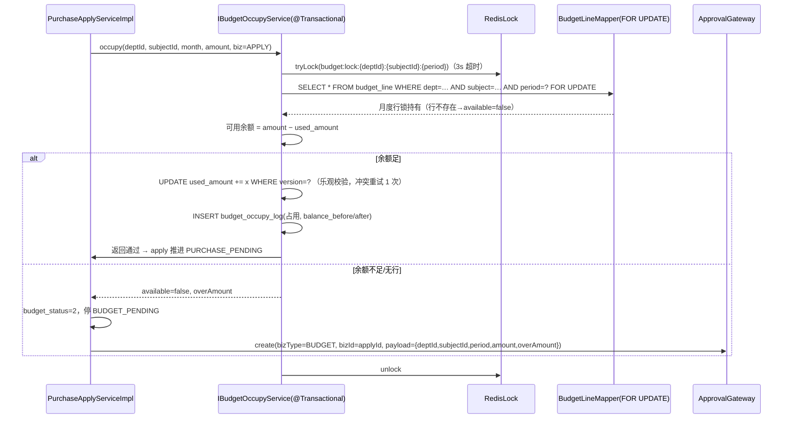
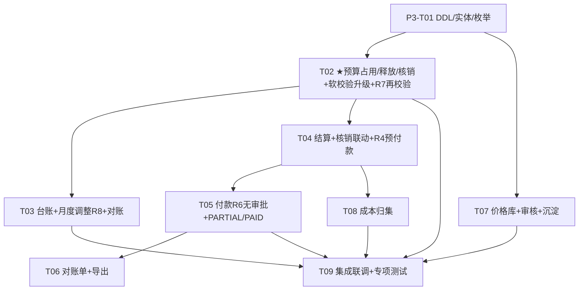

# P3 预算硬控制 + 结算付款 + 成本管理 · 系统设计（Design）

> 版本：v1.1（审计修订版——按《口径与PRD一致性核对报告》R1–R9 修正，见 §0R；v1.0 为 P3 阶段设计基线）
> 作者：架构师 高见远（Gao）
> 上游依据：`docs/P3预算结算规格设计.md`（v1.0，0acd4c3）、`docs/P2采购主链路设计.md`（§4 三重校验事务基线、§8 D3/D8 预留）、`docs/技术评审与架构设计.md`（架构 2.2 / 2.2-R2）、`docs/延期需求与占位登记.md`（D3/D8/D5）、**`docs/口径与PRD一致性核对报告.md`（ec44e7f，R1–R9 修订基准，PRD v1.1 原文逐条核对）**
> 范围：**只出设计，不含业务实现代码**；预算控制单元、事务方案为合规重点。
> ★ **Q1b 修正依据 PRD v1.1 §6.4.3**（wiki token `EIdSwfRRVi8oE0kwB7vcMtFVn1f`）："可用余额等于**月度**预算减去已占用金额"、PR-05"校验部门和**月份**可用预算"——**硬控制粒度 = 部门 × 预算科目 × 月份**（控制单元即 `budget_line` 月度行 `period=1–12`），**推翻规格 §8-Q1b 的"年度"建议**；项目维度按 PRD §6.4.1(L609) **不参与额度控制**（仅业务归属/统计）。
> 用户口径：**以实际需求交付标准为准**——本修订版按审计 R1–R9 逐条修正后作为 P3 实施基线。

---

## 0. 结论先行

- **清 D3（预算硬控）**：`IBudgetSoftCheckService` **契约不变、实现升级**为"校验+占用+拦截+升级审批"；新增 `budget_occupy_log` 流水表（对账唯一依据），`budget_line.used_amount` 开始真实写入。**占用时点 = 申请提交即预占用**（Q1）；超预算 → `budget_status=2` 停 `BUDGET_PENDING` → bizType=`BUDGET` 升级审批（通过=超支占用生效、驳回=回草稿不占用）。
- **硬控粒度（Q1b 定稿 + R1 修正）**：部门 × 科目 × **月份**——校验/占用/释放/核销均落在提交当月的 `budget_line` 月度行；**月度行不存在 = 无预算 = 拦截**（走升级审批）；**`period=0` 年度额度行拆除（R1）**——年度 = 12 个月度行的聚合视图，不落库为额度行；`project_id` 退出额度控制（保留统计冗余字段）。月度调整**一律走 BUDGET 审批**（R8）且受 `amount ≥ used_amount` 约束。
- **清 D8（结算付款）**：结算（物料按 `arrival_item.qty_stored`、服务按 `service_assess.deduct_amount` 扣款、**预付款按订单发起（R4）**、阶段/尾款按 `phase_plan`）走 `SETTLEMENT` 审批+核销；付款线下执行、财务**直接登记实付+凭证**（R6 无审批），付款单状态 UNPAID/PARTIAL/PAID 承载已付口径（R5）；**订单状态机不再流转 SETTLED/PAID**（deprecated，改派生展示字段）；对账单为系统内口径。
- **成本管理**：`price_history` 价格库（事后成交价沉淀，与 P1 `price_rule` 事前限价**两套分工不合一**，Q5）；成本按部门×科目×月份聚合查询（归属=申请部门，不摊，Q6）。
- **审批（R6 修订）**：新增 2 个 bizType（`BUDGET / SETTLEMENT`），**取消 PAYMENT**（付款登记无审批）；至此系统共 7 个 bizType（P1 资质 1 + P2 四类 + P3 两个），**恰好对齐 PRD §6.16 七类**，契约冻结待 P4 替换。履约调整取消 5% 免审、月度调整取消 20% 免审（R3/R8，一律审批）。
- **事务基线（★合规重点）**：完全复用 P2 §4 模式——行锁 `budget_line FOR UPDATE` + Redis 锁（粒度细化到月：`budget:lock:{deptId}:{subjectId}:{period}`）+ `version` 乐观兜底 + **每日对账任务 `Σlog(占用−释放) == used_amount`**。
- **契约提示**：本阶段所有新枚举遵循 #33 裁决的 **name 字符串 API 契约**（不加 `@JsonValue`）；Long→String 序列化与延期台账铁律不受本修订影响。

---

## 0R. 审计修订总览（R1–R9 · 结论先行）

> 修订依据：`docs/口径与PRD一致性核对报告.md`（28 条口径审计，9 条 🔴 违背 PRD）；修订原则：**只改设计与契约口径，不推翻已验证的事务/并发基线**（§3 全部保留），与 #33 name 契约、Long→String 序列化、延期台账铁律无冲突。

### 0R.1 R1–R9 修正点

| # | 审计结论（PRD 依据） | 设计修正点 | 影响的实体/状态机/接口/审批 |
|---|---|---|---|
| **R1** | 额度控制键=**部门+月份+科目**（§6.4.1 L609）；月度台账即预算，数据模型 `budget` 无年度额度行（L1197）；项目不参与额度 | **拆除 `period=0` 年度额度行**（年度=12 个月度行聚合**视图**，不落额度）；**`project_id` 退出额度控制**（保留为统计冗余字段）；硬控/对账全部落在月度行 | `budget_line` 导入校验/查询、`IBudgetSoftCheckService` 读数注释、预算台账/执行率、超预算判定；**§3 事务基线与锁键不变**（本就按月度行加锁） |
| **R5** | PRD §8(L1114) 订单状态**无 SETTLED/PAID**（仅待收货/部分到货/已完成/已取消+服务三态）；付款状态=未付款/**部分付款**/已付清（L918/L1119） | **订单状态机移除 SETTLED/PAID 流转**（枚举值保留但 `@Deprecated` 不再流转，改**派生展示字段** settleProgress/paidProgress，由结算/付款单聚合）；应付/已付由结算单/付款单承载；**`PaymentStatus` 改 UNPAID/PARTIAL/PAID，删除 REJECTED**（驳回在结算审批；付款无审批见 R6）。**推翻 #46 原"PAID-on-order"修复方向与 P2 承接清单"SETTLED/PAID 启用"** | `OrderStatus`、`PaymentStatus`、订单列表/详情 VO、§2.2 付款状态机、承接清单 #3 |
| **R6** | 付款登记无需审批（§6.11.1 L903：审批通过后财务根据线下实际付款结果**登记**） | **移除 PAYMENT bizType 与 `payment.submit()`**：付款创建 → 财务直接 `confirmPayment` 登记实付（金额/日期/凭证）；`reviewed_by/at` 字段停用保留兼容 | `IPaymentService`、§4 bizType 表、§5 `/payments/{id}/submit` 删除；**bizType 总数维持 7 个，恰好对齐 PRD §6.16 七类** |
| **R4** | 缺预付款结算与抵扣（§6.10.1 L873：预付款从订单条款发起…后续物料尾款结算中**自动抵扣**；L1213 `payment_stage/prepayment_deduction`；PAY-07） | `SettlementType` 补**预付款**；`settlement` 补 `payment_stage`、`prepayment_deduction` 两列；预付款链路 = **订单发起（无需到货）→ SETTLEMENT 审批 → 登记实付 → 尾款结算自动扣减**（尾款应结=订单应结−已付预付款）；累计校验不超订单有效金额 | `settlement` ALTER（+2 列）、`SettlementType`、结算发起入口（订单页）、尾款校验口径（§2.1）、R3 超付处理 |
| **R3** | 履约调整**一律进审批中心**（§6.7.3 L776，无免审阈值）；部分到货仍可调整（L774 仅"全部完成"不可调）；超付预付款须**退款/转余额/抵扣**（L777/BR-27） | **取消 FULFILLMENT_ADJUST 的 5% 免审分支**（P2 §3 契约修订：调整一律 create 审批）；放开"部分到货可调整"（仅"全部完成/已结算部分"不可调）；补超付预付款**退款/转余额/抵扣**处理与"已结算部分不得调整"校验 | P2 `fulfillment_adjust` 审批分支与入口校验、预付款联动（R4） |
| **R7** | 定标确认需**预算再校验**（BR-04 L1079、§6.4.3 L634：避免申请后额度被其他单据占用） | 定标提交/确认时**二次校验预算**（部门×科目×月，读月度行；不足→拦截走 BUDGET 升级审批，同 §2.3 行 2 逻辑）；**仅校验不重复占用**（占用锚在申请，`biz_type=2(AWARD)` 已预留不启用） | P2 `AwardService.submit/confirm` 联动点（跨模块契约，见 §6R）、§4 BUDGET 行 |
| **R8** | 月度调整由财务发起，**审批通过后**更新台账（L635）——一律审批 | **移除 20% 免审阈值**（Q4 作废）：`adjustAmount` 不再直生效，一律 create `BUDGET` 审批（调整标记入 payload），通过后更新 amount；前后值留痕 `budget_adjustment` | §2.3 `adjustAmount`、§4 BUDGET 行、§9 Q4 作废 |
| **R9** | 询价允许**无申请独立寻源**（BR-07 L1082：必填寻源原因）+ **线下直接定标登记**（§6.6.1 L682，原型已有入口）；移除"仅 APPROVED 申请可询价" | P3 设计无直接改动；**登记为 P2b 首批范围**：`inquiry` 补来源类型（申请/独立寻源）与 `source_reason`（独立寻源必填）、线下定标登记入口（不补建询价单直接落 award） | P2 `inquiry/award` 模型与入口（跨模块，§6R 登记，P2b 排期） |
| **R2** | 定标按 SKU 拆多供应商 vs PRD **单中标供应商**（§6.6.4 L718、L1201 单数字段）——**待用户业务决策** | 默认回归 PRD 单中标供应商；两方向影响面对照见 §0R.2，决策前 P2b 定标登记不动 `award` 约束 | `award/award_item` 约束、合同金额来源（连带审计 #14"份额校验"规则的存废） |

### 0R.2 R2 两方向影响面对照（供用户决策）

| 维度 | 方向 A：回归单中标供应商（PRD 口径，**推荐默认**） | 方向 B：走 PRD 变更保留拆标 |
|---|---|---|
| 数据模型 | `award` 按 inquiry 唯一中标（单数语义恢复）；`award_item` 仅保留明细行（同供应商） | `award` 允许多中标行（行级 supplier_id）；`award_item` 需补 supplier_id 维度或重组 award→award_lot→items |
| 合同 | 合同金额=定标金额（可校验）；P2 "按 award_item 份额校验"规则**删除**（审计 #14 连带简化） | 一单一供应商或按中标行拆分合同，P2 合同模块重构 |
| 下单三重校验 | 不变（合同供应商=中标供应商天然一致） | 需按 SKU 匹配中标行供应商，校验复杂度上升 |
| 已实现回归面 | P2 定标 UI/服务**回退拆标逻辑**（中等工作量）；比价页回归单供应商 | 无回退，但新增多中标行 UI/校验（工作量 ≥ 方向 A 且引入 PRD 变更流程） |
| 预算联动（R7） | 单点再校验，简单 | 按中标行拆分校验，BUDGET 升级 payload 需多行 |
| 对 P3 的影响 | 无（预算按申请锚定不变） | 占用转移需按中标行拆分 log（§2.3 行 6 复杂化） |

### 0R.3 报表中心解除阻塞

审计证实 **PRD §6.12（L928–966）有完整报表需求**（采购统计汇总/结构/明细两级菜单、预算执行、成本报表、履约报表、同步报表，含指标口径与页面要求，标注"生产目标口径"）——原"业务需求未提供、真阻塞"判断**作废**。排期建议见 §8 D8 行；注意成本归集维度需补**申请部门/品类/项目/供应商/月份**（L936），当前部门×科目×月聚合不足，属报表批次补齐项。

---

## 1. 实体设计（DDL 级）

### 1.1 公共约定（沿用 P1/P2）

`BaseEntity` 审计列（`id/created_by/created_at/updated_by/updated_at/deleted`）；逻辑外键；唯一索引带 `deleted`；金额 `DECIMAL(18,2)`、数量 `DECIMAL(18,4)`。

### 1.2 新建实体 DDL（2 个）

#### 1.2.1 `budget_occupy_log` — 预算占用/释放/核销流水（对账唯一依据）

```sql
CREATE TABLE `budget_occupy_log` (
  `id`              BIGINT        NOT NULL,
  `budget_line_id`  BIGINT        NOT NULL                COMMENT '预算明细行ID（控制单元：部门×科目×月，R1：无年度行）',
  `biz_type`        TINYINT       NOT NULL                COMMENT '1=APPLY 2=AWARD(预留,R7仅校验不启用) 3=ORDER 4=SETTLEMENT 5=ADJUST',
  `biz_id`          BIGINT        NOT NULL                COMMENT '业务单据ID（申请/定标/订单/结算/调整）',
  `action`          TINYINT       NOT NULL                COMMENT '0=占用 1=释放 2=核销 3=调整',
  `amount`          DECIMAL(18,2) NOT NULL                COMMENT '本笔发生额（带方向：占用/调增为正，释放/调减为负；核销为正且 used_amount 不变=构成转移）',
  `balance_before`  DECIMAL(18,2) NOT NULL                COMMENT '动作前 used_amount 快照',
  `balance_after`   DECIMAL(18,2) NOT NULL                COMMENT '动作后 used_amount 快照（核销时前后相等）',
  `operator`        BIGINT        NULL                    COMMENT '操作人（系统动作为 NULL）',
  `remark`          VARCHAR(512)  NULL,
  `created_by` BIGINT NULL, `created_at` DATETIME NULL,
  `updated_by` BIGINT NULL, `updated_at` DATETIME NULL,
  `deleted`    INT    NOT NULL DEFAULT 0,
  PRIMARY KEY (`id`),
  KEY `idx_line` (`budget_line_id`, `created_at`),
  KEY `idx_biz` (`biz_type`, `biz_id`),
  KEY `idx_action` (`action`)
) ENGINE=InnoDB DEFAULT CHARSET=utf8mb4 COLLATE=utf8mb4_0900_ai_ci COMMENT='预算占用/释放/核销流水（每日对账依据）';
```
> **口径**：`used_amount = Σ(action=占用) − Σ(action=释放)`；`核销额 = Σ(action=核销)`（仅构成转移）；对账任务即校验此恒等式。

#### 1.2.2 `price_history` — 价格库（事后成交价沉淀）

```sql
CREATE TABLE `price_history` (
  `id`             BIGINT        NOT NULL,
  `sku_id`         BIGINT        NOT NULL                COMMENT 'SKU',
  `supplier_id`    BIGINT        NULL                    COMMENT '供应商（手工/品类级价可空）',
  `price`          DECIMAL(18,2) NOT NULL                COMMENT '单价（基本单位口径）',
  `source`         TINYINT       NOT NULL                COMMENT '0=报价 1=定标 2=订单 3=手工（PriceSource）',
  `biz_type`       VARCHAR(32)   NULL                    COMMENT '来源单据类型（QUOTATION/AWARD/ORDER）',
  `biz_id`         BIGINT        NULL                    COMMENT '来源单据ID',
  `effective_date` DATE          NOT NULL                COMMENT '生效日期（默认来源单据日期）',
  `audit_status`   TINYINT       NOT NULL DEFAULT 0      COMMENT '0=待审 1=通过 2=驳回（PriceAuditStatus）',
  `audit_by`       BIGINT        NULL,
  `audit_at`       DATETIME      NULL,
  `remark`         VARCHAR(512)  NULL,
  `created_by` BIGINT NULL, `created_at` DATETIME NULL,
  `updated_by` BIGINT NULL, `updated_at` DATETIME NULL,
  `deleted`    INT    NOT NULL DEFAULT 0,
  PRIMARY KEY (`id`),
  KEY `idx_sku_supplier` (`sku_id`, `supplier_id`, `effective_date`),
  KEY `idx_audit` (`audit_status`),
  KEY `idx_biz` (`biz_type`, `biz_id`)
) ENGINE=InnoDB DEFAULT CHARSET=utf8mb4 COLLATE=utf8mb4_0900_ai_ci COMMENT='价格库（成交价沉淀；与 price_rule 事前限价两套分工，Q5）';
```
> 沉淀埋点（自动写入 `audit_status=1` 的通过价）：报价采纳（`QuotationService.accept`）、定标审批通过（`AwardService.onApprovalCallback`）、订单生成（`OrderService.createOrder`）；异常价（超 `price_rule` 限价或低于历史均价 20%）写 `audit_status=0` 待审。P2 比价"历史比价"取数切换/兜底为本表。

### 1.3 已有实体 ALTER（3 个）

#### 1.3.1 `settlement`（+10，R4 增补 2 列）

```sql
ALTER TABLE `settlement`
  ADD COLUMN `settle_no`        VARCHAR(32)   NULL COMMENT '结算单号 JS-{yyyy}{MM}-{seq6}（全局唯一）' AFTER `order_id`,
  ADD COLUMN `settled_qty_base` DECIMAL(18,4) NULL COMMENT '本次结算数量（基本单位累计口径；预付款结算可空）' AFTER `settle_no`,
  ADD COLUMN `deduct_amount`    DECIMAL(18,2) NOT NULL DEFAULT 0 COMMENT '服务考核扣款合计（物料=0；取数 service_assess；落库回填——#43）' AFTER `settled_qty_base`,
  ADD COLUMN `contract_id`      BIGINT        NULL COMMENT '追溯合同（nullable，展示比对用）' AFTER `deduct_amount`,
  ADD COLUMN `settle_mode`      TINYINT       NOT NULL DEFAULT 0 COMMENT '0=一次性 1=阶段 2=尾款（SettleMode）' AFTER `contract_id`,
  ADD COLUMN `phase_no`         INT           NULL COMMENT '阶段号（settle_mode=1 时必填）' AFTER `settle_mode`,
  ADD COLUMN `phase_ratio`      DECIMAL(5,2)  NULL COMMENT '阶段比例%（Σ=100 校验；比例仅默认建议，金额可自行填写——PRD L869）' AFTER `phase_no`,
  ADD COLUMN `is_final`         TINYINT       NOT NULL DEFAULT 0 COMMENT '是否末次结清标记：0/1（展示属性，不参与状态机——R5）' AFTER `phase_ratio`,
  ADD COLUMN `payment_stage`    TINYINT       NULL COMMENT '付款阶段（R4 预付款：1=预付 2=进度款 3=尾款；一次性/物料可空）' AFTER `is_final`,
  ADD COLUMN `prepayment_deduction` DECIMAL(18,2) NOT NULL DEFAULT 0 COMMENT '本单抵扣的预付款合计（R4：尾款结算自动扣减，落库回填）' AFTER `payment_stage`,
  ADD UNIQUE KEY `uk_settle_no` (`settle_no`, `deleted`);
```

#### 1.3.2 `payment`（+6，R6 停用 2 列）

```sql
ALTER TABLE `payment`
  ADD COLUMN `pay_no`        VARCHAR(32) NULL COMMENT '付款单号 FK-{yyyy}{MM}-{seq6}（全局唯一）' AFTER `settlement_id`,
  ADD COLUMN `pay_date`      DATE        NULL COMMENT '付款日期（登记确认时填）' AFTER `pay_no`,
  ADD COLUMN `reviewed_by`   BIGINT      NULL COMMENT '（R6 停用：付款无审批环节，字段保留兼容不再写入）' AFTER `pay_date`,
  ADD COLUMN `reviewed_at`   DATETIME    NULL COMMENT '（R6 停用）' AFTER `reviewed_by`,
  ADD COLUMN `confirmed_by`  BIGINT      NULL COMMENT '线下付款登记确认人（财务）' AFTER `reviewed_at`,
  ADD COLUMN `confirmed_at`  DATETIME    NULL COMMENT '登记确认时间' AFTER `confirmed_by`,
  ADD UNIQUE KEY `uk_pay_no` (`pay_no`, `deleted`);
```

#### 1.3.3 `purchase_order`（+1）

```sql
ALTER TABLE `purchase_order`
  ADD COLUMN `phase_plan` TEXT NULL COMMENT '阶段结算比例 JSON（如 [{"phase":1,"ratio":30},{"phase":2,"ratio":40},{"phase":3,"ratio":30}]；null=一次性；比例仅默认建议值——PRD L869）' AFTER `order_type`;
```

### 1.4 P3 新增枚举（遵循 #33 name 契约，不加 `@JsonValue`）

| 枚举 | 值域 | 归属 |
|---|---|---|
| `BudgetAction` | 0=占用 / 1=释放 / 2=核销 / 3=调整 | `budget_occupy_log.action` |
| `BudgetBizType` | 1=APPLY / 2=AWARD(预留) / 3=ORDER / 4=SETTLEMENT / 5=ADJUST | `budget_occupy_log.biz_type` |
| `SettleMode` | 0=一次性 / 1=阶段 / 2=尾款 | `settlement.settle_mode` |
| `PriceSource` | 0=报价 / 1=定标 / 2=订单 / 3=手工 | `price_history.source` |
| `PriceAuditStatus` | 0=待审 / 1=通过 / 2=驳回 | `price_history.audit_status` |

> 复用（R4/R5/R6 修订）：`SettlementStatus`（PENDING/SETTLED/PARTIAL，不加驳回态——见 §2.1 说明）、`SettlementType`（物料/服务/**预付款**）、`PaymentStatus`（**UNPAID/PARTIAL/PAID；删除 REJECTED**——驳回在结算审批，付款无审批）、`OrderStatus`（**SETTLED/PAID 标记 `@Deprecated` 不再流转**，改派生展示字段——R5，推翻 P2 承接清单"启用"口径）、`BudgetHeaderStatus`。

---

## 2. 分层契约与状态机

### 2.1 结算（settlement）

**Mapper**：`SettlementMapper`（+ `selectByOrder(orderId)`、`sumSettledAmount(orderId)`、`sumSettledQty(orderItemId)`、`sumPrepaymentPaid(orderId)`）；`ArrivalItemMapper` 复用（读 `qty_stored`）；`ServiceAssessMapper`（读 `deduct_amount`）。

**Service**：
```java
interface ISettlementService extends IService<Settlement> {
    SettlementDraftVO draftFromOrder(Long orderId);        // 带出：订单/明细价、已入库量、可结余量、服务扣款、已付预付款、合同累计结算
    SettlementDraftVO draftFromArrival(Long arrivalId);    // 到货单入口优先：按 arrival_item.qty_stored 汇总
    Long createPrepaymentSettlement(Long orderId, BigDecimal amount, String remark);
                                                           // R4：预付款从订单发起（无需到货、无 settled_qty）→ SETTLEMENT 审批 → 登记实付 → 尾款自动扣减
    Long createSettlement(SettlementSaveReqVO req);        // 校验：订单 RECEIVED/PARTIAL_RECEIVED 或到货 STORED/PARTIAL_STORED（预付款结算除外——订单发起）；
                                                           // 结算数量≤已入库合格累计；重复结算拦截；阶段比例 Σ=100（仅默认建议，金额可自行填写）；
                                                           // 尾款校验"累计已结+本次−预付款抵扣 = 应结总额"
                                                           //   应结总额口径（#42 裁决 + R4）：物料=订单金额；服务=订单金额−Σ(service_assess.deduct_amount)；尾款=应结−已付预付款
    void submit(Long id);                                  // 发起 ApprovalGateway(bizType=SETTLEMENT)
    void onApprovalCallback(Long taskId, boolean approved, String comment);
                                                           // 通过→单据 SETTLED + 触发预算核销(IBudgetOccupyService.writeOff)；订单状态**不变**（R5：
                                                           //   结清进度为派生展示字段）；预付款审批通过同路径（R4）；驳回→保持 PENDING（留痕审批记录，可修改重提）
    IPage<SettlementPageRespVO> page(SettlementPageReqVO req);
}
```
**状态机**（`SettlementStatus`，单据维度）：

| 流转 | 触发 | 事件 |
|---|---|---|
| （创建）→ PENDING | `createSettlement` / `createPrepaymentSettlement` | 结算数量/金额校验；一订单可多批次；预付款结算无数量校验（R4） |
| PENDING → SETTLED | `SETTLEMENT` 审批通过 | **触发核销**（占用→核销，`used_amount` 不变）；**订单状态不变（R5）**，结清进度派生展示 |
| PENDING →（驳回留痕）→ PENDING | 审批驳回 | 修改重提（不动枚举值；`approval_task` 留痕，P4 如需显式 REJECTED 态再扩展） |

> 部分结算：订单维度 `PARTIAL` 由"已结金额 < 订单应结总额"派生展示（前端标签，不入状态机，R5 口径统一）；单据级保持 PENDING→SETTLED（规格口径）。

### 2.2 付款（settlement/payment）—— R6：无审批，财务直接登记

**Mapper**：`PaymentMapper`（+ `selectBySettlement(settlementId)`、`sumPaidAmount(settlementId)`）。

**Service**：
```java
interface IPaymentService extends IService<Payment> {
    Long createPayment(PaymentSaveReqVO req);              // 仅结算单 SETTLED 可发起；累计付款 ≤ 结算金额；生成 pay_no
                                                           //（R6：无 submit/无 PAYMENT bizType——创建后直接待登记）
    void confirmPayment(Long id, BigDecimal actualAmount, String voucherFile, LocalDate payDate);
                                                           // R6：财务直接登记实付（金额/日期/回单凭证≤5，PRD L903）：
                                                           // 累计实付 < 应付 → PARTIAL；== 应付 → PAID；落 confirmed_by/at；
                                                           // 回写结算单已付累计；订单状态不变（R5，付清进度派生展示）
    IPage<PaymentPageRespVO> page(PaymentPageReqVO req);
    StatementVO statement(Long supplierId, LocalDate from, LocalDate to); // 对账单：应付=Σ结算、已付=Σ付款、差额+明细清单（导出 Excel）
}
```
**状态机**（`PaymentStatus`，R5/R6 修订）：

| 流转 | 触发 | 事件 |
|---|---|---|
| （创建）→ UNPAID | `createPayment` | 无审批（R6）；应付=结算金额（尾款单应结已含预付款抵扣） |
| UNPAID → PARTIAL | `confirmPayment`（累计实付 < 应付） | 登记实付+凭证+`pay_date`；**部分付款（R5 补，PRD L918/L1119）** |
| UNPAID/PARTIAL → PAID | `confirmPayment`（累计实付 == 应付） | 登记确认完成；付款单闭环 |

> 状态推进按**累计实付 vs 应付**判定，单笔实付可小于付款单金额（分批付款，PRD §6.11）。~~REJECTED~~ 删除（驳回在结算审批，付款登记无审批可驳回）。付款确认**无预算动作**（核销已在结算完成，规格 §5 行 12）。登记冲销能力（PAY-08，审计 🟡 项）登记为 P3b 补齐，不在本期 R 项范围。

### 2.3 预算控制（budget）——占用生命周期与 `budget_line` 联动

**接口升级（契约不变）+ 新增动作接口**：
```java
/** 原软校验接口：方法契约不变（P2 入口零改动），实现内部升级为月度硬控读数 */
interface IBudgetSoftCheckService {
    BudgetCheckResultVO check(Long deptId, Integer year, Long subjectId, BigDecimal amount);
    // <!-- D3: 已落地硬控读数 -->：按"提交当月"取 budget_line 月度行（period=1–12），
    // 可用余额 = 该行 amount − used_amount；行不存在 = 无预算（available=false）；
    // 年度行(period=0) 拆除（R1）：年度=12 个月度行聚合视图，不落额度行；project_id 退出额度控制（统计冗余）
}

/** 新增：占用/释放/核销/转移/调整（唯一写 used_amount 与 log 的入口） */
interface IBudgetOccupyService {
    OccupyResultVO occupy(BudgetOccupyCmd cmd);            // 校验+占用+写 log（同事务，见 §3）；占用月份 = expected_date 所在月（属当前年）否则提交当月
    OccupyResultVO checkOnly(BudgetOccupyCmd cmd);         // R7：定标再校验专用只读入口（同锁链读月度行，不写 used_amount/log）
    void release(BudgetOccupyCmd cmd);                     // 释放（≤该 biz 累计占用余额，不足按余额释放并告警）
    void writeOff(BudgetOccupyCmd cmd);                    // 核销：占用→核销，used_amount 不变，log balance 前后相等
    void transfer(BudgetTransferCmd cmd);                  // 占用主体转移（申请侧全额释放预估价占用 + 订单侧按合同价全额占用，
                                                           //   净变动=合同价−预估价的差额修正；log 两笔 RELEASE+OCCUPY，biz_type=ORDER——#37 裁决维持实现）
    void adjustAmount(Long budgetLineId, BigDecimal newAmount, String reason); // R8：一律走 BUDGET 审批（通过后更新，前后值留痕 budget_adjustment）；
                                                           // 调减校验 amount≥used_amount；log action=3
}
```
**占用生命周期**（对照规格 §5 的 14 行规则 + R7 补充，逐条落代码路径）：

| # | 触发事件 | 代码路径 | 预算动作 | `used_amount` | 业务状态联动 |
|---|---|---|---|---|---|
| 1 | 申请提交（余额足） | `PurchaseApplyServiceImpl.submit` → `occupy` | 占用 + | 增加 | `DRAFT→BUDGET_PENDING→PURCHASE_PENDING` |
| 2 | 申请提交（余额不足/无月度行） | `submit` → `occupy` 拦截分支 | 0（暂不占用） | 不变 | `budget_status=2`，停 `BUDGET_PENDING`，bizType=`BUDGET` 升级审批 |
| 3 | 超预算审批通过 | `BudgetApprovalHandler.onApprovalCallback(BUDGET, APPROVED)` | 占用（超支）+ | 增加 | `BUDGET_PENDING→PURCHASE_PENDING` |
| 4 | 超预算审批驳回 | 同上（REJECTED） | 0（回草稿） | 不变 | `BUDGET_PENDING→REJECTED→DRAFT`（修改重提再校验） |
| 5 | 申请驳回 / 作废 | `apply.onApprovalCallback(REJECTED)` / `closeApply(void)` | 释放 − | 减少 | 按该申请累计占用余额释放 |
| 6 | 订单生成 | `OrderServiceImpl.createOrder` | **转移**（申请释放 −预估价 + 订单占用 +合同价） | 净变动 = 合同价−预估价（#37 裁决维持实现，规格 §5 行6 字面同步修订） | 申请→`PARTIAL_ORDER/FULL_ORDER`；订单 `CREATED` |
| 7 | 订单变更（减量） | `changeOrder`（变更生效） | 释放差额 − | 减少 | `order_change` 生效 |
| 8 | 订单变更（增量） | `changeOrder` | 校验+占用差额 + | 增加 | 不足→拦截（同行 2 逻辑，走 BUDGET 审批） |
| 9 | 订单取消 | `cancelOrder` | 释放 − | 减少 | `→CANCELLED`（同时回冲合同额度，P2 §4） |
| 10 | 申请关闭（FULL_ORDER/作废） | `closeApply` | 释放未转单余量 − | 减少 | 防假占用 |
| 11 | 结算审批通过 | `SettlementServiceImpl.onApprovalCallback` | **核销**（占用→核销） | 0（不变） | **订单状态不变（R5）**：结清进度派生展示 |
| 12 | 付款登记确认 | `confirmPayment` | 无 | 不变 | 付款单 UNPAID/PARTIAL→PAID（R5/R6；订单状态不变） |
| 13 | 月度调整 | `adjustAmount` | 调整（改 amount） | 不变 | **一律走 `BUDGET` 审批（R8，20% 免审作废）**；调减校验 `amount≥used_amount` |
| 14 | 每日对账任务 | `DailyBudgetReconcileTask.run`（@Scheduled） | 校准 | — | `Σlog(占用−释放) ≠ used_amount` → 告警（对齐架构 2.2-R2） |

> **R7 补充（生命周期行 6a · 定标再校验）**：定标提交/确认时调用 `checkOnly` 二次校验预算（部门×科目×提交当月，读月度行）；不足→拦截定标确认并走 `BUDGET` 升级审批（同行 2 逻辑，通过后放行）；**仅校验不重复占用**（占用锚在申请，`biz_type=AWARD` 预留不启用——PRD 只要求"再次校验"）。

---

## 3. ★ 预算占用/释放/核销事务方案（合规重点，复用 P2 §4 基线；R1 修订不影响本节——本就按月度行加锁）



**要点与取舍**（对齐架构 2.2 与 P2 §4）：
1. **三重保障**：`budget_line` 行锁 `FOR UPDATE`（主）+ Redis 锁（多实例防穿透）+ `version` 乐观兜底（UPDATE 带 `WHERE version=?`，冲突重试 1 次）。
2. **锁粒度细化到月**：Redis 锁键 `budget:lock:{deptId}:{subjectId}:{period}`（P2 基线 `{deptId}:{subjectId}` 基础上加 period），不同月互不阻塞。
3. **锁顺序固定**：同事务内若涉及多行（多科目明细），按 `budget_line.id` 升序逐行加锁，防交叉死锁。
4. **同事务原子性**：校验、`used_amount` 更新、`budget_occupy_log` 写入、业务状态变更**同一 DB 事务**；审批经 `ApprovalGateway` 在事务边界外发起（create 幂等）。
5. **每日对账**：`DailyBudgetReconcileTask` 按 `budget_line_id` 校验 `Σlog(占用−释放) == used_amount` 与 `balance_after 链式连续`；不一致→告警 + 人工校准工具（以 log 链重放修正 `used_amount`，修正动作亦写 log action=3）。
6. **超支占用**：仅 `BUDGET` 审批通过后执行（"先占后审"禁止）；`used_amount` 允许 > `amount`（超支），台账执行率 >100% 标红展示。
7. **R7 接入**：定标再校验走 `checkOnly`（同锁链只读，无写动作），复用本节锁链但不产生 log。

---

## 4. ApprovalGateway 接入契约（新增 2 个 bizType；R6 移除 PAYMENT）

| bizType | create 时机 | ApprovalTaskSpec 构造 | 回调映射（APPROVED / REJECTED） | 级别 |
|---|---|---|---|---|
| `BUDGET` | `occupy` 拦截分支 / `adjustAmount`（R8 一律）/ **定标再校验拦截（R7）** | `bizType=BUDGET, bizId=applyId（调整=adjLineId、定标=awardId，标记入 payload）, title="预算升级-{applyNo}", payloadJson={deptId,subjectId,period,amount,overAmount,adjust?或award?}` | 通过→**超支占用生效**+`→PURCHASE_PENDING`（调整：amount 生效；定标：放行确认）；驳回→`→REJECTED→DRAFT`（不占用）/调整、定标不变 | 一级（预算管理员） |
| `SETTLEMENT` | `settlement.submit()`（含预付款结算，R4） | `bizType=SETTLEMENT, bizId=settlementId, title="结算-{settleNo}", payloadJson={orderId,type,amount,deductAmount,prepaymentDeduction?,phaseNo?,paymentStage?}` | 通过→单据 `SETTLED`+**核销**（订单状态不变，R5）；驳回→保持 PENDING 可重提 | 一级（采购负责人，Q9） |

> ~~`PAYMENT`~~ **R6 移除**：付款登记无审批（PRD L903 审批止于结算），财务直接 `confirmPayment`。幂等/重提契约沿用 P2 §3（任务状态一次性流转、同 bizId 重提=新任务、取最新）；本地桩即审即过，P4 换实现业务无感。**bizType 总数维持 7 个**，与 PRD §6.16 七类一一对应：采购申请(PURCHASE_APPLY)/预算(BUDGET)/定标(AWARD)/合同(CONTRACT)/履约调整(FULFILLMENT_ADJUST)/结算(SETTLEMENT)/资质(SUPPLIER_QUAL)；**FULFILLMENT_ADJUST 取消 5% 免审（R3，P2 §3 契约同步修订：调整一律 create）**。

---

## 5. API 端点清单（权限键按规格 §6-8 新增）

| 组 | 方法 | 路径 | 权限键 |
|---|---|---|---|
| 预算台账 | GET | `/api/v1/budgets/execution`（部门×科目×月：预算/占用/核销/可用/执行率；R1：年度=月度聚合视图）、`/api/v1/budgets/occupy-logs` | `budget:read` |
| 月度调整 | POST | `/api/v1/budgets/lines/{id}/adjust`（R8：一律触发 BUDGET 审批） | `budget:adjust` |
| 超预算/调整审批 | GET/POST | `/api/v1/approvals/tasks?bizType=BUDGET`、`/{taskId}/approve`、`/{taskId}/reject` | `budget:audit` / `approval:approve` |
| 结算 | GET/POST | `/api/v1/settlements`（`/page`、`/{id}`）、`/draft/from-order/{orderId}`、`/draft/from-arrival/{arrivalId}`、`/prepayment/{orderId}`（R4）、`/{id}/submit` | `settlement:read` / `settlement:write` |
| 付款 | GET/POST | `/api/v1/payments`（`/page`、`/{id}`）、`/{id}/confirm`（**R6 删除 `/submit`**：登记无审批） | `payment:read` / `payment:write` / `payment:confirm` |
| 对账单 | GET | `/api/v1/payments/statement?supplierId=&from=&to=`（导出 Excel） | `payment:read` |
| 价格审核 | GET/POST | `/api/v1/cost/price-histories`（`/page`）、`/{id}/audit`、`/manual` | `cost:price:audit`（审核/补录）/ `cost:read` |
| 成本归集 | GET | `/api/v1/cost/summary?deptId=&year=&month=`（下钻订单明细） | `cost:read` |

> 全部列表/台账/对账单经 `DataPermissionInterceptor` 部门过滤；阶段一门禁沿用 `@authz.hasAnyPerm`，权限键为阶段二细化目标。

---

## 6. 任务分解（有序 · 含依赖 · 后端/前端归属）

> 顺序：DDL → 预算硬控 → 结算 → 付款 → 成本 → 联调。

| T | 任务 | 后端文件（示例） | 前端文件（示例） | 依赖 | 优先级 |
|---|---|---|---|---|---|
| **P3-T01** | DDL / 实体 / 枚举 | `scripts/sql/p3_schema.sql`（2 CREATE+3 ALTER，settlement +10 含 R4 两列）、`BudgetOccupyLog/PriceHistory` 实体+Mapper、`BudgetAction/BudgetBizType/SettleMode/PriceSource/PriceAuditStatus`、`PaymentStatus` 改造（R5）、`SettlementType` 补预付款（R4） | — | — | P0 |
| **P3-T02** | ★ 预算占用/释放/核销/转移 + 软校验升级 + BUDGET 审批 + 定标再校验（R7） | `IBudgetOccupyService`+Impl（锁+log+`checkOnly`）、`BudgetSoftCheckServiceImpl` 内部升级（契约不变、R1 读数）、`PurchaseApplyServiceImpl.submit` 接入、`BudgetApprovalHandler`、`OrderServiceImpl` 转移/变更/取消接入、P2 `AwardService` 再校验联动点 | `views/budget/BudgetExecution.vue`、超预算待审列表 | P3-T01 | P0 |
| **P3-T03** | 预算执行台账 + 月度调整（R8 一律审批）+ 每日对账 | `BudgetExecutionQueryService`（R1：拆除年度额度行聚合）、`adjustAmount`、`DailyBudgetReconcileTask`、人工校准工具 | `views/budget/BudgetLedger.vue`（月度台账即预算、执行率/标红）、`MonthAdjust.vue`（调整即审批） | P3-T02 | P0 |
| **P3-T04** | 结算（物料/服务/**预付款**/阶段尾款）+ SETTLEMENT 审批 + 核销联动 | `ISettlementService`+Impl、`SettlementController`、核销联动 `writeOff`、结清进度**派生字段**（R5 不动订单状态机）、`phase_plan` 校验、预付款链路与尾款自动扣减（R4） | `views/settlement/SettleList.vue`、`SettleForm.vue`（双入口+预付款入口）、`PhasePlan.vue` | P3-T02 | P0 |
| **P3-T05** | 付款（R6 无审批）+ PARTIAL/PAID 确认回写 | `IPaymentService`+Impl（去 submit/PAYMENT 回调）、`confirmPayment`（累计实付 vs 应付 → PARTIAL/PAID）、结算单已付累计回写 | `views/settlement/PayList.vue`（PARTIAL/PAID 状态）、`PayConfirm.vue`（凭证上传） | P3-T04 | P0 |
| **P3-T06** | 对账单 + 付款台账导出 | `statement()` 聚合 + EasyExcel 导出 | `views/settlement/Statement.vue` | P3-T05 | P1 |
| **P3-T07** | 价格库 + 异常价审核 + 沉淀埋点 + 比价兜底切换 | `IPriceHistoryService`、沉淀埋点（quotation.accept / award 回调 / order 创建）、审核动作、P2 `comparison` 历史价取数切换 | `views/cost/PriceAudit.vue`、`PriceHistory.vue` | P3-T01 | P1 |
| **P3-T08** | 成本归集台账 | `CostSummaryQueryService`（部门×科目×月聚合，下钻订单；维度补齐留报表批次） | `views/cost/CostSummary.vue` | P3-T04 | P1 |
| **P3-T09** | 集成联调 + 专项测试 | 全链路（本地桩）：占用→转移→核销→付款（PARTIAL→PAID）→对账单；QA 专项见 §9 | 前端联调 | P3-T02..T08 | P0 |

**审计修正落地任务（R 项归属 · §6R）**

| R 项 | 归属 | 内容 | 依赖 |
|---|---|---|---|
| R1 | P3-T02/T03 | 拆除 period=0 额度行 + project_id 退出控制（查询/导入/台账回归） | P3-T01 |
| R3 | P2 侧（FULFILLMENT_ADJUST 分支）+ P3-T04/T05 | 取消 5% 免审、部分到货可调整、超付预付款退款/划扣/抵扣、已结算部分不得调整 | R4 |
| R4 | P3-T01/T04/T05 | settlement+2 列、预付款结算链路（订单发起→审批→实付→尾款自动扣减） | — |
| R5 | P3-T01/T04/T05 + 订单 VO | SETTLED/PAID deprecated、结清/付清派生字段、PaymentStatus UNPAID/PARTIAL/PAID | — |
| R6 | P3-T05 | 移除 PAYMENT bizType 与 `/payments/{id}/submit`、confirmPayment 直登 | — |
| R7 | P2 侧（AwardService）+ P3-T02 | 定标确认预算再校验（checkOnly）+ BUDGET 拦截升级 | P3-T02 |
| R8 | P3-T03 | adjustAmount 一律审批（20% 免审作废） | — |
| R9 | P2b（跨模块登记） | 询价来源类型+source_reason、线下定标登记入口 | P2b 排期 |
| R2 | **待用户决策** | 两方向影响面见 §0R.2；决策前不动 award 约束 | 用户决策 |

**依赖图**



---

## 7. 承接清单（P3 兑现 P2 口子）

| # | P2 预留口子 | P3 落地 |
|---|---|---|
| 1 | `IBudgetSoftCheckService.check()`（只读） | **契约不变、实现升级**为月度硬控读数（R1：无年度额度行、project_id 退出控制）；占用/释放/核销走新 `IBudgetOccupyService`（唯一写入口）；`<!-- D3 -->` 注释逐一清零 |
| 2 | `BUDGET_PENDING` 节点 + `budget_status`/`budget_occupied` | 激活真实语义：`BUDGET_PENDING`=超预算待升级审批（行 2）；`budget_occupied` 由快照升级为**真实占用金额**（下单转移后=本单占用） |
| 3 | 订单 `SETTLED / PAID` | **R5 推翻 P2"启用"口径**：枚举标记 `@Deprecated` 不再流转；订单结清/付清改**派生展示字段**（settleProgress/paidProgress，由结算单/付款单聚合）；订单状态机回归 PRD（待收货/部分到货/已完成/已取消+服务三态） |
| 4 | `service_assess.deduct_amount` | 服务结算自动汇总（R-STL-02，落库回填）；Q7 终口径=扣款金额在考核单落定 |
| 5 | `ApprovalGateway`（4 bizType） | 新增 `BUDGET/SETTLEMENT`（R6 去 PAYMENT）→ 共 7 个 bizType **恰好对齐 PRD §6.16 七类**，契约冻结（P4 无感）；FULFILLMENT_ADJUST 取消 5% 免审（R3） |
| 6 | 结算双入口 | `settlement.order_id/arrival_id` 已有，到货单入口优先带出 `qty_stored`；**补预付款入口（R4，订单发起）** |
| 7 | P2 比价"历史比价"实时计算 | 兜底/切换 `price_history`（口径：SKU+供应商+生效日期，仅取 `audit_status=1`） |
| 8 | 权限键 | 新增 `budget:occupy/budget:adjust/budget:audit`、`settlement:{read,write}`、`payment:{read,write,confirm}`、`cost:price:audit/cost:read` |

**单据编号**：`settle_no=JS-{yyyy}{MM}-{seq6}`、`pay_no=FK-{yyyy}{MM}-{seq6}`（沿用 P2 `IdGenerator` 机制，全局唯一索引带 deleted）。

---

## 8. 延后项登记（对照 `docs/延期需求与占位登记.md`）

| 台账项 | 本阶段处理 | 就地标注 |
|---|---|---|
| **D3 预算硬控制** | **本阶段清零**：占用/释放/核销/月度调整（R8 一律审批）/超预算拦截+升级审批/定标再校验（R7）/每日对账全部落地（§2.3/§3）；硬控维度按 R1 修正（月度行即控制行）；收尾时台账状态更新为 ✔ | `IBudgetSoftCheckService` javadoc `<!-- D3 -->` 改"已落地 P3（R1 修订口径）"；`purchase_apply.budget_occupied`、`BUDGET_PENDING` 语义激活 |
| **D8 结算/付款/成本** | **本阶段清零**（物料/服务/**预付款**/阶段/尾款结算、付款登记（R6 无审批）/对账单、价格库/成本归集）；**尾项"报表中心"解除阻塞（审计证实 PRD §6.12 有完整需求）——排期建议：P3b 独立批次**（采购统计两级菜单/预算执行/成本/履约/同步报表；成本归集维度补申请部门/品类/项目/供应商/月份）；本阶段仅保证台账数据可支撑取数 | `OrderStatus.SETTLED/PAID` 改 `@Deprecated` 派生字段注释（R5）；`PaymentStatus.PARTIAL` 启用注释；`service_assess.deduct_amount` 取数注释清零 |
| **D5 审批中心** | 维持 P4；本阶段新增 2 bizType（共 7 个，对齐 PRD §6.16 七类），幂等/重提契约不变；FULFILLMENT_ADJUST 免审取消（R3） | §4 表注 |
| **R1–R9 修正项** | 修订落点见 §0R/§6R；**收尾核对将 R1–R8 纳入 P3 验收清单**（R9 属 P2b、R2 待用户决策） | §0R 修正点表 |
| **D1/D2（P2b 链路）/D4（P5）/D6（P6）/D7（P7）** | 本阶段不涉及，口子不变；付款不外发指令（P6 适配层）；**R9（独立寻源+线下定标登记）并入 P2b 首批范围** | — |
| **B 区占位（B1 演示胶囊、B2 综合评分，及台账增补的 B3/B4 等）** | **维持现状不处理**（按用户口径） | — |

> **收尾核对**：按台账铁律，P3 阶段收尾必须核对 A 区（D3 ✔、D8 ✔含报表中心解锁排期）、审计修正项（R1–R8 落地、R9 登记 P2b、R2 待决策）与 B 区（维持）状态，并更新登记表。

---

## 9. 风险与待确认

**已定稿口径（主理人拍板，影响面备查）**：
- **Q1 占用时点=申请提交即预占用**（对齐架构 2.2）；若改"审批通过才占用"：`BUDGET_PENDING` 语义需重定义、存在审批窗口期超卖，影响 §2.3 行 1–4 与 T02——不建议改。
- **Q1b 粒度=部门×科目×月份（PRD §6.4.3 定稿，非年度；R1 进一步定稿：无年度额度行、项目退出控制）**；占用月份锚定 `expected_date` 所在月（否则提交当月）；若业务要求跨月分摊占用，需扩展 occupy 支持多行拆分（影响 T02）。
- **Q3 付款回写=线下付款+财务手动登记（R6：无审批）+凭证**；与财务系统对账属 P6。
- **Q5 `price_history` 与 `price_rule` 两套分工不合一**；如需合一须重定义 P1 契约，成本高。
- **Q7 服务考核扣款以 `service_assess` 落定为终口径**。
- **Q4 作废（R8）**：月度调整一律审批，`app.budget.adjust-threshold` 免审配置废弃；**Q6 成本按申请部门归属不摊**；**Q9 修订（R6）**：结算一级审批保留，付款审批取消。
- **#37 转移口径（已裁决）**：维持"申请全额释放预估价 + 订单全额占用合同价"实现，规格 §5 行6 字面同步修订（净变动=价格差额修正，守恒不变式不受影响）。

**待用户决策**：
- **R2 定标拆标**：两方向影响面见 §0R.2；建议默认回归 PRD 单中标供应商（方向 A），如业务确需拆标走 PRD 变更（方向 B）。

**风险**：
1. **并发穿透**：占用/释放必须全部经 `IBudgetOccupyService` 单一入口（禁止其他 Service 直改 `used_amount`），QA 须覆盖"同部门同科目同月并发申请"不穿透用例。
2. **金额守恒**：`Σlog(占用−释放)==used_amount` 为硬不变式；对账任务 + 人工校准工具（校准亦写 log）兜底。
3. **跨月边界**：申请占用月与订单转移/结算核销必须同一条 `budget_line`（转移不改月），避免月度口径漂移。
4. **结算驳回态缺枚举**：以"保持 PENDING+审批留痕"过渡，P4 如需显式 REJECTED 再扩枚举（一处变更）。
5. **价格库口径一致性**：比价历史切换后需回归 P2 比价页（历史价来源从实时计算变为价格库，注意空库兜底回实时计算）。
6. **#33 枚举契约**：本阶段新枚举/新 VO 一律 name 契约，勿再引入 Integer 承载枚举或 `@JsonValue`。
7. **R5 状态机回归面**：`OrderStatus`/`PaymentStatus` 变更影响 P2/P3 已有用例与前端订单列表/详情、付款页，QA 需专项回归（派生字段口径：结清进度=Σ有效结算/应结、付清进度=ΣPAID 付款/应结）。
8. **R2 未决前置约束**：用户决策前 P2b 定标登记**不动 `award` 约束**（避免按拆标实现后返工）。

---

## 10. 设计汇总

本设计（v1.1 审计修订版）交付 P3 三大块：**① 预算硬控制（清 D3，R1/R7/R8 修正）**——`IBudgetSoftCheckService` 契约不变、实现升级，新增 `budget_occupy_log` 流水表与 `IBudgetOccupyService` 唯一写入口，硬控粒度定稿为**部门×科目×月份**且**拆除年度额度行、项目退出额度控制**（R1），占用时点=申请提交即预占用（Q1），超预算拦截走 `BUDGET` 升级审批，**定标确认预算再校验（R7，checkOnly 只读）**，月度调整**一律审批（R8）**，释放/核销/转移/调整按规格 §5 的 14 行生命周期规则落代码路径（行 6 转移按 #37 裁决口径），事务方案完全复用 P2 §4 基线（行锁+Redis 锁细到月+version 兜底）并以**每日对账 `Σlog==used_amount`** 兜底；**② 结算付款（清 D8，R4/R5/R6 修正）**——`settlement`+10 字段（含阶段/尾款/**预付款 payment_stage/prepayment_deduction**）、`payment`+6 字段，结算双入口+**预付款订单发起入口（R4，尾款自动扣减）**，服务结算自动取 `service_assess` 扣款，`SETTLEMENT` 审批驱动核销；付款**无审批（R6）**、财务直接登记实付，`PaymentStatus=UNPAID/PARTIAL/PAID` 承载部分付款（R5）；**订单状态机移除 SETTLED/PAID 流转（R5，deprecated+派生字段）**，对账单系统内口径；**③ 成本管理**——`price_history` 价格库（与 `price_rule` 两套分工，Q5）+ 异常价审核独立权限 + 沉淀埋点与比价历史兜底切换 + 部门×科目×月成本聚合（Q6）。bizType 共 **7 个恰好对齐 PRD §6.16 七类**（R6 去 PAYMENT），契约冻结待 P4；履约调整取消 5% 免审（R3）；延后项 D3/D8 本阶段清零、**报表中心解除阻塞（P3b 排期）**、B 区维持；R1–R8 修正落点见 §0R/§6R，R9 登记 P2b、R2 待用户决策（§0R.2 影响面对照）；风险集中于并发穿透、金额守恒（单一写入口+对账兜底）与 R5 状态机回归面。下一步：工程师按 P3-T01→T09 实现（T01 DDL 先行，T02 预算硬控为合规核心），QA 重点覆盖并发占用、超预算审批闭环、全链路金额守恒、付款 PARTIAL/PAID 推进与 R5 派生字段口径；收尾按 `延期需求与占位登记.md` 核对并更新 D3/D8 与 R 项状态。
