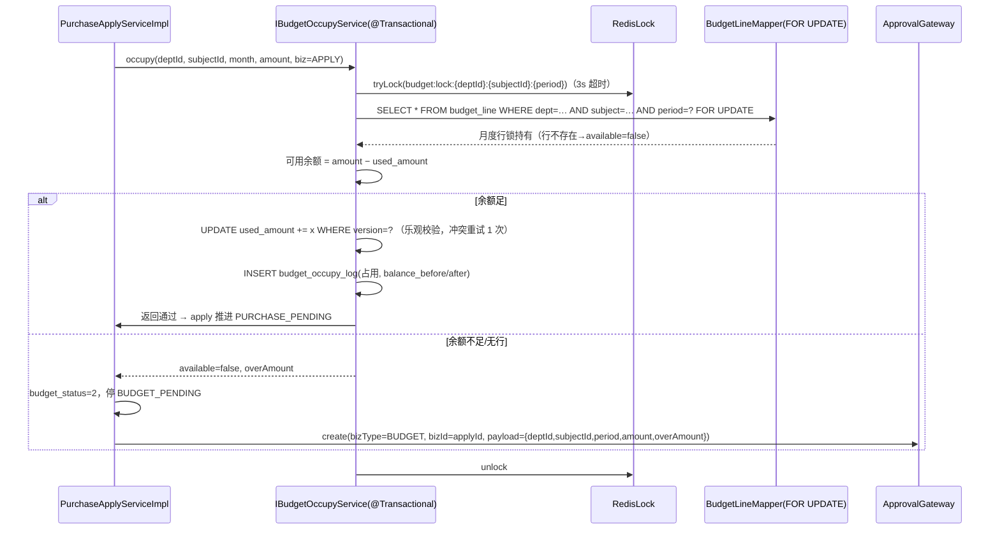
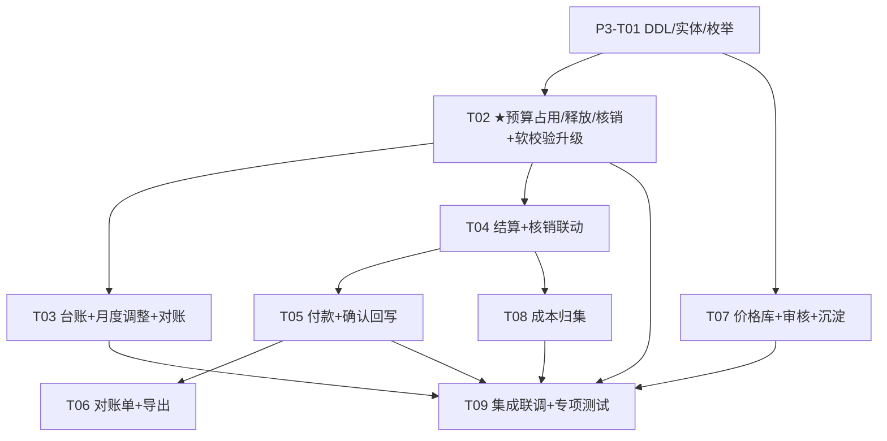

# P3 预算硬控制 + 结算付款 + 成本管理 · 系统设计（Design）

> 版本：v1.0（P3 阶段设计基线）
> 作者：架构师 高见远（Gao）
> 上游依据：`docs/P3预算结算规格设计.md`（v1.0，0acd4c3）、`docs/P2采购主链路设计.md`（§4 三重校验事务基线、§8 D3/D8 预留）、`docs/技术评审与架构设计.md`（架构 2.2 / 2.2-R2）、`docs/延期需求与占位登记.md`（D3/D8/D5）
> 范围：**只出设计，不含业务实现代码**；预算控制单元、事务方案为合规重点。
> ★ **Q1b 修正依据 PRD v1.1 §6.4.3**（wiki token `EIdSwfRRVi8oE0kwB7vcMtFVn1f`）："可用余额等于**月度**预算减去已占用金额"、PR-05"校验部门和**月份**可用预算"——**硬控制粒度 = 部门 × 预算科目 × 月份**（控制单元即 `budget_line` 月度行 `period=1–12`），**推翻规格 §8-Q1b 的"年度"建议**；项目维度按 PRD 争议项表仅作业务归属/统计。

---

## 0. 结论先行

- **清 D3（预算硬控）**：`IBudgetSoftCheckService` **契约不变、实现升级**为"校验+占用+拦截+升级审批"；新增 `budget_occupy_log` 流水表（对账唯一依据），`budget_line.used_amount` 开始真实写入。**占用时点 = 申请提交即预占用**（Q1）；超预算 → `budget_status=2` 停 `BUDGET_PENDING` → bizType=`BUDGET` 升级审批（通过=超支占用生效、驳回=回草稿不占用）。
- **硬控粒度（Q1b 定稿）**：部门 × 科目 × **月份**——校验/占用/释放/核销均落在提交当月的 `budget_line` 月度行；**月度行不存在 = 无预算 = 拦截**（走升级审批）；年度行（`period=0`）与月度台账仅展示汇总。月度调整照旧且受 `amount ≥ used_amount` 约束。
- **清 D8（结算付款）**：结算（物料按 `arrival_item.qty_stored`、服务按 `service_assess.deduct_amount` 扣款、阶段/尾款按 `phase_plan`）驱动订单 `SETTLED`；付款线下执行、财务**手动登记确认+凭证**回写 `PAID`（Q3）；对账单为系统内口径。
- **成本管理**：`price_history` 价格库（事后成交价沉淀，与 P1 `price_rule` 事前限价**两套分工不合一**，Q5）；成本按部门×科目×月份聚合查询（归属=申请部门，不摊，Q6）。
- **审批**：新增 3 个 bizType（`BUDGET / SETTLEMENT / PAYMENT`），复用 `ApprovalGateway` 本地桩即审即过；至此系统共 7 个 bizType，契约冻结待 P4 替换。
- **事务基线（★合规重点）**：完全复用 P2 §4 模式——行锁 `budget_line FOR UPDATE` + Redis 锁（粒度细化到月：`budget:lock:{deptId}:{subjectId}:{period}`）+ `version` 乐观兜底 + **每日对账任务 `Σlog(占用−释放) == used_amount`**。
- **契约提示**：本阶段所有新枚举遵循 #33 裁决的 **name 字符串 API 契约**（不加 `@JsonValue`）。

---

## 1. 实体设计（DDL 级）

### 1.1 公共约定（沿用 P1/P2）

`BaseEntity` 审计列（`id/created_by/created_at/updated_by/updated_at/deleted`）；逻辑外键；唯一索引带 `deleted`；金额 `DECIMAL(18,2)`、数量 `DECIMAL(18,4)`。

### 1.2 新建实体 DDL（2 个）

#### 1.2.1 `budget_occupy_log` — 预算占用/释放/核销流水（对账唯一依据）

```sql
CREATE TABLE `budget_occupy_log` (
  `id`              BIGINT        NOT NULL,
  `budget_line_id`  BIGINT        NOT NULL                COMMENT '预算明细行ID（控制单元：部门×科目×月）',
  `biz_type`        TINYINT       NOT NULL                COMMENT '1=APPLY 2=AWARD 3=ORDER 4=SETTLEMENT 5=ADJUST',
  `biz_id`          BIGINT        NOT NULL                COMMENT '业务单据ID（申请/定标/订单/结算/调整）',
  `action`          TINYINT       NOT NULL                COMMENT '0=占用 1=释放 2=核销 3=调整',
  `amount`          DECIMAL(18,2) NOT NULL                COMMENT '本笔发生额（带方向：占用/调增为正，释放/调减为负；核销为正且 used_amount 不变=构成转移）',
  `balance_before`  DECIMAL(18,2) NOT NULL                COMMENT '动作前 used_amount 快照',
  `balance_after`   DECIMAL(18,2) NOT NULL                COMMENT '动作后 used_amount 快照（核销时前后相等）',
  `operator`        BIGINT        NULL                    COMMENT '操作人（系统动作为 NULL）',
  `remark`          VARCHAR(512)  NULL,
  `created_by` BIGINT NULL, `created_at` DATETIME NULL,
  `updated_by` BIGINT NULL, `updated_at` DATETIME NULL,
  `deleted`    INT    NOT NULL DEFAULT 0,
  PRIMARY KEY (`id`),
  KEY `idx_line` (`budget_line_id`, `created_at`),
  KEY `idx_biz` (`biz_type`, `biz_id`),
  KEY `idx_action` (`action`)
) ENGINE=InnoDB DEFAULT CHARSET=utf8mb4 COLLATE=utf8mb4_0900_ai_ci COMMENT='预算占用/释放/核销流水（每日对账依据）';
```
> **口径**：`used_amount = Σ(action=占用) − Σ(action=释放)`；`核销额 = Σ(action=核销)`（仅构成转移）；对账任务即校验此恒等式。

#### 1.2.2 `price_history` — 价格库（事后成交价沉淀）

```sql
CREATE TABLE `price_history` (
  `id`             BIGINT        NOT NULL,
  `sku_id`         BIGINT        NOT NULL                COMMENT 'SKU',
  `supplier_id`    BIGINT        NULL                    COMMENT '供应商（手工/品类级价可空）',
  `price`          DECIMAL(18,2) NOT NULL                COMMENT '单价（基本单位口径）',
  `source`         TINYINT       NOT NULL                COMMENT '0=报价 1=定标 2=订单 3=手工（PriceSource）',
  `biz_type`       VARCHAR(32)   NULL                    COMMENT '来源单据类型（QUOTATION/AWARD/ORDER）',
  `biz_id`         BIGINT        NULL                    COMMENT '来源单据ID',
  `effective_date` DATE          NOT NULL                COMMENT '生效日期（默认来源单据日期）',
  `audit_status`   TINYINT       NOT NULL DEFAULT 0      COMMENT '0=待审 1=通过 2=驳回（PriceAuditStatus）',
  `audit_by`       BIGINT        NULL,
  `audit_at`       DATETIME      NULL,
  `remark`         VARCHAR(512)  NULL,
  `created_by` BIGINT NULL, `created_at` DATETIME NULL,
  `updated_by` BIGINT NULL, `updated_at` DATETIME NULL,
  `deleted`    INT    NOT NULL DEFAULT 0,
  PRIMARY KEY (`id`),
  KEY `idx_sku_supplier` (`sku_id`, `supplier_id`, `effective_date`),
  KEY `idx_audit` (`audit_status`),
  KEY `idx_biz` (`biz_type`, `biz_id`)
) ENGINE=InnoDB DEFAULT CHARSET=utf8mb4 COLLATE=utf8mb4_0900_ai_ci COMMENT='价格库（成交价沉淀；与 price_rule 事前限价两套分工，Q5）';
```
> 沉淀埋点（自动写入 `audit_status=1` 的通过价）：报价采纳（`QuotationService.accept`）、定标审批通过（`AwardService.onApprovalCallback`）、订单生成（`OrderService.createOrder`）；异常价（超 `price_rule` 限价或低于历史均价 20%）写 `audit_status=0` 待审。P2 比价"历史比价"取数切换/兜底为本表。

### 1.3 已有实体 ALTER（3 个）

#### 1.3.1 `settlement`（+8）

```sql
ALTER TABLE `settlement`
  ADD COLUMN `settle_no`        VARCHAR(32)   NULL COMMENT '结算单号 JS-{yyyy}{MM}-{seq6}（全局唯一）' AFTER `order_id`,
  ADD COLUMN `settled_qty_base` DECIMAL(18,4) NULL COMMENT '本次结算数量（基本单位累计口径）' AFTER `settle_no`,
  ADD COLUMN `deduct_amount`    DECIMAL(18,2) NOT NULL DEFAULT 0 COMMENT '服务考核扣款合计（物料=0；取数 service_assess）' AFTER `settled_qty_base`,
  ADD COLUMN `contract_id`      BIGINT        NULL COMMENT '追溯合同（nullable，展示比对用）' AFTER `deduct_amount`,
  ADD COLUMN `settle_mode`      TINYINT       NOT NULL DEFAULT 0 COMMENT '0=一次性 1=阶段 2=尾款（SettleMode）' AFTER `contract_id`,
  ADD COLUMN `phase_no`         INT           NULL COMMENT '阶段号（settle_mode=1 时必填）' AFTER `settle_mode`,
  ADD COLUMN `phase_ratio`      DECIMAL(5,2)  NULL COMMENT '阶段比例%（Σ=100 校验）' AFTER `phase_no`,
  ADD COLUMN `is_final`         TINYINT       NOT NULL DEFAULT 0 COMMENT '是否尾款结清：0/1' AFTER `phase_ratio`,
  ADD UNIQUE KEY `uk_settle_no` (`settle_no`, `deleted`);
```

#### 1.3.2 `payment`（+6）

```sql
ALTER TABLE `payment`
  ADD COLUMN `pay_no`        VARCHAR(32) NULL COMMENT '付款单号 FK-{yyyy}{MM}-{seq6}（全局唯一）' AFTER `settlement_id`,
  ADD COLUMN `pay_date`      DATE        NULL COMMENT '付款日期（登记确认时填）' AFTER `pay_no`,
  ADD COLUMN `reviewed_by`   BIGINT      NULL COMMENT '财务审核人（PAYMENT 审批回调落）' AFTER `pay_date`,
  ADD COLUMN `reviewed_at`   DATETIME    NULL COMMENT '财务审核时间' AFTER `reviewed_by`,
  ADD COLUMN `confirmed_by`  BIGINT      NULL COMMENT '线下付款登记确认人' AFTER `reviewed_at`,
  ADD COLUMN `confirmed_at`  DATETIME    NULL COMMENT '登记确认时间' AFTER `confirmed_by`,
  ADD UNIQUE KEY `uk_pay_no` (`pay_no`, `deleted`);
```

#### 1.3.3 `purchase_order`（+1）

```sql
ALTER TABLE `purchase_order`
  ADD COLUMN `phase_plan` TEXT NULL COMMENT '阶段结算比例 JSON（如 [{"phase":1,"ratio":30},{"phase":2,"ratio":40},{"phase":3,"ratio":30}]；null=一次性）' AFTER `order_type`;
```

### 1.4 P3 新增枚举（遵循 #33 name 契约，不加 `@JsonValue`）

| 枚举 | 值域 | 归属 |
|---|---|---|
| `BudgetAction` | 0=占用 / 1=释放 / 2=核销 / 3=调整 | `budget_occupy_log.action` |
| `BudgetBizType` | 1=APPLY / 2=AWARD / 3=ORDER / 4=SETTLEMENT / 5=ADJUST | `budget_occupy_log.biz_type` |
| `SettleMode` | 0=一次性 / 1=阶段 / 2=尾款 | `settlement.settle_mode` |
| `PriceSource` | 0=报价 / 1=定标 / 2=订单 / 3=手工 | `price_history.source` |
| `PriceAuditStatus` | 0=待审 / 1=通过 / 2=驳回 | `price_history.audit_status` |

> 复用：`SettlementStatus`（PENDING/SETTLED/PARTIAL，不加驳回态——见 §2.1 说明）、`SettlementType`（物料/服务）、`PaymentStatus`（UNPAID/PAID/REJECTED）、`OrderStatus`（SETTLED/PAID 启用）、`BudgetHeaderStatus`。

---

## 2. 分层契约与状态机

### 2.1 结算（settlement）

**Mapper**：`SettlementMapper`（+ `selectByOrder(orderId)`、`sumSettledAmount(orderId)`、`sumSettledQty(orderItemId)`）；`ArrivalItemMapper` 复用（读 `qty_stored`）；`ServiceAssessMapper`（读 `deduct_amount`）。

**Service**：
```java
interface ISettlementService extends IService<Settlement> {
    SettlementDraftVO draftFromOrder(Long orderId);        // 带出：订单/明细价、已入库量、可结余量、服务扣款、合同累计结算
    SettlementDraftVO draftFromArrival(Long arrivalId);    // 到货单入口优先：按 arrival_item.qty_stored 汇总
    Long createSettlement(SettlementSaveReqVO req);        // 校验：订单 RECEIVED/PARTIAL_RECEIVED 或到货 STORED/PARTIAL_STORED；
                                                           // 结算数量≤已入库合格累计；重复结算拦截；阶段比例 Σ=100；尾款校验"累计+本次=应结总额"
    void submit(Long id);                                  // 发起 ApprovalGateway(bizType=SETTLEMENT)
    void onApprovalCallback(Long taskId, boolean approved, String comment);
                                                           // 通过→SETTLED + 触发预算核销(IBudgetOccupyService.writeOff) + 订单全部结清→SETTLED；
                                                           // 驳回→保持 PENDING（留痕审批记录，可修改重提）
    IPage<SettlementPageRespVO> page(SettlementPageReqVO req);
}
```
**状态机**（`SettlementStatus`，订单维度视图）：

| 流转 | 触发 | 事件 |
|---|---|---|
| （创建）→ PENDING | `createSettlement` | 结算数量/金额校验；一订单可多批次 |
| PENDING → SETTLED | `SETTLEMENT` 审批通过 | **触发核销**（占用→核销，`used_amount` 不变）；订单全部结清→`SETTLED` |
| PENDING →（驳回留痕）→ PENDING | 审批驳回 | 修改重提（不动枚举值；`approval_task` 留痕，P4 如需显式 REJECTED 态再扩展） |

> 部分结算：订单维度 `PARTIAL` 由"已结金额 < 订单应结总额"派生展示，单据级保持 PENDING→SETTLED（规格口径）。

### 2.2 付款（settlement/payment）

**Mapper**：`PaymentMapper`（+ `selectBySettlement(settlementId)`、`sumPaidAmount(settlementId)`）。

**Service**：
```java
interface IPaymentService extends IService<Payment> {
    Long createPayment(PaymentSaveReqVO req);              // 仅结算单 SETTLED 可发起；累计付款 ≤ 结算金额；生成 pay_no
    void submit(Long id);                                  // 发起 ApprovalGateway(bizType=PAYMENT，财务审核)
    void onApprovalCallback(Long taskId, boolean approved, String comment);
                                                           // 通过→UNPAID(待付款确认)+reviewed_by/at；驳回→REJECTED（可修改重提）
    void confirmPayment(Long id, String voucherFile, LocalDate payDate); // 财务手动登记确认：置 PAID+confirmed_by/at；
                                                           // 回写结算单已付累计；结算单全部付清→订单 PAID
    IPage<PaymentPageRespVO> page(PaymentPageReqVO req);
    StatementVO statement(Long supplierId, LocalDate from, LocalDate to); // 对账单：应付=Σ结算、已付=Σ付款、差额+明细清单（导出 Excel）
}
```
**状态机**（`PaymentStatus`）：

| 流转 | 触发 | 事件 |
|---|---|---|
| （创建）→ UNPAID | `createPayment` | 待财务审核（`reviewed_at` 为空区分阶段） |
| UNPAID → UNPAID（待确认） | `PAYMENT` 审批通过 | `reviewed_by/at` 落 |
| UNPAID → REJECTED | 审批驳回 | 修改重提 |
| UNPAID（待确认） → PAID | `confirmPayment`（线下付款后登记） | 凭证+`pay_date`；结算/订单回写 |

> 预算动作：付款登记确认**无预算动作**（核销已在结算完成，规格 §5 行 12）。

### 2.3 预算控制（budget）——占用生命周期与 `budget_line` 联动

**接口升级（契约不变）+ 新增动作接口**：
```java
/** 原软校验接口：方法契约不变（P2 入口零改动），实现内部升级为月度硬控读数 */
interface IBudgetSoftCheckService {
    BudgetCheckResultVO check(Long deptId, Integer year, Long subjectId, BigDecimal amount);
    // <!-- D3: 已落地硬控读数 -->：按"提交当月"取 budget_line 月度行（period=1–12），
    // 可用余额 = 该行 amount − used_amount；行不存在 = 无预算（available=false）；
    // 年度行(period=0) 仅台账汇总展示（Q1b 依据 PRD §6.4.3）
}

/** 新增：占用/释放/核销/转移/调整（唯一写 used_amount 与 log 的入口） */
interface IBudgetOccupyService {
    OccupyResultVO occupy(BudgetOccupyCmd cmd);            // 校验+占用+写 log（同事务，见 §3）；占用月份 = expected_date 所在月（属当前年）否则提交当月
    void release(BudgetOccupyCmd cmd);                     // 释放（≤该 biz 累计占用余额，不足按余额释放并告警）
    void writeOff(BudgetOccupyCmd cmd);                    // 核销：占用→核销，used_amount 不变，log balance 前后相等
    void transfer(BudgetTransferCmd cmd);                  // 占用主体转移（申请→订单，amount 不变，log biz_type=ORDER）
    void adjustAmount(Long budgetLineId, BigDecimal newAmount, String reason); // 调增直生效；调减校验 amount≥used_amount；超阈值(默认20%)走 BUDGET 审批；log action=3
}
```
**占用生命周期**（对照规格 §5 的 14 行规则，逐条落代码路径）：

| # | 触发事件 | 代码路径 | 预算动作 | `used_amount` | 业务状态联动 |
|---|---|---|---|---|---|
| 1 | 申请提交（余额足） | `PurchaseApplyServiceImpl.submit` → `occupy` | 占用 + | 增加 | `DRAFT→BUDGET_PENDING→PURCHASE_PENDING` |
| 2 | 申请提交（余额不足/无月度行） | `submit` → `occupy` 拦截分支 | 0（暂不占用） | 不变 | `budget_status=2`，停 `BUDGET_PENDING`，bizType=`BUDGET` 升级审批 |
| 3 | 超预算审批通过 | `BudgetApprovalHandler.onApprovalCallback(BUDGET, APPROVED)` | 占用（超支）+ | 增加 | `BUDGET_PENDING→PURCHASE_PENDING` |
| 4 | 超预算审批驳回 | 同上（REJECTED） | 0（回草稿） | 不变 | `BUDGET_PENDING→REJECTED→DRAFT`（修改重提再校验） |
| 5 | 申请驳回 / 作废 | `apply.onApprovalCallback(REJECTED)` / `closeApply(void)` | 释放 − | 减少 | 按该申请累计占用余额释放 |
| 6 | 订单生成 | `OrderServiceImpl.createOrder` | **转移**（申请→订单） | 0（不变） | 申请→`PARTIAL_ORDER/FULL_ORDER`；订单 `CREATED` |
| 7 | 订单变更（减量） | `changeOrder`（变更生效） | 释放差额 − | 减少 | `order_change` 生效 |
| 8 | 订单变更（增量） | `changeOrder` | 校验+占用差额 + | 增加 | 不足→拦截（同行 2 逻辑，走 BUDGET 审批） |
| 9 | 订单取消 | `cancelOrder` | 释放 − | 减少 | `→CANCELLED`（同时回冲合同额度，P2 §4） |
| 10 | 申请关闭（FULL_ORDER/作废） | `closeApply` | 释放未转单余量 − | 减少 | 防假占用 |
| 11 | 结算审批通过 | `SettlementServiceImpl.onApprovalCallback` | **核销**（占用→核销） | 0（不变） | 订单全部结清→`SETTLED` |
| 12 | 付款登记确认 | `confirmPayment` | 无 | 不变 | 订单 `→PAID` |
| 13 | 月度调整 | `adjustAmount` | 调整（改 amount） | 不变 | 调减校验 `amount≥used_amount`；超 20% 走 `BUDGET` 审批（Q4） |
| 14 | 每日对账任务 | `DailyBudgetReconcileTask.run`（@Scheduled） | 校准 | — | `Σlog(占用−释放) ≠ used_amount` → 告警（对齐架构 2.2-R2） |

---

## 3. ★ 预算占用/释放/核销事务方案（合规重点，复用 P2 §4 基线）



**要点与取舍**（对齐架构 2.2 与 P2 §4）：
1. **三重保障**：`budget_line` 行锁 `FOR UPDATE`（主）+ Redis 锁（多实例防穿透）+ `version` 乐观兜底（UPDATE 带 `WHERE version=?`，冲突重试 1 次）。
2. **锁粒度细化到月**：Redis 锁键 `budget:lock:{deptId}:{subjectId}:{period}`（P2 基线 `{deptId}:{subjectId}` 基础上加 period），不同月互不阻塞。
3. **锁顺序固定**：同事务内若涉及多行（多科目明细），按 `budget_line.id` 升序逐行加锁，防交叉死锁。
4. **同事务原子性**：校验、`used_amount` 更新、`budget_occupy_log` 写入、业务状态变更**同一 DB 事务**；审批经 `ApprovalGateway` 在事务边界外发起（create 幂等）。
5. **每日对账**：`DailyBudgetReconcileTask` 按 `budget_line_id` 校验 `Σlog(占用−释放) == used_amount` 与 `balance_after 链式连续`；不一致→告警 + 人工校准工具（以 log 链重放修正 `used_amount`，修正动作亦写 log action=3）。
6. **超支占用**：仅 `BUDGET` 审批通过后执行（"先占后审"禁止）；`used_amount` 允许 > `amount`（超支），台账执行率 >100% 标红展示。

---

## 4. ApprovalGateway 接入契约（新增 3 个 bizType）

| bizType | create 时机 | ApprovalTaskSpec 构造 | 回调映射（APPROVED / REJECTED） | 级别 |
|---|---|---|---|---|
| `BUDGET` | `occupy` 拦截分支 / `adjustAmount` 超阈值 | `bizType=BUDGET, bizId=applyId（调整时=adjLineId+`ADJUST`标记入 payload）, title="预算升级-{applyNo}", payloadJson={deptId,subjectId,period,amount,overAmount,adjust?}` | 通过→**超支占用生效**+`→PURCHASE_PENDING`（调整：amount 生效）；驳回→`→REJECTED→DRAFT`（不占用）/调整不变 | 一级（预算管理员） |
| `SETTLEMENT` | `settlement.submit()` | `bizType=SETTLEMENT, bizId=settlementId, title="结算-{settleNo}", payloadJson={orderId,type,amount,deductAmount,phaseNo?}` | 通过→`SETTLED`+**核销**+订单收口；驳回→保持 PENDING 可重提 | 一级（采购负责人，Q9） |
| `PAYMENT` | `payment.submit()` | `bizType=PAYMENT, bizId=paymentId, title="付款-{payNo}", payloadJson={settlementId,payAmount,payMethod}` | 通过→待付款确认（reviewed_by/at）；驳回→REJECTED 可重提 | 一级（财务，Q9） |

> 幂等/重提契约沿用 P2 §3（任务状态一次性流转、同 bizId 重提=新任务、取最新）；本地桩即审即过，P4 换实现业务无感。至此 7 个 bizType 契约冻结。

---

## 5. API 端点清单（权限键按规格 §6-8 新增）

| 组 | 方法 | 路径 | 权限键 |
|---|---|---|---|
| 预算台账 | GET | `/api/v1/budgets/execution`（部门×科目×月：预算/占用/核销/可用/执行率）、`/api/v1/budgets/occupy-logs` | `budget:read` |
| 月度调整 | POST | `/api/v1/budgets/lines/{id}/adjust` | `budget:adjust` |
| 超预算/调整审批 | GET/POST | `/api/v1/approvals/tasks?bizType=BUDGET`、`/{taskId}/approve`、`/{taskId}/reject` | `budget:audit` / `approval:approve` |
| 结算 | GET/POST | `/api/v1/settlements`（`/page`、`/{id}`）、`/draft/from-order/{orderId}`、`/draft/from-arrival/{arrivalId}`、`/{id}/submit` | `settlement:read` / `settlement:write` |
| 付款 | GET/POST | `/api/v1/payments`（`/page`、`/{id}`）、`/{id}/submit`、`/{id}/confirm` | `payment:read` / `payment:write` / `payment:confirm` |
| 对账单 | GET | `/api/v1/payments/statement?supplierId=&from=&to=`（导出 Excel） | `payment:read` |
| 价格审核 | GET/POST | `/api/v1/cost/price-histories`（`/page`）、`/{id}/audit`、`/manual` | `cost:price:audit`（审核/补录）/ `cost:read` |
| 成本归集 | GET | `/api/v1/cost/summary?deptId=&year=&month=`（下钻订单明细） | `cost:read` |

> 全部列表/台账/对账单经 `DataPermissionInterceptor` 部门过滤；阶段一门禁沿用 `@authz.hasAnyPerm`，权限键为阶段二细化目标。

---

## 6. 任务分解（有序 · 含依赖 · 后端/前端归属）

> 顺序：DDL → 预算硬控 → 结算 → 付款 → 成本 → 联调。

| T | 任务 | 后端文件（示例） | 前端文件（示例） | 依赖 | 优先级 |
|---|---|---|---|---|---|
| **P3-T01** | DDL / 实体 / 枚举 | `scripts/sql/p3_schema.sql`（2 CREATE+3 ALTER）、`BudgetOccupyLog/PriceHistory` 实体+Mapper、`BudgetAction/BudgetBizType/SettleMode/PriceSource/PriceAuditStatus` | — | — | P0 |
| **P3-T02** | ★ 预算占用/释放/核销/转移 + 软校验升级 + BUDGET 审批 | `IBudgetOccupyService`+Impl（锁+log）、`BudgetSoftCheckServiceImpl` 内部升级（契约不变）、`PurchaseApplyServiceImpl.submit` 接入、`BudgetApprovalHandler`、`OrderServiceImpl` 转移/变更/取消接入 | `views/budget/BudgetExecution.vue`、超预算待审列表 | P3-T01 | P0 |
| **P3-T03** | 预算执行台账 + 月度调整 + 每日对账 | `BudgetExecutionQueryService`、`adjustAmount`、`DailyBudgetReconcileTask`、人工校准工具 | `views/budget/BudgetLedger.vue`（执行率/标红）、`MonthAdjust.vue` | P3-T02 | P0 |
| **P3-T04** | 结算（物料/服务/阶段尾款）+ SETTLEMENT 审批 + 核销联动 | `ISettlementService`+Impl、`SettlementController`、核销联动 `writeOff`、订单 `SETTLED` 收口、`phase_plan` 校验 | `views/settlement/SettleList.vue`、`SettleForm.vue`（双入口带出）、`PhasePlan.vue` | P3-T02 | P0 |
| **P3-T05** | 付款 + PAYMENT 审批 + 确认回写 | `IPaymentService`+Impl、`confirmPayment`、结算/订单回写 | `views/settlement/PayList.vue`、`PayConfirm.vue`（凭证上传） | P3-T04 | P0 |
| **P3-T06** | 对账单 + 付款台账导出 | `statement()` 聚合 + EasyExcel 导出 | `views/settlement/Statement.vue` | P3-T05 | P1 |
| **P3-T07** | 价格库 + 异常价审核 + 沉淀埋点 + 比价兜底切换 | `IPriceHistoryService`、沉淀埋点（quotation.accept / award 回调 / order 创建）、审核动作、P2 `comparison` 历史价取数切换 | `views/cost/PriceAudit.vue`、`PriceHistory.vue` | P3-T01 | P1 |
| **P3-T08** | 成本归集台账 | `CostSummaryQueryService`（部门×科目×月聚合，下钻订单） | `views/cost/CostSummary.vue` | P3-T04 | P1 |
| **P3-T09** | 集成联调 + 专项测试 | 全链路（本地桩）：占用→转移→核销→付款→PAID；QA 专项见 §9 | 前端联调 | P3-T02..T08 | P0 |

**依赖图**



---

## 7. 承接清单（P3 兑现 P2 口子）

| # | P2 预留口子 | P3 落地 |
|---|---|---|
| 1 | `IBudgetSoftCheckService.check()`（只读） | **契约不变、实现升级**为月度硬控读数；占用/释放/核销走新 `IBudgetOccupyService`（唯一写入口）；`<!-- D3 -->` 注释逐一清零 |
| 2 | `BUDGET_PENDING` 节点 + `budget_status`/`budget_occupied` | 激活真实语义：`BUDGET_PENDING`=超预算待升级审批（行 2）；`budget_occupied` 由快照升级为**真实占用金额**（下单转移后=本单占用） |
| 3 | 订单 `SETTLED / PAID` | 结算审批通过（全部结清）→`SETTLED`；结算单全部付清→`PAID`；期间维持 `RECEIVED` |
| 4 | `service_assess.deduct_amount` | 服务结算自动汇总（R-STL-02）；Q7 终口径=扣款金额在考核单落定 |
| 5 | `ApprovalGateway`（4 bizType） | 新增 `BUDGET/SETTLEMENT/PAYMENT` → 共 7 个 bizType 契约冻结（P4 无感） |
| 6 | 结算双入口 | `settlement.order_id/arrival_id` 已有，到货单入口优先带出 `qty_stored` |
| 7 | P2 比价"历史比价"实时计算 | 兜底/切换 `price_history`（口径：SKU+供应商+生效日期，仅取 `audit_status=1`） |
| 8 | 权限键 | 新增 `budget:occupy/budget:adjust/budget:audit`、`settlement:{read,write}`、`payment:{read,write,confirm}`、`cost:price:audit/cost:read` |

**单据编号**：`settle_no=JS-{yyyy}{MM}-{seq6}`、`pay_no=FK-{yyyy}{MM}-{seq6}`（沿用 P2 `IdGenerator` 机制，全局唯一索引带 deleted）。

---

## 8. 延后项登记（对照 `docs/延期需求与占位登记.md`）

| 台账项 | 本阶段处理 | 就地标注 |
|---|---|---|
| **D3 预算硬控制** | **本阶段清零**：占用/释放/核销/月度调整/超预算拦截+升级审批/每日对账全部落地（§2.3/§3）；收尾时台账状态更新为 ✔ | `IBudgetSoftCheckService` javadoc `<!-- D3 -->` 改"已落地 P3"；`purchase_apply.budget_occupied`、`BUDGET_PENDING` 语义激活 |
| **D8 结算/付款/成本** | **本阶段清零**（物料/服务/阶段/尾款结算、付款登记/对账单、价格库/成本归集）；**尾项"报表中心"维持真阻塞**（Q8，业务需求未提供，仅保证本阶段台账数据可支撑取数） | `OrderStatus.SETTLED/PAID` 启用注释；`service_assess.deduct_amount` 取数注释清零 |
| **D5 审批中心** | 维持 P4；本阶段新增 3 bizType（共 7 个），幂等/重提契约不变 | §4 表注 |
| **D1/D2（P2b 链路）/D4（P5）/D6（P6）/D7（P7）** | 本阶段不涉及，口子不变；付款不外发指令（P6 适配层） | — |
| **B 区占位（B1 演示胶囊、B2 综合评分，及台账增补的 B3/B4 等）** | **维持现状不处理**（按用户口径） | — |

> **收尾核对**：按台账铁律，P3 阶段收尾必须核对 A 区（D3 ✔、D8 ✔除报表尾项）与 B 区（维持）状态，并更新登记表。

---

## 9. 风险与待确认

**已定稿口径（主理人拍板，影响面备查）**：
- **Q1 占用时点=申请提交即预占用**（对齐架构 2.2）；若改"审批通过才占用"：`BUDGET_PENDING` 语义需重定义、存在审批窗口期超卖，影响 §2.3 行 1–4 与 T02——不建议改。
- **Q1b 粒度=部门×科目×月份（PRD §6.4.3 定稿，非年度）**；占用月份锚定 `expected_date` 所在月（否则提交当月）；若业务要求跨月分摊占用，需扩展 occupy 支持多行拆分（影响 T02）。
- **Q3 付款回写=线下付款+财务手动登记确认+凭证**；与财务系统对账属 P6。
- **Q5 `price_history` 与 `price_rule` 两套分工不合一**；如需合一须重定义 P1 契约，成本高。
- **Q7 服务考核扣款以 `service_assess` 落定为终口径**。
- **Q4 月度调整超 20% 走审批**（配置 `app.budget.adjust-threshold`）；**Q6 成本按申请部门归属不摊**；**Q9 结算一级/付款一级审批**。

**风险**：
1. **并发穿透**：占用/释放必须全部经 `IBudgetOccupyService` 单一入口（禁止其他 Service 直改 `used_amount`），QA 须覆盖"同部门同科目同月并发申请"不穿透用例。
2. **金额守恒**：`Σlog(占用−释放)==used_amount` 为硬不变式；对账任务 + 人工校准工具（校准亦写 log）兜底。
3. **跨月边界**：申请占用月与订单转移/结算核销必须同一条 `budget_line`（转移不改月），避免月度口径漂移。
4. **结算驳回态缺枚举**：以"保持 PENDING+审批留痕"过渡，P4 如需显式 REJECTED 再扩枚举（一处变更）。
5. **价格库口径一致性**：比价历史切换后需回归 P2 比价页（历史价来源从实时计算变为价格库，注意空库兜底回实时计算）。
6. **#33 枚举契约**：本阶段新枚举/新 VO 一律 name 契约，勿再引入 Integer 承载枚举或 `@JsonValue`。

---

## 10. 设计汇总

本设计交付 P3 三大块：**① 预算硬控制（清 D3）**——`IBudgetSoftCheckService` 契约不变、实现升级，新增 `budget_occupy_log` 流水表与 `IBudgetOccupyService` 唯一写入口，硬控粒度按 PRD §6.4.3 定稿为**部门×科目×月份**（Q1b），占用时点=申请提交即预占用（Q1），超预算拦截走 `BUDGET` 升级审批，释放/核销/转移/调整按规格 §5 的 14 行生命周期规则逐条落代码路径，事务方案完全复用 P2 §4 基线（行锁+Redis 锁细到月+version 兜底）并以**每日对账 `Σlog==used_amount`** 兜底；**② 结算付款（清 D8）**——`settlement`+8 字段（含阶段/尾款与 `phase_plan`）、`payment`+6 字段，结算双入口（订单/到货）、服务结算自动取 `service_assess` 扣款，`SETTLEMENT/PAYMENT` 两个新 bizType 驱动订单 `SETTLED/PAID` 真实流转，付款线下执行+财务手动登记确认（Q3），对账单系统内口径；**③ 成本管理**——`price_history` 价格库（与 `price_rule` 两套分工，Q5）+ 异常价审核独立权限 + 沉淀埋点与比价历史兜底切换 + 部门×科目×月成本聚合（Q6）。新增 3 个 bizType 后共 7 个契约冻结待 P4；延后项 D3/D8 本阶段清零（报表中心尾项维持真阻塞）、B 区维持；风险集中于并发穿透与金额守恒（单一写入口+对账+专项并发测试兜底）。下一步：工程师按 P3-T01→T09 实现（T01 DDL 先行，T02 预算硬控为合规核心），QA 重点覆盖并发占用、超预算审批闭环、全链路金额守恒与订单状态推进；收尾按 `延期需求与占位登记.md` 核对并更新 D3/D8 状态。
