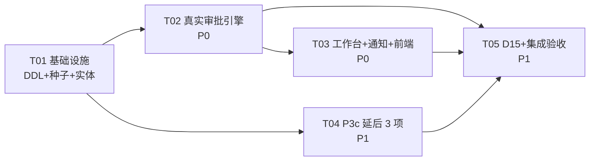

# P4 审批中心 · 系统设计（真实审批引擎 + 工作台 UI + P3c 延后 3 项 + D15）

> **产出**：架构师 高见远｜**规格输入**：`docs/P4审批中心规格设计.md`（commit `17b2ac6`，下称"规格"）＋ `docs/审批节点拍板清单.md`（commit `da24f62`，未拍板项按"我方建议"默认值做配置种子）
> **代码基线**：`develop` @ `da24f62`（实证于本设计撰写时工作区，引用行号均以该 commit 为准）
> **上游溯源**：PRD v1.1 §6.16（L1054–1070）、L89/L110/L211/L224/L1005/L1478/L1510；延期台账 D5/D13/D14/D15/D17；P2/P3 既有规格与设计
> **铁律（承接规格 §0，不可妥协）**：只换实现，不改契约——`ApprovalGateway`/`ApprovalTaskSpec`/`ApprovalDecision`/`ApprovalCallbackHandler` 签名、`ApprovalStatus` 状态机、8 个 bizType 枚举、回调幂等语义**零变更**；节点/审批人角色/金额阈值**全部表驱动配置化**（规格 §3.1 硬约束），业务拍板后只改配置数据不改代码；**在途任务按提交时配置走完**（拍板清单声明，本设计以"节点快照"机制落实，见 §2.9）。

---

## 0. 结论先行

| 块 | 口径 | 设计落点 | 优先级 |
|---|---|---|---|
| R1 真实引擎 | 表驱动节点流转 + 角色解析审批人 + 待办/意见/并发校验/审计/站内通知 | §1 DDL、§2 引擎、§3 通知 | P0 |
| R2 工作台 UI | 替换 `/approval` 占位：待办+已办+审批动作+来源单据跳转 | §4 | P0 |
| R3a 合同类型字典+补充签订 | 字典表+配置页；补充签订关联原合同；A1 免检判据回归确认点 | §5.1 | P1 |
| R3b 超收/计重 | 默认超收拒绝+可配置授权比例；计重合格量≤实到重量 | §5.2 | P1 |
| R3c 最低价同步开关 | 全局开关默认关；开启后同口径最低正数成交价写标准价 | §5.3 | P2 |
| R4 D15 供货范围 | 方案 A：有清单走 A1 硬拦截；无清单有定标校验 award_item SKU 集；皆无走白名单兜底 | §5.4 | P1 |

**开工顺序**：R1/R2 按拍板清单默认值即可开工（配置化兜底，规格 §0）；R3a–R3c/R4 与 R1/R2 无文件冲突可并行（见 §7 任务依赖图）。
**与规格/现状的偏差点**：共 5 处，全部显式登记于 §10 并附裁决建议，无默默偏离。

---

## 1. 实体设计（DDL 级）

### 1.1 公共约定（沿用架构基线 `docs/技术评审与架构设计.md`）

- 所有表含 BaseEntity 六列：`id BIGINT PK`（ASSIGN_ID 雪花）、`created_by/created_at/updated_by/updated_at/deleted`；
- 金额一律 `DECIMAL(18,2)`；状态枚举一律 `TINYINT` + Java 侧 `IEnum<Integer>`（`ApprovalStatus` 既有，**不动**）；
- 双份 DDL 惯例（P2/P3 模式）：`backend/src/main/resources/db/schema.sql`（新建库自动初始化，`CREATE TABLE IF NOT EXISTS` / `ADD COLUMN` 报 1060 可忽略）+ `scripts/sql/p4_migration.sql`（存量库幂等迁移）。

### 1.2 新建表（5 个）

#### 1.2.1 `approval_flow_def` — 审批流定义（规格 §3.1 ★硬约束）

```sql
CREATE TABLE IF NOT EXISTS approval_flow_def (
    id           BIGINT       NOT NULL PRIMARY KEY,
    flow_key     VARCHAR(50)  NOT NULL COMMENT '流程键（=biz_type，8 个：PURCHASE_APPLY/AWARD/CONTRACT/FULFILLMENT_ADJUST/BUDGET/SETTLEMENT/SUPPLIER_QUAL/DAILY_AUTH）',
    biz_type     VARCHAR(50)  NOT NULL COMMENT '业务类型（与 flow_key 同值，显式冗余便于查询）',
    flow_version INT          NOT NULL DEFAULT 1 COMMENT '流程版本（每次配置变更 +1；任务创建时快照落 approval_task.flow_version，仅审计对账用，运行期读节点快照）',
    flow_name    VARCHAR(100) NULL COMMENT '流程名称',
    enabled      TINYINT      NOT NULL DEFAULT 1 COMMENT '1=启用 0=停用（停用后该 bizType 新任务拒绝创建，在途不受影响）',
    remark       VARCHAR(255) NULL,
    created_by   BIGINT       NULL,
    created_at   DATETIME     DEFAULT CURRENT_TIMESTAMP,
    updated_by   BIGINT       NULL,
    updated_at   DATETIME     DEFAULT CURRENT_TIMESTAMP ON UPDATE CURRENT_TIMESTAMP,
    deleted      TINYINT      NOT NULL DEFAULT 0,
    UNIQUE KEY uk_flow_key (flow_key, deleted)
) ENGINE=InnoDB DEFAULT CHARSET=utf8mb4 COLLATE=utf8mb4_0900_ai_ci COMMENT='审批流定义（表驱动硬约束，规格 §3.1）';
```

> **溯源标注**：`flow_version` 为规格 §3.1 DDL 未列、主理人任务书明确要求之列——采纳（偏差④，§10）。

#### 1.2.2 `approval_node_def` — 审批节点定义（节点序/角色/金额区间/签类型/超时免审规则位）

```sql
CREATE TABLE IF NOT EXISTS approval_node_def (
    id            BIGINT        NOT NULL PRIMARY KEY,
    flow_key      VARCHAR(50)   NOT NULL COMMENT '所属流程（引用 approval_flow_def.flow_key）',
    node_code     VARCHAR(50)   NOT NULL COMMENT '节点编码（任务内唯一，如 N1/N2）',
    node_name     VARCHAR(100)  NULL COMMENT '节点名称（工作台展示）',
    seq           INT           NOT NULL COMMENT '节点序（1 起，按 seq 升序流转）',
    approver_type VARCHAR(30)   NOT NULL COMMENT '审批人解析类型：ROLE / DEPT_HEAD_OF_APPLICANT / USER',
    approver_value VARCHAR(200) NULL COMMENT 'ROLE=角色编码（sys_role.role_code）；DEPT_HEAD_OF_APPLICANT=置 NULL；USER=用户名（兜底慎用）',
    amount_min    DECIMAL(18,2) NULL COMMENT '节点生效金额区间下界（含）；NULL=无下界',
    amount_max    DECIMAL(18,2) NULL COMMENT '节点生效金额区间上界（不含）；NULL=无上界；双 NULL=恒生效',
    sign_type     VARCHAR(10)   NOT NULL DEFAULT 'ANY' COMMENT 'ANY=或签（默认）/ ALL=会签（预留，Q13 未拍板不启用）',
    timeout_hours INT           NULL COMMENT '超时升级时限（**预留位不实现**，超时升级列 v1.x，规格 §1.2 Out of Scope）',
    free_review   TINYINT       NOT NULL DEFAULT 0 COMMENT '免审规则位（**预留位**：0=必审；本期全部必审，Q7 履约调整一律审批口径固化于种子）',
    enabled       TINYINT       NOT NULL DEFAULT 1,
    remark        VARCHAR(255)  NULL,
    created_by    BIGINT        NULL,
    created_at    DATETIME      DEFAULT CURRENT_TIMESTAMP,
    updated_by    BIGINT        NULL,
    updated_at    DATETIME      DEFAULT CURRENT_TIMESTAMP ON UPDATE CURRENT_TIMESTAMP,
    deleted       TINYINT       NOT NULL DEFAULT 0,
    UNIQUE KEY uk_flow_node (flow_key, node_code, deleted)
) ENGINE=InnoDB DEFAULT CHARSET=utf8mb4 COLLATE=utf8mb4_0900_ai_ci COMMENT='审批节点定义（节点/角色/金额区间全配置化）';
```

**金额区间语义（文档化，引擎实现据此）**：任务创建时按 `payloadJson.amount`（无金额的 bizType 视为 NULL）取节点集——命中条件 `(amount_min IS NULL OR amount >= amount_min) AND (amount_max IS NULL OR amount < amount_max)`，命中节点按 `seq` 升序构成该任务的节点链。由此 CONTRACT"金额>50 万升两级"表达为：N1 恒生效（双 NULL）+ N2 区间 `[500000, ∞)`。

#### 1.2.3 `user_notice` — 站内通知（规格 §3.6 裁量：站内最小集）

```sql
CREATE TABLE IF NOT EXISTS user_notice (
    id         BIGINT       NOT NULL PRIMARY KEY,
    user_id    BIGINT       NOT NULL COMMENT '接收人（sys_user.id）',
    title      VARCHAR(200) NOT NULL COMMENT '通知标题',
    content    VARCHAR(1000) NULL COMMENT '正文（终态通知含意见摘要，截断 500 字）',
    biz_type   VARCHAR(50)  NULL COMMENT '关联业务类型（审批通知=bizType）',
    biz_id     BIGINT       NULL COMMENT '关联业务单据/任务 id（taskId）',
    channel    VARCHAR(20)  NOT NULL DEFAULT 'site' COMMENT '渠道：site=站内（**预留**：sms/wecom/dingtalk 列 v1.x，PRD L1007/L224）',
    read_flag  TINYINT      NOT NULL DEFAULT 0 COMMENT '0=未读 1=已读（红点角标数据源）',
    created_by BIGINT       NULL,
    created_at DATETIME     DEFAULT CURRENT_TIMESTAMP,
    updated_by BIGINT       NULL,
    updated_at DATETIME     DEFAULT CURRENT_TIMESTAMP ON UPDATE CURRENT_TIMESTAMP,
    deleted    TINYINT      NOT NULL DEFAULT 0,
    KEY idx_user_read (user_id, read_flag, deleted)
) ENGINE=InnoDB DEFAULT CHARSET=utf8mb4 COLLATE=utf8mb4_0900_ai_ci COMMENT='站内通知（审批待办/终态通知；外部渠道 Adapter 口子见 §3.4）';
```

#### 1.2.4 `contract_type` — 合同类型字典（R3a，规格 §5.1 / PRD L840）

```sql
CREATE TABLE IF NOT EXISTS contract_type (
    id         BIGINT       NOT NULL PRIMARY KEY,
    type_code  VARCHAR(50)  NOT NULL COMMENT '类型编码',
    type_name  VARCHAR(100) NOT NULL COMMENT '类型名称',
    enabled    TINYINT      NOT NULL DEFAULT 1 COMMENT '1=启用 0=停用（停用后新建合同不可选，存量不受影响）',
    remark     VARCHAR(255) NULL,
    created_by BIGINT       NULL,
    created_at DATETIME     DEFAULT CURRENT_TIMESTAMP,
    updated_by BIGINT       NULL,
    updated_at DATETIME     DEFAULT CURRENT_TIMESTAMP ON UPDATE CURRENT_TIMESTAMP,
    deleted    TINYINT      NOT NULL DEFAULT 0,
    UNIQUE KEY uk_type_code (type_code, deleted)
) ENGINE=InnoDB DEFAULT CHARSET=utf8mb4 COLLATE=utf8mb4_0900_ai_ci COMMENT='合同类型字典（被引用不可删，PRD L840）';
```

#### 1.2.5 `contract_sku_whitelist` — 合同 SKU 白名单（D15 方案 A 兜底，规格 §6）

```sql
CREATE TABLE IF NOT EXISTS contract_sku_whitelist (
    id         BIGINT       NOT NULL PRIMARY KEY,
    contract_id BIGINT      NOT NULL COMMENT '合同 id（无清单且无定标合同的兜底供货范围）',
    sku_id     BIGINT       NOT NULL COMMENT '允许下单的 SKU',
    remark     VARCHAR(255) NULL COMMENT '维护原因（审计）',
    created_by BIGINT       NULL,
    created_at DATETIME     DEFAULT CURRENT_TIMESTAMP,
    updated_by BIGINT       NULL,
    updated_at DATETIME     DEFAULT CURRENT_TIMESTAMP ON UPDATE CURRENT_TIMESTAMP,
    deleted    TINYINT      NOT NULL DEFAULT 0,
    UNIQUE KEY uk_contract_sku (contract_id, sku_id, deleted)
) ENGINE=InnoDB DEFAULT CHARSET=utf8mb4 COLLATE=utf8mb4_0900_ai_ci COMMENT='合同 SKU 白名单（D15 方案 A：无清单无定标合同兜底，空=维持现网额度闸行为）';
```

### 1.3 已有表 ALTER（4 个）

#### 1.3.1 `approval_task`（+4：缺口①③④⑤收敛）

```sql
ALTER TABLE `approval_task`
  ADD COLUMN `applicant`     VARCHAR(64)    NULL COMMENT '申请人用户名快照（ApprovalTaskSpec.applicant 落库，缺口④；展示用，通知投递用 applicant_id）' AFTER `flow_key`,
  ADD COLUMN `applicant_id`  BIGINT         NULL COMMENT '申请人用户 id（通知/重提归属，缺口④）' AFTER `applicant`,
  ADD COLUMN `amount`        DECIMAL(18,2)  NULL COMMENT '金额摘要（创建时从 payloadJson.amount 提取冗余，工作台列表展示+节点金额区间匹配）' AFTER `applicant_id`,
  ADD COLUMN `flow_version`  INT            NOT NULL DEFAULT 1 COMMENT '提交时流程版本快照（在途任务按提交时配置走完，拍板清单声明）' AFTER `amount`,
  ADD COLUMN `version`       INT            NOT NULL DEFAULT 0 COMMENT '乐观锁版本（并发防重审，规格 §3.4；BaseEntity 无 version，任务实体独立加列，与 contract.version 同模式）' AFTER `flow_version`;
```

> `title` 沿用现状落 `remark` 列（`LocalApprovalGateway.java:66` 既有行为），不新增列——减少 ALTER 面，偏差登记 §10-⑤。

#### 1.3.2 `approval_node`（+4：节点快照机制，§2.9）

```sql
ALTER TABLE `approval_node`
  ADD COLUMN `node_code`     VARCHAR(50)   NULL COMMENT '节点编码快照（=approval_node_def.node_code）' AFTER `task_id`,
  ADD COLUMN `seq`           INT           NULL COMMENT '节点序快照' AFTER `node_code`,
  ADD COLUMN `sign_type`     VARCHAR(10)   NULL COMMENT '签类型快照：ANY/ALL' AFTER `seq`,
  ADD COLUMN `version`       INT           NOT NULL DEFAULT 0 COMMENT '乐观锁版本（节点行并发防护，规格 §3.4）' AFTER `sign_type`;
```

> 现状 `node_def` 列（VARCHAR(100)）保留兼容，新引擎写 `node_code`；`approver` 列语义升级为"实际审批人"（通过/驳回时回填），候选人不落该列（候选人=运行期按 def 解析，见 §2.4）。

#### 1.3.3 `approval_record`（+1：审计快照，规格 §3.5）

```sql
ALTER TABLE `approval_record`
  ADD COLUMN `approver_name` VARCHAR(64) NULL COMMENT '审批人姓名快照（留痕防用户改名，规格 §3.5）' AFTER `approver`;
```

#### 1.3.4 `contract`（+2：R3a 补充签订；type 字典引用迁移）

```sql
ALTER TABLE `contract`
  ADD COLUMN `source_contract_id` BIGINT      NULL COMMENT '关联原合同（补充签订 SUPPLEMENT 指向原合同；续签沿用既有 renewed_from_id）' AFTER `renewed_from_id`,
  ADD COLUMN `relation_type`      VARCHAR(20) NULL COMMENT '关联类型：SUPPLEMENT=补充签订（续签=renewed_from_id 表达，不占本列）' AFTER `source_contract_id`,
  ADD COLUMN `type_id`            BIGINT      NULL COMMENT '合同类型字典引用（contract_type.id；与存量 contract_type TINYINT 并存，type_id 优先）' AFTER `relation_type`;
```

> **存量迁移映射表**（`contract.contract_type` TINYINT → `contract_type` 字典种子，随 p4_migration.sql 出）：0=物料→`MATERIAL`、1=服务→`SERVICE`、2=综合→`MIXED`；迁移后 `contract.type_id` 回填，原 TINYINT 列保留只读兼容一个版本（P5 评估删除）。
> **A1 免检判据回归确认点（台账 D13 ⚠️，规格 §5.1）**：P4 引入类型字典后，"是否存在 contract_price_item"判据**维持不动**（未拍板），仅在本设计登记回归确认点——R4 落地后跑 A1 全量 AC（§8），零差异则维持；切换为"按合同类型 FRAME"须业务拍板（Q10 连带裁决）。

### 1.4 配置种子 SQL（拍板清单默认值 → 8 个 bizType 初始流定义，含 DAILY_AUTH）

**前置：审批角色种子**（`sys_role` 现仅 SUPER_ADMIN，data.sql 实证；幂等 `INSERT IGNORE`）：

| role_id | role_code | role_name | 拍板清单依据 |
|---|---|---|---|
| 2 | DEPT_HEAD | 部门负责人 | 第 3 题·申请第 1 节点/日常超授权 |
| 3 | PURCHASE_DEPT | 采购部（招采） | 第 3 题·申请第 2 节点/资质审批 |
| 4 | FINANCE | 财务负责人 | 第 2 题·超预算 |
| 5 | PROCUREMENT_LEAD | 采购负责人 | 第 3 题·定标/合同/履约/结算 |
| 6 | LEADER | 分管领导 | 第 3 题·合同超阈值第 2 节点（**待拍板默认值**，偏差① §10） |

**流定义种子**（`approval_flow_def` 8 行 + `approval_node_def` 10 行；金额默认=50 万占位 Q5/Q6，拍板后 UPDATE 即生效）：

| flow_key | seq | node_code | 节点名 | approver_type / value | 金额区间 | sign | 依据 |
|---|---|---|---|---|---|---|---|
| PURCHASE_APPLY | 1 | N1 | 部门负责人审批 | DEPT_HEAD_OF_APPLICANT / NULL | 恒生效 | ANY | 拍板 1-A 两级；PRD §2.1 L157 数据范围=本部门 |
| PURCHASE_APPLY | 2 | N2 | 采购部审批 | ROLE / PURCHASE_DEPT | 恒生效 | ANY | 拍板 1-A；P2-Q2 定稿口径 |
| AWARD | 1 | N1 | 定标审批 | ROLE / PROCUREMENT_LEAD | 恒生效 | ANY | 拍板 3 表·定标 |
| CONTRACT | 1 | N1 | 合同审批 | ROLE / PROCUREMENT_LEAD | 恒生效 | ANY | 拍板 3 表·合同 |
| CONTRACT | 2 | N2 | 合同升级审批 | ROLE / LEADER | [500000, ∞) | ANY | 规格基线 §2.2"金额>50 万升两级"；50 万=Q5 占位 |
| FULFILLMENT_ADJUST | 1 | N1 | 履约调整审批 | ROLE / PROCUREMENT_LEAD | 恒生效 | ANY | Q7：一律审批无免审（PRD L776，free_review=0 固化） |
| BUDGET | 1 | N1 | 超预算/调整审批 | ROLE / FINANCE | 恒生效 | ANY | 拍板 2-A；PRD L189 |
| SETTLEMENT | 1 | N1 | 结算审批 | ROLE / PROCUREMENT_LEAD | 恒生效 | ANY | 规格基线 §2.2（Q9 采购负责人） |
| SUPPLIER_QUAL | 1 | N1 | 资质审核 | ROLE / PURCHASE_DEPT | 恒生效 | ANY | 拍板 3 表·招采人员 |
| DAILY_AUTH | 1 | N1 | 超授权确认 | ROLE / DEPT_HEAD | 恒生效 | ANY | 拍板 3 表二选一**默认部门负责人**（偏差③ §10）；50 万阈值仍在 `app.order.daily-auth-limit`（业务触发参数，Q6） |

> **在途任务口径（拍板清单声明，写入种子注释）**：配置变更（拍板 UPDATE）只影响新创建任务；在途任务按创建时节点快照走完（§2.9），无需迁移。

**菜单种子**（复用/替换 id=10 审批中心根菜单，幂等；§4.1 详述）：

```sql
-- 1001 既有行语义升级（幂等 UPDATE，存量库走迁移脚本；新建库直接改 data.sql 源）
UPDATE sys_menu SET menu_name='待办审批', path='/approval/todo', component='approval/todo/index',
  perms='approval:todo,approval:approve' WHERE id=1001 AND deleted=0;
-- 新增二级菜单
INSERT IGNORE INTO sys_menu (id, parent_id, menu_name, menu_type, path, component, icon, perms, sort, status, created_at, updated_at, deleted) VALUES
(1002, 10, '已办审批', 2, '/approval/done',   'approval/done/index',   'finished', 'approval:done',            2, 0, NOW(), NOW(), 0),
(1003, 10, '流程配置', 2, '/approval/config', 'approval/config/index', 'setting',  'approval:config',          3, 0, NOW(), NOW(), 0);
-- 角色授权：SUPER_ADMIN 拥有全部；LEADER 等审批角色由 RbacService 按菜单-角色授权表发放（沿用 P1 机制，种子给超管全量）
```

> **权限键迁移说明**：现网 1001 perms=`approval:read,approval:approve`（data.sql:71 实证）→ 规格规格 §3.2 要求具名键 `approval:todo/approval:done/approval:approve`。按规格执行，`approval:read` 弃用但后端兼容一版（迁移脚本不清除，防存量角色授权丢失语义），偏差② §10。

**其他种子**：`contract_type` 三行（MATERIAL/SERVICE/MIXED，对应存量映射）；D15 白名单不预置（空=兜底现网行为）；yml 配置项见 §5.3/§5.4/规格 §7（`app.receipt.over-receive-percent: 0`、`app.price.lowest-price-sync-enabled: false`、`app.order.daily-auto-auth-enabled` 仅键名预留）。

### 1.5 迁移脚本（`scripts/sql/p4_migration.sql`，幂等，对齐 p3_r1_migration.sql 文头惯例）

按序：①5 个 CREATE TABLE IF NOT EXISTS → ②4 组 ALTER（1060 忽略注释）→ ③角色/流定义/节点定义/菜单/合同类型种子（INSERT IGNORE + UPDATE 幂等）→ ④contract 存量 type_id 回填 UPDATE → ⑤人工核对 SELECT 段（8 条 flow_key、10 个节点、菜单 1001/1002/1003）。

---

## 2. 引擎核心设计（R1）

### 2.1 契约不变声明（铁律落地方式）

| 契约 | 处置 |
|---|---|
| `ApprovalGateway.create/callback`（ApprovalGateway.java:16-21） | **签名零变更**；新增 `@Primary @Service WorkflowApprovalGateway` 替换内部实现 |
| `LocalApprovalGateway` | 保留为测试桩：改注解 `@Profile("local-approval")` + 测试配置装配，生产上下文不再实例化；其 PURCHASE_APPLY 两级特判（:64,:90-93）**删除**（语义由引擎按 node_def.seq 通用承载） |
| `ApprovalTaskSpec`（bizType/bizId/title/applicant/payloadJson） | 字段不动；applicant 起真实落库（§1.3.1） |
| `ApprovalDecision` / `ApprovalCallbackHandler` / `ApprovalStatus` | 不动 |
| 8 个 bizType 发起点（8 个业务 Service 的 `spec.setXxx` 调用） | **零改动**（业务代码只经 Gateway，铁律自动满足） |

### 2.2 引擎分层与组件（类图见 docs/class-diagram.mermaid）

```
approval/
├── WorkflowApprovalGateway      # @Primary，实现 ApprovalGateway；编排：配置解析→节点快照→流转→回调分发
├── ApprovalFlowConfigService    # 流程/节点配置读取 + 缓存 + 失效（§2.3）
├── ApproverResolver             # 审批人解析（§2.4）：返回候选 userId 集合
├── ApprovalTaskServiceImpl      # 扩展：todo/done 查询、候选人过滤、条件更新（乐观锁）、operation_log 留痕
├── SupplierQualApprovalHandler  # 新增：SUPPLIER_QUAL 正向回调（§2.8 缺口收敛）
└── DailyAuthApprovalHandler     # 新增：DAILY_AUTH 通过/驳回业务动作（§2.8 缺口收敛）
```

依赖方向：`WorkflowApprovalGateway → {FlowConfigService, ApproverResolver, ApprovalTaskServiceImpl, ObjectProvider<ApprovalCallbackHandler>}`；`ApproverResolver → {SysUserMapper, SysRoleMapper, SysUserRoleMapper}`（只读 system 域，不反向依赖）。回调分发仍用 `ObjectProvider<ApprovalCallbackHandler>` 延迟解析（LocalApprovalGateway.java:46-53 既有模式，防循环依赖），`findHandler` 逻辑平移。

### 2.3 配置加载与缓存方案（规格 §3.1"配置加载与缓存（Redis/本地，给方案）"）

**选型：本地 Caffeine 缓存（TTL 60s）+ 配置保存后主动失效；不引 Redis。**

- **理由**：①现网单体部署（架构基线），无 Redis 依赖，P4 不新增中间件；②AC#3（规格 §3.1）要求"修改 node_def 不改代码不重启生效"——TTL 60s 兜底 + `ApprovalFlowConfigService.saveFlow/updateNode` 写后 `invalidate(flowKey)` 主动失效双保险，配置页保存即生效；③Redis 方案登记 v1.x 多实例部署时再评估（接口留 `FlowConfigCache` 抽象，实现可替换）。
- 缓存粒度：`flow_key → (FlowDef, List<NodeDef>)` 整链缓存；缓存未命中回源 DB 并空值防穿透（空链缓存 30s）。

### 2.4 审批人解析（规格 §3.2）

| approver_type | 解析规则 | 数据源 |
|---|---|---|
| `ROLE` | `sys_role.role_code = approver_value AND status=0` 的全部在职用户（sys_user.status=0，逻辑删除过滤） | sys_user ⨝ sys_user_role ⨝ sys_role |
| `DEPT_HEAD_OF_APPLICANT` | 申请人（task.applicant_id）所在部门（`sys_user.main_dept_id`）内持 DEPT_HEAD 角色的用户；部门内无该角色 → 逐级上溯父部门（sys_dept.parent_id），根部门仍无 → 兜底 ROLE PURCHASE_DEPT 并写 WARN 日志 | sys_user / sys_dept |
| `USER` | `approver_value` 指定用户名直取（兜底慎用） | sys_user |

- **候选人即时解析、不落库**：待办查询与 approve/reject 校验时按当前节点 def 实时解析（角色成员变动即时生效，AC#3 覆盖）；节点快照仅固化 seq/code/sign_type（§2.9），不固化候选人。
- **或签（ANY，默认）**：候选集中任一人审批即通过该节点；**会签（ALL）**：全部候选审批方推进——引擎实现条件更新计数（`approval_record` 按节点统计去重 approve 人数 = 候选人数），种子全 ANY（Q13 预留不启用），单测覆盖 ALL 分支防配置误启。
- **服务端权限收紧（规格 §3.2 硬要求）**：todo 查询服务端强制 `当前用户 ∈ 当前节点候选集`；approve/reject 前置校验非候选 → `ResultCode.FORBIDDEN(2004)` 且**不留痕**（AC①）。**替代并退役 `hasAnyPerm` 粗粒度**（ApprovalTaskController.java:32/51/60 三处，P3 收尾收紧惯例延续）。

### 2.5 节点流转状态机（时序图见 docs/sequence-diagram.mermaid）

**create（发起，事务内）**：
1. 读 `FlowConfigService.getFlow(bizType)`：无配置或 `enabled=0` → `BizException(STATUS_INVALID)`（fail-fast，不留幽灵任务）；
2. 按 `payloadJson.amount` 匹配节点集（§1.2.2 区间语义）→ 按 seq 排序为节点链；链空 → STATUS_INVALID；
3. 落 `approval_task`：status=IN_PROGRESS、current_node=首节点 code、applicant/applicant_id/amount/flow_version 落库（CREATED 态仅内部瞬时，不对外暴露——对外语义从第一节点即有待办）；
4. 逐节点写 `approval_node` 快照行（node_code/seq/sign_type，status=PENDING，version=0）；
5. 事务提交后（afterCommit）发站内通知：首节点候选人"您有新审批待办"（§3.3）。

**callback(taskId, decision, comment)（审批动作，事务内）**：
1. `SELECT ... FOR UPDATE` 语义由乐观锁替代：读 task → 状态机前置校验（仅 CREATED/IN_PROGRESS 可流转，终态重复回调**静默忽略**——幂等契约原样保留）；
2. **候选人校验**（§2.4，非候选 FORBIDDEN 不留痕）；
3. 驳回：comment 必填校验上移至网关（Controller 既有校验保留为第一道）；置 REJECTED → 全节点未完成行置 SKIPPED → 分发 `handler.onRejected`（同事务）→ 写 operation_log → afterCommit 通知申请人（含意见摘要）；
4. 通过：
   - 当前节点为 ANY：当前节点行回填 approver/action/comment/status=DONE（`WHERE id=? AND version=?` 条件更新，§2.6）；
   - 当前节点为 ALL：仅落 record，候选未齐 → 节点保持 PENDING（推进判断按去重 approve 数）；
   - 节点链未完 → `current_node = seq+1 节点`（task 条件更新 version+1），**不分发 handler**，afterCommit 通知下一节点候选人；
   - 节点链已完 → task=APPROVED → 分发 `handler.onApproved`（同事务，语义不变）→ operation_log → afterCommit 通知申请人。
5. **驳回=退回发起人重提路径**：驳回即任务终态 REJECTED（不走后续节点，规格 §3.3）；重提 = 业务方重新 `create` → 新 taskId 新节点链，旧任务+节点+record 全量留痕可查（契约"重提=新任务"不变，AC④）。

### 2.6 并发防重审（规格 §3.4，复用 P2 三重校验行锁经验）

- `approval_task` / `approval_node` 均带 `version`（§1.3.1/1.3.2）；所有状态变更走条件更新：
  `UPDATE approval_task SET status=?, current_node=?, version=version+1 WHERE id=? AND version=? AND status IN (0,1)`（0=CREATED 1=IN_PROGRESS）；
- 影响行数=0 → `BizException(DATA_CONFLICT(3002), "单据已被处理")`（ResultCode.java:29 既有码，语义精确命中）；
- **双保险**：version 乐观锁（防双推进）+ 状态机前置校验（防终态复流转）+ 幂等契约（终态回调忽略）三层；
- or签竞争 AC（规格 §3.4 AC①②）：两并发 approve 同一任务 → 恰一成功一 3002；approve 与 reject 并发 → 终态唯一；单测以 CountDownLatch + 双线程断言（§8）。

### 2.7 审计日志（规格 §3.5）

- 每次审批动作（通过/驳回）落一行 `approval_record`：taskId/nodeId/approver/action(APPROVE/REJECT)/comment/**approver_name 快照**/created_by/created_at（BaseEntity 承载操作人与时间）；
- task 终态时引擎写 `operation_log`（BR-19 L1094 通道，复用 P1 审计底座既有写入方式）；
- 已办列表 = `approval_record WHERE approver = 当前用户` 分页（§6 API）；
- AC：两级审批 ≥2 条 record；已办列表与 record 一致；operation_log 有终态留痕。

### 2.8 回调链：8 个 bizType handler 现状与缺口（代码实证）

| bizType | 回调承载（现状） | 机制 | P4 处置 |
|---|---|---|---|
| PURCHASE_APPLY | PurchaseApplyServiceImpl（:382 bizType()） | 正向 handler | 不动 |
| AWARD | AwardServiceImpl（:466） | 正向 handler | 不动 |
| CONTRACT | ContractServiceImpl（:320） | 正向 handler | 不动 |
| FULFILLMENT_ADJUST | FulfillmentAdjustServiceImpl（:167） | 正向 handler | 不动 |
| BUDGET | approval/BudgetApprovalHandler（四类负载分发） | 正向 handler | 不动 |
| SETTLEMENT | approval/SettlementApprovalHandler → ISettlementService.handleApproval | 正向 handler | 不动 |
| **SUPPLIER_QUAL** | SupplierQualServiceImpl.onApprovalCallback（:107）——**逆向流**：资质 Controller → 业务 Service → 反调 gateway.callback | 逆向 | **收敛为正向**：新增 SupplierQualApprovalHandler（通过=P3c 落 reviewed_by/status 逻辑平移）；原 Controller 路径保留转发（回归保障，偏差⑤ §10） |
| **DAILY_AUTH** | OrderServiceImpl 仅创建任务（:851，REQUIRES_NEW 事务）；**通过/驳回后无任何消费点**（grep 实证零 handler） | 无 | **补齐**：新增 DailyAuthApprovalHandler——通过=清除订单 `auth_over_limit` 挂起标记+授权确认留痕（订单维持既有状态机）；驳回=订单置终止+预算占用释放（复用既有 releaseCmd 链）。具体业务口径登记确认（偏差③ §10，建议默认可上线） |

### 2.9 在途任务按提交时配置走完（拍板清单声明 → 快照机制）

- 任务创建时：命中节点集**快照**到 `approval_node`（node_code/seq/sign_type 冗余列，§1.3.2）+ `flow_version` 冗余到 task；
- 运行期（待办/流转/候选人校验）**只读任务快照 + 节点 def 的审批人规则**：节点链结构冻结（拍板改配置不重排已有任务节点），候选人实时解析（角色成员调整即时生效——两者正交，前者保"流程稳定"、后者保"人员及时"）；
- 配置管理端点保存新配置时 `flow_version+1`，仅影响后续 create。

---

## 3. 通知设计（站内即时 + 列表红点，规格 §3.6）

### 3.1 触发点（最小集）

| 事件 | 接收人 | 内容 |
|---|---|---|
| 任务创建 | 当前节点候选审批人（每人一条） | 「您有新审批待办：{title}」 |
| 节点推进 | 下一节点候选审批人 | 「{title} 已过第 {n} 节点，待您审批」 |
| 任务终态 | 申请人（applicant_id） | 「{title} 已{通过/驳回}」+ 意见摘要（≤500 字） |

### 3.2 载体与红点

- 表：`user_notice`（§1.2.3）；
- 红点接口：`GET /api/v1/notices/unread-count` → 前端布局顶栏既有消息位挂角标（不建独立消息中心页，规格 §3.6 裁量原样采纳）；
- 列表：顶栏下拉最近 20 条 + 全部已读按钮；点击通知跳转工作台详情（taskId）。

### 3.3 事务解耦（AC③：通知失败不回滚审批事务）

- 发送点统一 `TransactionSynchronization.afterCommit` 回调（DAILY_AUTH 现状 REQUIRES_NEW 同理思路，OrderServiceImpl:856-865 惯例）；
- 通知写入 try-catch，失败仅 WARN 日志 + 计数埋点，不抛出。

### 3.4 外部渠道 Adapter 口子（v1.x / P6，规格 §1.2）

- 通知发送收敛在单点 `NoticeService.send(notice)`；`channel` 字段已预留（site/sms/wecom/dingtalk）；
- v1.x 扩展 = 增加策略实现（按 channel 分发到短信/企微/钉钉 Adapter）+ PRD L1007 消息模板接入，**不改审批引擎与表结构**。

---

## 4. 工作台 UI 设计（R2，替换 `/approval` 占位）

### 4.1 路由与菜单（Q15：保留 `/approval` 现网路径，PRD `/approval-center/*` 为原型命名差异，不阻塞）

```js
// frontend/src/router/index.js 改造（现 :56 行 approval 占位删除）：
{ path: 'approval', redirect: '/approval/todo' },
{ path: 'approval/todo',   name: 'ApprovalTodo',   component: () => import('@/views/approval/TodoList.vue'),   meta: { title: '待办审批' } },
{ path: 'approval/done',   name: 'ApprovalDone',   component: () => import('@/views/approval/DoneList.vue'),   meta: { title: '已办审批' } },
{ path: 'approval/config', name: 'ApprovalConfig', component: () => import('@/views/approval/FlowConfig.vue'), meta: { title: '流程配置' } },
// 既有 /approval/tasks（TasksIndex.vue "待我审批"）路由删除，由 TodoList 承接（文件 git rm，避免双页并存）
```

菜单：1001 升级为"待办审批"（path/perms 迁移 §1.4）+ 1002 已办 + 1003 流程配置（仅超管授权）。

### 4.2 页面清单（复用 `usePagination`/`StatusTag`/`EnumSelect`/`PageHead` 惯例，TasksIndex.vue 范式）

| 页面 | 内容 | 要点 |
|---|---|---|
| TodoList.vue（默认） | bizType 页签（8 类，对齐 PRD §6.16 七类+DAILY_AUTH）｜标题、申请人、发起时间、当前节点、金额摘要（payloadJson.amount → task.amount 冗余列取数）、操作=同意/驳回（驳回弹窗意见必填，前端+后端双拦截 AC②） | 数据=服务端候选人过滤后的待办（非前端筛选）；状态覆盖 PRD §9.3 全集（加载/空/无结果/无权限/成功失败） |
| DoneList.vue | 我的审批记录（approval_record 取数）：bizType、标题、结论、意见、审批时间 | 只读 |
| 详情抽屉（TodoList/DoneList 共用组件 ApprovalDetailDrawer.vue） | 任务全链节点时间轴（approval_node 快照+record）、审批意见、来源单据跳转按钮 | 时间轴复用 el-timeline |
| FlowConfig.vue（P1 附加） | 流定义+节点行表格编辑（角色/金额区间/签类型），保存走配置 API 并提示"仅影响新任务" | 管理员页；拍板后纯配置操作入口 |

### 4.3 来源单据跳转映射表（8 个 bizType → 既有页面，规格 §4"回写来源单据跳转"）

| bizType | 跳转路由 | 定位方式 | 前端改动 |
|---|---|---|---|
| PURCHASE_APPLY | `/purchase/apply?bizId={id}` | 列表行高亮 | ApplyIndex 补 query 定位（小改） |
| AWARD | `/purchase/award?bizId={id}` | 同上 | AwardIndex 补 query 定位 |
| CONTRACT | `/contract/list?bizId={id}` | 同上 | ContractIndex 补 query 定位 |
| FULFILLMENT_ADJUST | `/order/adjust?bizId={id}` | 同上 | AdjustIndex 补 query 定位 |
| BUDGET | `/budget/ledger?bizId={id}` | 台账行定位 | BudgetLedger 补 query 定位 |
| SETTLEMENT | `/settlement/list?bizId={id}` | 同上 | SettlementIndex 补 query 定位 |
| SUPPLIER_QUAL | `/supplier/qual?bizId={id}` | 同上 | SupplierQual 补 query 定位 |
| DAILY_AUTH | `/order/list?bizId={id}` | 同上 | OrderIndex 补 query 定位 |

> 映射表随 bizType 枚举维护（前端 `constants/approval.js` 单点配置）；目标页现状均无 `:id` 详情子路由，采用"列表页 + query 定位高亮"最小改动方案（不新增 8 个详情路由）。

---

## 5. P3c 延后 3 项 + D15 设计（引用规格 §5/§6 AC，此处给落点）

### 5.1 R3a 合同类型字典 + 补充签订（P1）

- **DDL**：`contract_type`（§1.2.4）+ `contract` ALTER（§1.3.4：source_contract_id/relation_type/type_id）+ 存量映射迁移；
- **后端**：ContractType CRUD（删除校验：`contract.type_id` 引用计数 >0 → 拒绝，PRD L840）；合同登记/编辑 `type_id` 必填（存量迁移后）；补充签订入口 → 新合同行 `source_contract_id=原合同、relation_type=SUPPLEMENT`，走 CONTRACT 审批（无新 bizType，PRD L1063 引擎自动覆盖）；续签沿用既有 `renewed_from_id`（P2b 已实现，PRD L849 保留原合同/原因/时间线——补回归确认用例）；
- **前端**：`/contract-types` 隐藏菜单解锁（ContractTypeConfig.vue 配置页：新增/编辑/停用，无删除按钮——被引用拒删后端拦截）+ 合同表单补充签订入口；
- **A1 免检判据回归确认点**：见 §1.3.4 标注——判据维持"是否存在 contract_price_item"不动，R4 落地后 A1 全量 AC 回归零差异即维持（台账 D13 ⚠️ 清零条件）。

### 5.2 R3b 超收 / 计重（P1）

- **超收**：到货验收校验链扩展——`app.receipt.over-receive-percent`（默认 0=禁止，Q11 最保守口径 PRD L793）：到货数量 > 订单剩余可收 → ①阈值 0 直接拒绝；②阈值 >0 且超收比例 ≤ 阈值 → 必填原因 + 持 `receipt:over-receive` 权限（=授权，operation_log 留痕）放行，**超收量不计入订单剩余可收**（不放大后续收货缺口）；无权限 → 拒绝；
- **计重**：SKU `valuation_type=1`（计重，schema.sql:655 实证字段位）到货行按实称重量录入；硬校验 **合格量 ≤ 实到重量**（PRD L811）；净重/毛重/允许误差参数（PRD L1480）**等业务拍板**，就地 `<!-- D5 -->` 标注参数位预留，未拍板仅做单约束；
- **前端**：到货录入页超收原因弹窗 + 权限提示；计重行展示"实到重量/合格量"双输入。

### 5.3 R3c 最低价同步标准价开关（P2）

- 配置 `app.price.lowest-price-sync-enabled: false`（默认关，Q12）；管理端业务配置页展示开关（入口现状隐藏，配置先行）；
- 开启时：订单完成（入库落账点）后，同 **SKU+采购单位+换算口径** 的有效订单中取**最低正数成交价** → 写 `sku.standard_price`（禁止跨口径比较，PRD L521 精确口径），同步动作写 price 留痕（price_history 通道）；
- 关闭时零行为（现状）；开关切换只影响后续订单不回刷历史（AC④）。

### 5.4 R4 D15 合同供货范围校验（P1，方案 A）

- **下单第四重校验扩展**（OrderServiceImpl 既有 A1 校验链加分支，规格 §6）：
  1. 合同**有** `contract_price_item` → 沿用 A1 硬拦截（sku+价格命中），行为回归零差异；
  2. 无清单但**有**关联 award（contract.award_id）→ 校验每行 SKU ∈ 该 award 的 `award_item` SKU 集，未命中 → `4000` 拦截，文案"SKU 不在合同供货范围（定标价格清单）内，请重新定标或发起合同审批"（对齐 docx 控制规则表第 4 行，无旁路）；
  3. 两者皆无 → `contract_sku_whitelist` 命中校验；白名单为空 → **维持现网行为**（额度闸兜底）+ 操作留痕（AC④ 空白名单合同现网不变）；
- **前端**：合同详情页"SKU 白名单"页签（无清单无定标合同展示，维护行 + remark 原因）；
- 白名单表 DDL 见 §1.2.5；本分支不改 A1 既有判据与文案。

---

## 6. API 清单（权限码沿用 P3 收尾收紧惯例：具名 `hasPerm`，禁裸 `hasAnyPerm`）

### 6.1 工作台（改造 ApprovalTaskController + ApprovalTaskServiceImpl 扩展）

| 方法 | 路径 | 权限（@PreAuthorize） | 说明 |
|---|---|---|---|
| GET | `/api/v1/approvals/tasks/todo` | `@authz.hasPerm(authentication,'approval:todo')` | 待办分页（bizType 筛选）；**服务端按当前节点候选人过滤**（规格 §3.2） |
| GET | `/api/v1/approvals/tasks/done` | `@authz.hasPerm(authentication,'approval:done')` | 已办分页（record 按 approver 查询） |
| GET | `/api/v1/approvals/tasks/{taskId}` | `hasPerm('approval:todo') or hasPerm('approval:done')` | 任务详情（节点链+record+候选人可见性校验） |
| POST | `/api/v1/approvals/tasks/{taskId}/approve` | `@authz.hasPerm(authentication,'approval:approve')` | 同意（comment 可空）；**网关内候选人校验**非候选→2004 |
| POST | `/api/v1/approvals/tasks/{taskId}/reject` | `@authz.hasPerm(authentication,'approval:approve')` | 驳回（comment 必填双拦截）；并发冲突→3002 |
| GET | `/api/v1/approvals/tasks/{taskId}/nodes` | 同详情 | 节点链时间轴（详情页取数） |

### 6.2 流程配置管理（新增 ApprovalFlowDefController；菜单 1003，仅超管授权）

| 方法 | 路径 | 权限 | 说明 |
|---|---|---|---|
| GET | `/api/v1/approvals/flows` | `@authz.hasPerm(authentication,'approval:config')` | 流定义列表（含节点树） |
| POST | `/api/v1/approvals/flows` | `approval:config` | 新建流（bizType 唯一校验） |
| PUT | `/api/v1/approvals/flows/{flowKey}` | `approval:config` | 改名/启停（停用后新任务拒绝创建） |
| PUT | `/api/v1/approvals/flows/{flowKey}/nodes/{nodeId}` | `approval:config` | 节点编辑（角色/区间/签类型）；保存后缓存失效（§2.3）；提示仅影响新任务 |

### 6.3 站内通知（新增 NoticeController）

| 方法 | 路径 | 权限 | 说明 |
|---|---|---|---|
| GET | `/api/v1/notices/unread-count` | `isAuthenticated()` | 红点角标 |
| GET | `/api/v1/notices` | `isAuthenticated()` | 分页列表（强制 `user_id=当前用户`，个人数据归属过滤） |
| POST | `/api/v1/notices/{id}/read` | `isAuthenticated()` | 标记已读（归属校验，非本人 → 2004） |
| POST | `/api/v1/notices/read-all` | `isAuthenticated()` | 全部已读 |

> **权限豁免说明**：通知三端点为纯个人数据且无业务语义，`isAuthenticated()` + 服务端归属过滤即满足纵深防御；不设业务权限键（避免给全员发权限键的运维负担）。此为对"禁裸 hasAnyPerm"惯例的**显式例外登记**，非默许裸奔。

### 6.4 R3a–R3c/R4 新增端点（挂既有 controller 域）

| 端点 | 权限 |
|---|---|
| `/api/v1/contract-types` CRUD（4 端点） | `contract:type:read` / `contract:type:write`（新键，菜单 /contract-types 解锁） |
| POST `/api/v1/contracts/{id}/supplement`（补充签订） | `contract:write` |
| GET/PUT `/api/v1/contracts/{id}/sku-whitelist` | `contract:write`（维护）/ `contract:read`（查看） |
| 到货超收（既有 confirm 端点扩展） | 既有 `arrival:confirm` + 超收分支要求 `receipt:over-receive`（新键） |
| GET/PUT `/api/v1/admin/price-config`（最低价开关展示/切换） | `catalog:price:write` |

---

## 7. 任务分解（T01–T05，有序·含依赖；≤5 硬上限，按模块分组）

**文件清单（相对路径）**：

- **DDL/种子**：`backend/src/main/resources/db/schema.sql`、`backend/src/main/resources/db/data.sql`、`scripts/sql/p4_migration.sql`
- **后端新增**：`entity/approval/ApprovalFlowDef.java`、`ApprovalNodeDef.java`、`entity/system/UserNotice.java`、`entity/contract/ContractType.java`、`ContractSkuWhitelist.java`、`mapper/`（对应 5 个）、`approval/WorkflowApprovalGateway.java`、`ApprovalFlowConfigService.java`、`ApproverResolver.java`、`SupplierQualApprovalHandler.java`、`DailyAuthApprovalHandler.java`、`service/impl/notice/NoticeServiceImpl.java`、`controller/approval/ApprovalFlowDefController.java`、`NoticeController.java`、`controller/contract/ContractTypeController.java`
- **后端修改**：`approval/LocalApprovalGateway.java`（@Profile 测试桩化）、`controller/approval/ApprovalTaskController.java`、`service/impl/approval/ApprovalTaskServiceImpl.java`、`service/impl/order/OrderServiceImpl.java`（D15 分支 + DAILY_AUTH 消费）、`service/impl/order/ReceiptService 到货链`（R3b）、`service/impl/catalog/SupplierQualServiceImpl.java`（正向收敛）、`application.yml`
- **测试**：`ApprovalGatewayContractTest`（Local/Workflow 双实现参数化）、`WorkflowApprovalGatewayConcurrencyTest`、`FlowConfigCacheTest`、`ContractTypeTest`、`OverReceiveTest`、`WeightedSkuTest`、`LowestPriceSyncTest`、`ContractSkuScopeTest`
- **前端新增**：`views/approval/TodoList.vue`、`DoneList.vue`、`ApprovalDetailDrawer.vue`、`FlowConfig.vue`、`views/contract/ContractTypeConfig.vue`、`api/approval.js`、`constants/approval.js`；**前端修改**：`router/index.js`、`layout/Layout.vue`（红点）、`api/purchase2.js`（迁移）、8 个业务列表页（query 定位）、`views/contract/ContractIndex.vue`（补充签订+白名单页签）、到货录入页

| 任务 | 内容 | 源文件 | 依赖 | 优先级 | 拍板依赖 |
|---|---|---|---|---|---|
| **T01** | **P4 基础设施**：5 新表 DDL + 4 组 ALTER（schema.sql + p4_migration.sql 双份）+ 实体/Mapper/枚举 + 全部配置种子（8 bizType 流定义、5 角色、菜单 1001 迁移/1002/1003、contract_type 字典、yml 配置项、D17 键名预留） | schema.sql、data.sql、p4_migration.sql、5 entity + 5 mapper、application.yml | 无（首任务） | **P0** | 无——种子即拍板默认值 |
| **T02** | **真实审批引擎**：WorkflowApprovalGateway（@Primary 替换，Local 桩化）+ FlowConfigService 缓存 + ApproverResolver + 节点流转状态机 + 乐观锁并发 + 审计 record/operation_log + SUPPLIER_QUAL 正向收敛 + DAILY_AUTH handler 补齐 + 契约测试双实现全绿 + 并发单测 | approval/ 5 文件、ApprovalTaskServiceImpl、LocalApprovalGateway、SupplierQualServiceImpl、OrderServiceImpl(DAILY_AUTH 消费)、测试 3 个 | T01 | **P0** | 无 |
| **T03** | **工作台 API + 通知 + 前端**：ApprovalTaskController 改造（todo/done/detail + 权限收紧退役 hasAnyPerm）+ NoticeService/Controller + 前端 TodoList/DoneList/详情抽屉/FlowConfig + 路由替换 + 菜单对齐 + 8 bizType 跳转映射 + 顶栏红点 + E2E | ApprovalTaskController、NoticeServiceImpl/Controller、前端 7 新 + 10 改 | T02 | **P0** | 无 |
| **T04** | **P3c 延后 3 项**：contract_type 字典 CRUD + 删除校验 + 存量迁移 + 补充签订 + /contract-types 解锁 + 超收/计重校验链 + 最低价同步开关 + 各 AC 单测 | ContractType 全链、ContractServiceImpl、ReceiptService、PriceHistoryServiceImpl、ContractTypeConfig.vue、ContractIndex.vue、application.yml | T01（并行于 T02/T03） | **P1** | 净重/毛重参数留白等拍板（不阻塞，D5 标注） |
| **T05** | **D15 + 集成验收**：contract_sku_whitelist + 第四重校验分支 + 合同白名单页签 + A1 回归零差异确认 + Gateway 契约测试真实引擎全绿 + 163 例全量回归 + 工作台 E2E（两新页 + 8 bizType 跳转） | ContractSkuWhitelist 全链、OrderServiceImpl、ContractIndex.vue、ContractSkuScopeTest | T02、T03、T04 | **P1** | 无（方案 A 默认落地） |

**任务依赖图**：



**关键依赖路径**：T01 → T02 → T03 → T05（引擎→API→前端→验收）；T04 与 T02/T03 并行（无文件冲突：T04 动 contract/receipt/price 域，T02/T03 动 approval/notice 域）。
**拍板后纯配置操作清单**（不改代码不重启，走 FlowConfig 页或 SQL）：Q1 申请链节点数/角色（node_def 增删行）、Q2 超预算节点（node_def）、Q5 合同升级阈值（node_def.amount_min）、Q6 DAILY_AUTH 阈值（yml `app.order.daily-auth-limit`，业务触发参数）+ 节点角色、Q7 履约调整免审（free_review 位，默认 0=必审）、Q13 会签启用（sign_type）。全部在途任务按快照走完（§2.9）。

---

## 8. 验收基线（对齐规格 §10 + 主理人要求）

1. **零回归**：P2/P3 全量 **163 例**零回归（业务处理器未动 + 契约签名不变）；
2. **Gateway 契约测试在真实引擎下全绿**：幂等（终态重复回调忽略）/重提=新任务/回调事务/终态唯一/幽灵任务显式失败——`ApprovalGatewayContractTest` 参数化跑 Local 桩与 Workflow 双实现；
3. **并发单测**：双线程同任务 approve → 恰一成功一 3002（或签竞争）；approve/reject 并发 → 终态唯一；ALL 签计数推进；
4. **工作台 E2E**：待办/已办两新页；申请两级审批（两节点两待办，待办仅候选人可见）；合同 60 万两级/30 万单节点（阈值升级 AC）；驳回重提新 taskId；8 bizType 来源单据跳转全部正确；驳回不填意见前后端双拦截；空态/无权限态渲染；
5. **引擎 AC**（规格 §3.1–3.6）：配置修改不改代码不重启生效（TTL 兜底+主动失效）；非候选直调 API → 2004 且不留痕；通知失败不回滚审批事务；两级审批 ≥2 条 record 且 operation_log 有终态留痕；
6. **R3a–R3c/R4 各 AC 落单测**（规格 §5/§6 清单）；A1/A4/A5 既有 AC 回归零差异；SUPPLIER_QUAL 逆向路径回归通过（收敛兼容验证）。

---

## 9. 延后项对照（逐条引用 `docs/延期需求与占位登记.md` 台账 + P3c 延后 3 项）

| 台账项 | 内容 | P4 处置 |
|---|---|---|
| **D5** | 审批中心三层占位（②前端空壳 / ③节点语义占位） | **清零**：工作台两页落地（②）+ 真实引擎逐节点流转（③）；①（外部 OA 对接）保留 → P6/v1.x（PRD L224） |
| **D15** | 无清单合同任意 SKU 下单 | **清零**：R4 方案 A 三分支校验（§5.4）；A1 免检判据回归确认点同步关闭（零差异即维持，台账 D13 ⚠️ 连带） |
| **D17** | 高频补货自动通过 | **保留**：仅键名预留 `app.order.daily-auto-auth-enabled`（默认不写=关），逻辑 P4 之后（规格 §1.2） |
| **P3c 延后①** | 合同类型字典+补充签订 | **清零**：R3a（§5.1） |
| **P3c 延后②** | 超收/计重 | **清零**（净重/毛重/允许误差参数留白待拍板，D5 就地标注，§5.2） |
| **P3c 延后③** | 最低价同步标准价 | **清零**：R3c 开关默认关（§5.3） |
| 保留不动 | 真实 SSO（P5/D4）、外部 OA 审批对接（P6/v1.x）、外部消息渠道（v1.x）、超时升级（timeout_hours 预留位）、PRD §16.3 L1510 产品侧细化文档（拍板后修订规格时承载） | 全部登记 Out of Scope，接口/字段位已留 |

---

## 10. 与规格/现状的偏差点（显式登记 + 裁决建议，无默默偏离）

| # | 偏差 | 依据 | 裁决建议 |
|---|---|---|---|
| ① | **CONTRACT 升级第 2 节点审批人**：规格 §2.2/拍板清单第 3 题均未定（"超阈值加第 2 节点=？"）；本设计默认新建角色 `LEADER`（分管领导）做种子 | 拍板清单 3 表留白；无 PRD 出处 | 拍板清单第 3 题补一问；未拍板按 LEADER 上线，改配置即生效 |
| ② | **权限键 approval:read → approval:todo/done**：现网菜单 1001 用 `approval:read`（data.sql:71），规格 §3.2 要求具名 todo/done/approve | 按规格执行；存量授权迁移走 UPDATE（approval:read 后端兼容一版不清除） | 遵循规格，前端 v-permission 同步对齐；无需拍板 |
| ③ | **DAILY_AUTH 审批后业务动作缺口**：现状仅创建任务无消费点（OrderServiceImpl 实证）；本设计补 DailyAuthApprovalHandler（通过=清 auth_over_limit+留痕；驳回=订单终止+预算释放），且默认审批人 DEPT_HEAD（拍板 3 表"二选一"） | 规格 §2.2 仅标 handler=OrderServiceImpl，未给动作口径 | 建议默认上线；驳回后是否允许重新下单生成新订单，登记业务确认 |
| ④ | **flow_version 列**：规格 §3.1 DDL 未列，主理人任务书含之；本设计采纳（task 落快照版本，仅审计对账） | 主理人任务书 §1 | 采纳，无冲突 |
| ⑤ | **SUPPLIER_QUAL 逆向回调流收敛**：规格 §2.2 称"业务处理器=SupplierQualServiceImpl（不动）"，代码实证其为逆向流（Controller→Service→反调 gateway.callback，SupplierQualServiceImpl.java:107-125）而非正向 handler | 契约统一性要求（引擎只认正向 handler 分发） | 收敛为正向 handler + 原路径保留转发兼容；若坚持完全不动则引擎需为 SUPPLIER_QUAL 开特例分发——不建议（破坏通用流转），提请规格方确认 |

> 其余口径（或签默认、站内通知、`/approval` 路径保留、A1 判据维持、D15 方案 A、Q1–Q15 默认值）均与规格及拍板清单一致，无偏差。
