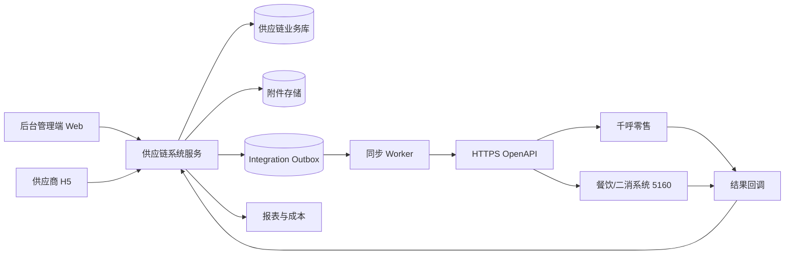
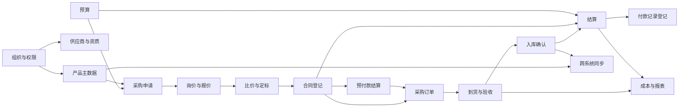
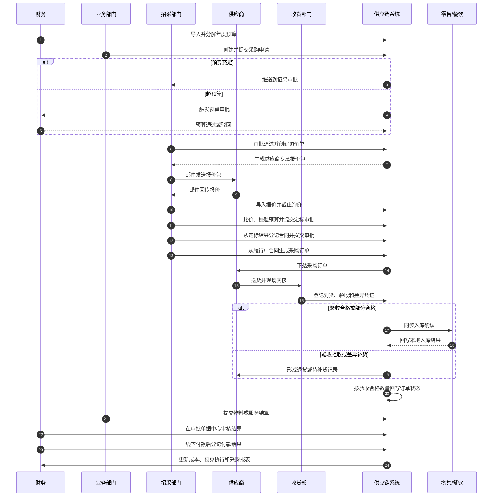
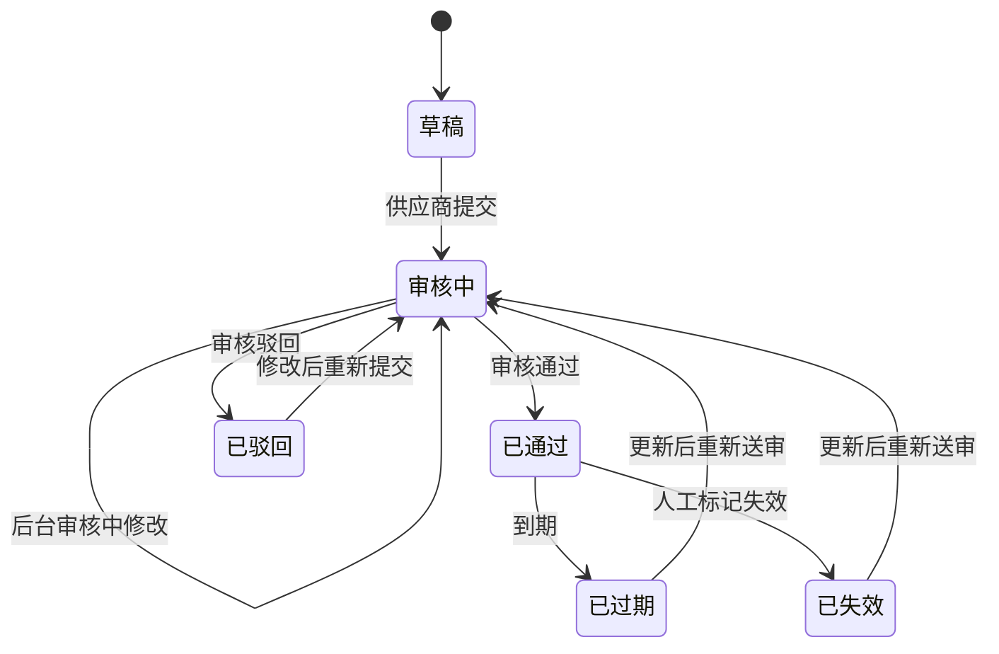
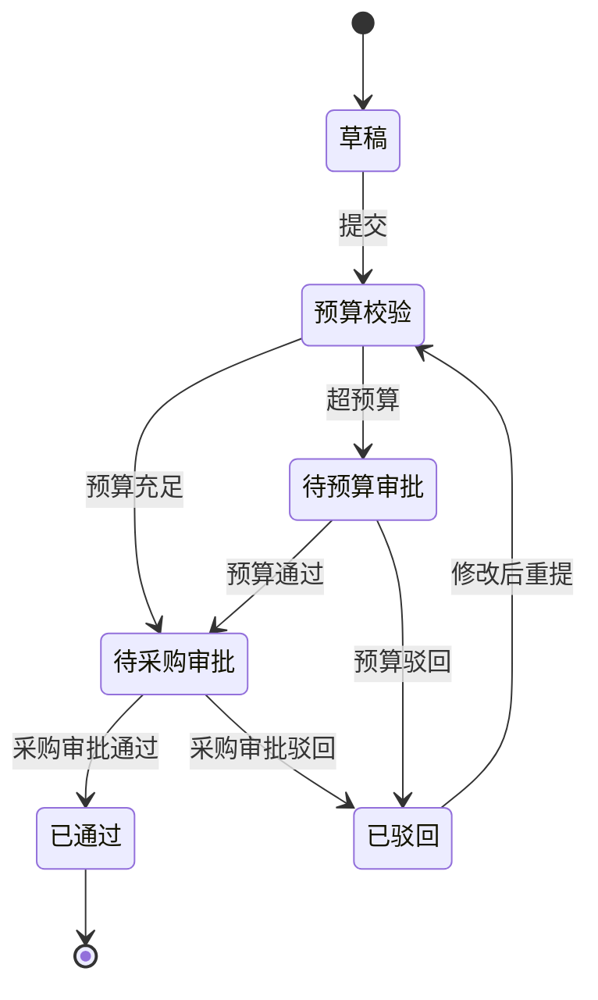
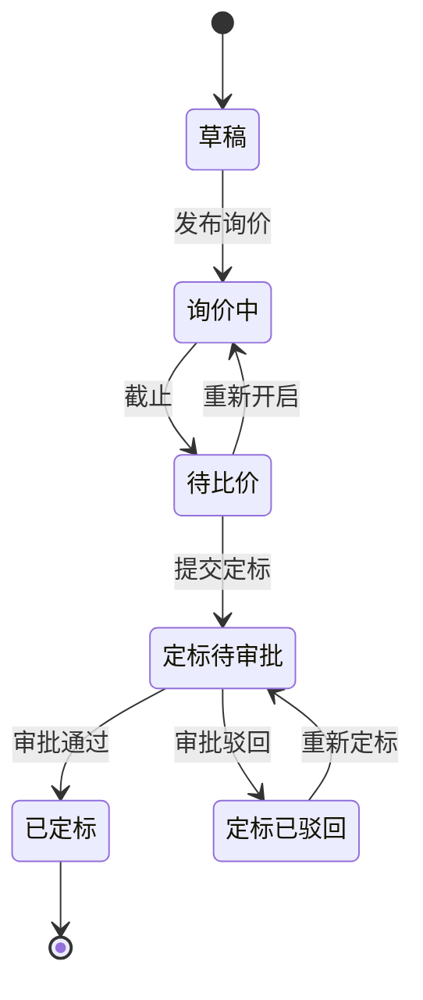
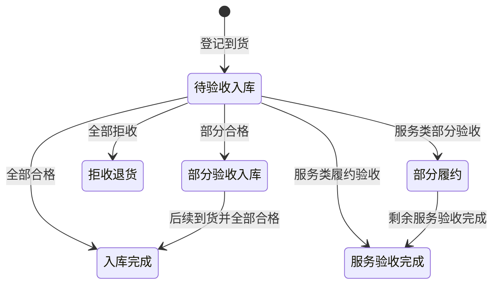
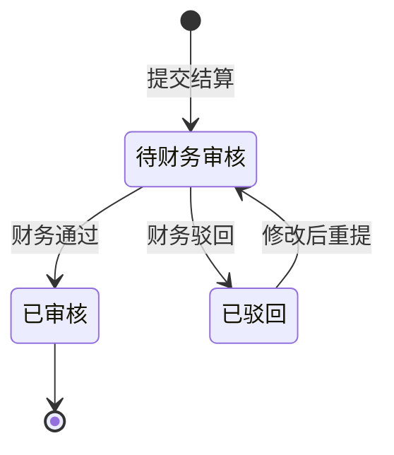

# 顶点公园供应链系统产品需求文档（PRD v1.1）

## 0. 文档信息

| 项目 | 内容 |
|-|-|
| 产品名称 | 顶点公园供应链系统 |
| 文档版本 | v1.1 当前基线稿 |
| 文档日期 | 2026-09-17 |
| 文档状态 | 已同步当前原型与最新业务口径，可评审、可用于开发拆解 |
| 产品阶段 | 后台 MVP 主链路已形成可运行原型；供应商 H5 当前开放资质协同，其他能力按版本补齐 |
| 目标用户 | 业务部门、招采部门、收货部、财务部、供应商、平台管理员 |
| 产品形态 | 后台管理端 Web + 供应商 H5 + 审批单据中心 + 对外开放接口/集成 Worker |
| 本期范围 | P0 采购闭环 + 已确认的 P1 效率与治理能力；P2 能力只做架构预留 |

### 0.1 本稿依据

本稿不是重新提出一套脱离现状的通用供应链方案，而是对项目现有材料进行统一：

1. 2026-09-17 `功能清单.md` 中的 P0、P1、P2 范围和原型落地状态。
2. 2026-09-17 当前 `后台管理端原型` 的路由、功能开关、页面动作和共享 Mock。
3. 当前 `供应商H5原型` 的实际路由、可操作状态和业务边界。
4. `字段字典_供应链系统.md`、`产品多单位与计量方案.md`、`供应商资质认证细化方案.md`。
5. `业务流程图文档.md`、`全流程演示示例.md` 和 `新用户业务流程使用指南.md`。
6. `供应链与零售餐饮系统对接方案_2026-09-14.md` 和 `跨系统同步初步方案_2026-09-14.md`。
7. `PLAN_P0/P1/P2` 修复结论，以及 2026-09-16 支付、发票和订单渠道梳理。

### 0.2 版本冲突处理原则

项目早期资料经过多次确认和调整，部分内容已经过期。本 PRD 按以下优先级形成最终口径：

1. 2026-09-17 当前系统功能开关、路由和页面动作所表达的最终原型边界。
2. 2026-09-17 `功能清单.md` 中已确认的采购、合同、订单、验收、结算和付款职责。
3. 2026-09-14 至 2026-09-16 的跨系统、单位计量、支付和发票边界。
4. 当前双端原型的实际可操作能力，以及代码保留但入口隐藏的能力。
5. 2026-09-04 的 P0、P1、P2 修复结论。
6. 更早期的 PLAN、需求分析和初版 PRD。

本稿明确覆盖以下旧口径：

| 争议项 | 旧口径 | 本 PRD 采用的最新口径 |
|-|-|-|
| 供应商在线报价 | 早期计划为一期线上、线下混合 | 一期统一使用 Excel 报价包导出和后台导入；在线报价移至后续版本 |
| 供应商 H5 范围 | 早期计划包含工作台、资质、订单进度和对账结算 | 当前原型只开放资质提交、审核结果和修改重提；登录、订单、结算等代码保留但不作为当前已开放入口 |
| 采购订单来源 | 旧流程允许定标后直接生成订单或手工创建 | 采购订单必须由履行中的有效合同发起；定标只形成合同和价格依据，不直接转单 |
| 采购订单审批 | 旧流程包含订单审批或单独下达 | 订单由合同发起后直接进入待收货或待履约验收，不单独设置订单审批 |
| 订单完成 | 部分原型曾提供业务人员手工完成入口 | 采购订单只查看详情；到货验收回写入库数量，订单状态自动更新为部分到货或已完成 |
| 结算与付款 | 旧口径由结算管理创建结算、审核并登记付款 | 预付款、阶段付款、尾款和服务结算从订单或到货单发起；审批单据中心完成财务审核；结算管理只读查看；付款管理负责实付记录查询，当前原型使用预置付款数据 |
| 预算颗粒度 | 早期为部门、项目、科目、月份 | 额度控制按部门和预算科目；项目保留为业务归属和统计维度 |
| 财务系统集成 | 早期预留直接财务接口 | 一期不直接对接财务；通过 Excel 和标准适配层解耦 |
| 库存边界 | 曾讨论完整库存 | 供应链只做到货、验收入库台账和入库确认同步；不建设完整 WMS |
| 产品单位 | 旧模型为单一产品单位 | 产品采用 SPU/SKU，维护采购单位、基本单位和默认换算；单据保存换算快照 |
| 采购申请内容 | 早期要求一张申请只能包含物料或服务 | 同一申请允许混合选择物料和服务；生成订单时按采购项类型和供应商拆分为物料订单、服务订单 |

### 0.3 当前系统基线

当前已有两个可运行原型：

| 系统 | 当前已覆盖 | 当前性质 |
|-|-|-|
| 后台管理端原型 | 产品库与配置、供应商与资质、采购申请、询价报价、比价定标、合同、采购订单、履约调整、到货验收、预算、结算查询、付款记录、审批单据；报表中心、系统设置、价格纠正、供应商产品绑定和合同类型代码保留但入口隐藏 | 业务逻辑和页面基线，数据为共享 Mock，不代表生产级权限、并发和持久化能力 |
| 供应商 H5 原型 | 当前仅开放资质提交、审核结果查看、驳回/过期/失效后的修改重提；登录、订单、结算和报价代码保留但未路由 | 供应商资质协同体验基线；当前验收不得把未路由页面计为已开放能力 |
| 共享 Mock | 双端共用类型、枚举、状态和示例数据 | 保证字段、状态和演示口径一致 |
| 跨系统同步 | 已有产品同步、入库确认同步、映射、Outbox、幂等和回冲方案 | 方案已形成，尚未视为生产已上线能力 |

### 0.4 生产化缺口

当前原型到生产系统之间仍有以下主要缺口：

- 真实登录、组织、角色、菜单、操作和数据权限。
- 数据库、事务、幂等、审计日志、附件存储和并发控制。
- 真实审批流、待办推送、短信/企微通知。
- Excel 报价包与预算模板的生产级解析、校验、错误回传。
- 跨系统 OpenAPI、Outbox Worker、映射台账、重试和每日对账。
- 性能、容灾、监控、告警、备份和安全合规。
- 当前结算管理和付款记录页的生产级登记、冲销、重放和财务对账能力。
- 当前供应商 H5 仅开放资质协同，订单、结算和登录能力仍需按版本补齐入口和验收。

### 0.5 当前原型能力状态

| 能力 | 当前状态 | 说明 |
|-|-|-|
| 产品库、产品配置、供应商、资质、采购申请、询价报价、定标、合同、采购订单、履约调整、到货验收、预算、审批单据 | 当前开放 | 后台原型可见并可演示 |
| 结算管理 | 当前开放但只读 | 查询结算、金额和审批状态；创建从订单或到货单发起 |
| 付款记录 | 当前开放但数据预置 | 查询、导出、明细和附件预览；生产版本需补齐实付登记 |
| 工作台、报表中心、系统设置、价格纠正、供应商产品绑定、合同类型维护、付款条款、直接到货 | 当前入口隐藏 | 代码保留；不计入当前已开放功能验收 |
| 供应商 H5 资质 | 当前开放 | 提交、查看、驳回/过期/失效后修改重提 |
| 供应商 H5 登录、订单、结算、报价 | 代码保留但未路由 | 不作为当前开放能力；按后续版本补齐 |
| 真实短信、OA、财务、进销存、支付渠道、银行和外部接口 | 未接入 | 当前只做 Mock、页面内数据和接口方案 |

## 1. 产品概述

### 1.1 背景

顶点公园包含餐饮、零售、冰雪运动、酒店、园区维护及服务采购等多业态。采购需求分散在不同部门，供应商准入、线下报价、合同登记、预算执行、到货验收、结算付款和成本统计之间缺少统一数据链路，容易出现以下问题：

- 采购需求、审批和寻源过程依赖线下沟通，状态不透明。
- 多供应商报价口径不一致，定标结果和比价附件难追溯。
- 预算、采购、合同、入库和结算各自维护数据，金额口径难对齐。
- 供应商资质、有效期和黑名单状态不能在全流程统一生效。
- 商品箱规、采购单位、基本单位不一致，导致比价、验收入和下游入库换算错误。
- 零售和餐饮系统无法稳定获得供应链主数据和入库确认，库存与成本存在重复录入风险。

### 1.2 产品定位

供应链系统定位为“采购与供应商协同中台”，负责：

- 采购主数据：产品 SPU/SKU、品类、单位换算、供应商及资质。
- 采购执行：采购申请、询价报价、比价定标、采购订单、到货验收、入库确认。
- 审批协同：统一审批单据中心汇总待审批记录，审批完成后通知申请人或业务对方。
- 协同管理：合同、预算、结算、付款记录、供应商 H5。
- 经营支撑：采购价格、成本归集、采购统计和预算执行。
- 跨系统协同：向零售/餐饮系统同步产品与入库确认，并回收处理结果。

供应链系统不替代零售 POS、餐饮系统、酒店 PMS、票务系统或完整 WMS。

### 1.3 产品目标

1. 建立一条可追溯的采购闭环：预算 → 申请 → 询价 → 报价 → 定标 → 合同 → 订单 → 验收入库 → 结算 → 付款登记 → 报表。
2. 让每一个关键金额、状态和数量都能追溯到来源单据、操作人和时间。
3. 将供应商资质、合作状态、黑名单与报价、订单和合同资格统一联动。
4. 用 SPU/SKU、采购单位和基本单位换算解决多业态产品主数据和比价口径问题。
5. 通过产品映射和入库确认单同步，让供应链成为下游库存与成本的数据源之一，但不代替下游库存主责。

### 1.4 成功指标

以下目标值为一期建设建议值，首个完整运行季度后根据实际业务量复盘调整。

| 指标 | 定义 | 一期目标 |
|-|-|-|
| 采购主链路线上化率 | 通过系统完成申请、寻源、订单、验收或结算的采购单占比 | ≥ 90% |
| 比价与定标可追溯率 | 已定标询价单中报价、比价和定标记录完整的比例 | 100% |
| 供应商资格校验准确率 | 报价、订单、合同使用有效供应商的比例 | 100% |
| 物料结算来源完整率 | 物料结算关联验收/入库记录的比例 | 100% |
| 付款记录完整率 | 实际付款均有金额、日期和必要凭证记录的比例 | 100% |
| 产品同步成功率 | 下游成功接收并回写映射或结果的产品事件比例 | ≥ 99.9% |
| 重复入库单数 | 同一入库确认事件在下游重复生成单据的数量 | 0 |
| 跨系统日对账准确率 | SKU 和入库确认单两边一致的比例 | ≥ 99.9% |

### 1.5 非目标

- 不建设完整仓储 WMS、库位、批次、盘点和调拨全场景。
- 不接入第三方支付、银行付款或收银渠道。
- 一期不直接对接财务系统，不处理总账、凭证和税务申报。
- 一期不开放供应商在线报价和多轮竞价。
- 一期不做供应商对账在线确认、绩效评分和企业信用接口。
- 不替代零售商品主数据、餐饮物料/BOM、POS、PMS 和票务系统。
- 不做 AI 定价、需求预测和自动寻源推荐。

## 2. 用户与职责

### 2.1 用户角色

| 角色 | 核心任务 | 主要页面/端 | 数据范围 |
|-|-|-|-|
| 业务申请人 | 提报需求、查看进度、提交结算、确认服务履约 | 后台 | 本部门申请、订单、验收、结算 |
| 部门负责人 | 审核本部门采购需求、决定需求合理性 | 后台 | 本部门审批数据 |
| 招采人员 | 维护产品供应商、审批申请、询价定标、订单和合同 | 后台 | 全量采购与供应商数据 |
| 收货人员 | 登记到货、验收、差异处理、上传凭证 | 后台 | 到货、验收、入库台账 |
| 财务人员 | 预算导入调整、预算审批、结算审核、付款记录和成本核算 | 后台 | 全量预算、结算、付款记录、成本 |
| 供应商联系人 | 当前提交/修改资质；后续查看订单进度和对账结算 | H5 | 仅当前供应商数据 |
| 平台管理员 | 组织、角色、权限、参数、预警和集成配置 | 后台 | 全局配置 |
| 下游系统 | 接收产品与入库确认、回写映射和处理结果 | API/Worker | 授权范围内的单证和主数据 |

### 2.2 权限原则

- 用户只能访问所属组织允许的数据。
- 业务部门对产品、申请、订单、验收和结算实行部门数据隔离。
- 招采人员可查看全量采购主数据和执行单据。
- 财务人员可查看预算、结算、付款和成本数据。
- 当前原型供应商只能操作本企业资质数据；后续开放登录、订单和结算后仍严格按企业隔离。
- 产品录入与价格纠正权限分离。
- 关键状态变更、审批、驳回、拉黑、定标、作废和付款登记必须记录操作日志。
- 正式系统必须实现后端权限校验，前端隐藏按钮不能作为安全边界。

### 2.3 角色权限矩阵

| 功能 | 业务申请人 | 部门负责人 | 招采 | 收货 | 财务 | 管理员 | 供应商 |
|-|-|-|-|-|-|-|-|
| 产品档案维护 | 查看 | 查看 | 新增/编辑/停用 | 查看 | 查看 | 配置 | 否 |
| 价格纠正 | 否 | 否 | 授权人员（当前隐藏） | 否 | 查看 | 配置 | 否 |
| 供应商档案 | 查看 | 查看 | 新增/编辑/拉黑 | 查看 | 查看 | 配置 | 否 |
| 资质审核 | 否 | 否 | 审核通过/审核不通过 | 否 | 否 | 配置 | 提交/查看结果/修改重提 |
| 采购申请 | 新建/编辑/提交 | 审批 | 审批 | 查看 | 查看/预算审批 | 配置 | 否 |
| 询价报价 | 查看 | 查看 | 新建/导入/比价/定标 | 否 | 查看 | 配置 | 接收模板 |
| 采购订单 | 查看 | 查看 | 从有效合同发起/调整 | 查看 | 查看 | 配置 | 后续 H5 查看 |
| 到货验收 | 协同/查看 | 查看 | 查看 | 登记/验收/差异 | 查看 | 配置 | 送货 |
| 合同 | 查看 | 查看 | 登记/审批/续签/终止 | 否 | 查看 | 配置 | 否 |
| 预算 | 查看 | 查看 | 查看/预算校验 | 否 | 导入/调整/预算审批 | 配置 | 否 |
| 结算 | 从订单/到货单发起 | 查看 | 查看 | 查看 | 审核 | 配置 | 后续 H5 查看 |
| 付款 | 否 | 否 | 查看 | 否 | 查看/登记实付 | 配置 | 后续 H5 查看 |
| 报表 | 本部门查看 | 本部门查看 | 全量采购报表 | 到货报表 | 全量财务报表 | 配置 | 否 |

## 3. 范围与版本

### 3.1 MVP v1.0 范围

| 模块 | P0 能力 | 交付结果 |
|-|-|-|
| 工作台 | 待办、预警 | 功能保留但当前系统默认隐藏，不作为菜单入口 |
| 产品库 | SPU/SKU、三级品类、物料/服务、多单位、价格维护、批量导入导出 | 形成统一可采购目录 |
| 供应商 | 档案、分类分级、状态和黑名单 | 形成供应商准入 |
| 资质管理 | H5 提交、后台审核、驳回重提、过期/失效处理 | 供应商资格可验证、可追溯 |
| 预算 | Excel 导入、12 个月台账、月度调整、预算校验、超预算审批 | 采购前有统一预算口径 |
| 采购申请 | 新建、草稿、审批、驳回重提、预算校验 | 需求线上进入采购 |
| 询价报价 | 申请/无申请来源、供应商邀请、Excel 模板、报价导入、比价 | 形成可追溯寻源过程 |
| 合同 | 新签、已有合同、补充签订、续签、审批、终止、到期预警 | 管理线下签约合同并作为订单前置依据 |
| 采购订单 | 从履行中合同发起、物料/服务分单、订单变更和履约调整 | 完成合同到履约的转单 |
| 到货验收 | 从订单履约进入、逐行验收、差异处理、凭证、入库台账 | 形成物料结算唯一凭证 |
| 结算付款 | 预付款、阶段付款、尾款、物料/服务结算、财务审核、实付记录 | 完成应付、审核和付款台账 |
| 审批单据中心 | 采购申请、预算调整、定标、合同、履约调整、结算和资质审批 | 统一处理跨模块审批并回写来源单据 |
| 报表成本 | 采购统计、预算执行、成本报表 | 页面已实现，当前入口隐藏，生产版本按权限开放 |
| 基础设置 | 组织、员工、角色、权限、审批、预警、消息 | 代码保留，当前系统设置入口隐藏 |
| 供应商 H5 | 当前开放资质提交、审核结果和修改重提；后续补齐登录、订单、对账结算 | 分阶段实现供应商自助协同 |
| 跨系统同步 | 产品下行、映射回写、入库确认下行、结果回写 | 支持零售/餐饮库存和成本衔接 |

### 3.2 v1.1 建议补齐

- 常购清单和采购申请模板。
- 采购订单变更审批、履约调整、线下订单导入。
- 对账单生成和导出、供应商 H5 订单及结算查询。
- 付款计划、预算执行增强报表、采购统计和履约报表。
- 操作日志中心、消息模板和更完整的字段权限。
- OA、进销存接口日志、重试和告警。

### 3.3 v2.0 评估

- 供应商在线报价、多轮报价和加权评分。
- 供应商绩效、风险预警、企业信用接口。
- 电子签、合同变更、自动续签。
- 进项发票登记和自动认证；供应链发票不进入销售开票链路。
- 与 POS、PMS、票务、租赁系统深度集成。
- 价格趋势、滚动预算、需求预测和智能推荐。

### 3.4 仅 PRD 规划说明、本期不进入系统

- 工作台“全流程导航”：PRD 保留六阶段业务流程、阶段节点和后续产品方向，供业务评审及研发理解采购全链路。本期后台管理端原型、一期系统、共享 Mock、用户操作指南和系统验收均不实现或展示该模块，也不以导航状态、数量统计和快捷入口作为系统功能验收依据。
- 原型中的“开发流程”菜单仅用于产品、研发和验收理解流程图，不属于业务用户菜单，不作为生产系统功能交付。

## 4. 产品架构

### 4.1 总体结构

### 4.2 端与职责

| 端 | 用户 | 主要职责 |
|-|-|-|
| 后台管理端 Web | 内部业务、招采、收货、财务、管理员 | 全部采购执行、主数据、审批、预算、结算、付款、报表和配置 |
| 供应商 H5 | 供应商 | 当前资质提交/修改；后续订单进度和对账结算 |
| 集成层 | 零售/餐饮等下游系统 | 产品同步、映射回写、入库确认、结果回写、重试和对账 |

### 4.3 模块关系

## 5. 目标业务流程

### 5.1 主流程

```mermaid
flowchart LR
    A["财务导入年度预算"] --> B["生成 12 个月预算台账"]
    B --> C["业务创建采购申请"]
    C --> D{"预算校验"}
    D -->|预算充足| E{"采购审批"}
    D -->|超预算| BUD["预算审批"]
    BUD -->|通过| E
    BUD -->|驳回| C
    E -->|通过| F["申请通过"]
    E -->|驳回| C
    F --> G["招采创建询价单"]
    G --> H["发布询价并直接生效"]
    H --> I["导出供应商 Excel 报价包"]
    I --> J["供应商邮件回传"]
    J --> K["后台导入报价"]
    K --> L["报价截止并比价"]
    L --> M["定标"]
    M --> O["定标结果转合同"]
    O --> CA["合同审批生效"]
    CA --> N["从有效合同发起采购订单"]
    CA --> PP["按订单条款发起预付款"]
    N --> P["供应商送货"]
    P --> Q["到货登记与验收"]
    Q --> R["合格数量入库"]
    Q --> S["差异退货或等待补货"]
    R --> T["验收回写订单状态"]
    T --> U["物料/服务结算"]
    U --> V["审批单据中心财务审核"]
    V --> W["付款记录页面查询/登记实付"]
    W --> X["线下付款结果归档"]
    R --> Y["同步下游入库确认"]
    X --> Z["成本归集与报表"]
```

#### 5.1.1 分阶段责任与交接

| 阶段 | 责任角色 | 上游输入/触发 | 关键动作 | 系统输出/状态 | 交给下一环节 |
|-|-|-|-|-|-|
| 0. 预算准备 | 财务 | 年度预算文件和预算科目 | 导入预算、选择分解方案、校验并确认 | 12 个月预算台账，形成部门和科目可用额度 | 业务部门可发起采购申请 |
| 1. 需求提报 | 业务申请人 | 部门采购需求 | 选择日常/项目采购，填写需求时间、用途、科目、项目和 SKU 明细 | 采购申请草稿；提交后进入审批 | 部门负责人 |
| 2. 预算与采购审批 | 财务、招采 | 已提交采购申请 | 先校验预算；超预算在采购申请中完成预算审批，通过后再进行采购审批 | 申请通过或驳回；预算占用 | 招采部门发起寻源 |
| 3. 寻源立项 | 招采 | 已通过申请，或年度寻源/价格到期等独立寻源需求 | 创建询价单，选择合格供应商并提交发布 | 询价单直接生效为询价中 | 供应商接收报价包 |
| 4. 报价回传 | 供应商、招采 | 询价单和供应商专属 Excel 模板 | 供应商填写含税单价、交期并邮件回传；招采导入报价 | 报价入库并保留版本；截止后进入待比价 | 招采部门比价 |
| 5. 比价定标 | 招采、审批角色 | 已截止询价、完整报价和预算余额 | 比较总价、单价、税率、运费、交期和资格，校验预算并选择中标供应商；提交定标审批 | 定标完成并生效；中标/未中标结果明确 | 招采或合同经办人登记合同 |
| 6. 合同订单 | 招采、供应商 | 定标结果；线下已签合同 | 登记合同并审批生效；选择履行中合同，按供应商和采购项类型生成物料或服务订单 | 合同履行中；订单待收货或待履约验收 | 供应商安排送货或服务履约 |
| 7. 到货登记 | 供应商、收货部门 | 待收货或部分到货订单 | 供应商送货，收货人员登记实际到货时间和数量 | 到货记录待验收入库 | 验收人员处理 |
| 8. 验收差异 | 收货部门、业务申请人 | 到货记录 | 逐行填写合格数量；差异选择退货不补货或等待补货；上传验收凭证 | 入库完成、部分验收入库或拒收退货 | 业务确认完成并进入结算 |
| 9. 订单完成 | 系统 | 已形成的入库/退货记录 | 根据验收合格数量和剩余待收数量回写订单状态 | 部分到货或订单已完成 | 提交物料或服务结算 |
| 10. 结算审核 | 业务申请人、财务 | 入库凭证、合同/订单价格、服务评分和扣款 | 从订单或到货单发起预付款、阶段付款、尾款或服务结算；审批单据中心完成财务审核 | 结算已审核或驳回 | 登记实付记录 |
| 11. 付款记录 | 财务 | 已审核结算单和应付余额 | 线下付款后登记实际金额、日期、回单和附件 | 未付、部分付款或已付清 | 成本归集和报表 |
| 12. 下游同步 | 系统、零售/餐饮 | 已确认入库明细和 SKU 映射 | 推送入库确认，下游完成本地库存处理并回写结果 | 本地入库单号、处理状态和数量 | 库存、成本和 BOM 入账 |
| 13. 复盘分析 | 招采、财务、管理层 | 采购、预算、入库、结算和付款数据 | 查看采购统计、预算执行、成本和履约报表 | 形成采购与经营分析结果 | 优化下一轮采购 |

#### 5.1.2 角色泳道流程

#### 5.1.3 关键交接控制点

| 交接点 | 交接内容 | 进入下一环节的硬条件 | 失败或异常后的去向 |
|-|-|-|-|
| 预算到采购申请 | 部门、科目、月份额度和项目档案 | 预算科目存在；超预算时必须有预算审批结果 | 补预算、调整预算或驳回申请 |
| 采购申请到寻源 | SKU、数量、单位换算、需求时间、预算状态 | 预算充足或预算审批已通过，且采购审批已通过 | 退回申请人修改后重提 |
| 寻源到供应商 | 询价单、报价截止时间、供应商范围 | 询价单已发布，供应商资格有效 | 调整供应商、延长截止或重新立项 |
| 供应商到招采 | Excel 报价、交期和报价版本 | 模板格式正确、SKU 完整、报价在截止前有效 | 重新回传或由招采重新邀约 |
| 定标到合同 | 中标供应商、价格、交期、预算校验结果 | 询价已截止并处于待比价，定标审批通过 | 定标驳回、重新比价或废标重询 |
| 合同到订单 | 合同供应商、合同价格、合同剩余额度、采购项类型 | 合同为履行中且在有效期内，供应商、产品和价格与合同一致 | 补签合同、续签、终止后重签或调整合同范围 |
| 订单到收货 | 订单、SKU、剩余可收数量、计划交期 | 订单为待收货或部分到货 | 订单变更、取消或重新下达 |
| 收货到结算 | 收货单、合格数量、差异处理、验收凭证 | 验收已完成且凭证齐全；物料数量可结算 | 补货、退货、补充凭证或修正验收 |
| 结算到付款 | 应付金额、合同、已付余额、付款条件和预付款抵扣 | 结算已通过审批，未超过应付余额 | 驳回结算、修改金额或补充资料 |
| 入库到下游 | 入库确认事件、SKU 映射、换算快照 | 事件幂等校验通过，存在有效映射 | 进入异常队列，补映射后重放 |

### 5.2 线上与线下分工

| 环节 | 系统内 | 系统外 |
|-|-|-|
| 报价 | 导出供应商专属 Excel 模板、导入报价、计算总价、比价留痕 | 供应商线下填写并通过邮件回传 |
| 合同 | 登记、附件、审批、续签、终止和到期预警 | 合同谈判、签署和用印 |
| 到货 | 登记、验收、差异处理、凭证和入库确认 | 供应商送货、现场清点和质量核验 |
| 付款 | 登记实际付款金额、日期和附件 | 财务通过银行或内部流程实际付款 |
| 发票 | 预留字段和接口，不进入一期主链 | 线下取得、认证和入账 |
| 下游库存 | 推送入库确认并展示同步结果 | 零售/餐饮完成本地库存、成本和 BOM 入账 |

### 5.3 异常分支

| 场景 | 处理规则 |
|-|-|
| 采购申请驳回 | 回到申请人修改，保留驳回原因，可重新提交 |
| 预算不足 | 软阻断，进入预算审批；通过前不能进入采购审批，也不能继续定标或下单 |
| 供应商资质异常 | 不能进入询价邀请、订单或合同选择 |
| 报价不足或差异大 | 延长截止、重新邀约、废标重询；保留操作原因 |
| 定标驳回 | 返回比价阶段，可重新选供应商或补充说明 |
| 到货短缺 | 合格部分先入库；差异行选择退货不补货或等待补货 |
| 整单拒收 | 全部合格量置零，差异行选择退货并上传凭证 |
| 服务履约异常 | 记录质量评分、扣款金额和说明，按实际应付结算 |
| 结算驳回 | 修改结算明细或凭证后重新提交 |
| 付款记录错误 | 未计入成本归集的记录可修正；已使用记录修正时必须留痕 |
| 下游同步失败 | 自动重试；参数或映射错误进入异常队列，人工修复后重放 |

## 6. 功能需求

### 6.1 工作台

#### 6.1.1 目标

工作台负责汇总“当前我该处理什么”和“哪里有风险”，不是简单快捷入口集合。

当前后台原型默认隐藏工作台入口，待办和预警逻辑保留，生产版本按角色和菜单权限开放。

#### 6.1.2 全流程导航（PRD 规划说明，本期不进入系统）

该模块仅在 PRD 中记录采购业务的六阶段主链路，用于业务评审、需求沟通和后续产品演进参考，不作为本期系统页面、路由、接口、共享 Mock 或验收范围。

| 阶段 | 阶段目标 | 关键节点 |
|-|-|-|
| 1. 预算准备 | 建立部门与预算科目的可用额度基线 | 预算导入、预算分解、预算校验 |
| 2. 采购申请 | 将部门需求转为受控采购单据 | 创建申请、审批、审批完成 |
| 3. 寻源比价 | 形成可追溯的询价、报价和定标结果 | 发起询价、供应商报价、比价定标 |
| 4. 合同/订单 | 将定标结果转为合同，再从有效合同生成履约订单 | 合同审批、按合同下单、履约执行 |
| 5. 到货入库 | 以验收入库记录形成结算凭证 | 到货确认、验收、入库 |
| 6. 结算付款 | 完成应付审核和线下付款登记 | 结算申请、财务审核、线下付款 |

后续版本如评估启用，导航状态和数量必须从真实业务数据实时派生，并受当前用户的数据权限控制；一期不预留页面入口、前端 Mock 数据或独立状态计算。

#### 6.1.3 功能要求

| 编号 | 功能 | 需求 |
|-|-|-|
| WB-01 | 待办中心 | 汇总待审批、待处理、草稿和逾期事项，点击进入对应单据 |
| WB-02 | 预警中心 | 展示超预算、合同到期、资质到期、到货逾期、同步失败等提醒 |
| WB-03 | 数据派生 | 待办和预警从真实业务数据派生，不能与列表状态相互矛盾 |
| WB-04 | 数据权限 | 只展示当前用户和角色有权查看的事项 |
| WB-05 | 状态展示 | 明确待处理、已逾期、草稿、紧急、关注和提示状态 |

#### 6.1.4 验收要点

- 新增一张待审批申请后，对应处理人工作台待办数量增加。
- 处理完成后待办自动移除或变为已完成。
- 资质、合同或到货逾期能在工作台被定位并跳转处理。
- 全流程导航不在本期系统验收范围内；工作台验收仅覆盖待办中心和预警中心。

### 6.2 产品库

#### 6.2.1 数据模型

- 产品采用“产品 SPU → 规格 SKU”两层模型。
- SPU 共享名称、品类、图片、简介、采购项类型、计量方式、基本单位、采购单位和税率。
- SKU 是可采购、报价、下单、验收和同步的最小单位。
- 容量、尺寸、型号、口味等实质差异拆为不同 SKU。
- 同一 SKU 仅维护默认包装换算；供应商箱规差异维护在供应商采购信息。

#### 6.2.2 功能要求

| 编号 | 功能 | 需求 |
|-|-|-|
| PM-01 | 单规格产品 | 一个 SPU 对应一个 SKU |
| PM-02 | 多规格产品 | 维护规格属性和值，自动生成规格组合，每个组合维护 SKU 编码、规格、条码和价格 |
| PM-03 | 三级品类 | 支持一级、二级、三级品类树；产品只关联三级品类 |
| PM-04 | 采购项类型 | 区分物料类和服务类；服务类不进入库存入库，但需进入服务验收并登记扣款明细 |
| PM-05 | 计量方式 | 支持计件和计重 |
| PM-06 | 多单位 | 维护采购单位、基本单位和换算关系，例如 `1 箱 = 24 瓶` |
| PM-07 | 单据快照 | 申请、询价、订单、验收和同步保存单位换算快照 |
| PM-08 | 价格 | 参考价必填，标准价选填；标准价留空时采购流程使用参考价。可全局开启按采购订单最低价自动更新标准价 |
| PM-09 | 状态 | 支持启用、停用；停用后不能新增业务单据，但历史数据保留 |
| PM-10 | 数据权限 | 业务部门按部门隔离，招采可维护全局采购目录 |
| PM-11 | 导出 | 产品导出包含 SPU、SKU、品类、规格、采购单位、基本单位和换算说明 |
| PM-12 | 单规格批量导入 | 下载单规格 Excel 模板，一行维护一个 SPU/SKU；模板包含产品、品类、规格、单位换算、价格、税率、条码和状态字段 |
| PM-13 | 多规格批量导入 | 下载多规格 Excel 模板，一行维护一个 SKU，同一 SPU 可占多行；通过规格类型和规格值列生成规格组合与 SPU 共享信息 |
| PM-14 | 导入校验预览 | 导入后先解析预览；校验必填项、三级品类、单位配置、换算关系、价格、重复 SPU/SKU 和规格组合，错误行修正后才能确认导入 |

#### 6.2.3 业务规则

- SKU 编码必须唯一，作为跨系统同步和单据引用的稳定键。
- 采购单位与基本单位必须可换算；计重产品通常两者一致。
- 金额计算必须使用“当前单位数量 × 当前单位单价”。
- 单价单位与数量单位必须一致。
- 已被单据引用的品类、单位或换算规则不能直接删除。
- 修改已使用换算规则时，只影响后续新单据；历史单据保留快照。
- 规格组合不能重复，条码可为空，但填写后应校验冲突。
- 参考价必须维护；标准价可为空，留空时采购申请、订单和合同默认使用参考价。
- 开启“采购最低价同步标准价”后，仅比较同一产品、同一采购单位和换算口径的有效订单单价，并将最低正数成交价写入标准价。
- 单规格与多规格必须使用对应模板，不能在同一文件中混用。
- 单规格模板一行对应一个 SKU，同一 SPU 只能出现一次。
- 多规格模板按 SPU 分组，同一 SPU 的产品名称、采购项类型、三级品类、单位、税率和简介必须一致。
- 批量导入只新增产品，不覆盖已有产品；文件中或系统中已存在的 SKU 编码应拦截并提示。
- 仅在全部错误校验通过后允许确认导入，导入完成后刷新产品库列表和产品/规格统计。

#### 6.2.4 价格纠正

- 当前后台原型保留价格纠正代码，但 `PRICE_CORRECTION_ENABLED=false`，入口隐藏，不计入当前已开放功能。
- 产品录入和价格纠正由不同权限控制。
- 普通编辑不能直接修改已有产品价格。
- 价格纠正必须记录纠正前值、纠正后值、原因、操作人和时间。
- 产品详情展示纠正记录数量和最近纠正时间。
- 是否在生产一期开放价格纠正，由后续产品与招采共同确认；未开放前，参考价和标准价通过产品编辑、批量导入及经授权的价格维护能力管理。

### 6.3 供应商与资质

#### 6.3.1 供应商档案

| 字段/能力 | 要求 |
|-|-|
| 企业信息 | 企业名称、统一社会信用代码、法人、经营范围、注册地址、税号、开票信息 |
| 联系人 | 联系人、手机号 |
| 银行信息 | 开户行、银行账号，按权限脱敏展示 |
| 业务分类 | 供应品类多选，由字典维护 |
| 等级 | A、B 等可配置等级 |
| 合作状态 | 待审核、审核不通过、合作中、暂停合作、已终止 |
| 黑名单 | 与合作状态独立；拉黑后禁止参与新报价、订单和合同 |
| 附件 | 营业执照、银行证明等，支持图片、PDF、Word、Excel，单文件不超过 20MB |
| 日志 | 状态、等级、黑名单和关键资料变更必须留痕 |

供应商产品绑定、供应商货号和供货价维护代码保留，但当前 `SUPPLIER_PRODUCT_BINDING_ENABLED=false`，入口隐藏，不作为当前已开放功能。

#### 6.3.2 资质状态模型

审核状态与有效状态分开管理：

| 维度 | 状态 |
|-|-|
| 审核状态 | 草稿、待审核、已通过、已驳回 |
| 有效状态 | 正常、即将到期、已过期、已失效 |
| 变更类型 | 首次提交、审核中修改、驳回重提、过期更新、失效更新 |
| 修改来源 | 供应商 H5、后台审核人员 |

#### 6.3.3 资质流程

#### 6.3.4 功能规则

- 供应商通过 H5 首次提交资质，或由后台新增、批量导入供应商时，均自动创建或关联供应商待审核档案。
- 供应商列表展示资质提交来源，并支持按“供应商 H5 / 后台录入”筛选。
- 供应商列表支持勾选多条审核中记录批量通过或批量驳回，驳回必须填写原因。
- 后台审核与修改分离，审核中修改必须留痕。
- 审核通过后同步供应商档案，并将合作状态调整为合作中；审核驳回时调整为审核不通过，供应商修改并重新提交后恢复待审核。
- 已驳回、已过期、已失效资质可修改后重新送审。
- 修改后必须重新审核，不能直接恢复有效。
- 资质有效期早于当前日期时不能审核通过。
- 资质到期预警默认提前 30 天和 7 天，可配置。

#### 6.3.5 采购资格

供应商同时满足以下条件才可用于报价邀请、采购订单和合同：

- 合作状态为合作中。
- 未拉黑。
- 最新资质审核状态为已通过。
- 资质有效状态为正常或即将到期。

### 6.4 预算管理

#### 6.4.1 预算主数据

- 预算按年度、部门、预算科目和月份管理。
- 项目名称在采购申请或询价单中手工录入，用于采购、合同、成本和报表归属；项目档案用于统计配置，不限制业务单据手工填写。
- 项目不参与预算额度控制，额度控制键为“部门 + 月份 + 预算科目”。
- 预算科目和项目档案分别维护。

#### 6.4.2 Excel 导入

| 能力 | 要求 |
|-|-|
| 按年模板 | 一个文件导入一个年度的部门、科目和年度总额预算 |
| 按月模板 | 一个文件导入年度、月份、部门和科目的月度预算；重复期间更新原记录并重算年度合计 |
| 方案 | 按年导入时支持均摊 12 个月、季度比例、手工逐月调整 |
| 默认 | 均摊 12 个月 |
| 预览 | 导入后展示每一行 12 个月的分解结果 |
| 校验 | 年度、月份、部门、科目、金额和季度比例必须合法 |
| 确认 | 确认后生成完整 12 个月台账 |
| 试算 | 导入预览不直接占用预算，确认后才生效 |

#### 6.4.3 预算控制

- 按年导入用于首次建立年度基线，按月导入用于后续预算下达或修订；同一部门、月份和科目重复导入时更新原记录，不允许生成重复额度。
- 月度导入后重新计算年度预算合计，同时保留导入批次、操作人和变更记录。
- 采购申请提交或审批时计算部门和科目可用余额。
- 可用余额等于月度预算减去已占用金额。
- 预算充足时正常继续。
- 预算不足时软阻断，单据保留并在采购申请中进入预算审批；预算管理只查看记录。
- 预算审批通过后，采购申请自动进入采购审批；采购审批通过后允许询价、定标和下单。
- 定标确认时必须再次校验预算，避免申请后额度被其他单据占用。
- 月度预算调整由财务发起，审批通过后更新台账并保留调整记录。
- 已审批采购申请占用预算；驳回、取消或结算完成后的释放规则在开发前形成明确账务口径。

### 6.5 采购申请

#### 6.5.1 功能要求

| 编号 | 功能 | 需求 |
|-|-|-|
| PR-01 | 新建申请 | 选择日常采购或项目采购，填写部门、申请人、需求时间、用途、预算科目和手工录入的项目名称 |
| PR-02 | 产品明细 | 选择 SKU，采购单位默认取产品采购单位，可切换为基本单位；填写数量、单价和金额并保存单位换算快照 |
| PR-03 | 采购内容 | 同一申请允许同时选择物料类和服务类；系统分别标记明细类型。生成合同时可按业务范围处理，生成订单时必须按供应商和采购项类型拆分为物料订单、服务订单 |
| PR-04 | 草稿 | 保存后允许继续编辑 |
| PR-05 | 预算校验 | 校验部门和月份可用预算；超预算自动触发预算审批 |
| PR-06 | 预算审批 | 在采购申请中完成超预算审批并保留记录；通过后自动进入采购审批，预算管理只做只读查看 |
| PR-07 | 采购审批 | 采购申请必须完成采购审批；预算审批未通过前不能进入采购审批 |
| PR-08 | 驳回重提 | 预算或采购审批驳回后，申请退回申请人修改并重新提交 |
| PR-09 | 审批中不可撤回 | 已提交申请需由审批人通过或驳回，不支持申请人撤回 |
| PR-10 | 时间线 | 记录创建、预算校验、预算审批、采购审批、驳回和预算占用 |
| PR-11 | 来源追溯 | 后续询价、订单和结算可回溯至申请 |

> 开发备注：日常采购面向常规、高频消耗或周期补货需求，项目名称可按业务需要选填；项目采购面向明确项目、活动或专项建设，项目名称必填。两种模式仅用于业务分类、检索和统计，后续询价、比价、定标和合同流程一致；项目名称在申请和询价单中直接输入，不强制从项目档案选择。一个采购申请可以对应多个采购订单，同一订单只能对应一个采购申请；基于框架合同或已有合同的日常订单可以不关联采购申请。

#### 6.5.2 状态

预算审批是本流程内的前置分支状态，不改变最终“已通过/已驳回”的业务结果。

### 6.6 询价与报价

#### 6.6.1 询价来源

- 从已审批采购申请发起，继承产品、数量、部门、申请人、预算科目、项目和需求时间。
- 招采人员可在采购申请列表中直接打开发起询价弹窗，保存后询价单进入询价报价列表，不离开当前采购申请页面。
- 线下已经完成比选和定标时，不补建询价单，直接从定标审批登记供应商、定标价格和定标备注。
- 采购申请审批通过后不自动生成询价单，由招采决定是否询价、拆包或合并。

#### 6.6.2 询价功能

| 编号 | 功能 | 需求 |
|-|-|-|
| RFQ-01 | 新建询价 | 维护标题、来源、供应商范围、报价截止、交期和付款条件 |
| RFQ-02 | 产品明细 | 从申请继承或手工选择 SKU，带出采购单位和换算快照 |
| RFQ-03 | 供应商范围 | 报价供应商创建时为选填，只能选择合作中、未拉黑、资质有效的供应商；草稿或询价中可继续追加，已有报价的供应商不能移除 |
| RFQ-04 | 发布生效 | 保存草稿，产品明细完整即可提交进入询价中；询价发布不单独设置审批，供应商可在发布后补充维护 |
| RFQ-05 | 调整截止 | 询价中可延长截止时间并留痕 |
| RFQ-06 | 截止 | 到达截止时间或手工截止后进入待比价，不再接受新报价 |
| RFQ-07 | 重新开启 | 未定标时可按权限重新开启并设置新截止时间 |
| RFQ-08 | 导出模板 | 按供应商分别导出专属 Excel，只包含本方产品和数量 |
| RFQ-09 | 导入报价 | 校验供应商、SKU、完整性、单价、税率、运费和交期 |
| RFQ-10 | 报价版本 | 保留每次导入/修改的报价版本和操作记录 |

- 供应商报价导入作为询价报价列表页的独立入口；询价单详情只展示询价、供应商和报价结果，不承载文件导入操作。
- 列表页支持统一选择询价单后导入，也可从处于“询价中”的询价单行直接进入导入。
- 导入报价时必须校验文件中的供应名称在当前询价单的报价供应商范围内；不在范围内时整行报错并拒绝导入。

#### 6.6.3 报价模板

- 每个供应商一份独立模板。
- 模板只展示询价单号、供应商、产品、规格、单位、数量。
- 不导出参考价、其他供应商信息和示例报价。
- 供应商填写含税单价和承诺交期。
- 模板不展示行合计和整单合计。
- 后台导入后按“含税单价 × 数量”计算金额。
- 格式错误不允许产生部分脏数据，必须返回明确行级错误。

#### 6.6.4 比价与定标

- 只有待比价状态的询价单可以定标。
- 比较总价、单价、税率、运费、交期和供应商资格。
- 比价完成后先选择并确认中标供应商，确认后才允许填写定标申请。
- 定标前必须再次校验预算。
- 选择中标供应商后填写定标单价、金额和定标说明；有关联报价时默认带出中标供应商报价，有关联采购申请但无报价时带出采购申请价格，无采购申请时手工选择产品并填写数量、单价。
- 定标单价和金额允许在提交定标审批前调整，审批通过的定标价格作为合同和后续采购订单的最终价格来源。
- 定标后中标报价标记为中标，其他报价标记为未中标。
- 定标审批通过后询价结果直接生效并保持“已定标”状态。定标结果只能发起合同登记，不能直接生成采购订单；合同履行中后，才能从合同发起采购订单。

#### 6.6.5 状态

### 6.7 采购订单

#### 6.7.1 订单生成

- 正常主链为采购申请 → 询价 → 比价定标 → 定标审批 → 合同登记和审批 → 履行中合同 → 采购订单。
- 定标结果只作为合同供应商、价格和商务条件的依据，不直接生成采购订单。
- 采购订单必须选择履行中且在有效期内的合同；合同供应商、采购项、价格清单、合同剩余额度和预算均需校验通过。
- 同一采购申请可以对应多张采购订单；同一订单当前只对应一个采购申请。基于框架合同或已有合同的日常订单可以不关联采购申请，但必须保留预算占用和合同来源。
- 采购订单分为物料订单和服务订单。同一张订单不能混合物料和服务；混合采购申请生成订单时，按供应商和采购项类型拆分。物料订单进入待收货，服务订单进入待履约验收。
- 订单继承合同和定标审批确认后的供应商、SKU、采购单位、换算快照、数量、含税单价、金额、交期和预算归属。
- 订单生成后直接进入待收货或待履约验收，不设置独立订单审批和下达动作。
- 系统不再提供常规手工创建订单入口。历史订单或特殊订单如确需导入，纳入 P1 线下订单导入能力并强制保留原因和来源附件。

#### 6.7.2 订单字段

| 字段 | 说明 |
|-|-|
| 订单号 | 系统生成，全局唯一 |
| 订单类型 | 物料订单或服务订单，创建后不可修改 |
| 来源 | 履行中合同；合同可继续关联原始定标结果、历史询价定标或已有线下合同 |
| 关联合同 | 合同 ID、合同号，合同发起订单时必填 |
| 关联定标 | 定标结果 ID、询价单号；由定标结果转合同时继承，订单通过合同继续追溯 |
| 供应商 | 必须满足供应商资格 |
| 部门/采购员 | 业务归属和经办责任 |
| 产品明细 | SKU、规格、数量、单位、基本数量、单价、金额、已收、已退 |
| 计划交期 | 用于到货计划和逾期提醒 |
| 状态 | 物料订单为待收货、部分到货、已完成、已取消；服务订单为待履约验收、部分履约、服务验收完成 |
| 变更记录 | 变更前后值、原因、操作人和时间 |
| 时间线 | 生成、变更、入库、退货、完成和取消记录 |

#### 6.7.3 订单变更与履约调整

- 基础订单变更支持数量、单价和交期调整；生产版本可配置是否启用审批。
- 从采购订单列表可直接发起履约数量调整，不单独跳转到独立业务入口。
- 到货或服务履约全部完成的订单不可发起调整；已结算部分不得重复调整或释放。
- 调整必须二次确认，重新计算行金额、订单总金额、合同占用和预算占用。
- 履约调整进入审批单据中心；审批生效后生成订单调整版本和履约调整记录。
- 调减订单时释放合同和预算占用；已付预付款超过调整后应付金额时，支持退款、转供应商余额或抵扣后续订单。
- 变更后不影响历史入库、结算和付款快照。

#### 6.7.4 订单状态回写

- 采购订单页只提供查看详情，不提供手工完成或登记到货入口。
- 系统根据到货验收回写的累计合格入库数量自动更新订单状态。
- 存在有效入库或服务履约但仍有剩余数量时，订单状态为部分到货或部分履约。
- 全部物料行合格入库数量加退货关闭数量覆盖订单数量，或服务履约全部完成后，订单状态自动更新为已完成或服务验收完成。
- 完成后订单关闭，不允许继续新增到货，除非通过明确的反审核流程重新开启。

### 6.8 到货验收与入库

#### 6.8.1 到货登记

- 只能从待收货或部分到货订单登记到货。
- 到货数量不能超过订单剩余可收数量；超收必须有单独规则和授权。
- 支持一张订单多次到货。
- 登记实际到货时间、明细数量和备注。
- 当前后台原型的 `RECEIPT_DIRECT_CREATE_ENABLED=false`，不提供独立的“记录到货”入口；到货、验收和后续批次均从订单履约链路的现有单据处理。生产版本如启用直接到货，只作为受控补录能力，不得绕过订单来源和预算占用。

#### 6.8.2 验收与差异

| 场景 | 规则 |
|-|-|
| 验收入库 | 单张到货单直接逐项勾选本次合格商品并填写本次入库数量，不设置“全部入库/部分入库”模式按钮；未填合格数量的商品保留继续入库 |
| 验收合格 | 每个本次入库商品录入验收合格数量，入库数量默认且只能取验收合格数量 |
| 全部合格 | 本次勾选商品的合格数量全部入库；本单商品全部处理且无差异时，状态为入库完成 |
| 部分合格 | 本次合格部分立即入库，未处理商品或不合格差异继续保留，状态为部分验收入库 |
| 退货不补货 | 关闭对应缺口，不再生成剩余待收 |
| 后续到货 | 保留剩余待收数量，后续统一通过“验收入库”登记新的到货批次，不再单独设置补货或继续入库按钮 |
| 部分入库后续处理 | 未完成商品和订单剩余待收统一从原单执行“验收入库”，后续到货验收后累计更新订单已收数量，原到货单保留批次和凭证记录 |
| 整单拒收 | 全部合格量置为 0，差异行选择退货，必须填写原因并上传凭证 |
| 计件产品 | 按到货数量录入 |
| 计重产品 | 按实际称重录入，验收合格量不得超过实到重量 |
| 服务验收 | 服务类不产生入库数量，登记验收数量、履约说明和一条或多条扣款明细；扣款项目取服务考核指标，扣款金额不得导致应付为负 |

#### 6.8.3 凭证

- 验收提交前至少上传一份图片或 PDF 凭证。
- 收货单是物料结算的唯一必要来源凭证。
- 凭证必须与收货单和明细行绑定，可追溯上传人和时间。

#### 6.8.4 状态

### 6.9 合同管理

#### 6.9.1 功能要求

- 线下签署后线上登记。
- 维护合同编号、名称、类型、供应商、经办部门、经办人、签订日期、开始日期、结束日期、金额、标的、项目和附件。
- 目标版本支持合同类型新增、编辑和停用；已被合同引用的类型不可删除。当前原型入口隐藏。
- 合同保存草稿、提交审批、审批通过、驳回重提和终止；审批中不可撤回。
- 支持按名称、编号、供应商、类型、状态、到期范围和项目检索。
- 支持续签，续签合同关联原合同并保留原因和时间线。
- 合同到期前默认提前 30 天预警，预警天数可配置。
- 合同状态为履行中、即将到期、已到期、已终止；即将到期是派生筛选状态。
- 合同可关联采购订单和后续结算，也可独立登记。
- 合同是采购订单的必需前置单据；只有履行中且未到期的合同可以作为订单来源。
- 合同应维护价格清单、预算科目、项目、合同剩余额度和来源依据；存在报价或定标结果时继承供应商、价格和数量。
- 支持“补充签订”和“续签”；补充协议关联原合同，续签生成新合同并保留原合同、原因和时间线。
- 合同类型维护代码保留但当前入口隐藏，不作为当前已开放功能。

#### 6.9.2 日期校验

- 结束日期不得早于开始日期。
- 签订日期不得晚于开始日期后的合理范围。
- 续签开始日期默认等于或晚于原合同结束日期。
- 已到期合同再次续签必须明确处理原状态。

### 6.10 结算管理

#### 6.10.1 物料结算

- 来源必须是一张或多张已验收入库、凭证齐全的收货记录。
- 必须关联供应商、订单、合同和验收明细。
- 结算数量不得超过本次可结算的验收合格数量。
- 已结算数量不能重复结算。
- 单价与合同、订单或定标价格比对；差异必须说明或进入审核。
- 金额按验收合格数量和约定单价计算。
- 同一订单允许分多次结算；阶段结算金额由业务人员在可结算金额范围内自行填写，尾款结算默认按合同或订单剩余可结算金额生成。
- 同一订单的阶段结算和尾款结算分别形成独立结算单，并保留相同采购订单号用于追溯。
- 采购订单页可发起预付款、阶段性付款和尾款结算；到货验收页统一使用“发起结算”入口并选择阶段结算或尾款结算。提交后生成待财务审核结算单，不跳转到结算管理页面填写。
- 当前结算管理页只读，用于查询结算申请、金额和审批状态；创建、修改和重新提交均由订单或到货验收等来源单据发起，审批由审批单据中心处理。
- 预付款从订单条款发起，进入审批；审批通过并实际付款后，在后续物料尾款结算中自动抵扣，避免重复付款。
- 同一订单的阶段付款、尾款和预付款应相互校验，所有已发起和已付金额不得超过订单有效金额。

#### 6.10.2 服务结算

- 服务类不生成库存入库记录，但生成服务验收记录。
- 业务部门在到货验收模块登记服务履约数量、验收说明和扣款明细。
- 结算时参考服务验收记录填写服务明细、数量、单价、金额、质量评分和扣款明细。
- 应付金额等于结算金额减扣款金额。
- 服务履约确认不替代财务审核。

#### 6.10.3 结算状态

### 6.11 付款记录

#### 6.11.1 边界

- 系统不发起支付。
- 系统不维护销售侧支付渠道；采购侧付款条件、预付款比例和阶段付款规则属于采购商务信息。当前原型隐藏付款条款字段，生产版本按业务确认后开放。
- 实际付款由财务线下完成。
- 采购订单、到货验收和服务履约环节负责发起预付款、阶段付款、尾款或服务结算，生成待审批记录。
- 所有结算记录统一进入审批单据中心；审批通过后，财务根据线下实际付款结果登记金额、日期、回单和附件。
- 当前原型的付款记录页使用预置付款数据，只提供查询、导出和明细查看；生产版本需补齐实付登记、作废或冲销能力。
- 系统只记录结算审批结果和线下实际付款结果，不发起支付，也不包含外部付款审批。
- 同一结算单可分批登记多笔实际付款，累计已付和未付余额由付款记录自动计算。
- 到货结算的应付金额自动抵扣订单已付预付款，避免预付款和结算款重复支付。

#### 6.11.2 功能要求

| 编号 | 功能 | 需求 |
|-|-|-|
| PAY-01 | 结算审批入口 | 预付款、阶段付款、尾款和服务结算从来源单据发起，进入审批单据中心生成待财务审核记录 |
| PAY-02 | 付款登记入口 | 结算审批通过且仍有未付余额时，由财务按实际线下付款登记付款；生产版本需提供明确入口 |
| PAY-03 | 金额校验 | 全部付款记录累计不得超过结算应付金额 |
| PAY-04 | 回单附件 | 支持图片、PDF、Office 文件，最多 5 个 |
| PAY-05 | 分批付款 | 一个结算单可对应多笔实际付款记录 |
| PAY-06 | 付款状态 | 按累计实付金额计算未付款、部分付款或已付清 |
| PAY-07 | 预付款抵扣 | 物料到货结算按订单已付且尚未抵扣的预付款冲减应付金额 |
| PAY-08 | 付款台账 | 当前原型付款记录页只查询、导出和查看预置付款记录；生产版本在此基础上增加登记、冲销和审计能力 |

#### 6.11.3 状态

| 状态维度 | 状态 |
|-|-|
| 付款状态 | 未付款、部分付款、已付清 |

### 6.12 成本与报表

当前后台原型的 `REPORT_CENTER_ENABLED=false`，报表页面和菜单入口隐藏；以下为生产目标口径，当前阶段不作为已开放功能验收。

#### 6.12.1 成本

- 采购价格来自定标价、订单价、合同价和入库/结算数据。
- 价格库保留供应商、SKU、单位、含税价、税率、生效时间和来源单据。
- 成本按申请部门、品类、项目、供应商和月份归集。
- 供应链侧成本用于采购管理分析；最终财务成本仍以财务口径为准。

#### 6.12.2 报表

| 报表 | 维度 | 指标 |
|-|-|-|
| 采购统计 | 部门、品类、供应商、订单状态、订单来源、月份、物料/服务 | 采购金额、行项目数、平均单笔、订单完成率、综合到货率、参考价节约、在途金额、逾期订单、供应商集中度、结构累计占比、采购行项目明细 |
| 预算执行 | 部门、科目、年月 | 预算金额、占用金额、执行金额、执行率 |
| 成本报表 | 部门、供应商、结算类型、项目、品类、月份 | 应付、已付、未付、质量扣款、成本结构、付款率、产品与服务单位成本 |
| 履约报表 | 供应商、订单、交期 | 准时到货率、退货数量、未完成数量 |
| 同步报表 | 事件类型、下游系统、状态 | 成功数、失败数、待处理数、重试次数 |

采购统计和成本报表均以数值指标、金额口径和数据表为主，不使用图表、进度条或其他可视化组件。采购汇总参考 Odoo Purchase Analysis 的订单数、行项目数、订购量、收货量、确认周期和供应商分组口径，并补充采购项目中常见的参考价差异、供应商集中度和逾期风险指标。

采购分析页面要求：

- 采购汇总同时展示采购金额、参考价节约、到货率、订单完成率、逾期订单、在途金额、平均单笔和供应商数量。
- 月度趋势支持金额、环比、订单数、行项目数、到货率和参考价节约。
- 供应商和品类分析同时展示金额、占比、到货率、风险和参考价差异。
- 采购结构支持部门、供应商、品类、物料/服务、来源、状态和月份维度，并计算 Top 1、Top 3、Top 5 集中度和累计占比。
- 采购明细按订单行下钻到产品、规格、采购数量、基本数量、已到数量、采购单价、参考单价、价格差异和计划交期。

报表中心采用两级菜单，采购统计下拆分为采购汇总、采购结构和采购明细；成本报表只保留一个成本结构分析页面。结算单逐单业务明细保留在结算管理模块，预算执行保留在预算管理模块，产品与服务单位成本保留在原有业务分析入口，成本报表不重复提供这些内容。

成本报表页面要求：

- 成本结构支持申请部门、供应商、结算类型、项目和产品品类维度，并展示结算、扣款、应付、已付、未付、付款完成率和成本占比。
- 申请部门按采购申请归口统计，不等同于下游最终入库主体或成本中心；接入下游入库回写后再增加库存归属维度。
- 日期范围作为搜索条件，不再单独展示月度成本明细。
- 成本占比 = 当前维度应付金额 ÷ 当前筛选范围应付金额合计。

### 6.13 供应商 H5

#### 6.13.1 登录与身份

- 目标版本采用手机号加验证码登录，并使用统一社会信用代码进行二次校验。
- 当前原型直接初始化演示供应商会话，只路由到资质页；登录页、订单页、结算页和报价页代码保留但不属于当前开放范围。
- 被拉黑、合作状态异常或无有效资质的供应商限制业务操作；生产版本供应商只能访问本企业数据。

#### 6.13.2 功能

| 页面 | 功能 |
|-|-|
| 资质（当前开放） | 首次提交、查看结果、驳回后修改、过期/失效后更新并重新送审 |
| 登录（代码保留，当前未开放） | 手机号验证码和统一社会信用代码二次校验 |
| 门户（代码保留，当前未开放） | 展示资质状态、订单进度、结算概览和待处理提醒 |
| 我的订单（代码保留，当前未开放） | 查看订单明细、计划交期、到货和入库进度 |
| 对账结算（代码保留，当前未开放） | 查看结算状态、应付、已付和剩余余额 |

#### 6.13.3 一期不开放

- 在线报价。
- 供应商对账在线确认和异议。
- 发票登记。
- 多轮报价和议价。

当前 H5 原型的报价页面可以保留为二期技术资产，但正式一期不得向供应商展示业务入口。订单和对账结算属于后续版本能力，在补齐登录、数据权限和双端状态一致性前不作为当前验收范围。

### 6.14 基础设置

当前后台原型的系统设置总入口为 `SYSTEM_SETTINGS_ENABLED=false`，员工、角色、权限和业务配置页面代码保留但当前隐藏；下列内容描述生产目标能力。

| 模块 | 功能 |
|-|-|
| 员工管理 | 员工、部门、岗位、联系方式和角色关系 |
| 系统角色 | 角色基础信息、菜单和操作权限 |
| 应用权限 | 应用范围和数据范围授权 |
| 业务配置 | 预算、合同、资质、到货、结算等参数 |
| 审批流 | 固定流程基线；生产版本可配置审批角色和条件 |
| 预警配置 | 合同、资质、到货和同步异常的预警阈值 |
| 消息模板 | 短信、企微、站内消息模板和渠道配置 |
| 操作日志 | 关键档案和单据操作审计 |

### 6.15 跨系统同步

#### 6.15.1 数据主责

| 数据 | 主责系统 | 方向 |
|-|-|-|
| SPU、SKU、名称、规格、品类 | 供应链 | 供应链 → 零售/餐饮 |
| 采购单位、基本单位、默认换算 | 供应链 | 供应链 → 零售/餐饮 |
| 供应商采购信息和实际箱规 | 供应链 | 随单据快照下行 |
| 零售商品编码、售价、陈列属性 | 零售 | 保留在零售 |
| 餐饮物料编码、库存单位、BOM、成本 | 餐饮 | 保留在餐饮 |
| SKU 本地映射 | 映射台账 | 下游 → 供应链 |
| 入库确认单和换算快照 | 供应链 | 供应链 → 下游 |
| 本地待入库单、库存流水 | 下游 | 保留在下游 |
| 下游处理结果 | 下游 | 下游 → 供应链 |

#### 6.15.2 产品同步

- SKU 是同步最小单位，唯一键为 `sourceSystem + skuCode + version`。
- 产品新增或修改后写入 `integration_outbox`。
- Worker 通过 HTTPS OpenAPI 推送下游。
- 下游按本地编码自动匹配或进入人工映射。
- 下游回写本地商品/物料编码和映射状态。
- 产品停用只同步状态，不删除下游历史库存和单据。
- 每日执行增量补偿和全量校验。

#### 6.15.3 入库确认同步

- 到货验收合格后才生成入库确认事件。
- 事件包含 SKU、采购单位、合格数量、基本数量、换算快照、单价和金额。
- 下游默认生成待入库单，不直接越过门店/仓库确认写库存。
- 部分入库只处理本次合格增量。
- 后续补入时 `receiptVersion` 递增，下游按累计数量计算新增量。
- 下游回写本地入库单号、处理数量、状态、错误码和时间。

#### 6.15.4 同步可靠性

- 使用 Outbox 与业务事务同库提交。
- 使用 `eventId` 和 `receiptItemId + sourceVersion` 保证幂等。
- 同一 SKU 按版本递增处理，旧版本忽略但返回成功。
- 5xx 和超时自动重试，4xx 进入人工异常处理。
- 缺映射时拒绝入账，补映射后重放原事件。
- 每日对账产品数量、映射状态和入库确认结果。

### 6.16 审批单据中心

审批单据中心是跨模块统一入口，不新增独立业务阶段。审批结果必须回写原业务单据，并通过通知记录告知相关人。

| 审批类别 | 来源单据 | 审批动作 |
|-|-|-|
| 采购申请审批 | 采购申请 | 通过、驳回；超预算先完成预算审批 |
| 预算调整审批 | 采购申请或手工预算调整 | 通过、驳回 |
| 定标审批 | 询价定标结果 | 通过、驳回并返回比价环节 |
| 合同审批 | 新签、补充签订、续签、终止 | 通过、驳回、终止生效 |
| 履约调整审批 | 采购订单调整 | 通过、驳回并更新订单有效金额 |
| 结算审批 | 预付款、阶段付款、尾款、物料/服务结算 | 通过、驳回并回写付款条件 |
| 资质审批 | 供应商资质 | 单条或批量通过、驳回；驳回原因必填 |

- 当前原型已提供审批单据菜单和各类审批列表，审批通过或驳回后更新对应共享 Mock 状态。
- 生产版本需要支持审批人、节点、审批意见、待办、通知、并发校验和审计日志。
- 审批中心只展示当前用户有权处理的单据；前端隐藏操作不能代替后端权限校验。

## 7. 关键业务规则

| 编号 | 规则 |
|-|-|
| BR-01 | 所有采购单据必须选择具体 SKU，不允许使用自由文本产品替代主数据 |
| BR-02 | 单据保存采购单位和换算快照，历史单据不随主数据变更而改变 |
| BR-03 | 只有合作中、未拉黑且资质有效的供应商可参与新报价、订单和合同 |
| BR-04 | 采购申请审批和定标确认均需校验预算 |
| BR-05 | 超预算采用软阻断加预算审批，预算通过后再进入采购审批 |
| BR-06 | 采购申请通过后不自动询价，由招采决定拆包、合并或直接发起 |
| BR-07 | 无采购申请来源的询价必须填写寻源原因 |
| BR-08 | 报价截止后进入待比价，截止前报价保留版本 |
| BR-09 | 只能对待比价状态的询价单定标 |
| BR-10 | 定标审批通过后只能发起合同登记，不能直接生成采购订单；订单必须由履行中的有效合同发起 |
| BR-11 | 采购订单状态由到货验收入库结果自动回写，订单页不提供手工完成或登记到货入口 |
| BR-12 | 订单完成必须由入库验收或服务履约结果自动触发，不得由业务人员直接改状态 |
| BR-13 | 合格数量才能入库和结算，不合格部分必须选择退货或补货 |
| BR-14 | 物料结算按验收合格数量执行，不得脱离收货单 |
| BR-15 | 服务结算按履约结果、质量评分和扣款明细执行 |
| BR-16 | 系统不接销售支付渠道；采购订单可配置预付款、阶段付款和尾款商务条件，实际打款由财务线下完成并登记。当前原型隐藏付款条款字段 |
| BR-17 | 一个结算单可登记多笔实际付款，累计付款不得超过应付金额 |
| BR-18 | 预付款、阶段付款、尾款和服务结算从来源单据发起并进入审批单据中心；审批通过后登记实付，结算管理只读查看，付款管理维护付款台账 |
| BR-19 | 关键状态、审批、驳回、拉黑、定标、价格纠正和付款操作必须留痕 |
| BR-20 | 跨系统同步必须幂等、可重试、可对账，不允许重复入库 |
| BR-21 | 主数据修改只影响后续单据，历史单据使用快照 |
| BR-22 | 服务类不进入库存入库，但必须进入服务验收、扣款登记和结算 |
| BR-23 | 所有金额以元为单位保留两位小数，计算统一使用未格式化数值 |
| BR-24 | 所有状态变化必须由服务端规则校验，前端按钮状态不能代替后端校验 |
| BR-25 | 同一采购申请可混合物料和服务；生成订单时按供应商和采购项类型拆分，禁止在同一订单中混合 |
| BR-26 | 合同供应商、采购项、价格、有效期和剩余额度必须与订单一致；合同失效或额度不足时不能生成订单 |
| BR-27 | 订单调整必须校验已到货、已验收、已结算和已付预付款；调减后释放合同和预算占用，超付预付款必须完成退款、转余额或抵扣处理 |

## 8. 状态机汇总

| 对象 | 主要状态 | 关键限制 |
|-|-|-|
| 产品 | 启用、停用 | 停用不删除历史 |
| 供应商 | 待审核、审核不通过、合作中、暂停合作、已终止 | 黑名单独立 |
| 资质审核 | 草稿、待审核、已通过、已驳回 | 修改后重新审核 |
| 资质有效 | 正常、即将到期、已过期、已失效 | 有效期自动判定，失效人工标记 |
| 采购申请 | 草稿、待预算审批、待采购审批、已通过、已驳回 | 超预算先完成预算审批，再进入采购审批；驳回可重提 |
| 询价单 | 草稿、询价中、待比价、定标待审批、定标已驳回、已定标 | 发布后进入询价中；仅定标结果需要审批，审批通过后直接为已定标 |
| 采购订单 | 物料：待收货、部分到货、已完成、已取消；服务：待履约验收、部分履约、服务验收完成 | 页面只查看详情，状态由到货验收或服务履约结果自动回写 |
| 到货验收 | 待验收入库、部分验收入库、入库完成、拒收退货、部分履约、服务验收完成 | 物料按合格数量入库，服务类保留验收和扣款明细 |
| 合同 | 草稿、待审批、已驳回、履行中、已到期、已终止 | 日期和引用校验；只有履行中合同可作为订单来源 |
| 预算调整 | 待审批、已通过、已驳回 | 通过后更新台账 |
| 结算 | 待财务审核、已审核、已驳回 | 从订单或到货单发起并进入待财务审核；物料必须关联验收，预付款和阶段付款需校验累计金额 |
| 付款记录 | 未付款、部分付款、已付清 | 按实际付款记录累计 |
| 订单履约调整 | 待审批、已通过、已驳回 | 通过后生成调整版本，更新合同占用、预算占用和订单有效金额 |
| 同步事件 | 待发送、发送中、成功、失败、人工处理 | 幂等、重试、对账 |

## 9. 页面与信息架构

### 9.1 后台管理端

| 菜单 | 页面 | 主要能力 |
|-|-|-|
| 产品管理 | `/product`、`/product-config` | 产品库、品类、规格、单位、价格和批量导入导出；价格纠正当前隐藏 |
| 供应商管理 | `/supplier`、`/supplier-config` | 档案、分类分级、状态和黑名单；供应商产品绑定当前隐藏 |
| 供应商资质 | `/supplier-qualification` | 审核、修改、失效和到期处理 |
| 合同管理 | `/contract` | 台账、审批、续签、终止和预警 |
| 采购申请 | `/purchase-request` | 列表、详情、审批、驳回重提 |
| 询价报价 | `/rfq`、`/rfq/create`、`/rfq/:id/edit` | 询价列表、独立新建页、独立编辑页、报价导入和报价详情 |
| 比价定标 | `/quote-compare` | 报价对比、预算校验、定标 |
| 采购订单 | `/order` | 从有效合同发起、预付款/阶段付款/尾款入口、订单变更和履约进度 |
| 履约调整 | `/order-adjustment` | 订单调整记录、审批状态和金额/数量差异 |
| 到货验收 | `/receipt` | 验收入库、差异处理、凭证、服务验收和发起结算 |
| 合同类型 | `/contract-types` | 合同类型配置；当前入口隐藏 |
| 预算管理 | `/budget` | 导入、12 个月台账、执行和调整 |
| 科目配置 | `/budget-subjects` | 科目和项目配置 |
| 结算管理 | `/settlement` | 当前只读查看结算申请、金额和财务审批状态 |
| 付款记录 | `/payment` | 当前查看预置实付记录、导出、明细和附件；生产版本补齐实付登记 |
| 审批单据 | `/approval-center/*` | 采购申请、预算调整、定标、合同、订单履约调整、结算和供应商资质审批 |
| 报表中心 | `/report/purchase/*`、`/report/cost` | 采购汇总、采购结构、采购明细、成本报表；当前入口隐藏 |
| 员工管理 | `/settings/employees` | 员工和组织关系；当前系统设置入口隐藏 |
| 系统角色 | `/settings/system-roles` | 菜单和操作权限；当前系统设置入口隐藏 |
| 应用权限 | `/settings/application-roles` | 应用与数据范围；当前系统设置入口隐藏 |
| 业务配置 | `/settings/business` | 审批、预警、消息和业务参数；当前系统设置入口隐藏 |
| 个人中心 | `/profile` | 个人信息和密码 |

### 9.2 供应商 H5

| 页面 | 一期处理 |
|-|-|
| 登录 | 代码保留，当前不路由；目标为手机号验证码 + 信用代码二次校验 |
| 资质 | 当前唯一已开放页面：提交、查看、修改和重新送审 |
| 门户 | 代码保留，当前不路由；目标为资质、订单、结算概览 |
| 我的订单 | 代码保留，当前不路由；目标为查看订单和入库进度 |
| 对账结算 | 代码保留，当前不路由；目标为查看应付、已付和余额 |
| 报价 | 二期，不在正式一期开放 |

### 9.3 关键页面状态

所有列表和详情统一覆盖：

- 加载中。
- 正常数据。
- 空状态。
- 查询无结果。
- 无权限。
- 保存成功。
- 保存失败。
- 表单校验失败。
- 危险操作二次确认。
- 状态变更成功或失败。

## 10. 数据模型

### 10.1 主数据

| 表 | 关键字段 |
|-|-|
| `product_spu` | id, spu_code, name, item_type, category_id, description, image_url, status |
| `product_sku` | id, spu_id, sku_code, specification, barcode, measurement_type, purchase_unit, base_unit, tax_rate, standard_price, reference_price, status |
| `product_unit_conversion` | id, sku_id, unit, factor, base_unit |
| `product_category` | id, parent_id, name, level, status |
| `supplier` | id, name, credit_code, legal_person, business_scope, contact, phone, bank_name, bank_account, grade, status, blacklisted |
| `supplier_product` | id, supplier_id, sku_id, supplier_product_code, supply_price, supplier_pack_unit, supplier_pack_factor |
| `supplier_qualification` | id, supplier_id, version, audit_status, validity_status, expiry_date, change_type, change_origin |
| `supplier_qualification_history` | id, qualification_id, action, before_value, after_value, operator, reason, created_at |

### 10.2 业务单据

| 表 | 关键字段 |
|-|-|
| `budget` | id, year, month, department, subject, amount, used_amount |
| `budget_adjustment` | id, budget_id, before_amount, after_amount, reason, status, operator |
| `purchase_request` | id, request_no, type, department, applicant, need_time, purpose, subject, project, total_amount, status |
| `purchase_request_item` | id, request_id, sku_id, item_type, quantity, unit, conversion_snapshot, base_quantity, unit_price, amount |
| `rfq` | id, rfq_no, source_type, source_request_id, source_reason, deadline, delivery_time, status, awarded_supplier_id |
| `rfq_item` | id, rfq_id, sku_id, quantity, unit, conversion_snapshot, base_quantity, reference_price |
| `supplier_quote` | id, rfq_id, supplier_id, source, tax_rate, freight, delivery_time, total_amount, version, status |
| `supplier_quote_line` | id, quote_id, rfq_item_id, unit_price, quantity, amount |
| `contract_price_item` | id, contract_id, sku_id, product_name, specification, unit, unit_price, amount |
| `purchase_order` | id, order_no, contract_id, contract_no, source_award_id, source_request_id, source, source_no, order_type, budget_subject, supplier_id, department, purchaser, delivery_time, payment_terms, prepayment_rate, total_amount, effective_amount, status |
| `purchase_order_item` | id, order_id, contract_item_id, sku_id, item_type, quantity, unit, conversion_snapshot, base_quantity, unit_price, amount, received_quantity, returned_quantity |
| `order_adjustment` | id, adjustment_no, order_id, before_amount, after_amount, reason, status, applicant, approver, effective_at |
| `order_adjustment_item` | id, adjustment_id, order_item_id, before_quantity, after_quantity, changed_amount, reason |
| `receipt` | id, receipt_no, order_id, supplier_id, arrival_time, status, difference_note |
| `receipt_item` | id, receipt_id, order_item_id, received_quantity, accepted_quantity, inbound_quantity, difference_action |
| `contract` | id, contract_no, title, type, source_type, source_contract_id, relation_type, supplier_id, department, owner, sign_date, start_date, end_date, amount, subject, project, status |
| `settlement` | id, settlement_no, type, payment_stage, supplier_id, department, order_id, order_no, contract_no, source_receipt_id, settlement_amount, deduction_amount, prepayment_deduction, payable_amount, status |
| `payment_task` | id, payment_no, payment_type, settlement_id, order_id, payable_amount, paid_amount, status |
| `payment_record` | id, payment_task_id, amount, payment_date, bank_receipt_no, attachments, note, created_by, created_at |
| `approval_instance` | id, business_type, business_id, node, status, applicant, approver, comment, submitted_at, completed_at |

### 10.3 审计与集成

| 表 | 关键字段 |
|-|-|
| `operation_log` | id, business_type, business_id, action, before_value, after_value, operator, created_at |
| `attachment` | id, business_type, business_id, file_name, file_type, file_size, storage_key, uploaded_by |
| `integration_outbox` | id, event_id, aggregate_type, aggregate_id, event_type, payload, status, retry_count, next_retry_at, last_error |
| `integration_inbox` | id, source_system, event_id, processed_at, result |
| `product_mapping` | source_sku_code, target_system, target_item_code, mapping_status, mapping_version |
| `receipt_sync_record` | event_id, receipt_no, receipt_version, target_system, local_receipt_no, status, processed_quantity, error_code |

### 10.4 通用字段

所有业务单据建议统一包含：

- `id`：内部主键。
- `business_no`：业务编号。
- `status`：业务状态。
- `created_by`、`created_at`。
- `updated_by`、`updated_at`。
- `version`：乐观锁版本。
- `source_type`、`source_id`：来源追溯。
- `organization_id`、`department_id`：数据权限。

### 10.5 明细分页与导出

- 采购申请、询价单和采购订单详情中的产品明细统一按页展示，默认每页 10 项，可切换 10、20、50 项。
- 分页只影响页面展示，业务校验、金额合计和审批必须使用完整明细数据。
- 后续增加明细导出时，导出必须读取完整明细集合，不包含分页限制，不能只导出当前页。
- 采购申请详情导出使用 Excel，分为“申请信息”和“产品明细”两个工作表；预算校验和审批记录不在详情导出范围内。

## 11. 接口要求

### 11.1 后台业务接口

| 模块 | 接口方向 | 说明 |
|-|-|-|
| 认证 | `/api/auth/*` | 登录、登出、当前用户和权限 |
| 产品 | `/api/products`、`/api/skus` | SPU/SKU 查询和维护 |
| 供应商 | `/api/suppliers` | 档案、状态、黑名单和供应商产品 |
| 资质 | `/api/qualifications` | 提交、审核、修改、失效和重审 |
| 采购申请 | `/api/purchase-requests` | 创建、提交、审批和驳回 |
| 预算 | `/api/budgets` | 导入、台账、调整和校验 |
| 询价报价 | `/api/rfqs` | 询价、模板、报价导入、比价和定标 |
| 订单 | `/api/purchase-orders` | 从有效合同生成、履约调整、查询和状态回写；不提供常规手工创建 |
| 到货 | `/api/receipts` | 到货、验收、差异和凭证 |
| 合同 | `/api/contracts` | 登记、审批、续签和终止 |
| 结算 | `/api/settlements` | 预付款、阶段付款、尾款、物料/服务结算查询，金额校验和审批流转 |
| 付款 | `/api/payments` | 付款任务、查询、实付登记、冲销和附件 |
| 审批 | `/api/approvals` | 审批单据查询、通过、驳回和订单履约调整 |
| 报表 | `/api/reports/*` | 采购、成本和预算报表 |

### 11.2 供应商 H5 接口

| 接口 | 用途 |
|-|-|
| `POST /api/supplier-h5/auth/send-code` | 发送验证码 |
| `POST /api/supplier-h5/auth/login` | 手机号和信用代码二次校验 |
| `GET /api/supplier-h5/profile` | 当前供应商资料 |
| `POST /api/supplier-h5/qualification` | 当前开放：提交或重新送审资质 |
| `GET /api/supplier-h5/orders` | 后续开放：当前供应商订单和进度 |
| `GET /api/supplier-h5/settlements` | 后续开放：当前供应商对账结算 |

### 11.3 跨系统 OpenAPI

统一前缀：`/openapi/v1/scm`

| 方向 | 方法与路径 | 用途 |
|-|-|-|
| 供应链 → 下游 | `POST /products/batch-upsert` | 批量同步产品 |
| 下游 → 供应链 | `POST /callbacks/ProductMapped` | 回写本地编码和映射状态 |
| 下游 → 供应链 | `GET /products/changes?cursor=` | 主动补偿拉取产品变化 |
| 供应链 → 下游 | `POST /receipts/confirmed` | 推送入库确认单 |
| 下游 → 供应链 | `POST /callbacks/ReceiptStatus` | 回写接收和入库结果 |
| 下游 → 供应链 | `GET /receipts/eligible` | 查询可入库确认单 |
| 任意 | `GET /sync/events/{eventId}` | 查询事件处理状态 |
| 任意 | `GET /health` | 健康检查 |

### 11.4 接口通用要求

- HTTPS。
- `X-Client-Id`、`X-Request-Id`、`X-Timestamp`、`X-Nonce`、`X-Signature`、`X-Api-Version`。
- 所有写接口支持幂等键。
- 敏感字段不记录完整日志。
- 错误返回统一业务码、消息、字段和可重试标识。
- 批量产品建议每次最多 200 条。

## 12. 非功能需求

### 12.1 性能

- 普通列表和详情接口 P95 小于 1 秒。
- To C H5 首屏可用时间在常见 4G 网络下小于 3 秒。
- Excel 导入、报表导出和大批量同步允许异步处理。
- 产品批量同步单批最多 200 条。
- 同步 Worker 支持至少 3 次并发安全重复投递。

### 12.2 可用性

- 生产核心服务月可用性目标不低于 99.9%。
- 集成失败必须记录并支持重试，不阻塞人工业务入口。
- 建议 RPO 不大于 15 分钟，RTO 不大于 2 小时，最终以 IT 方案为准。
- 关键异步任务、消息队列和 Worker 必须有监控和告警。

### 12.3 安全

- 密码、验证码和 Token 不得明文存储。
- 银行账号、手机号和身份信息按权限脱敏。
- 所有文件上传校验类型、大小和文件名，并使用随机存储名。
- 防止越权访问、水平越权和 IDOR。
- 重要写入接口防止重复提交和重放。
- 跨系统 Secret 不写死在代码中。
- 公网 API 配置限流、IP 白名单或 VPN/专线。

### 12.4 审计

- 审批、驳回、定标、变更、拉黑、资质、付款、作废和同步人工处理必须留痕。
- 审计日志不可由普通业务用户修改或删除。
- 每条日志至少包含业务对象、动作、操作者、时间、前后值和原因。

### 12.5 兼容性

- 后台支持当前主流 Chrome、Edge 和安全浏览器版本。
- 后台最低适配 1366px 桌面宽度，并保证常见 1920px 分辨率下信息密度合理。
- H5 适配常见 iOS/Android 浏览器和主流屏幕尺寸。
- 金额、日期、状态和按钮文案在双端保持一致。

## 13. 验收标准

### 13.1 主流程验收

| 编号 | 前置条件 | 操作 | 预期结果 |
|-|-|-|-|
| AC-01 | 财务已有年度预算文件 | 导入并选择均摊方案 | 生成 12 个月台账，金额合计与年度预算一致 |
| AC-01A | 同一部门、月份和科目已有预算 | 使用按月模板再次导入 | 更新原月度记录并重算年度合计，不产生重复额度，保留批次和操作记录 |
| AC-02 | 预算充足 | 业务创建采购申请并提交 | 申请进入审批，预算占用正确 |
| AC-03 | 申请金额超预算 | 提交并审批 | 软阻断进入预算审批，通过前不能进入采购审批或定标 |
| AC-04 | 申请已通过 | 招采创建询价 | 继承产品、部门、科目和项目，可选择有效供应商 |
| AC-05 | 询价处于询价中 | 导出报价模板 | 每个供应商生成独立 Excel，不含其他供应商和参考价 |
| AC-06 | 供应商回传报价 | 后台导入 | 校验通过后形成报价，金额计算正确 |
| AC-07 | 询价未截止 | 尝试定标 | 系统拒绝，必须截止后进入待比价 |
| AC-08 | 询价待比价 | 选择供应商并提交定标审批 | 定标审批通过后保持已定标状态，只能发起合同登记，不能直接生成订单 |
| AC-08A | 定标已生效 | 从定标结果登记合同并审批 | 合同履行中后可作为订单来源，合同供应商、价格和采购项可追溯 |
| AC-08B | 合同为草稿、驳回、过期或终止 | 尝试从合同生成订单 | 系统拒绝，只有履行中且在有效期内的合同可生成订单 |
| AC-08C | 同一采购申请同时包含物料和服务 | 按供应商和采购项类型生成订单 | 生成物料订单和服务订单，单张订单不混合两类采购项 |
| AC-09 | 订单待收货 | 登记部分到货并部分验收 | 合格数量入库，验收状态为部分验收入库 |
| AC-10 | 存在不合格数量 | 选择退货不补货 | 对应缺口关闭，订单不自动完成 |
| AC-11 | 存在不合格数量 | 选择等待补货 | 剩余待收保留，可再次到货 |
| AC-12 | 物料已足量入库且已退货闭环 | 提交验收入库 | 系统自动将订单更新为已完成 |
| AC-12A | 订单尚未全部履约或结算 | 发起履约数量调整并审批通过 | 订单生成调整版本，有效金额、合同占用和预算占用同步更新，调整记录可追溯 |
| AC-12B | 订单已全部履约或已结算 | 尝试发起履约调整 | 系统拒绝，提示先完成结算/付款或走明确的反审核流程 |
| AC-13 | 订单已入库且收货凭证齐全 | 从到货验收发起阶段或尾款结算 | 只能选择验收合格数量，不能超结或重复结算；来源单据可追溯到订单和合同 |
| AC-14 | 服务订单履约完成 | 创建服务结算 | 可填写质量评分和扣款，应付金额正确 |
| AC-14A | 订单已配置预付款 | 从订单发起预付款并完成审批、实付和尾款结算 | 预付款、阶段付款和尾款累计不超过订单有效金额，尾款自动抵扣已付未抵扣预付款 |
| AC-15 | 结算已审核 | 登记第一笔线下付款记录 | 金额不超过应付，付款进度为部分付款或已付清 |
| AC-16 | 同一结算存在多笔付款记录 | 查看付款进度 | 按累计实际付款金额展示已付和未付余额 |
| AC-17 | 已付清结算 | 尝试继续登记付款 | 系统阻止超过应付金额 |

### 13.2 供应商和资质验收

| 编号 | 操作 | 预期结果 |
|-|-|-|
| AC-18 | 当前供应商 H5 打开资质演示 | 只进入资质页面，可提交、查看结果和修改重提；订单、结算和报价不出现入口 |
| AC-19 | 提交缺少营业执照的资质 | 阻止提交并提示 |
| AC-20 | 后台驳回资质 | 填写原因，供应商 H5 可见并可修改重提 |
| AC-21 | 后台修正资质有效期 | 修改留痕，供应商可见变更通知 |
| AC-22 | 资质到期 | 自动显示即将到期或已过期，并按权限限制采购资格 |
| AC-23 | 供应商被拉黑 | 不再出现在新的询价、订单和合同可选范围 |
| AC-23A | 后续版本供应商 H5 登录 | 手机号和信用代码校验通过后才能进入订单和结算页面 |

### 13.3 跨系统验收

| 编号 | 操作 | 预期结果 |
|-|-|-|
| AC-24 | 新增或修改 SKU | 下游在约定时间内收到并回写映射 |
| AC-25 | 同一产品事件重复推送 10 次 | 下游只处理一次 |
| AC-26 | 缺少 SKU 映射 | 不入库，返回明确错误；补映射后可重放 |
| AC-27 | 部分入库确认重复发送 | 下游不重复入账，数量与供应链一致 |
| AC-28 | 下游停机 24 小时后恢复 | 未处理事件自动补发 |
| AC-29 | 下游完成本地入库 | 供应链能查看本地单号、状态和处理时间 |
| AC-30 | 执行日对账 | 产品映射和入库确认无未解释差异 |

### 13.4 异常与安全验收

- 重复提交同一业务单据只生成一条记录。
- 越权访问其他部门、供应商或财务数据被后端拒绝。
- 日期、金额、税率、信用代码、手机号、数量和单位换算校验生效。
- 危险操作有二次确认和明确结果。
- 所有关键操作可在日志中查询到操作人、时间、结果和原因。
- 文件类型和大小校验生效，敏感数据不完整落入日志。

## 14. 报表与埋点

### 14.1 关键埋点

| 事件 | 触发时机 | 关键属性 |
|-|-|-|
| `purchase_request_submit` | 采购申请提交 | 部门、类型、金额、预算状态 |
| `rfq_published` | 询价发布并进入询价中 | 来源、供应商数、SKU 数 |
| `quote_imported` | 报价导入完成 | 供应商、行数、成功/失败数 |
| `award_completed` | 定标审批通过 | 供应商、金额、交期 |
| `contract_activated` | 合同审批通过并进入履行中 | 合同金额、供应商、有效期 |
| `order_created_from_contract` | 从有效合同生成订单 | 合同、订单类型、金额、预算 |
| `order_adjustment_approved` | 履约调整审批通过 | 订单、调整金额、数量、释放金额 |
| `order_completed` | 订单由入库或服务履约自动完成 | 订单、及时率、退货量 |
| `receipt_inbound_completed` | 入库完成 | 验收单、合格量、差异量 |
| `settlement_approved` | 结算通过 | 类型、付款阶段、金额、扣款、预付款抵扣 |
| `payment_recorded` | 付款登记 | 金额、是否付清 |
| `qualification_audited` | 资质审核 | 结果、时长、修改字段 |
| `integration_event_failed` | 同步失败 | 系统、事件、错误码、重试次数 |

### 14.2 运营监控

- 各单据积压数量和平均处理时长。
- 超预算审批数量、比例和审批时长。
- 询价供应商数、报价完整率和平均报价周期。
- 到货准时率、部分入库率和退货率。
- 结算驳回率、付款周期和未付余额。
- 资质过期数、审核时长和首次通过率。
- 同步成功率、失败队列和日对账差异。

## 15. 上线与交付计划

### 15.1 推荐实施顺序

| 阶段 | 内容 | 交付门槛 |
|-|-|-|
| 1. 需求基线 | 确认本 PRD、边界、待确认项和验收标准 | 业务、产品、开发、测试共同签字 |
| 2. 技术设计 | 数据模型、权限、状态机、接口、同步和部署方案 | 技术评审通过 |
| 3. 基础能力 | 登录、组织权限、产品、供应商、预算、附件、日志 | 主数据可维护，权限可验证 |
| 4. 采购主链 | 申请、询价、报价、定标、合同、订单 | 合同前置于订单，闭环验收通过 |
| 5. 履约财务 | 到货、验收、预付款/阶段付款/尾款、审批、付款台账、报表 | 与样例单据核对一致 |
| 6. 供应商 H5 | 当前先上线资质协同；后续补齐登录、订单和结算 | 当前阶段只验收资质；后续双端字段和状态一致 |
| 7. 集成联调 | 产品同步、入库确认、回写、重试和对账 | 幂等、补偿和对账验收通过 |
| 8. 试运行 | 小范围品类/部门运行，培训和问题修复 | 成功指标达到目标 |
| 9. 全量推广 | 分批扩展部门和业态 | 业务和运维支持就绪 |

### 15.2 发布策略

- 先上线基础设置、产品、供应商和预算。
- 再上线采购申请、询价、定标、合同、订单、到货和结算。
- 供应商 H5 先上线资质协同，订单和结算在登录、数据权限和双端状态同步完成后开放。
- 跨系统同步先在单一下游和单一品类试点。
- 每次发布保留版本回滚和数据库回滚脚本。

### 15.3 培训与迁移

- 为业务、招采、收货、财务和供应商分别提供操作手册。
- 历史合同、供应商、在途订单和未结算数据需要制定迁移模板。
- 上线前清理重复供应商、无效 SKU、缺失单位和无法映射的品类。
- 对历史在途单据采用“原单原规则、后续按新规则”方式过渡。

## 16. 风险与待确认事项

### 16.1 开发前必须确认

| 事项 | 影响 | 建议责任方 |
|-|-|-|
| 首批用户数、峰值并发、SKU/供应商/年单据量 | 部署、性能和容量设计 | 业务 + IT |
| 价格纠正功能是否保留及适用场景 | 产品档案维护权限、价格调整流程和页面范围 | 业务 + 产品 + 招采 |
| 采购申请审批链和超预算审批流程的具体节点 | 审批、权限和待办实现 | 业务 + 财务 + 招采 |
| 预算占用、释放、取消和驳回的账务口径 | 预算准确性 | 财务 |
| 计重产品净重/毛重、允许误差和超收规则 | 验收与结算数量 | 业务 + 收货 + 财务 |
| 服务采购履约确认和评分模板 | 服务结算规则 | 业务 + 财务 |
| 对账和付款记录是否允许一结算单跨部门或跨合同 | 数据模型和金额校验 | 财务 |
| 历史在途单据迁移方案 | 上线切换 | 项目组 |
| 千呼零售和餐饮 5160 OpenAPI 能力与责任人 | 跨系统实现 | 双方技术负责人 |
| SKU 自动匹配和人工映射规则 | 同步效率 | 供应链 + 下游业务 |
| BOM 成本采用最近到货价、移动平均价或结算价 | 下游成本准确性 | 餐饮 + 财务 |
| 下游入库默认待入库还是自动入库 | 库存风险 | 门店/仓储 + 下游 |
| 付款实付登记的最终入口和职责 | 结算管理只读、付款记录页和生产登记入口的流程一致性 | 财务 + 产品 + 开发 |
| 直接到货补录是否开放及授权边界 | 无订单到货、预算占用和后续结算追溯 | 招采 + 收货 + 财务 |

### 16.2 产品风险

| 风险 | 影响 | 应对 |
|-|-|-|
| 主数据质量不足 | 报价、验收和同步全部受影响 | 上线前治理，启用唯一性和换算校验 |
| 部门希望绕过合同直接采购 | 数据不完整，价格和预算失控 | 仅保留受控例外；订单必须关联有效合同，特殊场景强制审批、原因和附件 |
| 预算口径频繁变化 | 已占用金额不一致 | 所有调整走审批和审计 |
| Excel 模板版本混乱 | 报价导入失败 | 模板带版本号和询价单号 |
| 下游接口不稳定 | 库存不同步 | Outbox、重试、异常队列和日对账 |
| 供应商 H5 使用率低 | 资质和进度仍依赖线下 | 短信/企微通知，简化表单和待办 |
| 权限粒度过粗 | 财务和供应商敏感数据泄露 | 后端数据权限和字段脱敏 |
| 历史数据无法映射 | 试运行延期 | 先治理重点品类，分批迁移 |
| 结算和付款仍停留在原型只读口径 | 上线后无法形成真实应付和付款闭环 | 在开发前明确实付登记入口，补齐冲销、重放和财务对账规则 |
| 供应商 H5 开放范围被误认为已完成 | 验收范围和上线预期错位 | 当前只验收资质；订单和结算按明确版本另行验收 |

### 16.3 需产品后续补充的细化文档

- 采购申请与审批流详细设计。
- 预算占用和释放账务规则。
- 报价模板和导入错误码规范。
- 到货验收、退货和补货补充流程。
- 服务结算评分和扣款规则。
- 实付登记、付款冲销和预付款抵扣规则。
- 合同价格清单、合同剩余额度和订单调整释放规则。
- 权限与字段脱敏矩阵。
- 跨系统接口字段字典和错误码。

## 17. 版本规划

| 版本 | 目标 | 主要内容 |
|-|-|-|
| v1.0 | 采购闭环上线 | 产品、供应商、预算、采购申请、询价、定标、合同、订单、到货验收、结算审批、付款台账、产品与入库同步；供应商 H5 当前仅资质 |
| v1.1 | 效率和治理 | 常购、模板、订单履约调整、对账单、操作日志、接口监控、供应商 H5 订单与结算查询 |
| v1.2 | 供应商协同增强 | 对账确认、消息模板、更多履约报表、实付登记增强 |
| v2.0 | 深度协同 | 在线报价、多轮报价、绩效、信用、电子签、发票和深度系统集成 |

## 18. 变更记录

| 版本 | 日期 | 变更 |
|-|-|-|
| v1.0 | 2026-09-14 | 汇总现有 PRD、功能清单、业务流、字段字典、双端原型和跨系统同步方案，形成当前基线稿 |
| v1.1 | 2026-09-17 | 同步当前路由和功能开关；明确合同是订单必需前置；调整供应商 H5 当前仅开放资质；补充混合采购拆单、履约调整、预付款/阶段付款/尾款、结算只读和付款台账口径；更新数据模型、接口、状态机和验收标准 |
