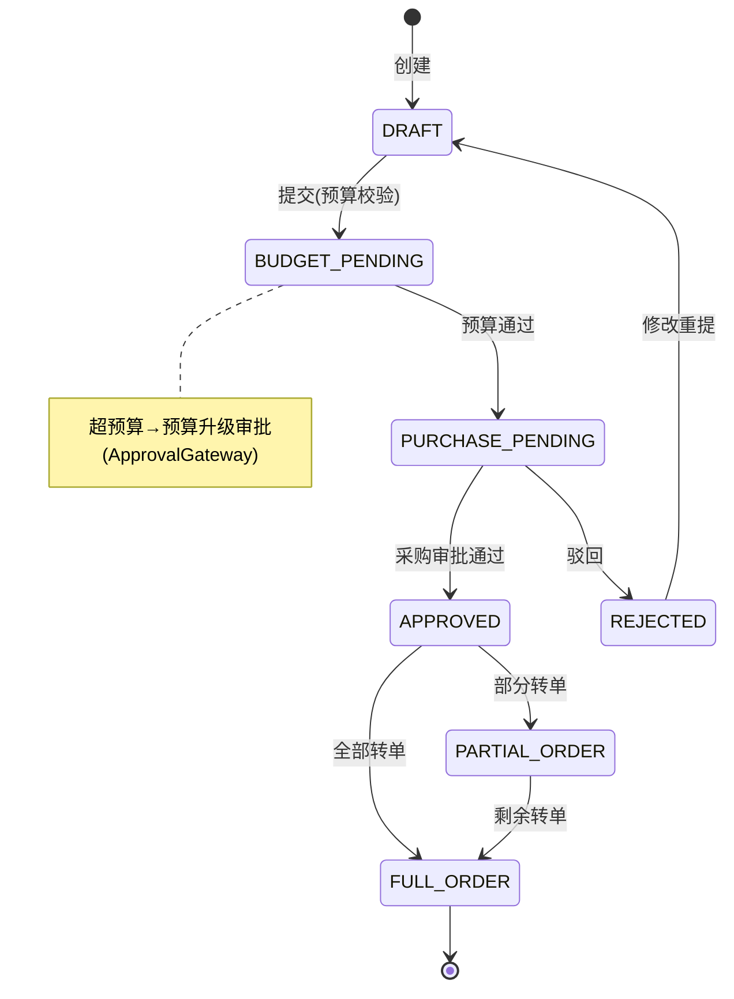
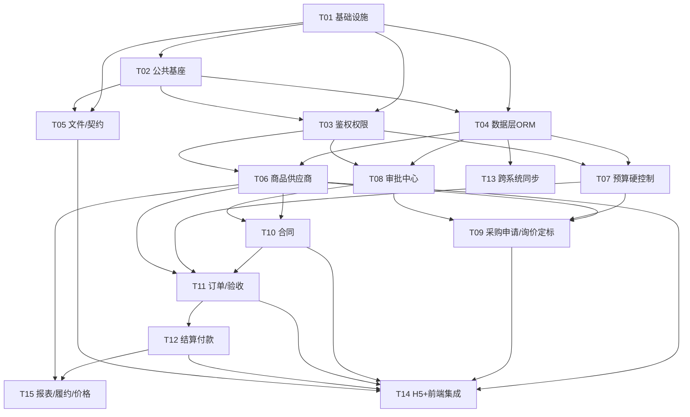

# 供应链采购协同中台 —— 技术评审与架构设计报告

> 版本：v1.0（技术评审基线稿）
> 评审对象：PRD v1.1（飞书，2026-09-17）× 需求评审报告（v1.0）× 三链路主流程 × 供应链需求清单_解析
> 角色：架构师（高见远）
> 配套文档：需求评审报告.md（统一需求基线）、供应链需求清单_解析.md（功能点拆解）

---

## 0. 结论先行（评审摘要）

**技术栈拍板（推荐）**：后端 **Spring Boot 3.2 + Java 17 + MyBatis-Plus + MySQL 8 + Redis 7**；前端 **Vue3 + Vite + Element Plus + Pinia + Vue Router**；供应商 H5 同栈独立构建；文件存储 **MinIO（对象存储，抽象 FileStorage 接口）**；API 契约 **OpenAPI 3.1（Springdoc）**；跨系统同步采用 **事务内 Outbox 表 + 幂等 + 对账（一期仅设计预留表结构与适配层）**；CI/CD **GitLab CI + Docker 多阶段构建**。

**两个最关键架构风险**：
1. **预算硬控制的事务与一致性**——"订单占用/释放/核销预算 + 合同额度扣减"必须在一笔事务内完成并加锁，否则高并发下会出现超下单、预算穿透。推荐：行级锁（`SELECT ... FOR UPDATE`）+ 应用层 Outbox + 乐观版本号兜底，一期不做跨服务分布式事务。
2. **审批中心的"自建 vs 对接现有"未定**——它横切采购申请/合同/定标/预算升级全链路，是状态机回流的唯一驱动源。推荐：一期**自建轻量审批单据中心**（表驱动 + 回调），但所有审批入口抽象为 `ApprovalGateway` 接口，确保后续可无缝切换为对接企业审批中心。

> 其余 6 项架构关键点（鉴权/权限、跨系统同步边界、状态机、SPU/SKU 多单位、Excel 导入、Monorepo 划分）见第 2 节逐点评审；12 条待明确事项的技术拍板点见第 8 节。

---

## 1. 技术选型与理由

### 1.1 后端

#### 1.1.1 运行时与框架版本
| 项 | 选型 | 理由 |
|---|---|---|
| 语言 | **Java 17**（LTS） | 长期支持、语法现代化（record/sealed）、与 Spring Boot 3 强绑定；避免 Java 8 的 EOL 与 Spring Boot 2 的维护终点。 |
| 框架 | **Spring Boot 3.2.x** | 一期为单体 + 内部模块化的中后台，无需引入 Spring Cloud 微服务治理；Boot 3 原生支持 Jakarta EE 9+、虚拟线程（可选）、可观测性。若后期需独立部署审批/集成 Worker，可平滑拆出独立 Boot 应用，无需改协议。 |
| 构建 | **Gradle（Kotlin DSL）** 多模块 Monorepo | 比 Maven 增量构建快、依赖声明更清晰；多模块便于 backend 内部按领域拆分（见 3.2）。如团队更熟 Maven，可改 Maven multi-module，不影响架构。 |

#### 1.1.2 后端模块划分（领域驱动，非技术分层）
```
backend/
 ├─ common      (通用：鉴权、异常、响应、幂等、Outbox、字典)
 ├─ identity    (组织/用户/角色/RBAC/数据权限/AuthProvider 适配层)
 ├─ catalog     (商品 SPU/SKU/单位换算、供应商、资质)
 ├─ budget      (预算导入/分解/校验硬控制)
 ├─ purchase    (采购申请/询价/报价/定标)
 ├─ contract    (合同登记/审批/额度)
 ├─ order       (采购订单/到货验收/入库)
 ├─ settlement  (结算/付款登记)
 ├─ approval    (审批单据中心 + ApprovalGateway)
 ├─ integration (跨系统同步 Worker/Outbox 消费者/适配层)
 └─ report      (报表中心 P1)
```
> 模块间依赖单向（common ← 各领域 ← approval/integration），禁止领域模块互相直接调用 DB，跨域访问走应用服务或领域事件（Outbox）。

#### 1.1.3 ORM 选型：**MyBatis-Plus（推荐），而非 JPA**
| 维度 | MyBatis-Plus | Spring Data JPA |
|---|---|---|
| 复杂多表关联（合同-订单-预算-定标追溯） | ✅ XML/注解 SQL 可控，性能可优化 | ⚠️ 多表 Join、Projections 易失控 |
| 预算/额度行锁（`FOR UPDATE`） | ✅ 原生 SQL 直接写 | ⚠️ 需 `@Lock` + 特定 Repository 方法，别扭 |
| 存量/迁移 SQL、Excel 批量导入 | ✅ 批量 SQL、动态 SQL 友好 | ⚠️ `saveAll` 性能差、批处理需额外配置 |
| 报表/统计聚合 | ✅ 直接写聚合 SQL | ⚠️ 需逃到 `@Query` 原生 |
| 开发心智 | 偏 SQL，贴合现有 Java 外包团队 | 偏对象，学习曲线 |
| 生成代码 | ✅ 代码生成器成熟 | ✅ 也成熟 |

**结论**：选 **MyBatis-Plus**。采购系统的核心难点是"强事务 + 行锁 + 复杂追溯查询 + 批量导入"，MyBatis-Plus 在这些点上明显占优；JPA 的"对象状态自动同步"反而会在预算占用、额度扣减等强一致场景埋坑。可辅以 **MapStruct** 做 DO/DTO 转换。

#### 1.1.4 鉴权与权限方案：**一期自建 Spring Security + JWT，预留统一认证适配层（推荐）**
**两种方案对比**：

| 方案 | 优点 | 缺点 | 适用 |
|---|---|---|---|
| A. 直接对接企业统一认证（SSO/OAuth2/LDAP） | 账号统一、免运维登录 | 一期强依赖外部系统，阻塞采购闭环；账号/权限映射机制未定（待确认问题 3）；联调成本高 | 已有稳定 SSO 且本期就要打通 |
| B. 自建 Spring Security + JWT + 本系统账号体系（**推荐一期**） | 解耦、可独立交付；权限本系统闭环（RBAC+数据权限由 identity 模块管理） | 需自建账号/密码/改密；后续对接 SSO 需做账号映射 | 一期聚焦采购闭环 |

**推荐方案 B + 适配层**：
- 鉴权用 **Spring Security 6 + JWT（Access Token 短时效 + Refresh Token）**，密码哈希 **BCrypt**；H5 与后台共用同一 Token 体系（H5 仅暴露资质接口，路由默认关闭见裁决 4）。
- 抽象 `AuthProvider` 接口：一期实现 `LocalAuthProvider`（本地账号）；后续实现 `SsoAuthProvider`（OAuth2/LDAP）即可切换，登录入口与 Token 发放逻辑不变。
- **权限校验必须后端做**：所有写接口在方法层用 `@PreAuthorize("hasPerm('contract:create')")` 或 AOP 拦截；前端按钮隐藏仅为 UX，非安全边界（需求硬约束）。数据权限（部门隔离）由 `DataPermissionInterceptor`（MyBatis 拦截器）自动注入 `dept_id` 过滤条件，前端不可绕过。

#### 1.1.5 数据库与缓存
- **MySQL 8.0**：默认 `InnoDB`、`utf8mb4_0900_ai_ci`；事务隔离级别 **READ COMMITTED + 行锁**（避免 RR 下间隙锁放大）；表名 `snake_case`、字段 `snake_case`；统一审计列 `created_by/created_at/updated_by/updated_at/deleted_at`（逻辑删除）；状态用 `TINYINT` + 字典表/枚举，禁止魔法字符串。
- **Redis 7**：
  - 分布式锁（预算占用、合同额度扣减的防并发兜底，与 DB 行锁双保险）；
  - 缓存：字典表、角色-权限映射、商品快照、登录用户信息（`USER:token` 短时效）；
  - 限流（登录失败、导入接口）；
  - **不存业务真源数据**，仅缓存可重建内容。

#### 1.1.6 文件存储：**MinIO（对象存储），抽象 FileStorage 接口（推荐）**
- 营业执照/合同签署件/到货凭证等附件统一走 `FileStorage` 接口，一期实现 `MinioFileStorage`；后续可切换为云 OSS（`CloudFileStorage`）不改业务代码。
- DB 仅存 `file_key + original_name + size + sha256 + 业务关联 id`；合规留存期由配置管理（待确认问题 5）。

#### 1.1.7 API 契约：**OpenAPI 3.1 + Springdoc-OpenAPI**
- 所有后端接口通过 Springdoc 自动生成 `/v3/api-docs` 与 Swagger UI；前端/H5 据此生成 TS 类型（openapi-typescript）。
- 响应统一 `{code, message, data, traceId}`；错误码分段（身份/权限/业务/系统）。
- 版本前缀 `/api/v1/...`；H5 以 `/h5/api/v1/...` 区分边界（见第 5 节）。

#### 1.1.8 消息与 Outbox（跨系统同步）
- **核心机制**：业务事务内写 `outbox_event` 表（与业务数据同库同事务），由 `IntegrationWorker` 定时/CDC 扫描并投递到下游；下游消费端用 `event_id` 做**幂等去重**。
- 一期**不引入 Kafka/RabbitMQ** 也可运行：用「DB Outbox 表 + Spring `@Scheduled` 扫描 + HTTP 适配层」即可满足"设计预留"要求；若首批对接系统确认（待确认问题 1），再升级为 MQ 解耦。
- 对账：新增 `sync_reconcile` 表记录投递/回执状态，支持补偿与人工对账（P1）。

#### 1.1.9 CI/CD 初步
- GitLab CI：`.gitlab-ci.yml` 多 stage（`build → test → sonar → docker-build → deploy-staging`）；`backend` 用 Gradle 构建 Docker 镜像，`frontend/h5` 用 Vite 构建静态产物（Nginx 托管）。
- 环境：dev / staging / prod；配置走环境变量 + Nacos/ConfigMap（一期可用 `application-{env}.yml` + CI 注入）；密钥走 Vault/CI Secret。
- 质量门禁：单测覆盖率阈值、Spotless 格式化、Sonar 异味阻断。

### 1.2 前端（后台 Web）
- **Vue 3（`<script setup>` + TS）+ Vite 5 + Element Plus + Pinia + Vue Router 4**。
- 请求层：`axios` 封装，统一拦截 401（刷新 Token）、业务错误码、loading；`OpenAPI → TS 类型` 自动化。
- 权限：路由级 `meta.permission` + 全局指令 `v-permission`（按钮级隐藏，仅 UX）；真实校验在后端。
- 字典/枚举：由后端字典接口拉取，前端 `dict store` 缓存。
- 工程：`ESLint + Prettier + Stylelint`，组件按 `views/ components/ store/ api/ utils/` 组织。

### 1.3 供应商 H5
- 同 Vue3 栈，独立 Vite 构建（更轻量，可引入 `vant` 移动组件）；移动端适配 + 安全区。
- **一期仅路由/暴露资质协同**（提交/审核/驳回重提）；登录/订单/结算路由代码保留但 `feature flag / 菜单权限` 默认关闭（裁决 4）。H5 与后台共用 `AuthProvider` 与 Token。

### 1.4 依赖选型小结（理由）
- 选 MyBatis-Plus 而非 JPA：强事务/行锁/复杂追溯/批量导入占优。
- 选自建 JWT 而非直连 SSO：解耦一期、独立交付。
- 选 MinIO 而非云 OSS 直连：接口抽象、可本地起、成本低。
- 选 Outbox 表而非直连 MQ：一期零外部依赖即可满足"设计预留"。

---

## 2. 架构关键点评审（逐点：方案 + 风险）

### 2.1 鉴权与权限模型（RBAC + 部门数据权限）
**方案**
- 模型：`sys_user ← sys_role ← sys_role_menu/perm`（菜单+操作权限），`sys_user_dept`（用户-部门多对多，含主部门），`sys_dept`（树）。
- 操作权限：`perm` 维度 = `资源:动作`（如 `contract:create`、`budget:import`），后端 `@PreAuthorize`/AOP 强制校验。
- 数据权限：在 MyBatis 拦截器 `DataPermissionInterceptor` 中，根据当前用户 `dept_id` 及其子树 + 配置的"数据权限类型（本人/本部门/本部门及子部门/全部）"，自动追加 `AND dept_id IN (...)`。商品、供应商、预算、采购申请等所有业务表带 `dept_id`。
- 前端仅做按钮隐藏，**所有写操作后端必校验**，杜绝"前端隐藏=安全"误用。

**风险**
- R1：数据权限拦截器若漏接某查询（如报表聚合、导出）会越权 → 强制"所有列表/导出查询必须经过拦截器"，报表用独立权限维度 + 部门过滤同样注入。
- R2：部门树变更导致历史数据归属错乱 → 数据权限基于"当前部门子树"实时计算，不做快照；历史归属变更走数据迁移脚本。

### 2.2 预算硬控制与事务一致性（最关键风险①）
**方案**
- 预算占用触发点：采购申请提交、定标超预算、订单生成（占用）、订单取消/减量（释放）、结算完成（核销）。
- 一致性保障：
  1. 预算占用/释放/核销在**同一 DB 事务**内，对 `budget_line`（预算明细行）加 **`SELECT ... FOR UPDATE` 行锁**，串行化同部门同科目并发。
  2. 占用前实时计算 `已占用 + 本次 ≤ 可用`，超预算则**拦截并生成预算升级审批任务**（经 `ApprovalGateway`）。
  3. 行锁 + Redis 分布式锁（`budget:lock:{deptId}:{subjectId}`）双保险，防止应用多实例下的并发穿透。
  4. 乐观兜底：`budget_line.version` 乐观锁，冲突重试。
- **一期不做跨服务分布式事务**（Seata 等过重），预算/合同/订单同库，靠本地事务 + 行锁即可；跨系统同步走 Outbox 最终一致。

**风险**
- R1（高）：高并发下若锁粒度粗（按部门）会严重串行 → 锁粒度细化到 `预算明细行 + 科目 + 期间`。
- R2（高）：释放/核销遗漏导致预算"假占用" → 用领域事件 + Outbox 保证"订单状态变更必触发预算相应操作"，并加对账任务每日校准 `预算占用汇总 = Σ有效占用`。
- R3：超预算拦截与审批回流的先后顺序 → 拦截即落"待预算审批"状态，审批通过回调后真正占用并发单，避免"先占后审"。

### 2.3 审批集成（自建 vs 对接现有）—— 最关键风险②
**方案**
- 一期**自建轻量「审批单据中心」**（`approval` 模块）：表驱动审批流（审批单 `approval_task` + 节点 `approval_node` + 记录 `approval_record` + 回调 `approval_callback`）。支持"会签/或签/逐级"简单模型即可。
- 抽象 `ApprovalGateway` 接口：`ApprovalGateway.create(task)` / `.callback(result)`；一期实现 `LocalApprovalGateway`（调本地审批中心），后续实现 `RemoteApprovalGateway`（对接企业审批中心 API/事件）。
- 所有需要审批的实体（采购申请、合同、定标、预算升级）统一通过 `ApprovalGateway` 发起，审批结果通过回调更新实体状态机。

**风险**
- R1（高）：若上线前确定对接现有审批中心，自建方案需返工 → 用 `ApprovalGateway` 隔离，业务侧无感；**待确认问题 2 必须尽快拍板**（建议：一期先 Local，二期 Remote，开关切换）。
- R2：审批超时/驳回后的状态回流复杂 → 状态机显式定义"审批中/通过/驳回"且驳回可回到草稿或指定节点（见 2.5）。

### 2.4 跨系统同步（Outbox / 幂等 / 对账，一期边界）
**方案**
- Outbox：`outbox_event(id, aggregate, aggregate_id, type, payload_json, status, created_at)` 与业务同事务写入。
- 投递：`IntegrationWorker` 扫描 `status=PENDING` → 调 `Adapter`（零售/餐饮适配层 HTTP）→ 成功后标记 `SENT`（或失败 `RETRY`，限次）。
- 幂等：下游按 `event_id` 去重；适配层接口设计为**幂等 PUT/POST**（带业务 idempotency-key）。
- 对账：`sync_reconcile` 记录投递/回执，支持定时对账与人工补推（P1）。

**一期边界（与待确认问题 1 呼应）**
- 一期**必须**：建 `outbox_event`/`sync_reconcile` 表、实现 `IntegrationWorker` 骨架与 `Adapter` 接口、商品与入库确认两类事件的"本地落库 + 适配层占位"。
- 一期**可选**：是否真连零售/餐饮（取决于首批对接系统清单与数据契约）。若未定，**适配层返回成功占位**，不阻断采购闭环。

**风险**
- R1：事件 payload 与下游契约漂移 → payload 用版本化 JSON Schema，下游适配层做兼容转换。
- R2：投递失败导致业务"以为成功" → 业务状态与 Outbox 分离，业务先成功，同步最终一致，关键链路（如入库确认）加对账补偿。

### 2.5 状态机设计（采购申请 / 合同 / 订单 / 验收 / 结算 / 付款 / 审批单据）
**方案**：每个核心实体显式状态枚举 + 状态流转表（见 4 节）+ 统一 `StatusMachine` 校验（非法流转拒绝）。关键流转：



- 合同：`DRAFT → PENDING_APPROVAL → EFFECTIVE(有效期内) → EXPIRED/TERMINATED`；**仅 EFFECTIVE 可发起订单**。
- 订单：`CREATED(占用预算) → PARTIAL_RECEIVED → RECEIVED → SETTLED → PAID/PAID_OFFLINE`；取消→`CANCELLED`(释放预算)。
- 验收：`ArrivalConfirmed → PartialStored → Stored`；差异/退货走履约调整（P1）。
- 审批单据：`CREATED → IN_PROGRESS → APPROVED/REJECTED → CALLBACK_DONE`。

**风险**
- R1：状态枚举散落各处 → 集中在 `enums` 包 + 数据库字典，状态流转用配置化校验器，禁止业务代码硬编码 if。
- R2：驳回回到哪个节点易乱 → 流转表明确定义每个"驳回"目标态。

### 2.6 SPU/SKU 多单位换算落库
**方案**
- 模型：`spu`（商品定义：名称/分类/规格）→ `sku`（最小可交易单元：编码/条码）→ `unit_conversion`（采购单位↔基本单位换算率，含 `from_unit/to_unit/rate`，`sku_id` 关联）。
- **单据存换算快照**：采购申请/订单/到货/结算行中同时存 `sku_id, purchase_unit, base_unit, qty_in_purchase_unit, qty_in_base_unit, conv_rate_snapshot`，快照取自下单时 `unit_conversion` 当前值（待确认问题 8：取快照而非实时换算，避免后期换算率变更影响历史单据）。
- 换算率维护：`unit_conversion` 带 `effective_from/version`，变更历史可追溯；维护权限（价格修正权限独立，见需求）。

**风险**
- R1：换算率变更导致历史单据数量口径不一致 → 强制"单据落快照"，统计/结算用快照值。
- R2：基本单位 vs 采购单位混用导致库存口径错 → 入库/结算统一以基本单位计，展示按采购单位。

### 2.7 Excel 模板导入（预算 / 报价）
**方案**
- 用 **EasyExcel（阿里）** 流式读写，避免 OOM。
- 流程：上传 → 服务端校验（模板版本号、字段类型、业务规则如"供应商存在/科目存在"）→ 错误行收集为"错误清单 Sheet" → 全部通过才落库，否则返回带错误标注的 Excel 供重传（待确认问题 4：模板字段/校验需与财务/供应商侧确认）。
- 预算导入：支持年度总额 + 分解（自动比例/手工微调），导入即生成 `budget_line`。
- 报价导入：招采导出"报价包模板"→ 供应商填 → 后台导入各供应商报价行，校验供应商/产品/数量/价格后入 `quotation`。

**风险**
- R1：大文件阻塞 → 异步导入（上传即返回 task_id，后台跑，进度可查）。
- R2：模板版本漂移 → 模板文件带 `templateVersion`，导入时校验版本，旧版拒绝并提示更新。

---

## 3. Monorepo 目录结构

```
dzgylxt/                         # 单仓 Monorepo 根
├─ README.md
├─ docker-compose.yml            # 本地一体化环境(mysql/redis/minio/backend/frontend/h5)
├─ .gitlab-ci.yml
├─ backend/                      # Spring Boot 多模块(Gradle)
│  ├─ build.gradle.kts
│  ├─ settings.gradle.kts
│  ├─ common/      identity/     catalog/      budget/
│  ├─ purchase/    contract/     order/        settlement/
│  ├─ approval/    integration/  report/
│  └─ (各模块标准: src/main/{java,resources}, src/test)
├─ frontend/                     # 后台 Web (Vue3+Vite+Element Plus)
│  ├─ index.html  vite.config.ts  package.json  tsconfig.json
│  └─ src/{api,assets,components,layout,router,store,styles,utils,views}
├─ h5/                           # 供应商 H5 (Vue3+Vite, 移动)
│  ├─ index.html  vite.config.ts  package.json
│  └─ src/{api,components,router,store,views}
├─ docs/                         # 文档(含本报告/需求评审/PRD)
│  ├─ 需求评审报告.md  技术评审与架构设计.md
├─ scripts/                      # 脚本(SQL初始化/数据迁移/CI辅助)
│  ├─ sql/        (DDL/种子数据/迁移)
│  ├─ migrate/    (Mock→生产 数据迁移, 待确认问题12)
│  └─ tools/      (对账/校验小工具)
└─ .github/ 或 gitlab ci 配置
```
> 命名一致：`backend` 用 `com.dzgylxt.*` 包前缀；`frontend/h5` 用 `@dzgylxt/*` 别名。

---

## 4. 数据库 Schema 概要

> 说明：以下为核心实体与关键字段/状态枚举（非全量字段）。统一审计列：`id(bigint pk), created_by, created_at, updated_by, updated_at, deleted_at`。所有金额 `DECIMAL(18,2)`，状态 `TINYINT`。

| 实体(表) | 关键字段 | 状态枚举 / 关系 |
|---|---|---|
| **部门 sys_dept** | id, parent_id, dept_name, tree_path, data_scope | 树形；承接数据权限 |
| **用户 sys_user** | id, username, password_hash(bcrypt), main_dept_id, status | status: 0启用/1禁用 |
| **角色/权限 sys_role, sys_role_perm** | role_code, perm(`res:action`) | N:N 用户-角色，角色-权限 |
| **用户部门 sys_user_dept** | user_id, dept_id, data_scope | 多部门归属 |
| **商品SPU spu** | id, spu_code, name, category_id, spec | 1:N → sku |
| **商品SKU sku** | id, spu_id, sku_code, barcode, base_unit | 1:N → unit_conversion |
| **单位换算 unit_conversion** | sku_id, from_unit, to_unit, rate, effective_from, version | 快照引用 |
| **供应商 supplier** | id, name, credit_code, level, category, status | status: 资质审核中/通过/驳回 |
| **供应商资质 supplier_qual** | supplier_id, type, file_key, expire_at, status | 资质提交(H5)/审核/驳回重提 |
| **供应商-商品绑定 supplier_sku** (P1) | supplier_id, sku_id, price_range | 限定报价/接单范围(待确认9) |
| **预算头 budget_header** | id, year, dept_id, total_amount, status | 年度 |
| **预算明细 budget_line** | header_id, subject_id, period(month), amount, used_amount, version | **行锁对象**；used=占用+核销 |
| **采购申请 purchase_apply** | id, dept_id, apply_no, type(标准/日常/线下), status, budget_status | status: DRAFT/BUDGET_PENDING/PURCHASE_PENDING/APPROVED/REJECTED/PARTIAL_ORDER/FULL_ORDER |
| **采购申请明细 purchase_apply_item** | apply_id, sku_id, qty, apply_qty, ordered_qty, remain_qty, unit_snapshot | 申请↔订单追溯 |
| **询价单 inquiry** | id, apply_id, status | 日常链路可跳过 |
| **报价 quotation** | inquiry_id, supplier_id, sku_id, price, conv_snapshot | 线下Excel导入 |
| **定标 award** | id, inquiry_id, supplier_id, status | 驱动合同不直接转单；status: PENDING_APPROVAL/APPROVED |
| **合同 contract** | id, supplier_id, no, amount, valid_from, valid_to, status, available_amount | **仅 EFFECTIVE 可下单**；status: DRAFT/PENDING_APPROVAL/EFFECTIVE/EXPIRED/TERMINATED |
| **采购订单 purchase_order** | id, contract_id, apply_id(可空), supplier_id, status, budget_occupied | status: CREATED/PARTIAL_RECEIVED/RECEIVED/SETTLED/CANCELLED/PAID |
| **订单明细 order_item** | order_id, sku_id, qty_purchase, qty_base, conv_snapshot, price, source_award_item | 来源合同/定标追溯 |
| **到货验收 arrival** | order_id, actual_qty, diff_qty,凭证file_key, status | ArrivalConfirmed/PartialStored/Stored |
| **结算 settlement** | id, order_id/arrival_id, type(物料/服务), amount, status | 从订单或到货单发起 |
| **付款登记 payment** | settlement_id, pay_amount, pay_method, voucher_file, status | 线下付款，回写状态(待确认11) |
| **审批单 approval_task** | biz_type, biz_id, flow_key, status, current_node | CREATED/IN_PROGRESS/APPROVED/REJECTED |
| **审批节点/记录 approval_node, approval_record** | node_def, approver, action, comment | 会签/或签/逐级 |
| **Outbox outbox_event** | aggregate, aggregate_id, type, payload_json, status, retry | PENDING/SENT/RETRY/FAILED |
| **同步对账 sync_reconcile** | event_id, target, status, last_resp | 幂等/对账(P1) |
| **文件 file_meta** | file_key, original_name, size, sha256, biz_id | 与 MinIO 对应 |

**关键关系（ER 要点）**
- `contract* ──< purchase_order`（1 合同 N 订单；订单累计 ≤ 合同 available_amount）
- `purchase_apply* ──< purchase_order`（1 申请 N 订单；ordered_qty ≤ apply_qty）
- `award ──> contract`（定标驱动合同，不直接转单）
- `purchase_order* ──< arrival ──< settlement ──< payment`
- `budget_line ──(占用/释放/核销)── purchase_apply / purchase_order / settlement`
- `supplier ──< supplier_qual / supplier_sku`

---

## 5. API 契约规划

> 统一：`/api/v1/{module}/...`（后台），`/h5/api/v1/{module}/...`（H5 仅资质）。响应 `{code,message,data,traceId}`。后端强制权限校验。

| 模块 | 接口分组 | 关键端点 | 契约边界 |
|---|---|---|---|
| 身份 identity | `/api/v1/auth` `/api/v1/org` `/api/v1/rbac` | POST `/auth/login`, `/auth/refresh`；CRUD `/depts`, `/users`, `/roles` | H5 仅 `/h5/api/v1/auth/login`；权限后端校验 |
| 商品 catalog | `/api/v1/catalog` | GET/POST `/spus`, `/skus`, `/unit-conversions` | 商品录入/价格修正权限独立 |
| 供应商 catalog | `/api/v1/suppliers` `/h5/api/v1/supplier-qual` | POST `/suppliers/import`, GET `/suppliers/:id/quals`；H5 POST `/qual/submit`, `/qual/resubmit` | **H5 仅资质协同** |
| 预算 budget | `/api/v1/budgets` | POST `/budgets/import`(Excel), POST `/budgets/:id/adjust`, GET `/budgets/lines` | 导入模板版本校验 |
| 采购 purchase | `/api/v1/purchase-requests` `/api/v1/inquiries` `/api/v1/quotations` `/api/v1/awards` | POST `/purchase-requests`(触发预算/审批), POST `/inquiries`, POST `/quotations/import`, POST `/awards/:id/approve` | 日常链路跳过 inquiry/award |
| 合同 contract | `/api/v1/contracts` | POST `/contracts`(→审批→EFFECTIVE), GET `/contracts?status=`, POST `/contracts/:id/expire-warn` | 仅 EFFECTIVE 可下单 |
| 订单 order | `/api/v1/orders` `/api/v1/arrivals` | POST `/orders`(选合同+占预算+校验), POST `/orders/:id/cancel`(释放), POST `/arrivals`(部分入库) | 订单必须关联有效合同 |
| 结算 settlement | `/api/v1/settlements` `/api/v1/payments` | POST `/settlements`(从订单/到货发起), POST `/payments`(线下回写) | 付款线下，状态回写 |
| 审批 approval | `/api/v1/approvals` (内部 `ApprovalGateway`) | POST `/approvals/tasks`, POST `/approvals/callback` | 业务经 Gateway，不直接耦合 |
| 集成 integration | `/api/v1/integration` (内部/适配层) | GET/POST `/adapters/:sys`, POST `/outbox/retry` | 一期占位，幂等 key |
| 报表 report(P1) | `/api/v1/reports` | GET `/reports/purchase-stats`, `/cost-analysis` | 数据源=业务表聚合 |

---

## 6. 任务分解列表（工程师"搭基础框架"输入）

> 分两阶段：**阶段一 框架骨架（T01–T05，全部 P0，互相低耦合，仅依赖 T01）**；**阶段二 业务模块（T06 起，按链路依赖顺序）**。每个任务 ≥3 文件，配置文件集中。

### 阶段一：框架骨架（不写业务，只搭可运行底座）
| ID | 任务 | 源文件（示例） | 依赖 | 优先级 |
|---|---|---|---|---|
| **T01** | 项目基础设施与 Monorepo 骨架 | `backend/build.gradle.kts`, `backend/settings.gradle.kts`, `frontend/vite.config.ts`, `frontend/package.json`, `frontend/tsconfig.json`, `frontend/src/main.ts`, `frontend/src/App.vue`, `h5/vite.config.ts`, `h5/package.json`, `docker-compose.yml`, `.gitlab-ci.yml` | — | P0 |
| **T02** | 后端公共基座（common） | `common/Response.java`, `common/GlobalExceptionHandler.java`, `common/BaseEntity.java`, `common/IdGenerator.java`, `common/OutboxEvent.java`, `common/DataPermissionInterceptor.java` | T01 | P0 |
| **T03** | 鉴权与权限基座（identity） | `identity/SecurityConfig.java`, `identity/JwtAuthFilter.java`, `identity/AuthProvider.java`(接口+Local实现), `identity/SysUser.java`, `identity/SysRole.java`, `identity/RbacService.java` | T01,T02 | P0 |
| **T04** | 数据层与 ORM 配置 | `backend/*/mapper/*.xml`(MyBatis-Plus 配置), `common/MybatisConfig.java`, `scripts/sql/schema_init.sql`(核心表 DDL), `common/RedisConfig.java` | T01,T02 | P0 |
| **T05** | 文件存储与 API 契约基座 | `common/FileStorage.java`(接口+Minio实现), `common/MinioConfig.java`, `common/SpringdocConfig.java`(OpenAPI), `frontend/src/utils/request.ts`(axios封装) | T01,T02 | P0 |

### 阶段二：业务模块（按采购主链路依赖顺序）
| ID | 任务 | 源文件（示例） | 依赖 | 优先级 |
|---|---|---|---|---|
| **T06** | 商品与供应商（catalog：SPU/SKU/单位换算/资质） | `catalog/Spu.java`, `catalog/Sku.java`, `catalog/UnitConversion.java`, `catalog/Supplier.java`, `catalog/SupplierQual.java`, `catalog/*Controller.java`, `catalog/*Mapper.xml` | T04,T03 | P0 |
| **T07** | 预算与硬控制（budget） | `budget/BudgetHeader.java`, `budget/BudgetLine.java`, `budget/BudgetService.java`(行锁+占用), `budget/BudgetLock.java`(Redis) | T04,T03 | P0 |
| **T08** | 审批单据中心（approval：ApprovalGateway + 表驱动流） | `approval/ApprovalTask.java`, `approval/ApprovalNode.java`, `approval/ApprovalGateway.java`(Local实现), `approval/ApprovalService.java` | T04,T03 | P0 |
| **T09** | 采购申请 + 询价/报价/定标（purchase） | `purchase/PurchaseApply.java`, `purchase/Inquiry.java`, `purchase/Quotation.java`, `purchase/Award.java`, `purchase/*Service.java`(状态机+ApprovalGateway) | T06,T07,T08 | P0 |
| **T10** | 合同（contract：登记/审批/额度/有效期） | `contract/Contract.java`, `contract/ContractService.java`(额度扣减), `contract/ContractController.java` | T08,T06 | P0 |
| **T11** | 采购订单 + 到货验收（order：合同发起/占预算/部分入库） | `order/PurchaseOrder.java`, `order/Arrival.java`, `order/OrderService.java`(占/释放预算+合同额度+快照), `order/OrderController.java` | T10,T07,T06 | P0 |
| **T12** | 结算与付款登记（settlement） | `settlement/Settlement.java`, `settlement/Payment.java`, `settlement/SettlementService.java`(核销预算) | T11 | P0 |
| **T13** | 跨系统同步骨架（integration：Outbox消费/适配层/对账） | `integration/IntegrationWorker.java`, `integration/Adapter.java`(接口+占位), `integration/SyncReconcile.java` | T04 | P1 |
| **T14** | H5 资质协同 + 前端页面集成 | `h5/src/views/QualSubmit.vue`, `h5/src/router/index.ts`, `frontend/src/views/**`(各模块页面), `frontend/src/store/*` | T06,T09,T10,T11,T12,T05 | P0/P1 |
| **T15** | 报表中心 + 履约调整 + 价格纠正（P1 治理） | `report/*`, `order/FulfillmentAdjust.java`, `catalog/PriceCorrection.java` | T12,T06 | P1 |

**依赖图（Mermaid）**


---

## 7. 依赖包清单

### 后端（Gradle，关键依赖）
```
org.springframework.boot:spring-boot-starter-web:3.2.x
org.springframework.boot:spring-boot-starter-security:3.2.x
org.springframework.boot:spring-boot-starter-data-redis:3.2.x
org.springframework.boot:spring-boot-starter-validation:3.2.x
org.springframework.boot:spring-boot-starter-aop:3.2.x
com.baomidou:mybatis-plus-spring-boot3:3.5.5+      // ORM
com.mysql:mysql-connector-j:8.3.x
io.jsonwebtoken:jjwt-api/impl:0.12.x               // JWT
org.springframework.boot:spring-boot-starter-mail  // 预警邮件(合同到期等)
com.github.xiaoymin:springdoc-openapi-starter-webmvc-ui:2.5.x  // OpenAPI
com.alibaba:easyexcel:3.3.x                        // Excel导入导出
io.minio:minio:8.5.x                              // 对象存储
com.github.ben-manes.caffeine:caffeine            // 本地缓存
org.redisson:redisson-spring-boot-starter:3.27.x  // Redis分布式锁
org.mapstruct:mapstruct:1.5.x + processor          // DO/DTO
com.fasterxml.jackson.core:jackson-databind       // JSON
test: spring-boot-starter-test, mockito, testcontainers
```

### 前端 / H5（package.json，关键依赖）
```
vue@^3.4   vite@^5   typescript@^5   @vitejs/plugin-vue
element-plus@^2.7   @element-plus/icons-vue   (h5可加 vant@^4)
pinia@^2   pinia-plugin-persistedstate
vue-router@^4
axios@^1.7
@dzgylxt/openapi-types   (由 springdoc 生成的 TS 类型)
dayjs   echarts@^5 (报表)   xlsx (前端解析预览,可选)
eslint + prettier + stylelint
```

---

## 8. 待明确事项（呼应需求评审 12 条，给技术拍板点）

| # | 需求评审待确认问题 | 技术侧需拍板的点（建议） |
|---|---|---|
| 1 | 跨系统同步一期落地范围 | 拍板：一期**仅落 Outbox 表 + 适配层占位 + 商品/入库两类事件本地落库**，不强制真连零售餐饮；首批对接系统清单与数据契约二期定。 |
| 2 | 审批中心方案 | 拍板：**一期 Local（自建表驱动审批中心），ApprovalGateway 隔离**；若已确定对接现有，则 T08 直接实现 Remote 分支（开关切换）。**最高优先拍板**。 |
| 3 | 统一认证对接方式 | 拍板：一期 Local AuthProvider（自建账号）；确定对接 SSO 时补 `SsoAuthProvider`，账号映射走 `sys_user.external_id`。 |
| 4 | Excel 模板规范 | 拍板：模板带 `templateVersion`；预算/报价字段与校验规则由产品+财务+供应商三方确认后冻结；错误回传用"错误 Sheet"。 |
| 5 | 文件存储方案 | 拍板：一期 MinIO（本地/自建），`FileStorage` 抽象；合规留存期由配置管理；容量阈值告警。 |
| 6 | 合同价格范围与授权阈值 | 拍板：在 `contract` 加 `price_range/authorization_threshold` 配置；超阈值触发升级审批（走 ApprovalGateway）；owner=采购配置。 |
| 7 | 预算控制粒度与来源 | 拍板：一期粒度=部门+预算科目（+可选项目）；预算数据经 Excel 导入（一期不直连财务），每日对账校准。 |
| 8 | 多单位换算规则 | 拍板：**单据落换算快照**（取下单时值），验收/结算用快照；换算率变更走 `version+effective_from` 历史。 |
| 9 | 供应商产品绑定范围 | 拍板：P1 实现 `supplier_sku`，可选"限定报价/接单范围"开关；与 SPU/SKU 通过 sku_id 关联。 |
| 10 | 报表中心范围与数据源 | 拍板：一期报表=采购统计/成本/履约（业务表聚合）；不接 BI；实时性=T+0 查询。 |
| 11 | 结算与财务衔接 | 拍板：付款线下执行，系统登记 `payment` + 凭证 + 状态回写；建付款台账，对账走 `sync_reconcile`（P1）。 |
| 12 | 数据迁移 | 拍板：两个原型 Mock 数据**不迁移**（仅结构参考）；已存在真实供应商/合同/商品由 `scripts/migrate` 评估迁移，责任方=平台方。 |

> 技术评审结论：12 项均可"先做架构预留 + 明确一期边界"，**真正阻塞启动的只有第 2 项（审批中心方案）与第 3 项（认证方式）**——二者已给出"Local 优先 + 接口隔离"的零返工路径，可在搭骨架（T01–T05）阶段并行拍板，不阻塞业务模块开发。

---

## 附：评审交付物索引
- 本报告：`docs/技术评审与架构设计.md`
- 需求基线：`docs/需求评审报告.md`、`供应链需求清单_解析.md`、PRD v1.1、三链路主流程
- 下游输入：第 6 节任务分解（T01–T15）作为工程师"搭基础框架"与"业务模块"两阶段直接依据。
